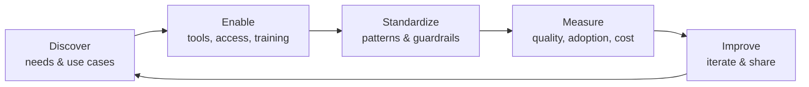

# AI Across CES: Maximizing Its Potential

*Cross Enterprise Services — enabling teams to get the most from AI while maintaining quality and controlling cost.*

**Owner:** AI Enablement Lead
**Status:** Draft v0.1
**Last updated:** 2026-09-02

**Companion documents:**
- [OverviewOfNewAITeam.md](OverviewOfNewAITeam.md) — plain-language executive summary of every area and why it matters (**start here if you are new**)
- [newCESTeamRoles.md](newCESTeamRoles.md) — team structure, staffing sequence, and decision rights
- [ai-across-ces/README.md](ai-across-ces/README.md) — the technical framework (12 documents) that implements this strategy

---

## 1. Purpose & Vision

Our mandate is to help every CES team use AI as a force multiplier — not as a novelty. Success means:

- **Capability:** Teams reach for AI by default for the right tasks and produce better work, faster.
- **Quality:** AI output is reviewed, grounded, and safe. AI raises our standards; it never lowers them.
- **Efficiency:** We deliver that value at the lowest sustainable token/compute cost.

These three goals are in tension, and that is the point of this role: to find the balance deliberately rather than by accident.

> **Guiding principle:** *Right model, right task, right context, reviewed by the right person.*

---

## 2. The Three Pillars

### Pillar A — Maximizing Adoption & Capability
Get AI into the daily workflow and lift the ceiling of what teams can do.

### Pillar B — Maintaining Quality & Safety
Ensure everything AI touches is verifiable, secure, and compliant.

### Pillar C — Minimizing Token & Cost Usage
Treat tokens like a metered utility — measure, attribute, and optimize.

Each pillar has principles, practices, and metrics below.

---

## 3. Operating Model (The Process)

A simple, repeatable loop so this scales beyond any one person.

### 3.1 Roles
| Role | Responsibility |
| --- | --- |
| **AI Enablement Lead (you)** | Owns strategy, standards, metrics, and the community. |
| **AI Quality Engineer** | Owns the agent QA harness, immutable evaluation manifests, golden baselines, human-anchored evals, and the drift gate. |
| **AI Platform & Operations Engineer** | Owns the agent registry, workload identities/action policies, runtime observability, kill switches, and incident response. |
| **Context & Knowledge Architect** | Owns knowledge artifacts (OKF), instruction files, and the prompt library. |
| **Enablement & Learning Engineer** | Owns the curriculum, labs, and competency measurement. |
| **Team AI Champions** | One per team; local point of contact, gathers feedback, drives adoption. |
| **Security / Compliance partner** | Reviews data-handling, model approval, and policy. |
| **Finance / FinOps partner** | Owns cost visibility and budget guardrails. |
| **Engineering managers** | Fold AI practices into team norms and reviews. |

> Full role definitions, the staffing sequence (hats before headcount), and decision rights are in [newCESTeamRoles.md](newCESTeamRoles.md). Not all roles are staffed at once — each is created against a stated trigger.

### 3.2 Cadence
| Activity | Frequency | Output |
| --- | --- | --- |
| AI Champions sync | Weekly (30 min) | Wins, blockers, new patterns |
| Metrics review | Monthly | Adoption, quality, cost dashboard |
| Registry & orphan sweep | Monthly | Agent ownership and risk accuracy ([10](ai-across-ces/10-agent-inventory-and-registry.md)) |
| Pattern/prompt library update | Continuous | Shared, versioned assets |
| Tooling & model review | Quarterly | Add/remove/renegotiate tools |
| Exec summary | Quarterly | ROI, risks, roadmap — two pages, Grade-A headline ([11 §8](ai-across-ces/11-measurement-baselines-and-roi.md)) |

---

## 4. Pillar A — Maximizing Adoption & Capability

### Principles
- Meet people where they work (IDE, browser, terminal) rather than forcing new surfaces.
- Lower the cost of a first success — a great "day one" experience drives adoption more than mandates.
- Share wins loudly; make good usage visible and copyable.

### Practices
- **Use-case catalog.** Maintain a living list of high-value tasks per role (see §8). Rank by impact × frequency.
- **Golden paths.** Provide ready-made prompts, `.instructions.md` / `AGENTS.md` files, and repo templates so teams start from a proven baseline.
- **Champions network.** Each team nominates a champion; they meet weekly and seed local adoption.
- **Onboarding kit.** A 60-minute starter: tool setup, top 5 use cases, do's & don'ts, where to get help.
- **Office hours & brown-bags.** Regular live sessions; record them into a searchable library.
- **Celebrate & template wins.** When a team saves real time, capture the pattern and publish it.

### What to encourage vs. avoid
| Encourage | Avoid |
| --- | --- |
| Drafting, refactoring, test generation, summarization, code review assistance | Blind copy-paste into production |
| Exploring unfamiliar codebases/domains | Treating output as authoritative without checks |
| Prototyping and "rubber-ducking" | Sending sensitive data to unapproved tools |

### Metrics
- % of engineers active weekly per tool, paired with role-relevant competency status
- # of catalogued use cases adopted per team
- Self-reported time saved (quarterly survey; Grade C supporting evidence only)
- Champion coverage (teams with an active champion)

---

## 5. Pillar B — Maintaining Quality & Safety

### Principles
- **Human accountability is non-negotiable.** AI drafts; a named human owns and approves.
- **Ground before you generate.** Prefer answers grounded in real context (code, docs, data) over model memory.
- **Trust boundaries matter.** Classify data before it touches any model.

### Practices
- **Review standard.** AI-assisted changes go through the same (or stronger) review as human-written ones. Reviewers should know AI was used but judge the output, not the origin.
- **Data classification & tool matching.** Map each data sensitivity tier to approved tools (see table below).
- **Prompt-injection awareness.** Treat tool/web/document output as untrusted input; never let it silently trigger actions or exfiltrate data.
- **Runtime authorization.** The model proposes; deterministic policy authorizes. Tool-enabled agents use unique workload identities, deny-by-default action envelopes, and approval bound to the exact consequential action ([09 §3.4](ai-across-ces/09-guardrails-and-grounding.md)).
- **Secure-by-default coding.** Ask AI to follow OWASP Top 10; scan AI-generated code with existing SAST/secret-scanning.
- **Verification habits.** For factual/technical claims, cite sources or verify against authoritative references before shipping.
- **Model/tool approval process.** New tools go through a lightweight security + compliance review before team-wide rollout.

### Data classification → approved tools (example — adjust to policy)
| Data tier | Examples | Eligible surface class (exact deployment profile still requires approval) |
| --- | --- | --- |
| **Public** | Open-source code, public docs | Any approved tool |
| **Internal** | Internal code, non-sensitive docs | Copilot (IDE), approved enterprise LLM |
| **Confidential** | Customer data, secrets, PII | Self-hosted / VPC only (e.g. local Gemma), never public web tools |
| **Restricted** | Regulated / contractual | Dedicated review; likely no AI without sign-off |

### Metrics
- % AI-assisted PRs passing review on first pass
- Security findings introduced vs. caught (pre-merge)
- # of policy exceptions / incidents
- Hallucination/error reports from teams

---

## 6. Pillar C — Minimizing Token & Cost Usage

### Principles
- **You can't optimize what you don't measure.** Attribute cost to team/use case first.
- **Match model to task.** The biggest model is rarely the right default.
- **Context is expensive.** Send the minimum context that yields a correct answer.

### Practices — model selection
- **Tiered defaults:** small/cheap model for routine tasks (formatting, simple Q&A, commit messages), mid-tier for most coding, frontier model only for hard reasoning or agentic multi-step work.
- **Local models where they fit:** use self-hosted Gemma for high-volume, privacy-sensitive, or cost-sensitive workloads where quality is sufficient.
- **Escalate, don't start big:** try the cheaper tier first; escalate only when it fails.

### Practices — context & prompt hygiene
- Trim system prompts and boilerplate; reuse concise, versioned prompt templates.
- Scope context to relevant files/sections instead of whole repos.
- Prefer retrieval/grounding over stuffing large documents into the prompt.
- Cache and reuse (prompt caching, embeddings) for repeated queries.
- Cap agent iterations and set stop conditions to avoid runaway loops.
- Batch where possible; avoid redundant re-queries for information already retrieved.

### Practices — governance
- **Cost visibility:** dashboard by team, tool, and use case; set budgets and alerts.
- **Unit economics:** track cost per task/PR/ticket, not just total spend, so savings from optimization are visible.
- **Quarterly right-sizing:** review model mix and licenses; drop what isn't used.

### Model selection quick guide
| Task type | Suggested tier | Notes |
| --- | --- | --- |
| Formatting, renaming, commit messages, simple lookups | Small / local (Gemma) | High volume, low risk |
| General coding, refactoring, tests, docs | Mid-tier (Copilot / standard models) | The daily workhorse |
| Complex reasoning, architecture, multi-step agents | Frontier (Claude/GPT top tier) | Use deliberately; watch token spend |
| Confidential-data workloads | Local / VPC only | Privacy over convenience |

### Metrics
- Total spend and spend per team/use case
- Cost per unit of work (per PR, per ticket)
- Model mix (% of calls by tier)
- Average context size / tokens per request trend
- Cache hit rate

---

## 7. Tooling Landscape (current)

This is a capability inventory, **not approval by brand name**. Data eligibility belongs to the exact provider/hosting/plan/region and model version recorded in the approved deployment-profile register ([02 §6](ai-across-ces/02-model-selection-and-fit.md)).

| Tool | Primary use | Data tier ceiling | Notes |
| --- | --- | --- | --- |
| **GitHub Copilot (IDE)** | In-editor coding, tests, refactor, agent | Per approved enterprise profile | Default coding surface; verify plan, retention, and model routing; use versioned instructions |
| **ChatGPT / Claude (web or API)** | Reasoning, drafting, analysis | Per approved profile; public consumer surfaces may be Public-only | Contract, retention/training terms, region, and endpoint decide the tier |
| **Coding agents (Copilot agent, Cursor)** | Multi-step, cross-file tasks | Inherits model endpoint **and tool/action** limits | Register the runnable release; cap iterations; enforce action policy; review evidence/diffs |
| **Gemma (self-hosted)** | High-volume / privacy-sensitive projects | Per verified hosting boundary | Data tier depends on actual isolation, access, logging, and operations, not the word "self-hosted" |

> Keep this capability inventory current, but do not authorize from it. The approved deployment-profile register in [02 §6](ai-across-ces/02-model-selection-and-fit.md) is the source of truth for "what exact endpoint, plan, region, and model version may process this data and task?"

---

## 8. Starter Use-Case Catalog

High-value, low-risk starting points teams can adopt immediately.

**Engineering**
- Generate and improve unit/integration tests
- Explain and onboard onto unfamiliar code
- Draft refactors and code review comments
- Write/update docstrings and READMEs
- Draft commit messages and PR descriptions (small/local model)

**Analysis & Docs**
- Summarize long threads, tickets, incidents
- Draft design docs and RFC first drafts
- Convert notes into structured docs

**Ops & Support**
- Draft runbooks and postmortems
- Triage and categorize tickets
- Summarize logs / error patterns (with grounding)

For each, record: prompt/template, recommended model tier, data tier, and a quality checklist.

---

## 9. 30 / 60 / 90 Day Rollout Plan

### Days 0–30 — Baseline & Foundations
- Inventory and tier runnable agents plus tools, access, and spend; fix R3 owner/access/off-switch gaps as they are found.
- Recruit AI Champions (one per team).
- Publish v1 of this document and the data-classification → **deployment-profile** table.
- Instrument the four operational baselines in [11 §5](ai-across-ces/11-measurement-baselines-and-roi.md); do not defer known safety fixes for measurement purity.

### Days 31–60 — Standardize & Scale
- Stand up the minimum QA harness: one golden baseline, one open/holdout trap set, release manifests, and tool/action-contract tests.
- Establish the two technical baselines produced by that harness; set pre-declared margins and hard safety invariants.
- Apply tier-required guardrails, action envelopes, runtime logging, and kill-switch drills to R2/R3 agents.
- Launch weekly champions sync and monthly metrics review.

### Days 61–90 — Optimize & Prove Value
- Run the first manual, accessible competency labs; require role-relevant proficiency for R2/R3 operators/reviewers.
- Run a real model/version decision through the drift gate and canary plan.
- Publish the first quarterly value summary (paired quality, cost, risk; attribution limits stated).
- Right-size model mix/licenses and publish only patterns that passed regression tests and human verification.
- Formalize the tool-approval and exception process.

---

## 10. Metrics Dashboard (at a glance)

| Pillar | Metric | Target (set after baseline) |
| --- | --- | --- |
| Adoption | Weekly active users per team | ↑ |
| Adoption | Use cases adopted per team | ↑ |
| Quality | AI-assisted PRs passing first review | ≥ human baseline |
| Quality | Security findings introduced pre-merge | ↓ |
| Cost | Spend per unit of work | ↓ |
| Cost | % calls on smallest sufficient model tier | ↑ |
| Risk | R2/R3 agents with all required controls green | 100% ([10](ai-across-ces/10-agent-inventory-and-registry.md)) |
| Risk | Orphaned agents (no current owner) | 0 |
| Overall | Self-reported time saved | ↑ (Grade C — supporting evidence only) |

> Set concrete targets only *after* one month of baseline data — avoid vanity goals. The baselining method, threshold derivation rules, and evidence grading are in [11 Measurement Backbone](ai-across-ces/11-measurement-baselines-and-roi.md).
>
> **Report metrics in pairs.** Speed is never shown without rework; cost is never shown without quality. A single number in isolation invites gaming ([11 §3](ai-across-ces/11-measurement-baselines-and-roi.md)).

---

## 11. Risks & Mitigations

| Risk | Mitigation |
| --- | --- |
| Sensitive data sent to public tools | Data-classification table + approved-tool enforcement + training |
| Over-reliance / skill erosion | "AI drafts, human owns" norm; keep review rigorous |
| Prompt injection via tool/web output | Treat external content as untrusted; no silent actions |
| Model-generated request mistaken for authorization | Runtime-enforced action envelope + exact, expiring approval receipt ([09 §3.4](ai-across-ces/09-guardrails-and-grounding.md)) |
| Runaway agent/token cost | Iteration caps, budgets, alerts, model tiering |
| Quality regressions | Same-or-stronger review standard; track first-pass pass rate |
| Shadow AI (unapproved tools) | Make approved paths easy; fast, lightweight approval process |
| Adoption stalls | Champions network, wins showcase, remove friction |
| **Unknown agent population** | Discovery sweep + registry with named owners ([10](ai-across-ces/10-agent-inventory-and-registry.md)) |
| **Silent model change by a vendor** | Version pinning + daily canary probes + drift gate ([04](ai-across-ces/04-model-drift-management.md), [12 §3](ai-across-ces/12-ai-incident-response-and-observability.md)) |
| **An incident with no way to stop it** | Tested kill switches on high-risk agents ([12 §5](ai-across-ces/12-ai-incident-response-and-observability.md)) |
| **The programme becomes shelfware** | Critical path only; quarterly retro that deletes; gates must justify themselves annually ([08 §4.1](ai-across-ces/08-ai-dlc-process-and-integration.md)) |

---

## 12. Principles Cheat Sheet (share widely)

1. **AI drafts, a human owns.** Always a named, accountable reviewer.
2. **Right model for the task.** Start small, escalate only when needed.
3. **Least context necessary.** Scope tightly; ground don't dump.
4. **Classify before you send.** Data tier decides the tool.
5. **Verify claims.** Cite or check before shipping.
6. **Treat external content as untrusted.** Guard against injection.
7. **Measure everything.** Adoption, quality, and cost — per team, per use case. In pairs, never alone.
8. **Share what works.** Turn wins into reusable templates.
9. **Register every agent.** If it isn't on the list, it isn't approved.
10. **Don't lead the witness.** Ask for options before revealing your preference; demand a dissent.
11. **Purpose over volume.** The smallest artifact that achieves the goal wins.
12. **The model proposes; policy authorizes.** Prompts do not grant access, and approval applies only to the exact action reviewed.

---

## 13. Open Questions / To Refine

- What are current per-tool spend and license counts? (baseline needed)
- Which data-classification policy is authoritative for CES?
- Who are the security/compliance and FinOps partners?
- Which teams pilot first?
- Confirm Gemma deployment details (version, hosting, scope).

---

*Living document — update as we learn. Feedback via the AI Champions channel.*
