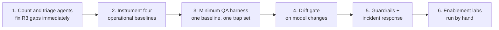

# AI Team Goals & Objectives

*What my team is here to do for CES, how we will do it, and how you should hold us to account.*

**Owner:** Director of AI (AI Enablement)
**Audience:** CES leadership, engineering managers, delivery teams
**Status:** Draft v0.1 — for review and challenge
**Last updated:** 2026-09-06

**Companion documents:** [DirectorAIRoleOverview](../DirectorAIRoleOverview.md) (the role) · [OverviewOfNewAITeam](OverviewOfNewAITeam.md) (plain-language summary) · [newCESTeamRoles](newCESTeamRoles.md) (who does what) · [AIAcrossCESMaximizingItsPotential](AIAcrossCESMaximizingItsPotential.md) (strategy) · [ai-across-ces/README](ai-across-ces/README.md) (the technical framework)

---

## 1. The whole thing in one minute

We are not here to tell teams how to use AI. We are here to make it easy for them to use it well, and to make it obvious when it is going wrong.

Our promise to CES, in one sentence:

> **We own the spine, not the work.** We build the standards, the test harness, the registry, the knowledge structures, and the training — and we make delivery teams better at their own jobs. The moment we start doing their AI work for them, we become a queue and the programme dies of its own success.

Three outcomes, deliberately in tension:

| Outcome | Plain meaning | The trap we are avoiding |
| --- | --- | --- |
| **Capability** | People get more done, and better work, because AI is used well | Enthusiasm without judgement |
| **Quality** | AI output is checked, grounded, and safe — AI raises our standards, never lowers them | Confident and wrong |
| **Cost** | We pay the least we can for that value, and can prove what it costs | Cheap answers that fail and get re-run |

Managing that tension on purpose, rather than by accident, is the job.

---

## 2. How we help teams succeed — our service catalogue

This is the friendly version: **what a team can ask us for on any given Tuesday.** If a team cannot name something on this list that we did for them, we are not earning our keep.

| A team can come to us for… | What they get | Turnaround |
| --- | --- | --- |
| **"Which model should I use for this?"** | A recommendation with the evidence behind it, or a one-day bake-off if we do not know yet ([02 §4.1](ai-across-ces/02-model-selection-and-fit.md)) | Same week |
| **"My agent gives inconsistent results."** | A diagnosis — usually a context problem, not a model problem ([01](ai-across-ces/01-context-engineering-and-transparency.md)) | Same week |
| **"Is my repo ready for agents?"** | A readiness audit of code and context, with a prioritised fix list ([14](ai-across-ces/14-repo-audit-agentic-readiness.md), [15](ai-across-ces/15-repo-audit-context-readiness.md)) | Two weeks |
| **"Are my tickets good enough for an agent?"** | A deterministic quality score plus a rewrite that would pass | Same day |
| **"Do my tests actually cover this change?"** | A mutation-tested adequacy report naming the defects your suite would ship | Two days |
| **"We want to try something ambitious."** | A design review, a safety opinion, and help staying out of trouble | Same week |
| **"Can you train my team?"** | Hands-on labs with objective before-and-after scores, run in their tools | Scheduled |
| **"We built something that works really well."** | We capture it, harden it, and make it reusable by everyone else | Ongoing |
| **"Something has gone wrong."** | Containment first, blame never ([12](ai-across-ces/12-ai-incident-response-and-observability.md)) | Immediate |

**Three commitments that make the above real:**

1. **Registration is an amnesty, not an audit.** If telling us about an agent gets someone in trouble, we will never hear about the risky ones. Register first, fix second.
2. **Metrics are never used for individual performance management.** Team and programme level only. The first breach of this ends our credibility permanently, and we know it.
3. **We eat our own cooking, publicly.** The first team to publish an embarrassing number is this one.

---

## 3. The goals

Fourteen goals, grouped into five themes. Each has objectives, a measure, and an owner. **The measure matters more than the objective** — an objective without a number is a wish.

Every measure below follows the paired-metric rule from [11 §3](ai-across-ces/11-measurement-baselines-and-roi.md): *nothing is reported alone*, because any single number can be gamed.

---

### Theme A — Know what we have

#### G1. Complete, current agent inventory

*You cannot govern, test, or fix an agent you have never counted. Everything else assumes this exists.*

| | |
| --- | --- |
| **Objectives** | Run the four-lens discovery sweep — code, spend, network traffic, and people ([10 §2](ai-across-ces/10-agent-inventory-and-registry.md)) · register every deployed or runnable agent with a **named human owner** · assign a risk tier to each · fix owner, access, and off-switch gaps on R3 agents the day they are found |
| **Measure (paired)** | Agents registered **and** the reconciliation gap — how many we found that nobody knew about |
| **Owner** | AI Platform & Operations Engineer |
| **Done looks like** | "What agents touch customer data, and who owns them?" answered in under a minute |

> **The single most telling early number** is the gap between agents we *find* and agents we *knew about*. That is the size of the risk CES is carrying blind today, and it is measurable within a month.

#### G2. Repository and portfolio context mapping

| | |
| --- | --- |
| **Objectives** | Build the three-tier context model — **Tier 1 Cortex** (estate inventory and purpose), **Tier 2 APM ID** (department/domain grouping and ownership boundary), **Tier 3 Repository** (the detailed artifacts that can actually name a file) · pilot OKF bundles on two or three repos **only** · wire the CI validation gate before the first concept is written |
| **Measure (paired)** | Token reduction on piloted repos **and** measured **grounding rate** — proof agents actually read the bundles ([05 §3.3](ai-across-ces/05-agent-qa-and-regression-framework.md)) |
| **Owner** | Context & Knowledge Architect |
| **Done looks like** | Teams ask for bundles instead of being sold them |

> **The honest constraint here is maintenance capacity, not authoring effort.** Generating a bundle takes an afternoon; keeping it true takes forever. A stale bundle is *worse than none* — it is confidently wrong, machine-readable, and trusted. We enforce a capacity gate ([03 §6.1](ai-across-ces/03-knowledge-artifacts-and-okf.md)) and we will decline to create bundles nobody will maintain.

---

### Theme B — Quality assurance and agentic readiness

#### G3. A working QA harness with golden baselines

| | |
| --- | --- |
| **Objectives** | Stand up the harness with **one** golden baseline and **one** trap set · establish incumbent model scores **and their variance** · maintain the golden baseline as a curated, versioned asset with a retirement policy · keep a **sealed holdout** never used for tuning |
| **Measure (paired)** | Golden-baseline score **and** the **open/holdout gap** |
| **Owner** | AI Quality Engineer |
| **Done looks like** | "The agents feel unreliable" becomes a number that moves |

> **The headline diagnostic is the open/holdout gap.** If the open set scores 0.90 and the sealed holdout scores 0.62, we have been optimising for the test rather than improving. That single comparison is worth more than any absolute score we could report.

#### G4. Ticket and story quality gates

| | |
| --- | --- |
| **Objectives** | Score story quality **deterministically before any model sees it** · use a zero-token-cost model (Gemma) for the grading pass · return a rewritten ticket that would pass · fold the check into Definition of Ready |
| **Measure (paired)** | Ticket pass rate at first submission **and** downstream rework on tickets that passed |
| **Owner** | AI Quality Engineer + Champions |
| **Done looks like** | Teams fix tickets before they reach an agent, not after it fails |

> Most agent failures are underspecified tickets, not weak models. This is the cheapest quality intervention available to us.

#### G5. Regression adequacy auditing

| | |
| --- | --- |
| **Objectives** | Audit whether existing test suites actually cover enhancement-related risk · run **mutation testing** — inject one deliberate defect at a time and check whether the suite catches it · have a low-cost model propose the missing tests and a frontier model check those proposals |
| **Measure (paired)** | Mutation score (defects killed) **and** suite runtime cost |
| **Owner** | AI Quality Engineer |
| **Done looks like** | "Green tests" stops being mistaken for "covered" |

> A defect that survives mutation is a defect the suite would have shipped. **Caveat:** mutation testing executes modified code, so it belongs in an isolated sandbox — never a shared host.

#### G6. Test-only scenarios with realistic data

| | |
| --- | --- |
| **Objectives** | Design realistic JIRA scenarios and representative test data **without checking anything into production repositories** · gate every ticket before it leaves the boundary · keep references, never payloads, in the audit record |
| **Measure (paired)** | Scenarios in the library **and** zero data-tier violations |
| **Owner** | AI Quality Engineer + Security partner |
| **Done looks like** | Real-world fidelity with no leak surface |

> Real data makes the best test fixture and the worst leak. Both facts are true at once, which is why the gate is deterministic and model-free.

---

### Theme C — Monitoring, drift, and incident response

#### G7. Agent effectiveness monitoring in production

| | |
| --- | --- |
| **Objectives** | Review a **defined, documented percentage** of production-promoted stories and AI-authored changes · publish the sampling method, the rate, and the named reviewer · score against baseline criteria: context usage, implementation quality, documentation clarity, production readiness |
| **Measure (paired)** | Sampled quality score **and** sample size with confidence interval |
| **Owner** | AI Quality Engineer |
| **Done looks like** | Quality is a chart, not an opinion |

> **Be strict about this one.** "A representative percentage" without a defined rate, a selection method, and a named reviewer is anecdote wearing the costume of monitoring. If we cannot state all three, we should not claim we are monitoring.

#### G8. Context sufficiency curves

| | |
| --- | --- |
| **Objectives** | For representative tasks, run the same model against a **cumulative ladder of context**, scored against sealed criteria the model never sees · add context until quality plateaus (that plateau is the token budget) · remove context until quality collapses (that floor is the minimum viable context) · repeat runs to separate signal from variance |
| **Measure (paired)** | Plateau score **and** tokens consumed at plateau |
| **Owner** | AI Quality Engineer |
| **Done looks like** | Context budgets are measured rather than argued |

#### G9. Model drift management

| | |
| --- | --- |
| **Objectives** | Pin every model version — never auto-adopt "latest" · gate every version change through the regression suite before adoption · run **daily canary probes** to catch a hosted provider silently swapping the model beneath us · test specifically for **calibration drift toward over-confidence** |
| **Measure (paired)** | Regression score delta **and** calibration/abstention rate |
| **Owner** | AI Quality Engineer |
| **Done looks like** | A model release is accepted or rejected on evidence within a week |

> Over-confidence drift is the failure mode that hurts **junior engineers first and worst**. A senior engineer usually catches confident-and-wrong; a junior often cannot, and the model gives no signal about which case they are in.

#### G10. Runtime observability and incident response

| | |
| --- | --- |
| **Objectives** | Runtime logging on every R2/R3 agent · a **tested** kill switch on every R3 agent, drilled quarterly · a named incident responder and rollback plan · every incident produces a regression test that prevents its recurrence · blameless post-mortems, always |
| **Measure (paired)** | Mean time to detect **and** mean time to contain |
| **Owner** | AI Platform & Operations Engineer |
| **Done looks like** | We find out before the customer does, and we can stop it |

> Prevention without detection is half a safety system. Given how many agents are already live, an incident is a *when*, not an *if*. **This is currently our thinnest area and I would fund it early.**

---

### Theme D — Enablement, training, and sharing

#### G11. Training that measurably changes behaviour

| | |
| --- | --- |
| **Objectives** | Run five labs **by hand** with real engineers before building any platform · measure objective before-and-after scores, never satisfaction surveys or completion rates · schedule a **90-day delayed reassessment on an unseen variant** to measure decay · grade the *process*, not just the artefact |
| **Measure (paired)** | Planted-flaw detection recall **and** precision; day-1 score **and** day-90 score |
| **Owner** | Enablement & Learning Engineer |
| **Done looks like** | Trained cohorts show measurably less rework than not-yet-trained ones |

> Two honest notes. **First:** a learner can ask an AI to complete the lab about not blindly trusting AI. We name that irony in the briefing, which turns a cheat into the lesson. **Second:** the people who volunteer for training first are not a random sample — they are the already-motivated. We will say so whenever we report a result.

#### G12. Capturing and sharing successes

| | |
| --- | --- |
| **Objectives** | A shared prompt and pattern library where contributions are admitted on **evidence, preconditions, and known failure modes** — not enthusiasm · capture outcomes and lessons learned, **including the failures, which are usually more instructive** · run brown-bags and office hours; record them into a searchable library · publish a short win template so a good pattern takes ten minutes to share, not an afternoon |
| **Measure (paired)** | Patterns published **and** patterns actually reused by another team |
| **Owner** | Context & Knowledge Architect + Champions |
| **Done looks like** | A brilliant prompt stops being lost in a Teams thread by Friday |

> **Reuse is the only real signal.** A library with 200 entries and no reuse is a graveyard. And a bad shared prompt scales harm just as efficiently as a good one scales value — which is why admission is evidence-based.

#### G13. Removing adoption barriers

| | |
| --- | --- |
| **Objectives** | Make the good path the easy path — repo templates, instruction files, and library prompts that ship correct by default · publish a 60-minute onboarding kit · fund champions at **~20% of their time, visible in their goals and protected by their manager** · keep the mandatory list short and make every gate justify itself annually or be removed |
| **Measure (paired)** | Weekly active engineers **and** role-relevant competency status |
| **Owner** | Director of AI + Champions |
| **Done looks like** | Teams ask for the framework instead of being sold it |

> **Most adoption is won in templates, not in governance.** An unfunded champion is a volunteer who will quietly stop within six weeks — so champion funding is not a nice-to-have, it is the mechanism that makes the whole federated model work.

---

### Theme E — Cost, architecture, and process

#### G14. Token and cost optimisation

| | |
| --- | --- |
| **Objectives** | Attribute cost to team and use case before optimising anything · publish tiered model defaults — small/local for routine, mid-tier for most coding, frontier only for hard reasoning · **cross-model delegation**: frontier model designs, cheaper model implements, harness arbitrates · introduce free and lower-cost models where quality is genuinely sufficient · budget in **cost per successful outcome**, not cost per token |
| **Measure (paired)** | Cost per merged PR **and** quality score |
| **Owner** | Director of AI + FinOps partner |
| **Done looks like** | Cost per unit of work trends down while quality holds |

> **"Free" is the wrong word and cost per token is the wrong unit.** An open-weight model has real fixed infrastructure cost, and a model that fails a third of the time is billed for every failure including the retries. The only honest denominator is a successful outcome.

#### G15. Enterprise architecture consolidation

| | |
| --- | --- |
| **Objectives** | Audit CES repositories for duplicated **functional business logic** and shared **non-functional enterprise libraries** · use embedding similarity to find duplication **by meaning rather than by name** · have a frontier model design the consolidation and a cheaper model implement it · produce a prioritised roadmap, not a wish list |
| **Measure (paired)** | Duplicated lines identified **and** lines actually consolidated |
| **Owner** | Director of AI + delivery architects |
| **Done looks like** | A funded consolidation roadmap with evidence behind each item |

> **Caveat worth stating up front:** similarity thresholds are corpus-specific and do not transfer between codebases unchanged. Any number we produce here comes with the corpus it was calibrated on and the margin it was calibrated at.

#### G16. AI-DLC process integration

| | |
| --- | --- |
| **Objectives** | Meet teams where they are — map onto Scrum, Kanban, SAFe, or their own hybrid rather than rip-and-replace · **Level 1 overlay** costs almost nothing and any team can start this sprint · plan-first with executive summary and diagram before code on non-trivial work · follow the adoption sequence **volunteers → evidence → norm → requirement**, and never start at requirement |
| **Measure (paired)** | Gate pass rates **and** cycle time with rework |
| **Owner** | Director of AI + Engineering Managers |
| **Done looks like** | Good habits survive the quarter after training |

> Mandating first produces malicious compliance — gates satisfied on paper with judgement disengaged. **That is strictly worse than no gate**, because it manufactures false assurance.

---

## 4. Where your list came from, and what I added

You named six areas. All six are here, and I added nine more that the framework needs to hold together.

| Your area | Covered by | Notes |
| --- | --- | --- |
| Help teams be successful with AI | §2 service catalogue, G13, G16 | This is the whole point; everything else serves it |
| Share AI successes | **G12** | Extended to capture *failures* too — they teach more |
| Audit AI-related processes | **G5, G15, G16**, plus repo readiness in §2 | Split into regression audit, architecture audit, and process audit |
| Provide training | **G11** | Extended with decay testing and process grading |
| Monitor AI | **G7, G9, G10** | Split into three: agent effectiveness, model drift, and runtime |
| AI QA oversight | **G3, G4, G6, G8** | Split into harness, ticket gates, safe fixtures, and context curves |

**What I added, and why each one matters:**

| Added | Why it is not optional |
| --- | --- |
| **G1 Agent inventory** | Every other goal silently assumes we know what exists. None of them establishes it. This is the foundation. |
| **G2 Context mapping** | Your Tier 1/2/3 model from the role overview — it belongs in the goal set, not just the role description |
| **G8 Context sufficiency curves** | Turns "how much context is enough?" from an argument into a measurement |
| **G9 Model drift** | A vendor can change the model underneath us overnight without telling us |
| **G10 Incident response** | Prevention without detection is half a safety system, and this is our thinnest area today |
| **G14 Cost per outcome** | Cost was in your role overview; the *unit* is the part that is usually wrong |
| **Sampling method (in G7)** | "A representative percentage" is not a method until the rate and reviewer are named |
| **Decay testing (in G11)** | Everyone skips it, and it is the only thing that tells us how often refreshers are needed |
| **Golden baseline as a maintained asset (in G3)** | One frozen case is a demo. Curation, versioning, and retirement are what make it an asset |

---

## 5. Direction from me, as your SME

You asked for direction rather than just a list. Here is what I would actually do, in order — and the things I would resist.

### Do these first

1. **Count the agents before improving any of them.** Thirty days. The reconciliation gap is the most persuasive number you will have all year, and it costs almost nothing to produce.
2. **Fund the champions properly, or do not appoint them.** 20%, in their goals, protected by their manager. This is the highest-leverage staffing decision in the programme and the one most often made carelessly.
3. **Hire or assign the AI Quality Engineer first.** Nothing can be gated without measurement, and adversarial AI evaluation is the capability least likely to already exist informally in CES.
4. **Run five training labs by hand before building any platform.** Building the flight simulator before proving the lessons work on paper is the single most expensive mistake available to this programme.
5. **Publish one honest result at 90 days**, including a section on what did not work.

### Resist these

| Pressure you will feel | Why to resist it |
| --- | --- |
| "Roll out knowledge bundles everywhere" | A stale bundle is worse than none. Two maintained beats ten rotting. |
| "Mandate the process org-wide" | Mandating first buys paperwork, not judgement. Volunteers → evidence → norm → requirement. |
| "Fine-tune a model on our code" | Give models better *information* first. Only train weights when you can prove information alone was insufficient. |
| "Build a custom AI gateway" | Try to answer the question with tools we already pay for. Build only when they demonstrably cannot. |
| "Write another framework document" | The document set is already at the limit of what an organisation can absorb. |

### Three habits to build into yourself

1. **Withhold your preferred solution until the model has proposed options.** You will be the most confident person in the room about AI, and confidence is not correctness. If an agent has never once told you that you were wrong, you are not getting analysis — you are getting an echo, and paying tokens for it.
2. **Appoint someone whose job is to disagree with you.** Make "tell the Director when the evidence contradicts the plan" an explicit, praised part of a named person's role. A programme built on transparency with no internal dissent is running the exact failure it warns others about.
3. **Present the Grade-C number when the Grade-A one is less flattering.** Leadership forgives a disappointing result. It does not forgive discovering that you knew and presented the flattering one instead.

### The single question to ask in every review

> *"What is the number, and what method produced it?"*

Apply it to your own team's claims first and hardest. Most of the failure modes in this programme are caught by that one question asked consistently.

---

## 6. Sequencing

| Horizon | What leadership should see |
| --- | --- |
| **30 days** | A real number for how many agents exist, including ones nobody knew about. Champions named and funded. |
| **90 days** | Every high-risk agent has an owner, a pinned model, and a **tested** off-switch. Six baselines published with their methods. One measured result presented honestly. |
| **6 months** | A model version accepted or rejected on evidence within a week. Trained teams show measurably less rework. Cost per unit of work trending down. |
| **12 months** | Quality is a chart, not an opinion. Incidents are rare, caught fast, and each has produced a test that prevents recurrence. Teams ask for the framework instead of being sold it. |

---

## 7. What we will deliberately not do

Saying no is what makes the rest affordable.

| Not now | Why |
| --- | --- |
| A large central AI team | Small core, federated edge. 3–4 people cannot serve every team; 30 champions can. |
| Reviewing every AI-assisted PR | We would become a bottleneck and teams would route around us. |
| Approving every prompt | Same reason. We set standards and provide evidence; teams own their work. |
| The full training platform | Prove the lessons work on paper first. The build is expensive and hard to change. |
| Applying heavy controls to every agent | Roughly 80% of agents draft text a human immediately reviews. Those need an owner and a review, nothing more. |
| Being the escalation queue for all AI questions | Champions are the first line. We are the second. |

**Right-sizing is what makes this affordable.** The expensive machinery — golden baselines, gold eval sets, drift gates, observability — is aimed at the R2/R3 minority that can cause real harm.

---

## 8. Honest risks

| Risk | Likelihood | What we do about it |
| --- | --- | --- |
| **The framework becomes shelfware** | High — this is the default outcome | Critical path only; a quarterly retro whose mandatory question is *what do we delete?* |
| **Teams see it as bureaucracy** | Medium-high | Short Required list; every gate justifies itself annually or is removed; retire an old ceremony for each new one |
| **We measure the wrong things** | Medium | Paired metrics throughout, so nothing can be gamed alone |
| **An incident before controls are in place** | Medium | Riskiest agents first, in the first 90 days |
| **We over-build the training platform** | Medium | Explicit build gates; each phase earned with evidence |
| **Key-person dependency** | Medium | Runbooks and versioned artefacts; a federated network, not a hero |
| **Leadership expects a faster payoff** | Medium | This document; honest evidence grades; no inflated early claims |

---

## 9. What is still open

Stated plainly, because discovering these mid-programme is worse than naming them now.

| Open question | Who needs to decide |
| --- | --- |
| Which repository becomes the golden baseline, and who curates it? | Director of AI + delivery architects |
| What sampling rate for production review, and who reviews? | Director of AI + Engineering Managers |
| Who owns data-tier classification decisions? | Security & Responsible AI |
| Is the token budget a hard cap or a soft guideline? | Director of AI + FinOps |
| What is the default approval mode for tool-enabled agents? | Security & Responsible AI |
| How do Tier 2 APM IDs map to actual org structure? | Delivery leadership |
| Who is the Level 3 flagship team for AI-DLC? | Engineering Managers |

---

## 10. How to challenge this document

This is a draft, and it should be argued with. Several documents in this set exist because someone pushed back.

If you think a goal is wrong, the most useful challenge is not *"I disagree"* — it is **"what number would tell you that you were wrong?"** If we cannot answer that for any goal above, that goal is not ready and should be sent back.

The same standard we apply to the models, we apply to ourselves.
