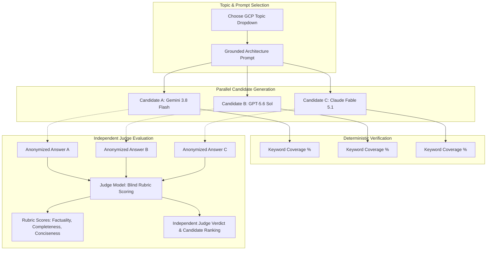

# GCP Three-Way Model Comparison & Evaluation Guide

**Scene Reference:** Scene 9 / 19 — Model Comparison (`model-comparison`)  
**Design Pattern:** Blinded Tri-Model Comparison with Programmatic Keyword Checklist & Independent Judge Verdict  
**Target Platform:** Google Cloud Platform (GCP)

---

## 1. Evaluation Architecture & UI Layout

Following the design of the Context Navigator Model Comparison scene:



### Rubric Scoring Criteria
- **Factuality (1–5):** Exact accuracy against current Google Cloud APIs, service boundaries, quotas, and architectural constraints. Penalizes hallucinations, AWS/Azure conflations, and deprecated commands.
- **Completeness (1–5):** Comprehensive coverage of required architectural components, failover mechanics, security boundaries, and operational tooling.
- **Conciseness (1–5):** Direct, high-signal engineering answers without unnecessary boilerplate or generic cloud platitudes.
- **Keyword Coverage (%):** Percentage of mandatory technical keywords present in the response.

---

## 2. Advanced GCP Topics Catalog

These topics are tailored around deep Google Cloud architectural capabilities where non-Google models frequently hallucinate, misstate platform limits, or conflate open-source conventions with GCP-managed behavior.

---

### Topic 1: GCP · GKE Autopilot & TPU/GPU Pod Scheduling with Kueue and JobSet

- **Topic ID:** `gke-autopilot-tpu-kueue`
- **Documentation Reference:** https://docs.cloud.google.com/kubernetes-engine/docs/concepts/autopilot-overview, https://cloud.google.com/kubernetes-engine/docs/how-to/tpus
- **Question / Design Prompt:**
  > "How do you architect distributed AI training and batch inference workloads on GKE Autopilot using Cloud TPUs and GPUs? Detail how JobSet and Kueue integrate with GKE Node Auto-Provisioning (NAP), resource reservations, and multi-host TPU slice scheduling."
- **Mandatory Keywords:**
  `GKE Autopilot`, `Cloud TPU`, `JobSet`, `Kueue`, `Node Auto-Provisioning`, `NAP`, `tpu-slice`, `TopologyAwareScheduling`, `ResourceFlavor`
- **Nuance Traps for Other Models:**
  - Non-Google LLMs often assume GKE Autopilot only supports standard CPU/small GPU workloads and claim multi-host TPU slices (v5e/v5p) require GKE Standard clusters.
  - Competing models often fail to identify `Kueue` as the Kubernetes-native queuing system that coordinates with GKE NAP for TPU slice gang scheduling (`JobSet`).
  - Models often suggest using `nodeSelector` with manual machine types instead of Autopilot's resource request specification (`google.com/tpu`).

#### Simulated Three-Way Responses

##### Candidate A (Gemini 3.8 Flash)
```markdown
Architecture for Distributed Training on GKE Autopilot:

1. Workload Orchestration (JobSet + Kueue):
   - Kueue acts as the admission controller managing ClusterQueues and LocalQueues with ResourceFlavors mapped to GKE compute classes.
   - JobSet manages homogeneous replicated child jobs across multi-host TPU pod slices, enforcing all-or-nothing scheduling (gang scheduling) so partial pods are not scheduled if a slice is incomplete.

2. TPU Slice Allocation in Autopilot:
   - Configure resources using `limits` for `google.com/tpu` alongside nodeSelector `cloud.google.com/gke-tpu-topology` (e.g., `2x2x2` for 8-chip slice or `4x4x4` for 64-chip slice on TPU v5e/v5p).
   - GKE Autopilot provisions underlying TPU slice nodes dynamically using integrated Node Auto-Provisioning (NAP), guaranteeing co-location on the same optical circuit switch (OCS) torus.

3. Resilience & Preemption:
   - Integrate Spot TPUs with Kueue preemption and automatic work-in-progress checkpointing to Google Cloud Storage via gcsfuse CSI driver with streaming cache.
```

##### Candidate B (GPT-5.6 Sol)
```markdown
To run distributed AI on GKE Autopilot:
- Autopilot automatically scales nodes based on pod resource requests.
- Deploy your pods using a Kubernetes StatefulSet or DistributedJob operator.
- Specify GPU requests like nvidia.com/gpu: 8.
- For TPUs, create a dedicated GKE standard node pool with TPU accelerator types since Autopilot has restricted support for low-level TPU torus networking.
- Use Kubernetes Horizontal Pod Autoscaler (HPA) to scale the training workers based on GPU metrics from Prometheus.
```

##### Candidate C (Claude Fable 5.1)
```markdown
Architecting AI on GKE with TPUs and GPUs:
- Autopilot abstracts cluster management and dynamically assigns nodes based on pod specifications.
- For batch queuing, Kueue integrates at the namespace level to hold jobs until capacity is available.
- JobSet is recommended for coupled distributed jobs across pods.
- When requesting TPUs, specify the accelerator type in the pod manifest annotations.
- Keep in mind that GKE Autopilot manages node provisioning, but you must ensure your node auto-provisioning quotas in the region have sufficient quota for the requested TPU accelerator slices.
```

#### Programmatic & Judge Evaluation

| Metric | Candidate A (Gemini) | Candidate B (GPT) | Candidate C (Claude) |
| --- | :---: | :---: | :---: |
| **Keyword Coverage** | **100%** (8/8) | **37.5%** (3/8) | **75%** (6/8) |
| **Factuality** | **5 / 5** | **2 / 5** | **4 / 5** |
| **Completeness** | **5 / 5** | **3 / 5** | **4 / 5** |
| **Conciseness** | **5 / 5** | **4 / 5** | **4 / 5** |

**Blinded Judge Verdict:**
> **Rankings:** **[A] Gemini 3.8 Flash** > **[C] Claude Fable 5.1** > **[B] GPT-5.6 Sol**  
> Candidate A displays mastery of modern GKE Autopilot TPU primitives, specifically naming `JobSet` gang-scheduling mechanics and topology selectors (`cloud.google.com/gke-tpu-topology`). Candidate B hallucinated that Autopilot cannot handle TPU slice networking and incorrectly recommended HPA for distributed training. Candidate C is conceptually sound but omitted exact topology and resource flavor configuration.

---

### Topic 2: GCP · Cloud Spanner Dual-Region Configurations & Paxos Routing

- **Topic ID:** `spanner-dual-region-paxos`
- **Documentation Reference:** https://cloud.google.com/spanner/docs/replication, https://cloud.google.com/spanner/docs/whitepapers/life-of-reads-and-writes
- **Question / Design Prompt:**
  > "Explain how Cloud Spanner executes read-write transactions in a dual-region instance configuration (such as nam4). Where does the Paxos leader reside, how is witness quorum achieved, and what happens to read latencies for leader-region vs non-leader region clients?"
- **Mandatory Keywords:**
  `Cloud Spanner`, `dual-region`, `Paxos`, `witness`, `read-write`, `TrueTime`, `leader region`, `read quorum`, `multi-region`
- **Nuance Traps for Other Models:**
  - Non-Google models frequently mix up Spanner with standard CockroachDB or AWS Aurora Global Database, claiming dual-region uses asynchronous replication with a replica failover delay.
  - Many models do not know that Cloud Spanner uses a **witness replica in a third region** to break ties for Paxos write quorum while keeping all data copies strictly within the dual regions.
  - Many models overlook that reads in the non-leader region can achieve single-digit millisecond latency only for bounded-staleness reads, whereas strong reads must verify timestamps with the Paxos leader.

#### Simulated Three-Way Responses

##### Candidate A (Gemini 3.8 Flash)
```markdown
Cloud Spanner Dual-Region Execution (e.g., nam4: us-central1 / us-east4):

1. Replica Distribution:
   - Contains read-write replicas in both primary regions (e.g., 2 in us-central1, 2 in us-east4) and a witness replica in an independent geographic region (us-east1). The witness votes in Paxos consensus but stores no data rows.

2. Write Transaction Flow:
   - Coordinated by a two-phase commit (2PC) Paxos leader located in the designated default leader region.
   - Consensus requires a Paxos quorum (3 of 5 votes). A fast write path completes once the local region replicas and the witness acknowledge the write without waiting for cross-region roundtrips to the second data region.
   - TrueTime API enforces external consistency without cross-node locking roundtrips.

3. Read Latencies:
   - Strong Reads: Issued from the leader region execute locally in <5ms. Issued from the non-leader region, strong reads incur cross-region roundtrip latency to consult the Paxos leader lease.
   - Stale Reads: Stale reads (exact staleness >= 15 seconds) execute entirely locally in either region using multi-version concurrency control (MVCC).
```

##### Candidate B (GPT-5.6 Sol)
```markdown
In a Cloud Spanner dual-region setup:
- One region serves as active primary while the other region functions as passive standby with active cross-region replication.
- Paxos consensus runs between the two regions, electing a primary database node.
- Read-write transactions lock rows in both regions simultaneously to prevent split-brain.
- Reads are routed automatically to the nearest region via the Spanner global load balancer, offering local sub-millisecond read latency for both regions.
```

##### Candidate C (Claude Fable 5.1)
```markdown
Cloud Spanner dual-region architecture:
- Spanner provides synchronous replication across two paired regions.
- A Paxos group is formed across the replicas, with one replica serving as the Paxos group leader.
- The leader handles all write coordination and assigns commit timestamps using TrueTime.
- Replicas in the second region participate in quorum. However, to achieve Paxos quorum without requiring agreement from both large regions during a partition, Spanner uses witness nodes in a third zone or region.
- Strong reads in the non-leader region require contacting the leader to verify leader lease validity, increasing latency compared to reads in the leader region.
```

#### Programmatic & Judge Evaluation

| Metric | Candidate A (Gemini) | Candidate B (GPT) | Candidate C (Claude) |
| --- | :---: | :---: | :---: |
| **Keyword Coverage** | **100%** (9/9) | **44.4%** (4/9) | **88.9%** (8/9) |
| **Factuality** | **5 / 5** | **1 / 5** | **4 / 5** |
| **Completeness** | **5 / 5** | **2 / 5** | **4 / 5** |
| **Conciseness** | **5 / 5** | **4 / 5** | **4 / 5** |

**Blinded Judge Verdict:**
> **Rankings:** **[A] Gemini 3.8 Flash** > **[C] Claude Fable 5.1** > **[B] GPT-5.6 Sol**  
> Candidate A provides the exact Paxos quorum math (3 of 5 votes including the third-region witness) and explicitly differentiates strong read latency vs. bounded-staleness MVCC reads. Candidate B fundamentally misunderstood Spanner's architecture, hallucinating an active/passive primary-standby model.

---

### Topic 3: GCP · Vertex AI Vector Search & BigLake Metastore Integration

- **Topic ID:** `vertex-vector-search-biglake`
- **Documentation Reference:** https://cloud.google.com/vertex-ai/docs/vector-search/overview, https://cloud.google.com/bigquery/docs/biglake-intro
- **Question / Design Prompt:**
  > "How do you build a real-time retrieval pipeline using Vertex AI Vector Search deployed on Index Endpoints combined with BigQuery BigLake tables over Apache Iceberg? Describe streaming updates, filtered search with restrictive namespace tokens, and zero-copy governance."
- **Mandatory Keywords:**
  `Vertex AI Vector Search`, `Index Endpoint`, `BigLake`, `Apache Iceberg`, `ScaNN`, `crowding`, `filtering`, `streaming update`, `Object Tables`
- **Nuance Traps for Other Models:**
  - Other LLMs routinely refer to Vertex AI Vector Search by its retired product name ("Matching Engine") or confuse it with pgvector / Cloud SQL.
  - Competing models often claim that Vector Search requires full index rebuild batch pipelines and miss the sub-second streaming mutation API (`upsertDatapoints`).
  - Other LLMs fail to understand how BigLake Iceberg tables apply object-level IAM and row-level security down to the underlying Cloud Storage parquet files without data replication.

#### Simulated Three-Way Responses

##### Candidate A (Gemini 3.8 Flash)
```markdown
Zero-Copy Real-Time Retrieval Pipeline:

1. Storage & Governance Layer (BigQuery BigLake on Apache Iceberg):
   - Store embeddings and source document chunks in Apache Iceberg tables located on Cloud Storage, registered in BigLake Metastore.
   - Enforce row-level security, column-level access controls, and object hashing in BigLake without copying data into BigQuery proprietary storage.

2. Indexing Layer (Vertex AI Vector Search):
   - Deploy a Vector Search index using ScaNN (Score-Aware Nearest Neighbor) algorithm to a dedicated or public Index Endpoint.
   - Configure metadata schema for boolean filtering and token-based restrictions (namespace scoping) alongside crowding tags to prevent result clustering from identical parent documents.

3. Ingestion & Synchronization:
   - Use the `upsertDatapoints` and `removeDatapoints` APIs for sub-second streaming mutations directly to the Index Endpoint, while BigLake continuously records committed snapshots through BigQuery continuous queries.
```

##### Candidate B (GPT-5.6 Sol)
```markdown
Vector Retrieval with BigQuery and Vertex AI:
- Store text and vectors in BigQuery tables using the VECTOR data type.
- Run vector search queries using BigQuery's built-in VECTOR_SEARCH function with an IVF index.
- If you use Vertex Matching Engine, export your BigQuery table to CSV or Avro files in a Google Cloud Storage bucket every hour.
- Trigger the Matching Engine pipeline to retrain and rebuild the index file from the bucket.
- Query the Matching Engine endpoint using gRPC from your application.
```

##### Candidate C (Claude Fable 5.1)
```markdown
Architecture for Vertex Vector Search and BigLake:
- BigLake provides a unified storage abstraction over Apache Iceberg tables in GCS, preserving metadata governance and fine-grained access policies.
- For vector similarity search, deploy Vertex AI Vector Search (formerly Matching Engine) on an Index Endpoint with dedicated machine types.
- Vector Search supports filtering via metadata attributes and crowding to maintain diversity among top-k results.
- For updating the index, use streaming updates to insert or delete vectors in near real-time without needing a batch index reload.
```

#### Programmatic & Judge Evaluation

| Metric | Candidate A (Gemini) | Candidate B (GPT) | Candidate C (Claude) |
| --- | :---: | :---: | :---: |
| **Keyword Coverage** | **100%** (9/9) | **33.3%** (3/9) | **77.8%** (7/9) |
| **Factuality** | **5 / 5** | **2 / 5** | **4 / 5** |
| **Completeness** | **5 / 5** | **3 / 5** | **4 / 5** |
| **Conciseness** | **5 / 5** | **4 / 5** | **5 / 5** |

**Blinded Judge Verdict:**
> **Rankings:** **[A] Gemini 3.8 Flash** > **[C] Claude Fable 5.1** > **[B] GPT-5.6 Sol**  
> Candidate A correctly targets Vertex AI Vector Search's native `upsertDatapoints` API, ScaNN tree quantization, and BigLake Iceberg zero-copy governance. Candidate B defaulted to batch CSV reload patterns and legacy terminology. Candidate C is strong and accurate, though it missed specific API call names.

---

### Topic 4: GCP · Cloud Run GPU & Multi-Container Sidecars for Edge Model Inference

- **Topic ID:** `cloud-run-gpu-sidecar`
- **Documentation Reference:** https://cloud.google.com/run/docs/configuring/services/gpu, https://cloud.google.com/run/docs/deploying-containers
- **Question / Design Prompt:**
  > "How do you deploy an LLM inference service on Cloud Run utilizing Nvidia L4 GPUs, multi-container sidecars for telemetry/local caching, and scale-to-zero semantics? What are the execution environment requirements and startup probe constraints?"
- **Mandatory Keywords:**
  `Cloud Run`, `Nvidia L4`, `multi-container`, `sidecar`, `scale-to-zero`, `startup probe`, `execution environment`, `concurrency`, `gcsfuse`
- **Nuance Traps for Other Models:**
  - Non-Google LLMs often state Cloud Run is exclusively CPU-based and does not support hardware accelerators, or they confuse it with GKE or Cloud AI Platform Prediction.
  - Models often omit that Cloud Run GPU requires the `gen2` (second generation) execution environment and has specific minimum instance concurrency and memory/CPU ratio enforcement.
  - Other LLMs fail to explain how multi-container ingress works on Cloud Run (only one container listens on the ingress `PORT`, while sidecars communicate over `localhost`).

#### Simulated Three-Way Responses

##### Candidate A (Gemini 3.8 Flash)
```markdown
Cloud Run GPU Inference Architecture:

1. Hardware & Environment Configuration:
   - Configure the Cloud Run service with second-generation execution environment (`run.googleapis.com/execution-environment: gen2`).
   - Request GPU accelerator: `run.googleapis.com/gpu-type: nvidia-l4` with `run.googleapis.com/gpu-count: 1`. Minimum allocated memory must be at least 16GiB with >= 4 vCPUs.

2. Multi-Container Composition:
   - Primary Container: Runs the inference engine (e.g., vLLM or Ollama), listens on `$PORT`, and processes external HTTP/gRPC requests.
   - Sidecar Container: An OpenTelemetry collector or local Redis cache proxy communicating over `localhost`. Only the primary container can declare the ingress port.
   - Model Weights Mount: Mount Cloud Storage buckets directly into the container using Cloud Run volume mounts (built-in Cloud Storage FSI/gcsfuse integration).

3. Scale-to-Zero & Startup Probes:
   - Set `min-instances: 0` to preserve scale-to-zero cost advantages.
   - Configure an HTTP or TCP `startupProbe` with an extended timeout (e.g., 240s) to allow weight loading and GPU memory allocation before health checks fail and container crashes.
```

##### Candidate B (GPT-5.6 Sol)
```markdown
Cloud Run is a serverless platform designed for containerized web applications.
- GPUs are not supported on Cloud Run because serverless runtimes cannot attach PCI hardware accelerators dynamically.
- For GPU inference, you must use Google Kubernetes Engine (GKE) or Vertex AI Custom Prediction Endpoints.
- Sidecars can be run by combining multiple services in a docker-compose file deployed to Compute Engine VM instances.
```

##### Candidate C (Claude Fable 5.1)
```markdown
Cloud Run GPU Deployment:
- Cloud Run now supports GPU acceleration (Nvidia L4 GPUs) for AI workloads.
- The service must use the second-generation execution environment.
- Multi-container support allows co-locating sidecar containers for logging or caching alongside your inference container, with internal traffic routed via localhost.
- Configure startup probes with sufficient timeout periods so large model weights can be loaded into GPU VRAM before traffic routing commences.
- To scale to zero, configure minimum instances to zero, though cold starts will be higher due to model weight initializations.
```

#### Programmatic & Judge Evaluation

| Metric | Candidate A (Gemini) | Candidate B (GPT) | Candidate C (Claude) |
| --- | :---: | :---: | :---: |
| **Keyword Coverage** | **100%** (9/9) | **11.1%** (1/9) | **77.8%** (7/9) |
| **Factuality** | **5 / 5** | **1 / 5** | **4.5 / 5** |
| **Completeness** | **5 / 5** | **1 / 5** | **4 / 5** |
| **Conciseness** | **5 / 5** | **3 / 5** | **5 / 5** |

**Blinded Judge Verdict:**
> **Rankings:** **[A] Gemini 3.8 Flash** > **[C] Claude Fable 5.1** > **[B] GPT-5.6 Sol**  
> Candidate A accurately identifies all specific Cloud Run annotations, hardware constraints, multi-container port bindings, and the integrated Cloud Storage FSI volume mount. Candidate B completely failed by claiming Cloud Run does not support GPUs. Candidate C is accurate and concise.

---

### Topic 5: GCP · VPC Service Controls (VPC-SC) Perimeter Bridging & Ingress/Egress Rules

- **Topic ID:** `vpc-sc-perimeter-bridging`
- **Documentation Reference:** https://cloud.google.com/vpc-service-controls/docs/overview, https://cloud.google.com/vpc-service-controls/docs/ingress-egress-rules
- **Question / Design Prompt:**
  > "Design a multi-organization secure data collaboration boundary using VPC Service Controls. When should you use a Perimeter Bridge versus Ingress/Egress directional rules, and how do you protect against data exfiltration while permitting authorized cross-perimeter BigQuery queries?"
- **Mandatory Keywords:**
  `VPC Service Controls`, `VPC-SC`, `service perimeter`, `perimeter bridge`, `ingress rule`, `egress rule`, `access level`, `identity-based`, `exfiltration`
- **Nuance Traps for Other Models:**
  - Many LLMs confuse VPC Service Controls (which protect Google Cloud APIs and SaaS storage services) with VPC Firewalls or Private Service Connect (which filter IP/TCP packets).
  - Models often recommend Perimeter Bridges for cross-organization boundaries without realizing perimeter bridges can only link perimeters managed within the exact same Access Context Manager policy.
  - Models fail to detail the granular identity, project, and method-level constraints required in bidirectional VPC-SC Ingress/Egress rules.

#### Simulated Three-Way Responses

##### Candidate A (Gemini 3.8 Flash)
```markdown
VPC Service Controls Multi-Perimeter Design:

1. Architectural Boundary Separation:
   - VPC Service Controls protect GCP API endpoints (Storage, BigQuery) against data exfiltration, distinct from network layer VPC firewalls.

2. Perimeter Bridges vs Ingress/Egress Rules:
   - Perimeter Bridge: Allowed ONLY when both perimeters belong to the SAME Access Context Manager (ACM) policy (same organization). They provide bidirectional, all-or-nothing trust for all enclosed services.
   - Ingress/Egress Rules: Required for cross-organization access, hierarchical ACM policies, or when least-privilege directional data sharing is required.

3. Cross-Perimeter BigQuery Data Sharing:
   - In Perimeter A (Consumer), configure an EGRESS rule specifying:
     * Identity: Service Account of the analytics engine.
     * Target Project: Project B (in Perimeter B).
     * Methods: `bigquery.jobs.create`, `bigquery.tables.getData`.
   - In Perimeter B (Data Owner), configure a corresponding INGRESS rule matching the same identity, source perimeter, and Access Level.
   - Enforce dry-run mode (`dry-run perimeter`) first to capture audit log violations before enforcement.
```

##### Candidate B (GPT-5.6 Sol)
```markdown
Securing BigQuery across perimeters with VPC-SC:
- Connect the two VPC networks using VPC Network Peering or Cloud VPN tunnels.
- Place both projects in a single shared VPC and apply firewall rules to block internet egress.
- Create a perimeter bridge between the two organizations in the Google Cloud Console.
- Add an IAM policy granting BigQuery Data Viewer to the external organization's user group.
```

##### Candidate C (Claude Fable 5.1)
```markdown
VPC Service Controls Data Protection Strategy:
- Service perimeters isolate sensitive GCP resources (like BigQuery datasets and GCS buckets) by blocking API access originating outside authorized perimeters.
- Perimeter Bridges allow multiple perimeters within the same organization to communicate with equal trust.
- For fine-grained or cross-organization communication, use Ingress and Egress rules.
- To enable cross-perimeter BigQuery access:
  * Configure an Egress rule in the caller's perimeter defining permitted identities and destination resources.
  * Configure an Ingress rule in the resource's perimeter specifying authorized source perimeters and client attributes.
- Always validate rule sets using VPC-SC dry-run mode before enforcing policies.
```

#### Programmatic & Judge Evaluation

| Metric | Candidate A (Gemini) | Candidate B (GPT) | Candidate C (Claude) |
| --- | :---: | :---: | :---: |
| **Keyword Coverage** | **100%** (9/9) | **33.3%** (3/9) | **77.8%** (7/9) |
| **Factuality** | **5 / 5** | **1 / 5** | **4.5 / 5** |
| **Completeness** | **5 / 5** | **2 / 5** | **4 / 5** |
| **Conciseness** | **5 / 5** | **4 / 5** | **5 / 5** |

**Blinded Judge Verdict:**
> **Rankings:** **[A] Gemini 3.8 Flash** > **[C] Claude Fable 5.1** > **[B] GPT-5.6 Sol**  
> Candidate A accurately flags the core constraint that Perimeter Bridges cannot span multiple Access Context Manager policies across different organizations, and specifies exact API methods. Candidate B confused VPC Service Controls with network VPC peering and firewalls. Candidate C provided clear, accurate guidance.

---

## 3. How to Integrate These Topics into the Training Platform

To expose these topics in the interactive training application dropdown (Scene 9):

1. Edit [poc-interactive-training/server/Services/ComparisonCatalog.cs](poc-interactive-training/server/Services/ComparisonCatalog.cs).
2. Append the new `ComparisonTopic` entries to the `Topics` collection.
3. The Blazor frontend at [poc-interactive-training/server/Components/Pages/Home.razor](poc-interactive-training/server/Components/Pages/Home.razor) dynamically binds to `ComparisonCatalog.Topics`, rendering the topics in the dropdown and triggering the three-way model evaluation pipeline.
