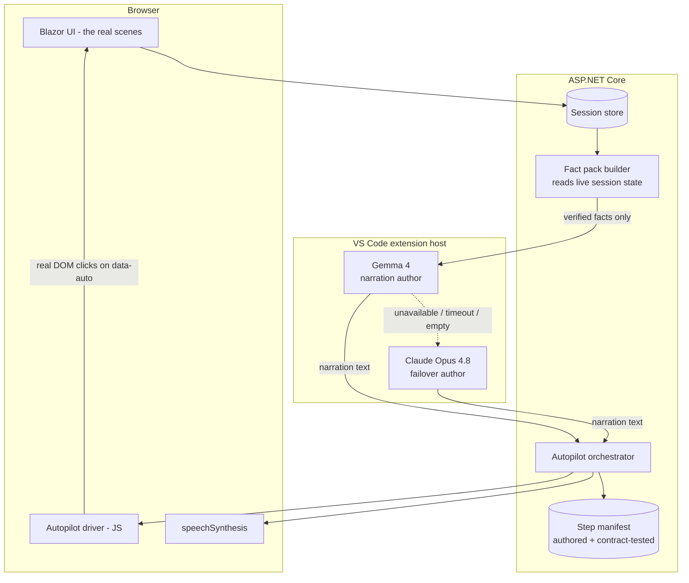
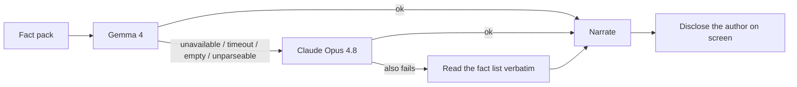

# Gemma 4 Auto-Narrates All Tabs — Design

*An unattended demonstration mode in which Gemma 4 walks all 34 scenes, operates every control, and explains what is happening — with Claude Opus 4.8 as the narration failover.*

**Owner:** Director of AI (AI Enablement)
**Status:** Design draft v0.1 — not built
**Target:** `poc-interactive-training` Blazor server + VSIX bridge
**Related:** [pocInteractiveTraainingProgram](pocInteractiveTraainingProgram.md) · [07 Enablement & Training](ai-across-ces/07-enablement-and-interactive-training.md) · [01 Context & Transparency](ai-across-ces/01-context-engineering-and-transparency.md) · [interactiveAITrainingDesign](ai-across-ces/interactiveAITrainingDesign.md)

---

## 1. Executive summary

**What is being proposed.** A single button — *Auto-run the whole programme* — that drives the existing training application end to end without a human touching it. It changes scene, clicks the real buttons, fills the real inputs, waits for the real results, and narrates each step aloud in plain language. It runs all **34 scenes** and operates all **41 interactive controls** across them.

**Why it is worth building.** The programme currently requires a knowledgeable presenter who knows which button to press, how long each stage takes, and what the numbers mean. That is a key-person dependency and it makes the work impossible to circulate. An auto-run turns a 90-minute guided walkthrough into something a stakeholder can start and watch, and it forces us to state — in writing, per step — what every control actually does and what result would count as correct.

**How the models are used.** Deliberately narrowly.

| Component | Role | May it decide anything? |
| --- | --- | --- |
| **Step manifest** (authored, versioned, contract-tested) | Says which control to click, in what order, and what to wait for | Yes — it is the only authority on sequence |
| **Gemma 4** | Turns a supplied, verified fact pack into spoken narration | **No.** It phrases; it does not choose actions or invent facts |
| **Claude Opus 4.8** | Narration failover when Gemma is unavailable, denied, times out, or returns nothing | **No.** Same constraint |
| **Deterministic services** | Produce every number the narration quotes | Yes — they are the source of truth |

**The central design rule:** *the models never infer what the application does.* Asking a model to look at a screen and explain it is exactly how a demo starts confidently describing a button that does something else. Every fact Gemma is permitted to say is written down in the manifest first, by a human, and verified against the code by an automated contract test.

**Assumptions register.** You asked for a design with no assumptions left to the model or the user. Rather than claim there are none, every assumption I found is listed in **§14**, and each is either resolved in this document or flagged as **requiring a human decision before build**. Seven remain open. None of them can be safely resolved by a model, and none should be discovered mid-demo.

**What this design refuses to promise.** It cannot make the run a fixed length — most scenes wait on live model latency we do not control. It cannot guarantee every scene succeeds; several depend on a 31B model returning parseable output, which it sometimes does not. Both facts are surfaced on screen rather than hidden, and §9 defines exactly what the run does when a step fails.

---

## 2. What this is, and what it is not

| It is | It is not |
| --- | --- |
| A scripted walkthrough that operates the real UI | An agent that "understands" the screen |
| Narration generated from verified facts | Narration generated from a screenshot or the DOM |
| A demonstration and a rehearsal harness | A test suite (it asserts almost nothing) |
| Honest about failures — it shows them | A polished recording that hides the slow parts |
| Reproducible in *sequence* | Reproducible in *output* — models are non-deterministic |

> **The most important non-goal:** this is not a way to make the programme look better than it is. If the mutation score is 23% and Gemma's consolidation build fails, the auto-run says so. A demo that only works when everything succeeds is a demo nobody should trust.

---

## 3. Resolving the ambiguity in the requirement

The brief said the design should have "no assumptions by the LLM or user in an executive summary." That sentence has two readings. I am building to both, and saying so rather than picking one silently.

| Reading | How this design satisfies it |
| --- | --- |
| **"The design must not leave assumptions for the LLM or the user to fill in"** | Every step declares its selector, precondition, action, wait condition, timeout, failure behaviour, and the exact facts narration may use (§11). Nothing is left to inference. |
| **"The executive summary must state the assumptions"** | §1 points at §14, which registers every assumption and marks the seven that need a human decision. |

If the intended meaning was narrower, this over-delivers rather than under-delivers, which is the safer error.

---

## 4. Architecture



**Four separations that make this safe:**

1. **Sequence is data, not inference.** The manifest is a versioned artifact a human wrote and a test verifies.
2. **Clicking is real.** The driver dispatches genuine DOM click events on the actual controls. Nothing is simulated at the server, so the demo cannot show a path the user could not take themselves.
3. **Facts come from state, not from the model.** The fact pack is built by reading the session store *after* a step completes. Gemma receives numbers; it does not produce them.
4. **Speech is the browser's.** Gemma authors text. It is not a text-to-speech engine, and pretending otherwise was corrected once already in this programme.

### 4.1 Why real DOM clicks rather than server-side invocation

Invoking the handlers directly on the server would be simpler and far more reliable. It would also be dishonest: it would prove the *server* works, not that a person can drive the UI. Since the entire point is to demonstrate the learner's path, the driver clicks what a learner would click, and a broken button breaks the demo — which is the correct outcome.

### 4.2 The selector contract

Controls are addressed by an explicit `data-auto` attribute, never by CSS class or position.

```razor
<button class="primary-command compact" data-auto="s09.submit-review" ...>
```

CSS classes change for visual reasons and would silently repoint the autopilot at the wrong control. A `data-auto` attribute exists only for this purpose, so changing it is a deliberate act. **§12 defines the startup contract test that fails the build if any manifest selector is missing from the markup.**

---

## 5. The step manifest schema

One record per step. Every field is mandatory; there are no defaults, because a default is an assumption.

```yaml
step_id: s09.02                     # scene.step, stable across edits
scene_id: prompt-challenge
scene_number: 9
kind: click | select | fill | wait | observe | scroll
selector: "[data-auto='s09.submit-review']"
precondition:                       # checked before acting; abort step if false
  bridge_required: true
  expression: "session.ReviewStatus not in ['queued','running']"
wait_for:                           # how we know the step finished
  type: state | element | settle
  expression: "session.ReviewStatus == 'completed'"
  timeout_seconds: 240
on_timeout: narrate-and-continue    # see §9
on_failure: narrate-and-continue
narration:
  class: static | result            # static = pre-generated; result = live
  facts:                            # the ONLY things Gemma may assert
    - "This button sends the learner's prompt to Claude Opus 4.8 for review."
    - "The rubric has six areas and is visible on screen before the review runs."
    - "The review is coaching commentary, not a validated grade."
  must_not_claim:                   # explicit negative constraints
    - "that the score is validated"
    - "that Claude is correct"
  max_words: 70
```

**`must_not_claim` is not decoration.** Every scene in this programme has a specific over-claim it is designed to avoid. Left unconstrained, a narration model will reach for exactly those phrases because they are the fluent ones.

---

## 6. Role split — who is allowed to say what

### 6.1 Gemma 4 (primary narrator)

**Input:** the step's `facts` list, `must_not_claim` list, word cap, and — for result narration — the deterministic values read from session state.

**System prompt constraints (verbatim intent):**
- Use only the supplied facts. If a fact is not supplied, do not state it.
- Never describe a number that is not in the supplied values.
- Never assert that a result is correct, validated, or proves anything.
- If the supplied values indicate a failure, say so plainly. Do not soften it.
- Plain language, no marketing register, under the word cap.

**Output contract:** a single JSON object `{"narration": "..."}`. Anything else is a failure and triggers failover.

### 6.2 Claude Opus 4.8 (failover only)

Invoked **only** on a mechanical failure of Gemma: unavailable, consent denied, timeout, empty response, or unparseable output. **Never** because someone judged Gemma's prose to be worse — that would be an unqualified quality guess, and the existing programme already corrected that mistake once.

Every failover is disclosed on screen and in the run log: *"Narration for this step was authored by Claude Opus 4.8 because Gemma 4 timed out."* Silent substitution would invalidate any comparison a viewer draws about Gemma's capability.

### 6.3 Deterministic fallback (failover of the failover)

If both models fail, the step narrates the manifest `facts` list joined into sentences, verbatim, with no model involved. It reads flatly — and it is always true. The run never stops for want of narration.



---

## 7. Narration timing — the problem that decides the design

Narration divides into two classes with opposite constraints.

| Class | Depends on | When generated | Why |
| --- | --- | --- | --- |
| **Static** | The manifest only | **Before the run starts**, in a pre-flight pass | A demo that pauses for a model before every sentence is unwatchable |
| **Result** | Live session state after a step | **During the run**, with a hard cap | Cannot be pre-generated; the numbers do not exist yet |

**Pre-flight pass.** On pressing *Auto-run*, the orchestrator generates all static narration first, shows a progress indicator, and caches it against the manifest version hash. Roughly 60 of the ~95 narration units are static. The cache survives restarts, so a rehearsed demo starts immediately.

**Result narration cap.** 20 seconds. On expiry, the deterministic fallback speaks and the run continues. A demo must never hang on a narrator.

> **Consequence worth stating plainly:** because static narration is pre-generated, Gemma is describing what the step *is designed to do*, not what it just observed. The narration for a result is live and does reflect the actual outcome. The on-screen label distinguishes the two, because conflating them would misrepresent what the model actually knows.

---

## 8. Run profiles and the honest time problem

A full run's duration is dominated by model latency, which we do not control and must not fabricate.

| Profile | Scope | Model calls | Suitable for |
| --- | --- | --- | --- |
| **Deterministic** | Only scenes needing no bridge model | 0 (narration cached) | Air-gapped rooms, quick smoke test, CI |
| **Rehearsed** | All 34 scenes, narration pre-cached, results from the current session | Result narration only | A leadership demo that has been rehearsed |
| **Full** | All 34 scenes, every model stage executed live | **~55 bridge round-trips** (§11) | Proving the whole pipeline actually works |
| **Single scene** | One scene, all its steps | Scene-dependent | Development and debugging |

### 8.1 Why there is no duration figure in this document

I can count model round-trips exactly, because they are in the code. I cannot state wall-clock duration without measuring it, and inventing a number here is precisely the behaviour this programme exists to discourage.

**Measurement protocol before the first leadership demo:**

1. Run the **Full** profile three times, recording per-step elapsed time.
2. Publish median and worst case **per scene**, not just the total.
3. Report the failure rate per scene across the three runs.
4. Only then quote a duration, with the sample size attached.

Three runs expose gross instability. It is not a sufficiency claim.

---

## 9. Failure policy — explicit, per step

Every step declares `on_timeout` and `on_failure` from this closed set. There is no default.

| Policy | Behaviour | Used for |
| --- | --- | --- |
| `narrate-and-continue` | State what failed, in plain terms, then move on | Model stages that legitimately fail sometimes |
| `retry-once-then-continue` | One retry, disclosed, then continue | Transient bridge/network conditions |
| `skip-scene` | Abandon remaining steps in this scene, move to the next | A precondition step failed, making the rest meaningless |
| `abort-run` | Stop everything and report | Bridge lost entirely; safety precondition violated |

**Failures are narrated, never hidden.** Example generated line: *"Gemma did not return usable output for this module within 240 seconds. That is a real failure mode for a 31-billion-parameter model asked for structured output, and it is the reason this scene splits the work into one task per module."*

**Escape aborts the run at any time.** A demo you cannot stop is a demo you cannot show.

---

## 10. Safety and guardrails

These are non-negotiable and precede any narration.

| Risk | Control |
| --- | --- |
| **Mutation testing executes code in-process** (scene 26) | Auto-run refuses to execute this step unless the host is marked `AllowInProcessExecution`. On a shared host it narrates the explanation and skips. **This is a hard block, not a warning.** |
| **Ephemeral ticket contains realistic secrets** (scene 27) | The deterministic data-tier gate runs first, exactly as in manual use. The autopilot has no path that bypasses it. |
| **Narration could leak fixture content** | Fact packs are authored from scene metadata and deterministic results only. Raw ticket payloads and source files are never placed in a narration prompt. |
| **Unattended run left on a screen** | Idle timeout ends the run and returns to scene 1. |
| **Model consent** | The VSIX consent model is unchanged. Auto-run cannot invoke a model the user has not authorised. |
| **Narration asserting something false** | `must_not_claim` per step, plus the rehearsal gate in §13. |

---

## 11. Scene-by-scene step design

The complete walkthrough. **34 scenes, 41 interactive controls, ~55 bridge round-trips.** Every control listed below was extracted from the current markup, not assumed.

Legend — **D** = deterministic, no model · **B** = bridge model call · *n×* = number of model round-trips.

---

### Scene 1 — Programme overview `introduction`
**Controls:** none (33 cross-reference links, not operated).
**Type:** D

| # | Action | Wait for | Narration facts |
| --- | --- | --- | --- |
| 1 | Observe | settle 2s | Six role priorities mapped onto the demonstrations; every scene ends in a number |
| 2 | Scroll to the gaps table | settle | Eight capabilities the role calls for that the lab does **not** yet cover; two have no scene at all |
| 3 | Scroll to caveats | settle | Model-scored numbers are judgement; most results are single runs |

> Deliberately opens on the gaps. Starting a demo by naming what is missing sets the register for everything after it.

---

### Scene 2 — The investigation `welcome`
**Controls:** `StartLesson`, `Next`.
**Type:** B — *1×* (`coach-narration`)

| # | Action | Wait for | Narration facts |
| --- | --- | --- | --- |
| 1 | Click **Start the investigation** | `CoachStatus == completed`, 120s | Queues grounded narration authored by Gemma from the OKF fixture |
| 2 | Observe model banner | element | Banner names the model actually used; fallback is disclosed, never silent |

`on_timeout: narrate-and-continue` — the rest of the programme does not depend on the coach.

---

### Scene 3 — Why OKF `why-okf`
**Controls:** none. **Type:** D

| # | Action | Narration facts |
| --- | --- | --- |
| 1 | Observe both paths | Ungrounded: keywords → broad search → first plausible match. Grounded: index → concept → decision → code map |
| 2 | Observe | The token claim is the tool authors' measurement, not ours. **`must_not_claim`: that we have measured a saving** |

---

### Scene 4 — Artifact structure `artifact-tree`
**Controls:** none. **Type:** D

| # | Action | Narration facts |
| --- | --- | --- |
| 1 | Observe tree | One file per concept; links are the graph; agent reads ~3 small files |
| 2 | Observe | Structure does not guarantee truth and does not change model weights |

---

### Scene 5 — JIRA to code `jira-trace`
**Controls:** 6 trace-step cards (`_traceStep`), 1 expander, 1 textarea, `RunGroundedChange`.
**Type:** B — *2×* (`grounded-change` implement, then audit)

**This is the scene in the brief's first three images, specified step by step.**

| # | Action | Wait for | Narration facts |
| --- | --- | --- | --- |
| 1 | Click step card **1 Open the index** | settle 1.5s | `okf/index.md` is the governed entry point; do not search the repository yet |
| 2 | Click **2 Resolve the concept** | settle | Delivery estimate is distinct from order-status formatting; excludes superficial UI matches |
| 3 | Click **3 Check the boundary** | settle | Fulfillment owns customer-facing estimates; Shipping supplies events |
| 4 | Click **4 Read the decision** | settle | ADR-024: only a **confirmed** carrier-delay event may revise an estimate |
| 5 | Click **5 Follow the code map** | settle | `DeliveryEstimateService.cs` is primary; the handler is a caller |
| 6 | Click **6 Inspect verification** | settle | Tests expose the delayed and unchanged paths; plan proof before proposing a change |
| 7 | Expand **The context the agent is given** | element | Exactly 8 artifacts: 5 OKF documents and 3 source files — nothing else is available to it |
| 8 | Observe the ticket | settle | FUL-1842 never names the API field for estimate source; **that omission is deliberate** |
| 9 | Click **Resolve the ticket from context** | `GroundedChange.Status == completed`, 300s | Gemma 4 implements from the artifacts above and nothing else |
| 10 | Observe implementation | element | *(result narration)* Which files changed, and that each carries an OKF citation comment |
| 11 | Observe Claude's audit | element | *(result narration)* Per-change provenance and whether the missing fact was flagged or invented |

> **Step 11 is the payoff of the whole programme.** The audit's finding — that the model named the gap in prose and then hard-coded invented literals anyway — is the most instructive result in the application. The fact pack states it directly: *naming a gap in prose is not the same as leaving it open in the code.*

---

### Scene 6 — Animation demo `animation-demo`
**Controls:** `ReplayAnimation`. **Type:** D

| # | Action | Wait for | Narration facts |
| --- | --- | --- | --- |
| 1 | Click **Replay animation** | settle 6s | Motion shows the investigation narrowing from a broad story to one code path |
| 2 | Observe | — | Labelled **illustration**, not live reasoning. **`must_not_claim`: that this shows the model thinking** |

---

### Scene 7 — Image demo `image-demo`
**Controls:** none. **Type:** D

| # | Narration facts |
| --- | --- |
| 1 | Reviewed bitmap with an asset record: source, format, data classification, readability review |
| 2 | Structured HTML remains the source of truth; images are not searchable, localisable, or accessible alone |

---

### Scene 8 — Knowledge check `knowledge-check`
**Controls:** 3 questions × 4 options. **Type:** D

| # | Action | Wait for | Narration facts |
| --- | --- | --- | --- |
| 1–3 | Select the **correct** option for each question | settle 2s each | Why that evidence controls the investigation |
| 4 | Observe | — | Capability practice, not a workplace competency grade |

**Open decision (§14-3):** whether the autopilot should deliberately answer one question *wrongly* first to demonstrate the feedback path. More honest, slightly confusing. Human call.

---

### Scene 9 — Prompt challenge `prompt-challenge`
**Controls:** textarea (pre-filled), `SubmitReview`. **Type:** B — *1×* (`claude-review`, streaming)

| # | Action | Wait for | Narration facts |
| --- | --- | --- | --- |
| 1 | Observe rubric | settle | Six rubric areas Claude will score against |
| 2 | Observe pre-filled prompt | settle | Pre-filled worked example; it was **not** typed live |
| 3 | Click **Request Claude feedback** | `ReviewStatus == completed`, 240s | Sends only the synthetic story, fixture, rubric and prompt |
| 4 | Observe live trace | streaming | *(result)* Each rubric check as it is decided. **`must_not_claim`: that this is private chain-of-thought** |
| 5 | Observe review | element | *(result)* Coaching commentary — not a validated grade |

---

### Scene 10 — Model comparison `model-comparison`
**Controls:** topic `<select>`, `RunComparison`. **Type:** B — *4×* (3 answers + 1 judge)

| # | Action | Wait for | Narration facts |
| --- | --- | --- | --- |
| 1 | Select topic | settle | The same question goes to three models |
| 2 | Click **Run comparison** | `Comparison.Status == completed`, 420s | Answers first, then live vendor documentation is fetched, then a judge scores blind |
| 3 | Observe grounding stage | state `grounding` | Judge is grounded on real documentation retrieved at run time |
| 4 | Observe verdict | element | *(result)* Scores, evidence quotes, and any slot that failed |
| 5 | Observe coverage note | element | Illustrative harness, **not** a validated benchmark |

`on_failure: narrate-and-continue` — a per-slot model failure is displayed, and the incomplete banner is itself worth narrating.

---

### Scene 11 — Model Uses LLM Support `llm-support`
**Controls:** requirement textarea, `RunLlmSupport`. **Type:** B — *2×*

| # | Action | Wait for | Narration facts |
| --- | --- | --- | --- |
| 1 | Observe requirement | settle | A GCP migration requirement |
| 2 | Click **Run** | `LlmSupport.Status == completed`, 360s | Gemini acts as a retrieval instrument, not the designer |
| 3 | Observe synthesis | element | *(result)* What was already known, what was learned, what still needs primary documentation |

---

### Scene 12 — Round-trip grounding `round-trip`
**Controls:** class textarea, `RunRoundTrip`. **Type:** B — *3×* (story → recreate → QA)

| # | Action | Wait for | Narration facts |
| --- | --- | --- | --- |
| 1 | Observe original class | settle | Input to Gemma 4 |
| 2 | Click **Run** | `RoundTrip.Status == completed`, 420s | Class → JIRA story → class, rebuilt from the story only |
| 3 | Observe each stage | state | Stages are `story`, `recreating`, `qa` — narrated as they change |
| 4 | Observe Claude's QA | element | *(result)* How much behaviour survived the round trip |

---

### Scene 13 — Modernize legacy `modernize`
**Controls:** legacy code textarea, `RunModernize`. **Type:** B — *1×*

| # | Action | Wait for | Narration facts |
| --- | --- | --- | --- |
| 1 | Click **Run** | `Modernize.Status == completed`, 300s | Legacy comprehension is a recurring token tax; spend it once |
| 2 | Observe | element | *(result)* Behaviour-preserving rewrite, exposed business rules, visible service seams |

---

### Scene 14 — Audit Repo (code) `audit-code`
**Controls:** project textarea, `RunAudit`. **Type:** D→B — *1×*

| # | Action | Wait for | Narration facts |
| --- | --- | --- | --- |
| 1 | Click **Run** | state `analyzed` | **Roslyn runs first** — deterministic, reproducible, code never executed |
| 2 | Observe Roslyn rating | element | *(result)* The numbers come from static analysis |
| 3 | Observe Gemma feedback | `Audit.Status == completed`, 300s | *(result)* The model supplies judgement grounded on that rating |

> The two-stage status (`analyzed` → `completed`) is narrated explicitly. Which half produced which number is the entire lesson.

---

### Scene 15 — Audit Repo (context) `audit-context`
**Controls:** context textarea, expander, `RunContextAudit`. **Type:** D→B — *2×*

| # | Action | Wait for | Narration facts |
| --- | --- | --- | --- |
| 1 | Click **Run** | state `analyzed` | Deterministic scan + ML.NET classifier decide cheaply whether context is usable |
| 2 | Observe gate result | element | *(result)* Classification and confidence |
| 3 | Observe Gemma trap hunt | state `gemma` | Gemma uses the context to find planted inconsistencies |
| 4 | Observe Claude grading | `== completed`, 360s | *(result)* How many planted traps were caught |

---

### Scene 16 — LLM Language POC `llm-language`
**Controls:** JIRA textarea, `RunClaraPoc` (B — *2×*), `RunBenchmark` (D).

| # | Action | Wait for | Narration facts |
| --- | --- | --- | --- |
| 1 | Observe pipeline table | settle | The seven-stage chain: source → AST → intermediate form → codegen → execution |
| 2 | Click **Run CLARA POC** | `Clara.Status == completed`, 300s | Model writes the policy; it compiles and runs; a second model reviews |
| 3 | Observe compiled output | element | *(result)* Deterministic execution result |
| 4 | Click **Run benchmark** | `_benchmarkRunning == false`, 60s | Compiler conformance and measured cost against hand-written C# — **no model involved** |

---

### Scene 17 — POC Language test `language-test`
**Controls:** JIRA textarea, `RunLanguageTest`. **Type:** B — *3×* (2 arms + judge)

| # | Action | Wait for | Narration facts |
| --- | --- | --- | --- |
| 1 | Observe both arms | settle | Same ticket, same model, no context either way; one arm's knowledge lives only in people's heads |
| 2 | Click **Run** | `LanguageTest.Status == completed`, 420s | Both arms run, then Claude grades against sealed criteria neither arm saw |
| 3 | Observe verdict | element | *(result)* Per-arm scores and the prompt-token difference |

---

### Scene 18 — COBOL migration `cobol-migration`
**Controls:** `RunMigration`. **Type:** B — *3×* (three grounding arms)

| # | Action | Wait for | Narration facts |
| --- | --- | --- | --- |
| 1 | Observe the oracle | settle | The compiled COBOL, executed — this is the ground truth |
| 2 | Click **Run** | `Migration.Status == completed`, 600s | Three arms: no grounding, static analysis, compiler-resolved facts |
| 3 | Observe verdict | element | *(result)* **Nothing here is graded by a model** — every answer is compiled and executed against captured legacy output |

> Longest single-scene budget. Three model calls plus three compile-and-execute cycles.

---

### Scene 19 — Ticket quality gate `ticket-gate`
**Controls:** ticket textarea, `RunTicketGate`. **Type:** D→B — *1×*

| # | Action | Wait for | Narration facts |
| --- | --- | --- | --- |
| 1 | Observe deterministic pre-check | settle | Recomputed as you type; **no model, no bridge** |
| 2 | Click **Run** | `TicketGate.Status == completed`, 240s | Claude grades against the rubric and rewrites the ticket so it would pass |
| 3 | Observe rewrite | element | *(result)* Most agent failures are underspecified tickets, not weak models |

---

### Scene 20 — Cloud trap hunt `trap-hunt`
**Controls:** `RunTrapHunt`. **Type:** B — *2×*

| # | Action | Wait for | Narration facts |
| --- | --- | --- | --- |
| 1 | Click **Run** | `TrapHunt.Status == completed`, 360s | Gemma audits the design against the five-pillar checklist |
| 2 | Observe grading | element | *(result)* Graded against the **sealed** list of what was actually planted |

---

### Scene 21 — Drift scorecard `drift-scorecard`
**Controls:** `RunDrift(false)`, `RunDrift(true)`. **Type:** B — *1× each*

| # | Action | Wait for | Narration facts |
| --- | --- | --- | --- |
| 1 | Observe golden case | settle | A frozen commit, its ticket, and the patch a human actually wrote |
| 2 | Click the **agent candidate** | `Drift.Status == completed`, 300s | Three layers: functional, structural, semantic — first two deterministic |
| 3 | Observe scorecard | element | *(result)* Only the semantic layer asks a model |
| 4 | Click the **human candidate** | `== completed`, 300s | The control arm |
| 5 | Compare | element | *(result)* What the difference does and does not establish |

**Open decision (§14-4):** whether to run both candidates (more honest, doubles the time) or one.

---

### Scene 22 — Phase 0 prerequisites `phase-zero`
**Controls:** 4 `<select>`, payload textarea, `RunTiering`, `RunDataTier`. **Type:** D — *0×*

| # | Action | Wait for | Narration facts |
| --- | --- | --- | --- |
| 1 | Set the four registration selects | settle | Risk tier derives from blast radius × autonomy × data tier |
| 2 | Click **Evaluate tier** | element | *(result)* Derived tier and any missing mandatory fields |
| 3 | Observe payload | settle | Contains material that must not leave the boundary |
| 4 | Click **Assess data tier** | element | *(result)* Decision, finding types, incident severity |
| 5 | Observe | — | **Both controls run with no model at all. A prerequisite that can hallucinate is not a prerequisite** |

---

### Scene 23 — Context sufficiency curve `context-curve`
**Controls:** `RunCurve`. **Type:** B — *(3 tiers × N runs) + 1 judge*

| # | Action | Wait for | Narration facts |
| --- | --- | --- | --- |
| 1 | Observe three variants | settle | Identical source, different knowledge — documented, partial, undocumented |
| 2 | Click **Run** | `ContextCurve.Status == completed`, 900s | Median of repeated runs, scored against sealed criteria the model never sees |
| 3 | Observe degradation | element | *(result)* **Deterministic — no model produced these numbers** |
| 4 | Observe Claude review | element | *(result)* Engineering substance, not keywords |

> **Highest round-trip count in the application.** Excluded from the Rehearsed profile unless already complete.

---

### Scene 24 — Action authority `action-authority`
**Controls:** action `<select>`, `RunAuthority`. **Type:** D — *0×*

| # | Action | Wait for | Narration facts |
| --- | --- | --- | --- |
| 1 | Select a **reversible in-envelope** action | settle | Decided per exact action against the registered envelope |
| 2 | Click **Decide** | element | *(result)* Allowed to proceed |
| 3 | Select a **production write** | settle | — |
| 4 | Click **Decide** | element | *(result)* Stops for a verified human decision. Approving "deploy" is not approval |

Two contrasting actions, because one decision demonstrates nothing.

---

### Scene 25 — Neutral framing lab `framing-lab`
**Controls:** question textarea, `RunFraming`. **Type:** B — *4×* (3 framings + judge)

| # | Action | Wait for | Narration facts |
| --- | --- | --- | --- |
| 1 | Observe question | settle | One question, three framings, one model |
| 2 | Click **Run** | `Framing.Status == completed`, 420s | Divergence from the neutral answer is measured before anyone opines |
| 3 | Observe verdict | element | *(result)* The most expensive bias is the one the asker introduced |

---

### Scene 26 — Regression adequacy `regression-adequacy`
**Controls:** source textarea, tests textarea, `RunMutation` (D), `RunRegressionGuidance` (B — *2×*).

| # | Action | Wait for | Narration facts |
| --- | --- | --- | --- |
| 1 | Observe explainer | settle | A mutant is one deliberately injected defect; killed = a test failed as it should |
| 2 | **Safety check** | — | **Hard block** unless `AllowInProcessExecution`; otherwise narrate and skip to scene 27 |
| 3 | Click **Run mutation testing** | `_mutationRunning == false`, 180s | Suite compiled and executed, then one defect injected at a time |
| 4 | Observe score | element | *(result)* Survivors are defects the suite would have shipped |
| 5 | Click **Gemma proposes tests** | `RegressionGuidance.Status == completed`, 300s | Closing **named** survivors, not "more coverage" |
| 6 | Observe Claude's check | element | *(result)* Would each proposed test actually kill what it claims? |

---

### Scene 27 — Ephemeral test ticket `ephemeral-test`
**Controls:** ticket textarea, `RunEphemeral`. **Type:** D→B — *1×*

| # | Action | Wait for | Narration facts |
| --- | --- | --- | --- |
| 1 | Observe ticket | settle | Contains contact details, an account reference, a taxpayer id, a connection string and a token |
| 2 | Click **Run** | `Ephemeral.Status == completed`, 240s | The gate runs **before** anything leaves the boundary |
| 3 | Observe gate findings | element | *(result)* What was detected and redacted |
| 4 | Observe | — | **Not checked in is not the same as not sent.** The audit record keeps references, never payloads |

---

### Scene 28 — Portfolio context tiers `portfolio-tiers`
**Controls:** `RunPortfolio` (D), 6 × `ToggleAmp` (D), `RunPortfolioTiers` (B — *3×*).

| # | Action | Wait for | Narration facts |
| --- | --- | --- | --- |
| 1 | Click **Build the estate view** | element | Tier 1 Cortex: 8 services and their purpose |
| 2 | Expand **APM-1042** (Listed & OTC Trading) | settle | Tier 2 bounds what a team actually owns |
| 3 | Expand **APM-1187** (Digital Assets) | settle | The MSB perimeter — the reason crypto is out of scope |
| 4 | Click **Run the three-tier funnel** | `PortfolioTiers.Status == completed`, 540s | Tier 1 finds candidates, Tier 2 settles scope, Tier 3 names files |
| 5 | Observe each tier | state `tier1`→`tier2`→`tier3` | *(result)* Narrated as the stage changes |
| 6 | Observe the trap | element | *(result)* All three order-handling services share `platform-order-pipeline` |
| 7 | Observe token funnel | element | *(result)* Load them in the wrong order and you miss a service or bury the model |

---

### Scene 29 — Common code audit `common-code`
**Controls:** `RunCommonCode` (D, embeddings), `RunConsolidation` (B — *1 design + N module builds*).

| # | Action | Wait for | Narration facts |
| --- | --- | --- | --- |
| 1 | Click **Analyse the three repos** | `_commonCodeRunning == false`, 240s | Embedding similarity over **three real repositories** — duplication by meaning, not by name |
| 2 | Observe clusters | element | *(result)* Clusters found, and the functional/non-functional split |
| 3 | Observe threshold | element | Threshold was **measured by calibration**, not guessed; the margin is narrow and corpus-specific |
| 4 | Click **Design, then implement** | `Consolidation.Status == completed`, 900s | Claude designs; Gemma builds **one module per task** |
| 5 | Observe per-module results | element | *(result)* Including any module that failed — earlier, asking for a whole library in one JSON string exceeded the output cap |

---

### Scene 30 — Token economics `token-economics`
**Controls:** `RunEconomics`. **Type:** D — *0×*

| # | Action | Wait for | Narration facts |
| --- | --- | --- | --- |
| 1 | Click **Build the model** | element | *(result)* Cost per attempt vs cost per **successful outcome** |
| 2 | Observe | — | Rates are **illustrative**. A model failing a third of the time is billed for every failure |

---

### Scene 31 — Pattern library `pattern-library`
**Controls:** approach textarea, `SubmitPattern`. **Type:** D→B — *2×*

| # | Action | Wait for | Narration facts |
| --- | --- | --- | --- |
| 1 | Observe submission | settle | Pre-filled worked submission |
| 2 | Click **Submit to the library** | element | Deterministic admission check runs first — evidence, preconditions, failure modes |
| 3 | Observe gate result | element | *(result)* Admitted or rejected, and which checks failed |
| 4 | Observe Gemma's change | `PatternRun.Status == completed`, 300s | *(result)* Executes only if admitted |
| 5 | Observe Claude's review | element | *(result)* A bad shared prompt scales harm as efficiently as a good one scales value |

---

### Scene 32 — Plan first `plan-first`
**Controls:** plan textarea, `ReviewPlan`. **Type:** D — *0×*

| # | Action | Wait for | Narration facts |
| --- | --- | --- | --- |
| 1 | Click **Review the plan** | element | *(result)* Executive summary, diagram, risks, verification path |
| 2 | Observe | — | Deterministic scoring; jumping straight to code is the habit this gate exists to break |

---

### Scene 33 — Leadership walkthrough `leadership-map`
**Controls:** act links (`GoTo`). **Type:** D

| # | Action | Wait for | Narration facts |
| --- | --- | --- | --- |
| 1 | Observe the six acts | settle | Each answers a question leadership actually asks and ends in a number |
| 2 | Observe | — | This is the order to walk the programme in, not the order it was built in |

**The autopilot does not follow these links** — doing so would restart scenes already run. It narrates the map only. *(Resolves an obvious trap: a naive implementation would loop here indefinitely.)*

---

### Scene 34 — Making Gemma 4 an SME `crypto-sme`
**Controls:** `RunCryptoSme`. **Type:** B — *3×* (unaided → consult → design)

| # | Action | Wait for | Narration facts |
| --- | --- | --- | --- |
| 1 | Observe the ticket | settle | CRY-4417, a spot crypto execution adapter |
| 2 | Click **Run** | `CryptoSme.Status == completed`, 600s | Claude answers unaided, consults a grounded Gemma, then designs |
| 3 | Observe unaided score | state `unaided` | *(result)* Scores the **attempt only** — crediting the uncertainty list would reward naming what you cannot recall |
| 4 | Observe consultation | state `consulting` | *(result)* Answers, corrections, and facts the SME volunteered that nobody asked for |
| 5 | Observe design + trace | element | *(result)* The per-fact trace shows where each fact was lost |
| 6 | Observe | — | **Delegation only retrieves what the delegator thought to ask.** Keyword recall measures vocabulary, not correctness |

> Closing scene deliberately. It ends on the programme's most useful finding rather than on a success.

---

### 11.1 Totals

| Measure | Count |
| --- | --- |
| Scenes | 34 |
| Interactive controls operated | 41 |
| Steps in the manifest | ~95 |
| Deterministic scenes (no bridge) | 13 |
| Bridge scenes | 21 |
| Bridge round-trips, Full profile | **~55** |
| Static narration units (pre-generated) | ~60 |
| Result narration units (live) | ~35 |

---

## 12. The selector contract test

The manifest rots the moment someone renames a control. This is caught at startup, matching the convention every deterministic service in this codebase already follows.

```
Autopilot manifest self-check: 95 steps, 41 selectors, 41 resolved, 0 missing, manifest v1.
```

**On any missing selector the check fails loudly and the auto-run button is disabled** — a demo must never start against a stale script. The test parses the rendered markup for `data-auto` attributes and diffs them against the manifest. It runs in CI as well as at startup.

Additional invariants asserted:
- Every step has a non-empty `facts` list. *(No fact pack means an unconstrained model.)*
- Every step declares `on_timeout` and `on_failure`.
- Every scene id in the manifest exists in `Scenes`, and every scene in `Scenes` appears in the manifest. **Coverage is proven, not asserted.**

---

## 13. Rehearsal gate — before any leadership demo

The generated narration is model-authored prose. It is constrained, but constrained prose can still be misleading.

**Mandatory before an external showing:**

1. Generate the full static narration pack.
2. **A human reads all ~60 units.** Not skims.
3. Any unit that over-claims is fixed by editing the **fact pack**, not by hand-editing the output — otherwise the next regeneration reintroduces it.
4. Run the Full profile end to end once, in the room and on the network being used.
5. Record which scenes failed. Decide in advance how to narrate those failures — do not improvise it live.

> Step 5 matters most. A failure you have already decided how to describe is evidence of rigour. The same failure unprepared looks like the demo broke.

---

## 14. Assumptions register

Everything I had to assume, stated. **Seven require a human decision before build.**

| # | Assumption | Status |
| --- | --- | --- |
| 1 | Narration should be pre-generated for static steps | **Resolved** — §7; a demo cannot pause per sentence |
| 2 | Real DOM clicks, not server-side invocation | **Resolved** — §4.1 |
| 3 | Should the knowledge check answer wrongly first? | **OPEN — human decision** |
| 4 | Run one drift candidate or both? | **OPEN — human decision** |
| 5 | Full-run wall-clock duration | **OPEN — must be measured (§8.1), never asserted** |
| 6 | Is the demo host allowed to execute mutated code? | **OPEN — environment owner must confirm** |
| 7 | Should the run pause between scenes for questions? | **OPEN — presenter preference** |
| 8 | Voice, rate, and language for speech synthesis | **OPEN — accessibility review** |
| 9 | Does auto-run need its own agent registry entry? | **OPEN — it invokes models on a schedule, so probably yes (R1)** |
| 10 | Claude is used only on mechanical Gemma failure | **Resolved** — §6.2 |
| 11 | Failures are shown, not hidden | **Resolved** — §9 |
| 12 | Manifest coverage is contract-tested | **Resolved** — §12 |

**Item 9 deserves attention.** An auto-run that invokes ~55 model calls unattended is itself an agent by the programme's own definition. If we exempt it because we built it, we have failed our own registry rule in the first week.

---

## 15. Build phases and their gates

Each phase must earn the next. This is the same discipline applied to the training platform itself.

| Phase | Deliverable | Gate to proceed |
| --- | --- | --- |
| **P0** | `data-auto` attributes on all 41 controls + selector contract test | Self-check reports 41/41 resolved |
| **P1** | Manifest + driver, **Deterministic profile only** (13 scenes), fact-list narration, no models | A full deterministic run completes unattended twice |
| **P2** | Gemma narration + Claude failover + disclosure banner | Failover verified by forcing a Gemma timeout |
| **P3** | Bridge scenes, per-step timeouts, failure policies | Full profile completes three times; failure rate published |
| **P4** | Rehearsed profile, narration cache, presenter controls (pause, skip, abort) | Rehearsal gate (§13) passed once |

> **Do not build P3 before P1 works twice unattended.** The failure mode this sequencing prevents is the expensive one: a beautiful narration layer over a driver that cannot reliably click a button.

---

## 16. Honest limitations

Stated here so no one has to find them during a demo.

1. **This does not prove the training works.** It proves the application runs and the pipeline is real. Learning efficacy is measured by the labs in [07 §5.1](ai-across-ces/07-enablement-and-interactive-training.md), not by a walkthrough.
2. **Narration is model-authored prose over verified facts.** The facts are checked; the phrasing is not, beyond `must_not_claim` and the rehearsal gate.
3. **Static narration describes intent, not observation.** Gemma has not "watched" anything for those units. The UI labels which is which.
4. **Results are non-deterministic.** Two runs will produce different numbers on model-scored scenes. That is a property of the models, and the narration says so rather than implying stability.
5. **~55 live model calls has a real cost**, and the Full profile should not be run casually. The Rehearsed profile exists for that reason.
6. **A scene will fail eventually.** The design makes that visible rather than fragile — but it does mean the demo cannot be promised to be flawless, and it should not be sold that way.
7. **Fixtures are synthetic except scenes 28 and 29**, which use three real repositories.

---

## 17. How to challenge this design

The useful challenge is not "I would build it differently." It is:

> **"Which step in §11 could narrate something untrue, and what in the design prevents it?"**

If that question has no answer for a given step, that step's fact pack is wrong and should be sent back before any code is written.
