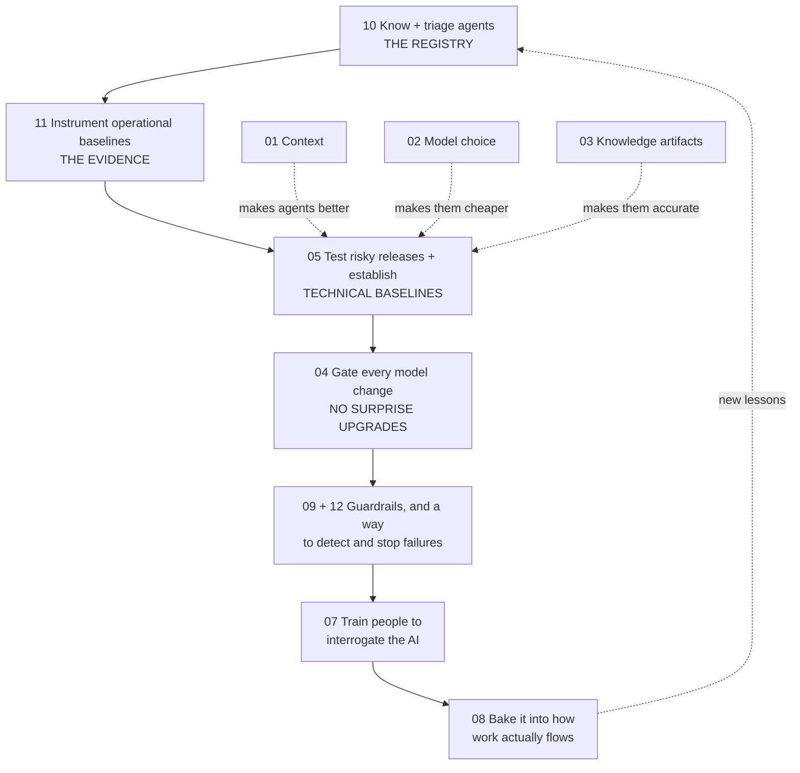

# Overview of the New AI Team

*A plain-language guide to what we are building, why each part matters, and what happens if we skip it.*

**For:** CES leadership, engineering managers, and anyone joining the programme
**Owner:** Head of AI Enablement
**Status:** Draft v0.1
**Last updated:** 2026-09-02
**Read next:** [newCESTeamRoles.md](newCESTeamRoles.md) (who does what) · [AIAcrossCESMaximizingItsPotential.md](AIAcrossCESMaximizingItsPotential.md) (the strategy) · [ai-across-ces/README.md](ai-across-ces/README.md) (the technical detail)

---

## 1. The whole thing in one minute

AI is already everywhere in CES. Engineers use it daily, agents are running in our repositories, and nobody has a complete list of them. That is not a scandal — it is what rapid, healthy adoption looks like. But it means we currently **cannot answer basic questions**: how many agents do we have, are they any good, who owns them, and what would we do if one went wrong?

This programme answers those questions. It is built on one idea:

> **Treat AI like production software.** We would never ship code with no owner, no tests, no monitoring, and no rollback plan. We are currently doing exactly that with AI — and this programme fixes it without slowing anyone down.

Three outcomes we are aiming for:

| Goal | Plain meaning |
| --- | --- |
| **Capability** | People get more done, and better work, because AI is used well |
| **Quality** | AI output is checked, grounded in real facts, and safe — AI raises our standards, never lowers them |
| **Cost** | We pay the least we can for that value, and we can prove what it costs |

These three pull against each other. Managing that tension deliberately — rather than by accident — is the job.

---

## 2. The problem, in plain language

Everyone can now produce plausible-looking work at enormous speed. That creates four risks that have nothing to do with the technology being bad:

1. **Confident and wrong.** AI states incorrect things with total conviction. Experienced engineers usually catch it. Junior engineers often cannot — and the model never signals which case you are in.
2. **Invisible dependence.** Agents are quietly embedded in daily work. When one starts behaving differently — because a vendor updated the model overnight, without telling us — nothing alerts us.
3. **Volume mistaken for value.** AI makes it trivial to produce a fifty-page document. Leadership already knows AI can generate documents. What is scarce, and what we actually reward, is a clear goal and the smallest piece of work that achieves it.
4. **Nobody's name on it.** When AI drafts something and it goes wrong, "the AI wrote it" is not an explanation. There must always be an accountable human.

**The single sentence that captures our answer:** *AI drafts, a named human owns.*

---

## 3. The five big ideas

Everything in the fourteen documents reduces to these:

| # | Idea | In one sentence |
| --- | --- | --- |
| 1 | **Know what you have** | You cannot manage, test, or fix agents you have never counted. |
| 2 | **Measure before you judge** | Every rule needs a number, and every number needs a method — otherwise gates are decoration. |
| 3 | **Test AI like software** | Golden references, adversarial traps, and regression suites — run automatically, every time something changes. |
| 4 | **Right-size the effort** | Heavy controls for the few agents that can cause real harm; almost nothing for the many that cannot. |
| 5 | **Train judgement, not tools** | The skill gap is not "how do I use Copilot"; it is knowing when to disbelieve it. |

Idea 4 is what makes this affordable. Roughly 80% of our agents draft text a human immediately reviews — those need an owner and a review, nothing more. The 20% that touch production, customers, or sensitive data get the full treatment.

---

## 4. The areas, and why each one matters

Each document owns one area. Here is what it is, why it matters, and — the important column — **what goes wrong if we skip it.**

### The foundation — giving AI a fair chance to be right

| Area | What it is | Why it matters | If we skip it |
| --- | --- | --- | --- |
| **[Context & Transparency (01)](ai-across-ces/01-context-engineering-and-transparency.md)** | How to give an agent enough information and inspect its sources, assumptions, actions, and verification evidence | Most bad AI output is a **briefing failure, not a model failure**. Also covers how *our own* leading questions produce the answers we wanted to hear | We blame the tool, buy a better one, and get the same results |
| **[Model Selection (02)](ai-across-ces/02-model-selection-and-fit.md)** | Choosing the right AI for each job — biggest is rarely best | A cloud-specialist model may beat a "smarter" general one on cloud work, at a fraction of the cost | We overpay for frontier models on trivial tasks and pick by brand loyalty |
| **[Knowledge Artifacts / OKF (03)](ai-across-ces/03-knowledge-artifacts-and-okf.md)** | Turning sprawling internal knowledge into small linked files any AI can read | An agent reads three small relevant files instead of a 3,000-line document — cheaper, faster, more accurate | Agents either drown in irrelevant context or invent the answer |

### The assurance layer — knowing whether it actually works

| Area | What it is | Why it matters | If we skip it |
| --- | --- | --- | --- |
| **[Drift Management (04)](ai-across-ces/04-model-drift-management.md)** | Testing every new AI version before we adopt it, like any dependency upgrade | A newer model can be better on average yet **worse for us** — often more confident and less willing to admit uncertainty | Quality changes overnight, nobody knows why, and juniors are hurt first |
| **[Agent QA & Regression (05)](ai-across-ces/05-agent-qa-and-regression-framework.md)** | Automated testing for agents: known-good references, deliberately planted bugs, rebuild challenges | This is how "the agents feel unreliable" becomes a number that can go up | Quality stays a matter of opinion, and opinions do not improve |
| **[Guardrails & Grounding (09)](ai-across-ces/09-guardrails-and-grounding.md)** | Keeping agents inside safe bounds and anchoring answers in real sources; plus IP, fairness and compliance | Prevents data leaks, unsafe actions, invented facts, and hostile instructions hidden in content the agent reads | One incident sets the entire programme back further than a year of progress |
| **[Agent Registry (10)](ai-across-ces/10-agent-inventory-and-registry.md)** | A living list of every agent: owner, model, risk level, test status | **The foundation.** Everything above assumes we know what exists | We improve the agents we can see and inherit the risk of the ones we cannot |
| **[Incident Response (12)](ai-across-ces/12-ai-incident-response-and-observability.md)** | Seeing what agents do in production, and knowing how to stop one | Prevention alone is half a safety system. Given the number of live agents, an incident is a *when* | We find out from a customer, and we have no way to turn it off quickly |

### The evidence layer — proving it

| Area | What it is | Why it matters | If we skip it |
| --- | --- | --- | --- |
| **[Measurement & ROI (11)](ai-across-ces/11-measurement-baselines-and-roi.md)** | How we set baselines, turn them into thresholds, and report value honestly | Without it, every quality gate is unenforceable and every benefit claim is unprovable — and rightly distrusted | We present survey numbers, someone challenges one, and credibility never recovers |

### The people layer — making it real

| Area | What it is | Why it matters | If we skip it |
| --- | --- | --- | --- |
| **[Collaboration & Prompt Hub (06)](ai-across-ces/06-collaboration-and-shared-prompt-hub.md)** | A shared space where the AI is present, and good prompts become reusable assets | Today a brilliant prompt is shared in a chat thread and lost by Friday | Every team solves the same problem independently, forever |
| **[Enablement & Training (07)](ai-across-ces/07-enablement-and-interactive-training.md)** | Hands-on labs inside VS Code that teach engineers to interrogate AI, not just prompt it | Tools do not produce good outcomes; **skilled operators do** | We buy capability and get none of it |
| **[AI-DLC Process (08)](ai-across-ces/08-ai-dlc-process-and-integration.md)** | Building AI into how work flows — from intake to release — and fitting it to processes teams already run | Training does not stick unless the process reinforces it | Good habits fade within a quarter |
| **[Training Platform Design](ai-across-ces/interactiveAITrainingDesign.md)** | The design for a richer training experience — narrated, with observable sources, actions, and verification events visible live | Genuinely powerful *if* the content and model adapters prove themselves first | We build an expensive product for lessons or integrations we never validated |

### Steering documents

| Area | What it is |
| --- | --- |
| **[Strategy](AIAcrossCESMaximizingItsPotential.md)** | The three pillars — adoption, quality, cost — and the operating model |
| **[Team Roles](newCESTeamRoles.md)** | Who does what, when to hire, and who has authority to say no |
| **[Architect Review](ai-across-ces/architect-review-and-recommendations.md)** | An honest self-critique of this framework, including what we chose *not* to build |

> That last one is worth noticing. The framework contains a documented argument against itself, and a list of things we deliberately declined to build. That is intentional: a programme that cannot criticise itself will not catch its own mistakes either.

---

## 5. How it fits together

Read it left to right: **know → measure/test → gate → protect → teach → embed**, and then round again. Discovery comes first; operational baselining and the minimum QA harness then overlap because the harness itself produces the technical baselines. Known high-risk gaps are fixed immediately, not held open for measurement purity.

---

## 6. What we are doing first — and what we are not

### First (the critical path)

1. **Count and triage the agents.** Sweep code, billing, network traffic, and teams. Registration is an **amnesty**, not an audit; fix any owner, access, or off-switch gap on an R3 agent as soon as it is found.
2. **Instrument four operational baselines.** Start a representative observation window for review acceptance, rework, cost, and tokens. Do not delay a known safety fix to keep the data clean; record the break.
3. **Stand up the minimum test harness in parallel.** One known-good reference project, one trap set, immutable release manifests, and action-contract tests for tool-enabled agents.
4. **Establish the two technical baselines.** The harness now produces incumbent quality and trap recall/precision with uncertainty, completing the six-baseline set ([ai-across-ces/11 §5](ai-across-ces/11-measurement-baselines-and-roi.md)).
5. **Run five training labs by hand.** Real engineers, objective before-and-after scores — no platform build.
6. **Report once, honestly.** Two pages to leadership at 90 days, with a section on what did not work.

### Deliberately not — yet

| Not now | Why |
| --- | --- |
| The full training platform | Prove the lessons work on paper first; the build is expensive and hard to change |
| Custom AI training (fine-tuning models) | Give models better information first; only train weights when we can prove information alone was not enough |
| A custom internal AI gateway | Try to answer the questions with tools we already pay for |
| Rolling knowledge artifacts out everywhere | Two or three pilots first — a stale knowledge base is worse than none, because it is confidently wrong |
| Mandating the process org-wide | Volunteers → evidence → norm → requirement. Mandating first buys paperwork, not judgement |
| Writing more documents | The framework is already at the limit of what an organisation can absorb |

**Saying no is the point.** The most likely way this programme fails is not that it does too little — it is that it produces an impressive framework nobody adopts. That is the exact failure the training curriculum teaches engineers to avoid, and we would deserve the irony.

---

## 7. How you will know it is working

| By | You should see |
| --- | --- |
| **30 days** | A real number for how many agents exist — including ones nobody knew about. Champions named and funded. |
| **90 days** | Every high-risk agent has an owner, a pinned model, and a tested off-switch. Six baselines published. One measured result presented honestly. |
| **6 months** | A new model version accepted or rejected on evidence within a week. Trained teams show measurably less rework than untrained ones. Cost per unit of work trending down. |
| **12 months** | Quality is a chart, not an opinion. Incidents are rare, caught fast, and each one has produced a test that prevents its recurrence. Teams ask for the framework instead of being sold it. |

**The single most telling early number** is the gap between agents we *find* and agents we *knew about*. That is the size of the risk we are currently carrying blind — and it is measurable within a month.

---

## 8. Honest risks

| Risk | How likely | What we do about it |
| --- | --- | --- |
| **The framework becomes shelfware** | High — the default outcome | Critical path only; quarterly retro whose mandatory question is *what do we delete?* |
| **Teams see it as bureaucracy** | Medium-high | Short Required list; gates must justify themselves annually or be removed; retire an old ceremony for each new one |
| **We measure the wrong things** | Medium | Metrics always reported in pairs — speed with rework, cost with quality — so nothing can be gamed alone |
| **An incident before controls are in place** | Medium | Riskiest agents first, in the first 90 days |
| **We over-build the training platform** | Medium | Explicit build gates; each phase must be earned with evidence |
| **Key-person dependency** | Medium | Runbooks and versioned artefacts; a federated network rather than a central team |
| **Leadership expects a faster payoff** | Medium | This document; honest evidence grades; no inflated early claims |

---

## 9. Questions you are likely to ask

**"Isn't this just adding process to something that already works?"**
For most work, no — roughly 80% of agents will only ever need a registered owner and normal code review. The heavier controls apply to agents that touch production, customers, or sensitive data. That proportion is a deliberate design decision, not an accident.

**"Will this slow teams down?"**
Slightly, at first, in the places where it should. We measure speed and rework *together* — if the pair does not improve within a quarter, the gate is removed. That commitment is written into the framework, not just implied.

**"We already review AI code. Why more?"**
Review catches what a human notices. It does not catch a vendor silently changing the model, an agent nobody owns any more, or a slow decline in quality across hundreds of interactions. That is what measurement and monitoring are for.

**"Are we just chasing the AI trend?"**
The opposite. The framework's own review argues against half of itself, and there is a published list of things we chose not to build. This is a scepticism programme with an enablement budget.

**"How much does the team cost?"**
It starts as one person plus part-time champions, and grows only when a specific trigger justifies it — for example, "we have high-risk agents we cannot monitor or stop." The staffing ladder and its triggers are in [newCESTeamRoles.md §5](newCESTeamRoles.md).

**"What if it doesn't work?"**
Then the measurements will say so, and we will remove what did not earn its place. Every report includes a "what got worse or didn't work" section — a quarterly review with no negatives is marketing, and experienced leaders discount it accordingly.

---

## 10. Plain-English glossary

| Term | What it actually means |
| --- | --- |
| **Agent** | A deployed or runnable AI configuration for a repeatable purpose; prompts and instruction files are linked components, not separate agents |
| **Decision trace** | Observable sources, assumptions, actions, approvals, and test results — not private chain-of-thought |
| **Action envelope** | The machine-enforced tools, targets, parameters, limits, and approval rules available to one agent release |
| **Context** | Everything we hand the AI for one conversation. Forgotten afterwards |
| **Training / fine-tuning** | Permanently changing the AI itself. Rare, expensive, governed. **Pasting documents into a chat is not this** |
| **Grounding** | Making the AI answer from real sources we gave it, rather than from memory |
| **Guardrail** | A rule that stops an AI doing something unsafe |
| **Golden baseline** | A known-good reference we measure an agent's work against |
| **Drift** | An AI version behaving differently from the last one — sometimes better, sometimes quietly worse |
| **Hallucination** | Confidently stating something untrue |
| **Prompt injection** | Hostile instructions hidden inside content the AI reads — a web page, a document, a ticket |
| **Risk tier (R0–R3)** | How much damage this agent could do. Decides how much testing it owes |
| **Blast radius** | How far a mistake would spread — one file, one team, or every customer |
| **OKF** | A format for breaking big documents into small linked files any AI can read cheaply |
| **AI-DLC** | Our delivery process, redesigned so AI is involved from the start rather than bolted on at the end |

---

## 11. Where to go next

| If you are… | Read |
| --- | --- |
| **A leader with 5 minutes** | Sections 1, 3, and 7 of this document |
| **A leader deciding on funding** | This document, then [newCESTeamRoles §5–§6](newCESTeamRoles.md) (staffing ladder and decision rights) |
| **An engineering manager** | This document, then [08 AI-DLC §4](ai-across-ces/08-ai-dlc-process-and-integration.md) (how it fits your team's process) |
| **An engineer** | [01 Context & Transparency](ai-across-ces/01-context-engineering-and-transparency.md) — it will change how you work this week |
| **A new AI Champion** | [ai-across-ces/README.md](ai-across-ces/README.md), then [10 Registry](ai-across-ces/10-agent-inventory-and-registry.md) to register your team's agents |
| **Sceptical of the whole thing** | [Architect Review](ai-across-ces/architect-review-and-recommendations.md) — we wrote the case against this ourselves |

---

*Living document. If any part of this is unclear, that is a defect in the writing, not in the reader — tell us and we will fix it.*
