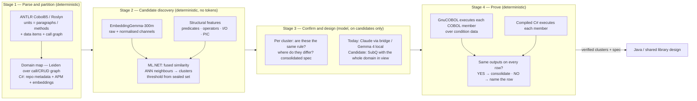

# SubQ 1.1 versus EmbeddingGemma — finding the same business logic across a COBOL estate and hundreds of C# repositories

*Analysis and experiment design for the Director of AI. Written to be argued with.*

**Status:** Design proposal — not built. The experiment reuses machinery that already exists in `poc-interactive-training` (scenes 18, 26, 29, 37, 39).
**Question asked:** Is it worth testing SubQ 1.1 Small on the COBOL migration and on consolidation across hundreds of C# repos, and how should the two "embedding options" be compared?
**Related:** [13 Legacy Modernization](ai-across-ces/13-legacy-modernization-for-ai.md) · [02 Model Selection](ai-across-ces/02-model-selection-and-fit.md) · [migrateCOBOLprojectToJAVA](migrateCOBOLprojectToJAVA.md) · [POC README — Common code audit](poc-interactive-training/README.md)

---

## 0. One correction before anything else

**SubQ 1.1 Small is not an embedding model.** It is a generative, sparse-attention LLM with a 1M–12M token window. EmbeddingGemma-300m is an embedding model: it turns text into a 768-dimensional vector and does nothing else. They are not two options for the same job.

The real comparison is between two **approaches** to the same question — *"which pieces of this estate implement the same business rule?"*:

| | A — Embed and cluster | B — Read everything and reason |
| --- | --- | --- |
| Engine | EmbeddingGemma-300m → cosine similarity → ML.NET clustering | SubQ (or any long-context LLM) with the corpus in the prompt |
| Output | Numbers: a similarity for every pair, clusters above a calibrated threshold | Prose and structure: "these five programs compute the same fee; here is the consolidated rule" |
| Determinism | Same input, same answer | Sampled; varies run to run |
| Cost model | Fixed: one CPU pass per unit, no per-token invoice | Variable: every token of the corpus billed on every call |
| Scale ceiling | None that matters — millions of units on a laptop over days, an hour on a server | The context window: 12M tokens at most, and less in practice |
| Explains why | No | Yes |
| Can be wrong silently | Yes — a high cosine between two things that are *about* the same subject but *do* different things | Yes — a fluent consolidation that drops a branch |

The likely right answer is not A *or* B. It is **A to find candidates at estate scale, B to confirm and design on the candidates, and executed tests to prove the candidates really are equivalent** — the same shape as the existing common-code audit (scene 29), where embeddings find the duplication, Claude designs the consolidation, Gemma writes it, and the oracle decides. This document designs the experiment that establishes *whether SubQ earns the B slot*, and what has to change in A for it to work on business logic rather than framework code.

---

## 1. What the platform has already measured

These are the facts this design starts from, not assumptions.

| Fact | Where measured | Consequence |
| --- | --- | --- |
| EmbeddingGemma with whole-file mean pooling separates duplicated **framework** code from unrelated code across three real trading repos, but the margin is narrow: threshold 0.863, chosen from the measured gap between the weakest true duplicate and the strongest unrelated pair | Scene 29, `--calibrate-corpus` | A single threshold works on one corpus and will not survive a noisier one. The threshold is a property of the corpus, and must be re-measured per estate |
| The same audit found **no functional duplication** across the three repos — the trading logic genuinely diverges by asset class | Scene 29 | The current tool was built and calibrated for framework duplication. **It has not been shown to find duplicated business logic**, which is what leadership is asking for |
| Programmer notes carry the domain: right domain in the top 3 for 92–94 % of BankDemo programs from the `Function:` header alone; cross-cutting concerns cannot be placed by words, only by the call graph | Scene 39 | Text-only similarity finds *subject*, not *behaviour*. Structure is needed to separate "about margin" from "computes margin" |
| Real IBM COBOL parses end to end with the ANTLR `Cobol85.g4` grammar, copybooks resolve in SYSLIB order, and a call graph, CRUD matrix and data-dependency graph can be built deterministically | Scene 18 | The units of comparison for COBOL — paragraphs with their data items — are already extractable |
| GnuCOBOL can compile and execute a legacy program to produce ground-truth outputs, and candidate implementations can be executed against them | Scene 17, `--migration-selftest` | "Same business logic" can be **proved by execution**, not argued from similarity |
| Roslyn extracts branch predicates and mutation sites from C#; both versions of a service can be executed over condition data and compared row by row | Scene 26 | The same differential proof is available for C# |
| Long-context models are not a cost lever: the index that lets a model read three files instead of thirty is the saving; a model that reads everything pays for everything every turn | Scene 28, 35, 36; the compressed-index result in the `claude-mega-brain` benchmark | SubQ makes 1M tokens *computationally* cheap for its vendor. What it charges per token is undisclosed, and whatever it is, it is paid per call |

---

## 2. The arithmetic that decides where SubQ can and cannot be used

Token estimates use ~12 tokens per COBOL line (fixed-format, verbose) and ~10 per C# line. Treat them as order-of-magnitude.

| Corpus | Size | Tokens | Fits SubQ 12M? |
| --- | --- | --- | --- |
| One COBOL program (BankDemo average) | ~600 lines | ~7K | Yes |
| One COBOL business domain (scene 18 estimate) | ~1,000 programs, ~600K lines | ~7M | **Yes — once, barely** |
| The 200-program SME-classified pilot | ~120K lines | ~1.5M | Yes |
| The whole COBOL estate | 62M lines | **~750M** | No — 60× over |
| One typical C# service repo | ~40K lines | ~400K | Yes |
| 100 C# repos | ~4M lines | ~40M | No — 3× over |
| 300 C# repos | ~12M lines | ~120M | No — 10× over |

Three conclusions follow that no benchmark can change:

1. **SubQ cannot hold the estate.** Neither the COBOL estate nor a few hundred C# repos fit in one prompt, so "load everything and ask" is not available at the scale leadership is asking about. Something has to partition the estate first, and that something is deterministic: the domain map (scene 18) for COBOL, and embeddings plus repository metadata for C#.
2. **SubQ can hold one partition.** A COBOL domain, a pilot, or a cluster of related C# repos fits. That is where whole-context reasoning is genuinely new: dependency tracing and consolidation design across a thousand programs *in one pass*, with no chunking to lose the relationship between page 2 and page 46.
3. **Pairwise similarity at estate scale is only affordable with embeddings.** 100,000 COBOL paragraphs is 5 billion pairs; a cosine is nanoseconds, a model call is not. The embedding sweep is the only way to get from "everything" to "these 400 candidate groups", and its cost is fixed infrastructure, not tokens.

---

## 3. Why the current embedding approach is not yet enough for business logic

Scene 29 works on framework code because framework duplicates are *textually* similar: the same class copied three times. Business logic duplicated across an estate is usually **behaviourally** similar and **textually** different — the same fee rule written in 1998 COBOL, 2011 C# and a 2019 microservice, with different names, different data types, and different surrounding code. Four changes are needed before A can find that.

### 3.1 Unit of comparison: paragraph or method, not file
Whole-file mean pooling averages the rule with everything around it. The unit must be the smallest thing that *does* something:
- **COBOL:** a paragraph (or SECTION) plus the WORKING-STORAGE items it reads and writes, resolved through copybooks. Scene 18 already produces this.
- **C#:** a method plus the fields it touches and the methods it calls one level down. Roslyn (scene 13/26) already parses to this level.

### 3.2 Normalise before embedding
Identifier names dominate an embedding. `CALC-LATE-FEE` and `ComputeOverdueCharge` should land near each other; `CUST-ID` and `customerId` should not pull them apart. Normalise: canonical identifier placeholders (`VAR1`, `PROC2`) *in one embedding channel*, raw text in a second. Compare both; a pair that is close in the normalised channel and far in the raw one is a **renamed duplicate**, which is the interesting kind.

### 3.3 Add a structural channel
Embeddings say what a unit is *about*. Structure says what it *does*. For each unit, extract deterministically: number and shape of branch predicates, arithmetic operators used, data items read vs written, call-outs, and for COBOL the PIC clauses of the fields involved (a rule on a `PIC S9(7)V99` amount is not the same as one on a `PIC X(10)` code). Scene 39 showed that pooling along the call graph lifts domain accuracy; the same holds here — two units that call the same three utilities and write the same table are stronger duplicate candidates than their text alone says.

### 3.4 Calibrate against sealed ground truth, not intuition
The threshold and the fusion weights must be set on a labelled set, per estate, and re-measured when the estate changes. §5 defines that set.

---

## 4. Recommended architecture: a three-stage funnel with an oracle at the end

**Rules that hold at every stage**, taken from the programme:
- Stage 2 produces every number the later stages quote. A model never decides a similarity.
- Stage 3 sees only the clusters Stage 2 shortlisted, never the estate. That is what keeps the token bill bounded whichever model sits there.
- Stage 4 is not optional. Two units that a model calls "the same rule" are **candidates** until they produce identical outputs on the same inputs. A model's consolidation that drops a branch is caught here or shipped.
- Every number is published with its coverage: how much of the estate parsed, how many units embedded, how many clusters confirmed, how many proved.

**Where SubQ would sit:** Stage 3, with a whole domain (~7M tokens) or a whole C# repo cluster in context. Its claimed advantage — relationships across a complete artifact without chunking — is exactly the Stage 3 question: *is this paragraph's rule really the same as that method's, given everything each of them calls and every field each of them touches?* Today that seat is held by Claude at 200K tokens working cluster by cluster with a code map, and it is the experiment in §5 that says whether SubQ does it better, cheaper, or neither.

---

## 5. The experiment

### 5.1 Ground truth — sealed before any arm runs

Two corpora, each with planted, labelled duplicate groups. Planting is the only way to know recall; the real estate's duplicates are unknown by definition.

| Corpus | Base | Planted groups (each ≥ 3 members) |
| --- | --- | --- |
| **COBOL** | BankDemo (81 programs, hand-written domain catalog) + the IBM GAM sample already in the fixture | (a) verbatim copy; (b) renamed identifiers only; (c) restructured — same rule, different control flow (EVALUATE vs nested IF); (d) **near-miss decoy** — same subject, one predicate flipped, different output on ≥ 1 row; (e) split — one rule spread over two paragraphs in one program, one paragraph in another |
| **C#** | The three trading repos (real, on disk) + 10–20 synthetic service repos generated from a shared template with divergent business rules | Same five kinds, in C# idiom (LINQ vs loop, switch expression vs if-chain, extension method vs static helper) |

Every planted member ships with **condition-permutation data and expected outputs** so Stage 4 can execute it. The decoy groups are the important ones: an approach that clusters (d) with its look-alikes has found *subject* similarity, not *behavioural* similarity, and would have consolidated a rule that differs.

### 5.2 Arms

| Arm | What runs | Cost class |
| --- | --- | --- |
| **A0** — file-level embeddings (today's scene 29) | Whole-file mean pooling, cosine, threshold 0.863 | No tokens |
| **A1** — unit-level embeddings, raw text | Paragraphs / methods, cosine, threshold re-calibrated | No tokens |
| **A2** — unit-level, raw + normalised + structural, fused | §3 in full, ML.NET fusion, threshold from the sealed set | No tokens |
| **B1** — long-context LLM, one partition in context | The whole BankDemo (or one synthetic repo cluster) in one prompt: "list every group of units that implement the same business rule; for each, cite members and state the rule." **Proxy today:** Gemini 3.8 Flash at 1M via the bridge (already a shootout contestant); **target:** SubQ 1.1 when the API exists | Tokens = corpus size, every call |
| **C** — hybrid | A2 shortlists; the same LLM confirms/rejects each cluster and writes the consolidated spec, seeing only the cluster and its call-graph neighbourhood | Tokens = shortlist size |

All arms are followed by the same Stage 4 execution, which is the only judge of "same rule".

### 5.3 Metrics — every one reproducible

| Metric | Definition |
| --- | --- |
| Recall by kind | Planted groups found, broken out by (a)–(e). Kind (c) restructured and (e) split are where A0 will fail and where the argument for B is made or lost |
| Precision | Proposed groups whose members produce identical outputs on all condition rows |
| Decoy rate | Kind (d) decoys wrongly grouped with their look-alikes. **A single decoy consolidated in production is a regression shipped** |
| Cost per proved consolidation | Tokens billed (0 for A) + wall-clock ÷ groups that passed Stage 4 |
| Determinism | Three runs; A arms must be identical; B/C report spread in recall |
| Scale curve | Wall-clock and cost at 1×, 10×, 100× of the base corpus (synthetic repos duplicated with fresh names). A arms should be linear in units; B hits the window; C should be linear in shortlist size |
| Explanation quality | For B and C only: does the stated rule match the executable ground truth? Scored by a sealed keyword floor first, then a blinded judge (the scene 37 pattern) |

### 5.4 Predictions to be proved wrong

Writing these down is the point; the run either confirms or embarrasses them.

- A0 finds (a) and (b), misses most of (c) and all of (e), and groups half the (d) decoys. It measures subject, not behaviour.
- A2 finds (a), (b), most of (c), some of (e); the structural channel rejects most decoys. This is the arm that should carry estate-scale discovery.
- B1 finds (c) and (e) better than any A arm on a corpus that fits — this is the genuine long-context advantage — but explains some decoys away fluently, and its recall varies run to run. Its cost at 10× corpus is 10× the tokens; at 100× it cannot run.
- C matches or beats B1 on recall at a fraction of the tokens, because the model reads only what Stage 2 handed it. If C ≈ B1 on the (c)/(e) kinds, whole-corpus context bought nothing that a good shortlist did not.

If B1 beats C decisively on (c) and (e) — restructured and split logic — that is the evidence SubQ earns a place: relationships that a cluster-by-cluster view cannot see. If not, the shortlist was the lever and the long window is a convenience.

---

## 6. Should SubQ be tested on the COBOL migration and the C# repos?

**Yes, in Stage 3, on one partition, as arm B1/C — and not as a replacement for the embedding sweep.**

| | Verdict | Why |
| --- | --- | --- |
| Estate-wide discovery (62M lines COBOL, hundreds of C# repos) | **No** | Does not fit any window; pairwise similarity is only affordable as embeddings; a hosted model billed per token over the whole estate on every run is the wrong cost model for a recurring audit |
| Whole-domain confirmation and consolidation design (one COBOL domain, one C# repo cluster) | **Yes — test it** | Fits in 7M tokens; cross-file dependency tracing in one pass is its stated strength and the platform's current weakness (Claude works cluster by cluster at 200K) |
| Right now | **Cannot** | No API, no weights, design partners only. Run the experiment with Gemini 3.8 Flash at 1M as the long-context proxy so the harness, ground truth and baselines exist the day SubQ is reachable |
| Confidential code | **Gate first** | SubQ is hosted. Real COBOL and C# go through the data-tier gate (scene 27) and a contract review before a token leaves. The synthetic and open corpora in §5.1 need no such gate and are enough for the comparison |

Concretely: join the design-partner list; build §5 against the proxy; when SubQ is available, swap it into B1 and C, re-run, and compare the two long-context models on the same sealed set. The decision is then a table, not an opinion.

---

## 7. What this means for the Java design and the C# consolidation

- **The migration gets a smaller design surface.** Confirmed, executed-equivalent clusters become one Java rule each, with the COBOL members as its test oracle. The GnuCOBOL execution from Stage 4 *is* the acceptance test for the consolidated Java.
- **The C# estate gets a shared-library candidate list with proof attached.** Each proposed consolidation carries the row-level differential result, so a team asked to adopt the shared rule can see it produces their current outputs.
- **Both get a recurring audit at fixed cost.** Stages 1, 2 and 4 are deterministic and local. They run nightly on a server for the price of the server. Only Stage 3 costs tokens, and only for what changed.

---

## 8. Governance and risks

| Risk | Control |
| --- | --- |
| Threshold calibrated on one corpus applied to another | Re-run the sealed-set calibration per estate; publish the margin, refuse to run below a minimum margin |
| A model's "same rule" accepted without execution | Stage 4 is mandatory; a cluster without a passing differential run is a hypothesis in the report, never a work item |
| Decoy consolidation shipped | Decoy rate is a release gate for the tool itself: above zero on the sealed set, the tool does not run on real code |
| Hosted long-context model sees confidential code | Data-tier gate before Stage 3; synthetic corpus for the comparison; contract terms before production |
| Embedding or classifier version changes silently | The encoder ONNX hash and the ML.NET model are pinned in the agent release (scene 22); a change is a drift event (scene 21) |
| Coverage gaps hidden | Every report leads with parse %, unit %, embedded %, executed % — a claim about the part of the estate that was read |
| "Zero token" language | It is **no per-token vendor cost**. Stage 2 has server, storage and re-calibration cost, and that is the honest comparison to make against a per-token bill |

---

## 9. Build plan

| Step | Reuses | New |
| --- | --- | --- |
| 1. Unit extraction for COBOL and C# | `CobolFrontEnd`, `CobolGraphBuilder`, `CSharpAuditAnalyzer` | Unit records with data items, predicates, calls |
| 2. Sealed corpus with planted groups and condition data | BankDemo, GAM fixture, trading repos, `RegressionSamples` pattern | Generator for synthetic C# repos; labelled group manifest |
| 3. Arms A0–A2 | `EmbeddingGemmaEncoder`, `CommonCodeAuditService`, ML.NET | Normalised channel, structural features, fusion, ANN |
| 4. Stage 4 execution | `CobolToolchain.RunOracle`, `MigrationSandbox`, `RegressionAdequacyService` differential | Batch runner over clusters |
| 5. Arms B1 and C via the bridge | Shootout task plumbing, Gemini 3.8 Flash | Long-context prompt contract; cluster-scoped confirmation prompt |
| 6. Headless `--consolidation-bench` and a scene | `--calibrate-corpus` pattern; scene 29 layout | Results table by kind, cost per proved consolidation, scale curve |
| 7. SubQ adapter | Bridge model-adapter pattern | Plain HTTPS client, when an API exists |

Steps 1–4 are worth doing regardless of SubQ: they turn the framework-duplication audit into a business-logic audit with proof, which is what leadership asked for. Steps 5–7 are what make the SubQ question answerable with a number.
