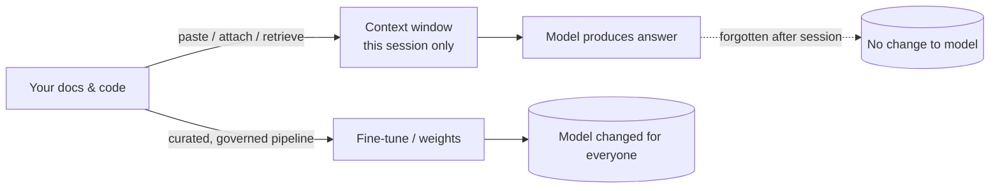
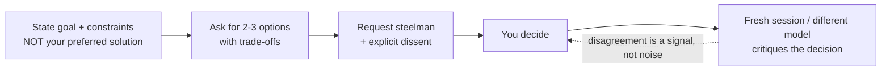
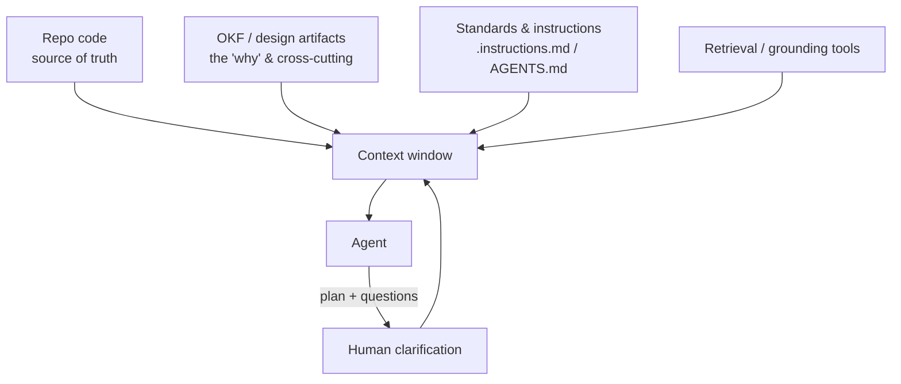

# 01 — Context Engineering & Transparency

*Making sure an agent has enough context to do its job — and that it is never a black box to the people relying on it.*

**Concerns covered:** #1 (sufficient context, inspect the evidence and rationale, look for questions), part of #5 (context vs. training), #12 (demand plans, exec summaries, diagrams).
**Related:** [03 Knowledge Artifacts & OKF](03-knowledge-artifacts-and-okf.md), [09 Guardrails & Grounding](09-guardrails-and-grounding.md), [07 Enablement & Training](07-enablement-and-interactive-training.md).

---

## 1. The core problem

An LLM only knows three things: what it learned during training, what you put in its context window, and what it can retrieve via tools. When agents produce weak or wrong output, the root cause is usually **missing or misshapen context**, not a "dumb model." Two failure modes dominate:

1. **Under-context** — the agent guesses because it wasn't told the constraints, conventions, or goal.
2. **Black-box trust** — a human accepts output without inspecting the evidence, assumptions, actions, or plan.

This document defines how CES engineers **supply enough context** and keep the process **transparent**.

---

## 2. Context vs. Training — clear this up first (concern #5)

A very common and costly misunderstanding. Say this plainly and repeat it often:

| | **Context (in-session)** | **Training / fine-tuning** |
| --- | --- | --- |
| What changes | Only what the model *sees this session* | The model's *weights* |
| When | At inference time, every request | Offline, a separate engineering effort |
| Persistence | Gone when the session/window ends | Baked into the model |
| Who does it in CES | Every engineer, every day | Rare, specialized, governed |
| Cost driver | Tokens per request | Compute + data pipeline + eval |
| Analogy | Briefing a contractor for today's job | Sending them to a 6-month course |

**Key message for the team:** *Pasting docs into a VS Code chat is not training the model.* It informs this one conversation. Nothing you type is remembered by the base model for the next user. Persistent knowledge belongs in **artifacts** ([03](03-knowledge-artifacts-and-okf.md)) and, rarely, in a **fine-tune** ([02](02-model-selection-and-fit.md), [05 §Gemma](05-agent-qa-and-regression-framework.md)).



---

## 3. What "enough context" means

Context sufficiency is task-specific. Use the **CLEAR** checklist before trusting an agent on a non-trivial task:

- **C — Constraints:** conventions, standards, forbidden approaches, security/compliance limits.
- **L — Locus:** the exact files, modules, or data in scope (not the whole repo).
- **E — Expected outcome:** definition of done, acceptance criteria, examples of good output.
- **A — Artifacts:** the knowledge graph / design docs / API contracts it must respect ([03](03-knowledge-artifacts-and-okf.md)).
- **R — Role & reporting:** who the agent is acting as, and a requirement to *show its plan, sources, assumptions, and open questions*.

> **Rule of thumb:** if a competent new hire couldn't do the task from what you gave the agent, the agent can't either.

### Least-context principle
More context is not always better — irrelevant context raises cost and *increases* hallucination. Aim for the **minimum sufficient context**, scoped tightly. This is exactly why OKF-style progressive disclosure matters ([03](03-knowledge-artifacts-and-okf.md)).

---

## 4. Transparency: never a black box (concerns #1, #12)

### 4.1 Inspect the decision trace, not hidden chain-of-thought
A model's private chain-of-thought is neither stable evidence nor a required interface. Many models do not expose it; where a provider presents "thinking," it may be a generated summary rather than a faithful record of internal computation. **Do not require, store, or score hidden chain-of-thought.** A plausible explanation can be fabricated just as easily as a plausible answer.

Require an **observable decision trace** instead:

- **Sources and citations** — what authoritative material was retrieved and which claims depend on it.
- **Assumptions and open questions** — especially anything that could change the answer.
- **Options and decision criteria** — what alternatives were considered and why one was selected.
- **Tool and action trace** — tools called, resources touched, approvals obtained, and outcomes; never secrets or full sensitive payloads.
- **Verification evidence** — tests, queries, scanners, or source checks actually run and their results.
- **Uncertainty or abstention** — what the agent could not establish from available evidence.

Model-generated rationale can still be a useful debugging clue, but it is **an output to verify, not proof of correctness**. Transparency means a reviewer can reconstruct what informed the result and what the agent did. Correctness comes from sources, tests, and independent checks.

### 4.2 Require the agent to surface questions
An agent that never asks questions on ambiguous work is guessing. Build this into instructions:

> "Before implementing, list any assumptions and ask clarifying questions where the requirements are ambiguous. Do not proceed on ambiguous points without flagging them."

### 4.3 Plan-first with executive summaries and diagrams (concern #12)
For any non-trivial change, require a **plan before code**:

1. **Executive summary** — 3–6 sentences a non-author can understand.
2. **Design diagram** — a Mermaid diagram of the components/flow being changed.
3. **Change list** — files touched and why.
4. **Risks & assumptions** — what could go wrong, what was assumed.
5. **Verification plan** — how the change will be tested.

This is not to "impress leadership" — it is so the human **understands the design and the changes** before they happen. A plan the reviewer can't follow is a plan that isn't ready.

Template lives in [§7](#7-templates).

### 4.4 Operator-induced bias — the failure mode on our side of the keyboard

Sections 4.1–4.3 assume the agent is the risk. Often it isn't. **The way a human frames a request systematically distorts the answer** — and because the model is agreeable and fluent, the distortion comes back looking like independent confirmation.

This is the most under-recognised quality risk in the whole programme: it is invisible in the output, it survives every guardrail, and the more senior and confident the operator, the worse it gets.

| Bias | What it sounds like | What you get back |
| --- | --- | --- |
| **Anchoring** | "I'm thinking we use Kafka here — thoughts?" | A well-argued case for Kafka |
| **Leading question** | "Why is this approach better?" | Reasons it's better; never the case against |
| **Premature direction** | Handing over the solution instead of the problem | Execution of your idea, not evaluation of it |
| **Sycophancy loop** | Pushing back until the model agrees | Agreement — which you then read as validation |
| **Framing by omission** | Leaving out the constraint that kills your favourite option | A confident recommendation that can't survive reality |
| **Authority framing** | "As the architect, I've decided…" | Compliance, not critique |

> **The tell:** if the agent has never once told you that you were wrong, you are not getting analysis. You are getting an echo, and you are paying tokens for it.

#### The de-biasing protocol

Four habits, in order. The first two cost nothing and catch most of it.

1. **Problem before solution.** State the goal, constraints, and success criteria — and *withhold your preferred approach* until after the model has proposed options. You can always steer afterwards; you can never un-anchor.
2. **Options before opinions.** Ask for 2–3 viable approaches with explicit trade-offs *before* asking "which should we use?"
3. **Demand a steelman and a dissent.** Require the strongest argument **against** the chosen direction, and the conditions under which it would be the wrong call. Treat a refusal to find any downside as a red flag about the *session*, not the idea.
4. **Separate the roles.** Ask for the plan in one session; critique it in a **fresh session** (ideally a **different model**, [02](02-model-selection-and-fit.md)) that has no memory of who authored it and no conversational commitment to defending it.



#### Neutral framing — a worked contrast

| Biased | Neutral |
| --- | --- |
| "Confirm that moving this to microservices is the right call." | "Here are the constraints and current pain points. Give me 2–3 architectures with trade-offs, then tell me which you'd choose and why — and what would change your mind." |
| "This code is fine, right?" | "Review this against our standards. List every issue you find, ranked by severity, including ones you're unsure about." |
| "Use Gemini because it's a GCP job." | "This is a GCP migration. Which model would you pick for it, and what evidence would settle the question?" |

#### Making it a team habit

- Build "present options before recommending" and "include a dissent" into shared instruction files and the default guardrail set ([09 §3.2](09-guardrails-and-grounding.md)).
- Make it a graded competency in training ([07 §2](07-enablement-and-interactive-training.md)) — learners are given a deliberately leading prompt and must rewrite it neutrally.
- Add it to review: *"how was this asked?"* is a fair review question when an AI-assisted design looks suspiciously aligned with the author's prior opinion.

---

## 5. The context supply chain

Where context should come from, in order of preference:



- **Code** answers *what the system does now.*
- **Artifacts/OKF** answer *why, and how pieces relate* ([03](03-knowledge-artifacts-and-okf.md)).
- **Instructions files** carry standards so you don't re-type them each session.
- **Retrieval** pulls the right slice on demand.
- **Human clarification** closes the gaps the agent surfaces.

---

## 6. Anti-patterns to stamp out

| Anti-pattern | Why it hurts | Fix |
| --- | --- | --- |
| Dumping the whole repo/monolithic doc into context | Cost + more hallucination | Scope tightly; use OKF progressive disclosure |
| Accepting code without reviewing the plan/evidence/action trace | Black-box trust | Plan-first; inspect observable evidence (§4.1) |
| "It didn't ask, so it must be fine" | Silent guessing | Require assumptions + questions |
| Re-typing standards every session | Waste + inconsistency | `.instructions.md` / `AGENTS.md` / OKF |
| Believing pasted docs "trained" the model | False mental model | Teach context vs training (§2) |
| Leading the model to your answer, then citing it as support | Manufactured confirmation | De-biasing protocol (§4.4) |
| Arguing with the model until it agrees | Sycophancy read as validation | Fresh session / different model critique (§4.4) |

---

## 7. Templates

### 7.1 Agent plan template (paste into instructions or ask for it)
````markdown
## Plan

### Executive summary
<3–6 sentences, understandable by a non-author>

### Design diagram
```mermaid
<component / flow diagram of the change>
```

### Changes
- <file>: <what & why>

### Assumptions
- <assumption> (flag if unverified)

### Open questions
- <question needing a human answer>

### Evidence & decision trace
- Sources consulted: <authoritative references>
- Options rejected: <option + decision criterion>
- Tool actions: <action + result; omit secrets/sensitive payloads>

### Verification plan
- <tests / checks that prove correctness>
````

### 7.2 Context sufficiency pre-flight (CLEAR)
```markdown
- [ ] Constraints given (standards, security, forbidden approaches)
- [ ] Locus scoped (specific files/modules, not "the repo")
- [ ] Expected outcome defined (acceptance criteria + example)
- [ ] Artifacts linked (OKF/design/API contracts)
- [ ] Role set + plan/sources/assumptions/questions required
```

---

## 8. Metrics

- % of non-trivial tasks that used a plan-first flow
- Required-information detection rate on ambiguous tasks (did it ask the *needed* question; raw question count is diagnostic only)
- Reviewer-reported unsupported assumptions caught in the decision trace per sprint
- Rework rate on AI changes attributed to missing context
- Average context size trend (watch for bloat)
- Rate at which agents disagree with the operator's stated preference (near-zero indicates operator bias, §4.4)

Baselines and thresholds for all of the above are derived in [11 Measurement & Baselines](11-measurement-baselines-and-roi.md).

---

## 9. Open questions to refine

- What is the minimum standard set of instruction files every CES repo should carry?
- Which tasks *mandate* plan-first vs. which are exempt (trivial edits)?
- What is the minimum decision-trace schema for each agent risk tier?
- Should "options before recommendation" be a default in every CES instruction file, or only for design-level work?
