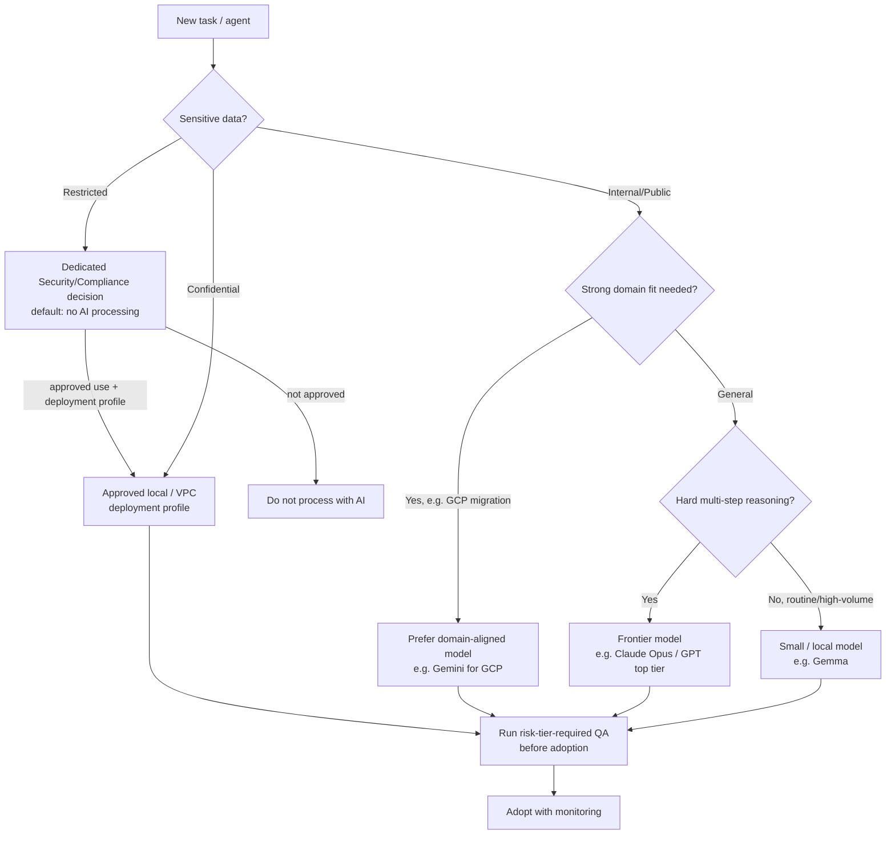
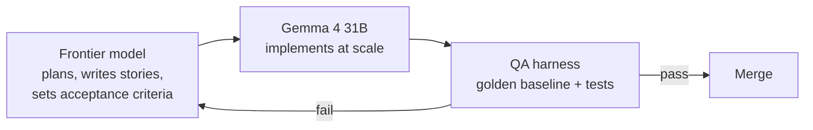

# 02 — Model Selection & Fit-for-Purpose

*Choosing the right LLM for each job — capability is not the only axis.*

**Concerns covered:** #2 (right LLM for the job; Opus vs Gemini for GCP migration), part of #10 (use the right model for the right job; Gemma for cheaper implementation).
**Related:** [05 Agent QA & Regression](05-agent-qa-and-regression-framework.md), [04 Drift Management](04-model-drift-management.md), [../AIAcrossCESMaximizingItsPotential.md](../AIAcrossCESMaximizingItsPotential.md).

---

## 1. Principle

**The most capable model is not automatically the right one.** Your GCP example is exactly right: Claude Opus may have stronger general reasoning, but Gemini may be better aligned with Google Cloud documentation and idioms for a GCP migration. Fit is multi-dimensional: capability, domain grounding, data-tier/residency, latency, and cost.

> **Rule:** Select the model that produces *correct, verifiable* output for **this task and this data**, at the lowest sustainable cost — then verify with QA ([05](05-agent-qa-and-regression-framework.md)).

---

## 2. The selection dimensions

| Dimension | Question to ask |
| --- | --- |
| **Reasoning capability** | How hard is the reasoning/planning? Multi-step? Novel? |
| **Domain grounding** | Is the model strong on this domain/ecosystem (e.g., GCP, .NET, security)? |
| **Data sensitivity** | What tier is the data? Does it require local/VPC (e.g., Gemma) only? |
| **Context needs** | How large is the required context? Retrieval or long-context? |
| **Latency / throughput** | Interactive coding vs. batch? Volume? |
| **Cost** | Cost per unit of work at expected volume (see [../AIAcrossCESMaximizingItsPotential.md §6](../AIAcrossCESMaximizingItsPotential.md)). |
| **Determinism / control** | Do we need reproducibility, tool-use reliability, structured output? |
| **Track record in our QA** | How did it score on our golden baseline & trap tests? ([05](05-agent-qa-and-regression-framework.md)) |

---

## 3. Decision flow

**Note:** the last step is mandatory but proportionate. R0/R1 use the lightweight checks required by [10 §5](10-agent-inventory-and-registry.md); R2/R3 add golden baselines, traps, held-out evidence, and the full drift gate ([05](05-agent-qa-and-regression-framework.md), [04](04-model-drift-management.md)). Restricted data remains no-AI by default unless Security/Compliance approves both the use and the exact deployment profile.

---

## 4. Fit-for-purpose matrix (starting point — refine with evidence)

| Task class | Primary candidate | Why | Fallback |
| --- | --- | --- | --- |
| Complex architecture / multi-step agentic | Frontier (Claude Opus / GPT top tier) | Deep reasoning, planning | Alternate frontier for cross-check |
| GCP migration / GCP-specific IaC | Gemini | Google ecosystem grounding | Frontier + retrieved GCP docs |
| Azure / .NET-heavy work | Model strongest on MS ecosystem | Ecosystem grounding | Frontier + retrieval |
| Routine coding, tests, refactors | Mid-tier coding model (Copilot default) | Good enough, cost-effective | Frontier on failure |
| High-volume, privacy-sensitive implementation | Gemma 4 31B (self-hosted) | Cost + data residency | Frontier for the hard parts |
| Story writing from a baseline (bulk) | Gemma, grounded by a frontier model | Cost; right-tool-for-job ([05 §10](05-agent-qa-and-regression-framework.md)) | Frontier if quality drops |
| Formatting, commit messages, summaries | Small / local | Trivial, high volume | — |

> This matrix is a **hypothesis**. Every row needs evidence proportionate to its task/agent risk; R2/R3 require golden-baseline/trap evidence. Revisit the evidence as models or deployment profiles change ([04](04-model-drift-management.md)).

### 4.1 The one-day bake-off (how to cheaply validate a row)

A hypothesis nobody tests becomes folklore. "Gemini for GCP" will be repeated as fact within a quarter unless we make validating it cheap enough that people actually do it.

**Protocol — deliberately small, one engineer-day:**

1. **Pick 10 real tasks** from that task class. Real work already completed, so we know the right answer. Not synthetic benchmarks.
2. **Freeze the evaluation manifest** — prompt/instructions, context/retrieval snapshot, tool schemas and permissions, decoding settings, environment, and rubric are identical for every candidate ([05 §6.2](05-agent-qa-and-regression-framework.md)).
3. **Run 2–3 candidates** on paired tasks, with repeated runs to expose variance. Three runs can reveal gross instability; it is not a universal sample-size rule.
4. **Blind-score** against a rubric written *before* the runs: correctness, idiom fit, hallucinated APIs, whether it asked when it should have. Strip model names before scoring.
5. **Record cost and latency per task**, not just quality.
6. **Publish the result** into the approved deployment-profile register (§6) with the sample size — including the negative results.

**Decision rule:** use the pre-specified practical margin and paired uncertainty method in [11 §6](11-measurement-baselines-and-roi.md). If candidates are practically equivalent, choose on cost, latency, and data-handling fit. Most bake-offs end here, and that is valuable — it means you may stop paying a premium for a difference you cannot measure.

| Bake-off outcome | Action |
| --- | --- |
| Clear winner beyond variance | Update the matrix row; record the evidence and n |
| Difference within variance | Pick the cheapest/most compliant option; note "no measurable difference" |
| All candidates fail | The problem is the **context or the task framing**, not the model ([01](01-context-engineering-and-transparency.md)) — fix that first |

> Ten tasks is a **screening experiment**, not production approval for R2/R3 agents. It is dramatically better than brand loyalty and small enough to happen; higher-risk approval still needs the representative, held-out, repeated evidence required by [05](05-agent-qa-and-regression-framework.md) and [10 §5](10-agent-inventory-and-registry.md).

---

## 5. Cross-model delegation (right tool for the right job)

A powerful pattern behind concern #10: use a **strong model to do the hard thinking**, and a **cheaper/local model to do the bulk execution**.

- The frontier model acts as **architect/reviewer**; Gemma acts as **implementer**.
- The QA harness ([05](05-agent-qa-and-regression-framework.md)) is the arbiter — this is how we *prove* the cheaper model is good enough.
- This is worked through end-to-end in [05 §"Cross-model delegation (concern #10)"](05-agent-qa-and-regression-framework.md).

---

## 6. Selection governance

- Maintain an **approved deployment-profile register** (provider/hosting/plan/region, endpoint configuration, model + exact version, contractual data handling, data-tier ceiling, approved task classes, last QA score, last drift check). Keep it beside the tool table in [../AIAcrossCESMaximizingItsPotential.md §7](../AIAcrossCESMaximizingItsPotential.md). A model name alone is never a data-handling approval.
- A model is only "approved for a task class" after passing QA for that class.
- Re-validate on every version bump ([04](04-model-drift-management.md)).
- Record **why** a model was chosen for each agent (a one-line rationale) so choices aren't cargo-culted — this is the `model_rationale` field in the agent registry ([10 §3.1](10-agent-inventory-and-registry.md)).
- **Avoid a monoculture on purpose.** Keep at least one validated alternate per critical task class. It is the fallback when a provider has an outage, the cross-check when output is high-stakes, and the only thing that stops a single vendor's blind spots from becoming ours.

### Approved deployment-profile register (template)
| Deployment/profile + model/version | Data-handling basis | Data-tier ceiling | Approved task classes | Last QA score | Last drift check | Owner |
| --- | --- | --- | --- | --- | --- | --- |
| Enterprise API / region / model x.y | Contract + retention/training terms | Internal | Architecture, review | 0.91 | 2026-08-15 | |
| Approved cloud endpoint / model x.y | Contract + regional controls | Internal | GCP migration | 0.88 | 2026-08-15 | |
| CES VPC / Gemma x.y | Self-hosted boundary | Confidential | Bulk implementation | 0.79 | 2026-08-15 | |

---

## 7. Anti-patterns

| Anti-pattern | Fix |
| --- | --- |
| "Use the biggest model for everything" | Fit-for-purpose matrix + cost per unit of work |
| Picking a model by vibes / brand loyalty | Evidence from QA harness |
| Ignoring data residency to get a better model | Data tier gates the choice first |
| Never re-checking after a version change | Mandatory drift review ([04](04-model-drift-management.md)) |
| One model monoculture (single point of failure/bias) | Keep a validated alternate for cross-checking |

---

## 8. Metrics

- % of agents with a recorded model-selection rationale
- QA score by model × task class (from [05](05-agent-qa-and-regression-framework.md))
- Cost per unit of work by model
- % of tasks running on the smallest sufficient model
- Number of tasks successfully delegated frontier → Gemma with passing QA

---

## 9. Open questions to refine

- Which domain-aligned models do we formally sanction (GCP→Gemini, etc.)?
- What is the minimum QA score to approve a model for a task class? (Derive it via [11 §6](11-measurement-baselines-and-roi.md); do not guess it.)
- Which task class do we bake off first (§4.1) — pick the one where we spend the most money on an unvalidated assumption.
- Who owns the approved deployment-profile register, and how does it link to agent releases in the registry ([10](10-agent-inventory-and-registry.md)) without duplicating them?
