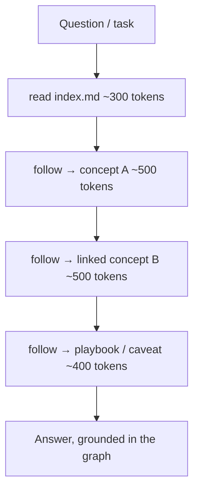
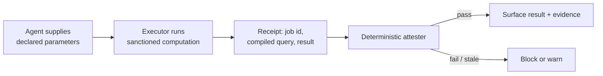
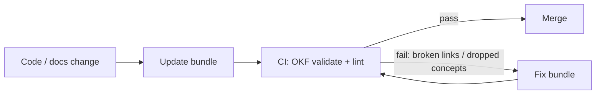

# 03 — Knowledge Artifacts & OKF

*Giving every LLM the same, correct, well-structured context — through artifacts an agent can actually read.*

**Concerns covered:** #3 (correct context artifacts and shared structures understood by all LLMs; the OKF example).
**Related:** [01 Context Engineering](01-context-engineering-and-transparency.md), [05 Agent QA](05-agent-qa-and-regression-framework.md), [08 AI-DLC](08-ai-dlc-process-and-integration.md).

---

## 1. The problem you pointed at

You noted, correctly, that an LLM (including me) can't reason about something like **OKF** until it's shown the right artifact. Knowledge across CES is real but **unusable by machines** when it's trapped in Confluence, Notion, 3,000-line READMEs, Teams threads, and people's heads. An agent then either **drowns in irrelevant context** or **hallucinates the gap**.

The fix is not another platform — it's a **format and a discipline**: small, linked, versioned artifacts an agent can traverse, a human can read, and git can review.

---

## 2. What OKF is (and why it fits)

**OKF — Open Knowledge Format** — is an open, vendor-neutral spec hosted by Google Cloud that represents knowledge as a directory of small Markdown files. CES targets **OKF v0.2** and records that version in each bundle:

- **One file = one concept** (a table, endpoint, metric, runbook, decision, service…), each with a tiny YAML frontmatter header.
- **Links are the graph** — concepts reference each other with ordinary Markdown links; relationships are explicit.
- **Progressive disclosure** — an agent starts at `index.md` and follows only the relevant links; it reads ~3 small files, not 3,000 lines.
- **Frontmatter = query and trust layer** — filter by `type` / `tags`, trace sources, distinguish generated from verified content, and detect staleness without opening bodies.
- **Git-native, zero lock-in** — diff, review, branch, PR; it's just UTF-8 Markdown.

Reference implementation reviewed for this program: [okf-knowledge (README)](https://github.com/sniperunder123/okf-knowledge/blob/main/README.md) and the official [OKF v0.2 spec](https://github.com/GoogleCloudPlatform/knowledge-catalog/blob/main/okf/SPEC.md). Pin both the spec and validator version in CI; the format evolves independently of this framework.

> Real-world effect **cited by the tool's authors** (their measurement, not ours — to be re-measured on a CES pilot before we quote it internally): a 2,762-line doc (~40k tokens) became 83 linked concepts; a typical question now touches ~3 small files (~1.5k tokens). If it holds for us, that means **less context, lower cost, fewer hallucinations** — directly serving [01](01-context-engineering-and-transparency.md) and our cost goals. Our own figure comes from the pilot in §9 and is recorded per [11](11-measurement-baselines-and-roi.md).

### Why this matters for "understood by all LLMs"
OKF is **model-agnostic Markdown**. Claude, Gemini, GPT, and a self-hosted Gemma can consume the same source artifact, so knowledge is not trapped in per-model silos. That does **not** mean every model retrieves or interprets it identically; qualify each supported agent/model combination with grounding, citation, and source-ablation tests ([05 §3.3](05-agent-qa-and-regression-framework.md)). Portability is a testable contract, not an assumption.

---

## 3. How an agent uses a bundle



Contrast with dumping a monolith into context on every question. Progressive disclosure is the mechanism that makes "enough context, not too much" ([01 §3](01-context-engineering-and-transparency.md)) practical.

---

## 4. Bundle anatomy (reference)

```
example-bundle/
├── index.md                      # CES-required map; root declares okf_version: "0.2"
├── log.md                        # chronological change history
├── datasets/       sales.md      # type: Dataset
├── tables/         orders.md     # type: Table
├── metrics/        gross-revenue.md   # type: Metric
├── services/       payments.md   # type: Service
├── playbooks/      reconciliation.md  # type: Playbook
└── references/     policy.md     # type: Reference
```

**Bundle-root `index.md`** (the only index allowed to carry frontmatter):
```yaml
---
okf_version: "0.2"
---
# Payments knowledge bundle
```

**Concept frontmatter** (`type` is the only field required by OKF itself; the trust fields below are required by the CES profile):
```yaml
---
type: Service                 # required
title: Payments API
description: One sentence — the quick-query summary.
resource: https://…          # optional URI to the underlying asset
tags: [payments, pci]
status: stable                # draft | stable | deprecated
generated: { by: human:<id>, at: 2026-09-02T00:00:00Z }
verified: { by: human:<id>, at: 2026-09-02T00:00:00Z }
stale_after: 2026-12-01T00:00:00Z
sources:
    - id: payments-openapi
        resource: ../openapi/payments.yaml
        title: Payments API contract
---
```

`generated` says who or what wrote the current content; `verified` says who or what checked it against its source. They are deliberately separate. A generated concept is not human-reviewed merely because a human merged the file. `timestamp` is a v0.1 legacy field and is not used for new CES concepts.

Reserved filenames at every level: `index.md` (navigation) and `log.md` (change history).

---

## 5. CES artifact taxonomy (what we must capture)

`type` is free-form; standardize a CES starter vocabulary so bundles are consistent across teams:

| Category | Concept `type` values |
| --- | --- |
| **Data** | Table, Dataset, Collection, Metric, Dashboard |
| **Services / code** | Service, Module, API Endpoint, Library, Config |
| **Ops** | Runbook, Playbook, Incident, SLA, Alert |
| **Org / context (the tribal knowledge)** | Decision (ADR), Policy, Glossary Term, Reference, Overview |
| **AI program** | Agent Spec, Prompt, Guardrail, Golden Baseline, Model Card |

The last row is CES-specific: we treat **agent specs, prompts, guardrails, and golden baselines as first-class knowledge artifacts** so they're versioned and discoverable ([05](05-agent-qa-and-regression-framework.md), [06](06-collaboration-and-shared-prompt-hub.md), [09](09-guardrails-and-grounding.md)).

### 5.1 Deterministic attestation for critical computations

OKF v0.2 defines an `Attested Computation` for claims such as financial, operational, or quality metrics where "the agent cited a source" is not enough. The sanctioned computation is fixed; the agent may supply only declared typed parameters; execution returns a receipt; deterministic code, not another LLM, attests that the approved computation produced the displayed result.



Use this for consequential numbers and policy-defined calculations, not ordinary prose. Keep the executor and attester outside model control, sandbox them, and test their own supply chain. Attestation proves **how one result was computed**; `verified` separately proves the definition still matches policy.

---

## 6. When to use OKF — and when not

**Great fit**
- Large, sprawling systems whose knowledge lives in one giant doc (or nowhere).
- AI-heavy development where agents must understand the system cheaply.
- Cross-cutting relationships: a metric → its table → its endpoint → its runbook.
- Knowledge you want versioned, reviewed, and portable across models/tools.

**Probably overkill**
- A tiny project a strong model reads in one shot.
- A pure code question where the code itself is the source of truth (OKF shines for the *why* and the cross-cutting, not for restating a function).
- Knowledge nobody will maintain — **a stale bundle is worse than none**. Pair it with an update step + a CI validate gate.

> Be honest: OKF is leverage when knowledge is big, linked, and agent-consumed; it's ceremony when it isn't.

### 6.1 The capacity gate (pass this before adopting a bundle)

The document already concedes that **a stale bundle is worse than none** — it is confidently wrong, machine-readable, and trusted. That admission has a consequence we must act on: *the binding constraint on this programme is maintenance capacity, not authoring effort.* Generating a bundle takes an afternoon. Keeping it true takes forever.

So no bundle is adopted until its owning team can answer **yes to all five**:

```markdown
- [ ] A **named person** owns this bundle (not a team alias)
- [ ] The **update step is in the team's definition of done** ([08](08-ai-dlc-process-and-integration.md)), not a good intention
- [ ] The **CI validate gate is wired** and blocking, before the first concept is written
- [ ] The team can absorb the ongoing cost — realistically **~1-2 hours/week**, and they have said so out loud
- [ ] Someone will notice if it rots: a **monthly health check is on a named calendar**
```

**If any answer is no, do not create the bundle.** Point the agent at the code and let it read that instead. A repo with no bundle is a known unknown; a repo with a stale bundle is an unknown wrong — and agents will cite it with total confidence.

**Staleness is measured, not assumed.** Set `stale_after` from the concept's volatility and track the gap between `generated.at`, its sources' `last_modified`, and the repo's last significant change. When any freshness rule fails, the concept is automatically flagged **Suspect**, and agents treat it as unverified context until refreshed. Better a bundle that admits it may be stale than one that quietly lies.

### 6.2 Verifying that agents actually use the bundle

We are about to spend real effort on artifacts on the assumption that agents read them. **Verify it rather than believing it** — via grounding canaries in a QA overlay of the bundle ([05 §3.3](05-agent-qa-and-regression-framework.md)). The resulting **grounding rate** is the metric that tells us whether this investment is paying for itself, and it is the first thing to measure on the pilot bundles (§9).

> Canaries live **only** in QA overlay copies, never in production bundles. See the safety rules in [05 §3.3](05-agent-qa-and-regression-framework.md).

---

## 7. Keeping artifacts correct (the hard part)

An artifact program dies from **staleness**. Enforce these:

1. **Dogfood location** — the bundle lives *in the repo it describes* (`/okf` or `/knowledge`), versioned with the code.
2. **Update-on-change** — team norm / instruction: "after any change to code or docs, update the bundle."
3. **CI validation gate** — run the OKF validator in CI:
   - conformance (hard): parseable YAML frontmatter, non-empty `type`, reserved-file structure.
    - CES profile (hard): root `okf_version: "0.2"`; valid `generated`, `verified`, `status`, `stale_after`, and `sources`; no stale stable concepts.
    - producer lints: missing `title`/`description`, broken intra-bundle links, orphan concepts.
4. **Anti-regression check** — flag when an update silently drops concepts or breaks previously-clean links.
5. **Ownership** — every bundle has an owner; monthly health check (see [README cadence](README.md)).



### Validator quick reference
The commands below are illustrative for the reviewed reference implementation. Verify and pin a validator that supports the CES v0.2 profile before making it a gate.
```bash
# conformance only (CI gate)
python okf/scripts/validate.py <bundle>
# + producer lint warnings (quality)
python okf/scripts/validate.py <bundle> --strict
```

---

## 8. OKF vs. RAG / wikis

OKF **doesn't replace RAG — it feeds it.** A curated OKF bundle is a clean, structured, inspectable, versioned corpus to embed. Keep OKF as the source of truth; let retrieval sit on top for scale.

| | Wiki/Notion | Vector RAG only | Monolithic doc | **OKF** |
| --- | --- | --- | --- | --- |
| Agent-readable | via API/scrape | lossy chunks | all-or-nothing | native MD + links |
| Keeps relationships | human links | chunks lose them | implicit | explicit graph |
| Progressive disclosure | ❌ | top-k only | ❌ | index → links |
| Git diff / review / PR | ❌ | ❌ | ✅ | ✅ |
| Vendor lock-in | high | medium | none | none (spec) |

---

## 9. Adoption plan for CES

1. **Pick 2–3 pilot systems** that are big, sprawling, and AI-heavy (best ROI).
2. **Generate an initial bundle** from code + existing docs; have a human curate the *why*.
3. **Wire the CI validate gate** so bundles can't rot silently.
4. **Point agents at the bundle** via instruction files ([01](01-context-engineering-and-transparency.md)).
5. **Measure** token/hallucination reduction vs. the old monolith.
6. **Templatize** and roll out to more systems via AI Champions ([06](06-collaboration-and-shared-prompt-hub.md)).

---

## 10. Metrics

- Bundle coverage: % of priority systems with a maintained bundle
- Staleness: median age since last `update`; % bundles failing CI; **% flagged Suspect** (§6.1)
- Token reduction per question vs. pre-OKF baseline (our own measurement, per [11](11-measurement-baselines-and-roi.md))
- **Grounding rate** — % of canary questions answered from the bundle ([05 §3.3](05-agent-qa-and-regression-framework.md)); the proof the artifacts are actually used
- Cross-model grounding/citation pass rate for every supported consumer (the portability contract)
- Attestation pass/fail/stale rate for consequential computed claims (§5.1)
- Hallucination/rework reduction on bundle-backed tasks
- Orphan-concept and broken-link counts (trend to zero)

---

## 11. Open questions to refine

- Standard bundle location and naming across CES repos?
- Which systems are the first pilots?
- Do we adopt OKF as-is, or extend the spec with CES-required `type`s and lints?
- Which validator implementation supports the CES OKF v0.2 profile, and how is its version pinned?
- How do we represent **agent specs, prompts, and golden baselines** as OKF concepts consistently? (The agent registry in [10 §3.1](10-agent-inventory-and-registry.md) is the first concrete case — settle the pattern there.)
- What is the staleness threshold at which a bundle is auto-flagged Suspect (§6.1)?
