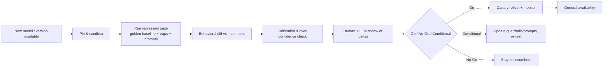

# 04 — Model & Version Drift Management

*A process to detect behavioral drift when an LLM version changes — before we adopt it.*

**Concerns covered:** #4 (check for drift on version change prior to adoption; e.g., an over-confident new model that could mislead junior programmers).
**Related:** [05 Agent QA & Regression](05-agent-qa-and-regression-framework.md), [02 Model Selection](02-model-selection-and-fit.md), [09 Guardrails & Grounding](09-guardrails-and-grounding.md).

---

## 1. The risk

New model versions are not strict upgrades. A newer model can be **more capable on average yet worse for us** — different defaults, changed tool-use behavior, more verbosity, or, as you observed, **over-confidence**: plausible-but-impractical recommendations delivered with high certainty. That is especially dangerous for **junior engineers** who can't yet tell confident-and-right from confident-and-wrong.

**Drift** = a change in model behavior across versions that alters output quality, safety, cost, or trustworthiness for our tasks.

> Treat every model/version change like a **dependency upgrade in production code**: pin it, test it against a suite, review the diff, then roll it out gradually.

---

## 2. Types of drift to watch

| Drift type | What it looks like | Who it hurts |
| --- | --- | --- |
| **Capability drift** | Better/worse at reasoning, coding, domain tasks | Everyone |
| **Confidence/calibration drift** | Same confidence, lower correctness; fewer hedges/questions | Juniors most |
| **Verbosity/format drift** | Longer answers, changed structure, more tokens | Cost, parsing |
| **Tool-use drift** | Different tool-calling patterns, more/fewer calls | Agents, cost |
| **Safety/guardrail drift** | Refuses differently; bypasses prior guardrails | Compliance |
| **Instruction-following drift** | Honors/ignores system prompts differently | All agents |
| **Cost drift** | Same task now costs more/less | FinOps |

The one you flagged — **calibration drift toward over-confidence** — gets special handling in §5.

---

## 3. The drift-gate process

No new model or version reaches general CES use until it clears this gate.



### Stage detail
1. **Pin & sandbox** — never auto-adopt "latest." Pin explicit versions; test in isolation.
2. **Regression suite** — run the same fixed test sets used in [05](05-agent-qa-and-regression-framework.md): golden-baseline changes, trap-finding repos, and the curated prompt/agent regression set.
3. **Behavioral diff** — compare new vs. incumbent on identical paired inputs/runs using the immutable evaluation manifest ([05 §6.2](05-agent-qa-and-regression-framework.md)). Report uncertainty around deltas; don't just eyeball point scores.
4. **Calibration check** — see §5.
5. **Human + LLM review** — a person reviews the notable deltas; a second model can help summarize differences.
6. **Decision** — Go / No-Go / Conditional (adopt only with updated guardrails/prompts).
7. **Canary rollout** — enable for a small group, monitor, then GA.

---

## 4. Behavioral diff harness

Keep a **frozen input set** so results are comparable across versions:

- **Versioned prompts/tasks** — an open regression corpus plus sealed holdouts; changes are reviewed and results remain tied to the corpus version.
- **Deterministic settings** — pin temperature/seed where supported; note where non-determinism remains.
- **Scored outputs** — automated scoring (tests/contracts/invariants, guardrail compliance) plus qualified, audited judges for qualitative deltas ([05 §2](05-agent-qa-and-regression-framework.md)). Similarity is diagnostic unless the output is canonical.
- **Side-by-side report** — per task: incumbent vs. candidate, score delta, and flagged regressions.
- **Decision rule fixed before the run** — safety invariants plus the practical non-inferiority margin and paired confidence-bound method in [11 §6](11-measurement-baselines-and-roi.md).

Store results in the model register ([02 §6](02-model-selection-and-fit.md)) as `Last drift check`.

---

## 5. The over-confidence / calibration check (your specific concern)

This deserves a dedicated test because it uniquely endangers junior engineers.

**What we measure:**
- **Accuracy vs. confidence/abstention** — on tasks with known answers (including *impossible* or *trap* tasks), does the model decline or seek evidence when it should? If numeric confidence is elicited, use a proper calibration score; verbal hedging alone is not a probability.
- **Question quality, not raw count** — does it ask the specific clarifying question needed on ambiguous work? A high question rate can be generated mechanically and is not evidence of calibration (ties to [01 §4.2](01-context-engineering-and-transparency.md)).
- **Ablation abstention rate** — on domain-validated fixtures where a required fact is deliberately removed, does the model ask for it or invent it? ([05 §3.2](05-agent-qa-and-regression-framework.md)). A safety-case fabrication is a hard failure; an aggregate regression is a No-Go when it breaches the pre-set floor/margin under the paired uncertainty rule ([11 §6](11-measurement-baselines-and-roi.md)).
- **Impractical-recommendation rate** — human/LLM review of whether "confident" recommendations are actually practical in our environment.
- **Trap susceptibility** — does it confidently "fix" planted traps incorrectly? (See [05 §3](05-agent-qa-and-regression-framework.md).)

**Include deliberately unanswerable / trick tasks.** A well-calibrated model should say "I can't determine this" or ask a question. A model that confidently fabricates an answer to an impossible task **fails the calibration gate**.

**Mitigations if a model is over-confident but otherwise strong:**
- Add guardrail instructions forcing assumptions + clarifying questions + uncertainty flags ([09](09-guardrails-and-grounding.md)).
- Require plan-first with explicit risk/assumption sections ([01 §4.3](01-context-engineering-and-transparency.md)).
- Route junior engineers' use through stronger review, or restrict the model to reviewed workflows.
- Publish a **model caution note** (see §7) so teams know the failure mode.

---

## 6. Rollout & monitoring after adoption

- **Canary group** first; pre-register quality, cost, action-policy, and incident stop conditions plus the exposure cap before rollout.
- **Keep the incumbent available** for fast rollback — the model pin-back is a kill-switch level in its own right ([12 §5](12-ai-incident-response-and-observability.md)).
- **Continuous regression** — the suite runs on a schedule, not just at upgrade, to catch silent server-side model updates.
- **Daily canary probes** — a ~20-prompt fingerprint set detects a hosted model changing beneath us *between* scheduled regressions, for a few cents a day ([12 §3](12-ai-incident-response-and-observability.md)). This is the answer to "how do we detect a silent swap?"
- **Shadow replay** — replay sanitised real sessions against the candidate to test drift on the *real* task distribution, not just our curated fixtures ([05 §6.1](05-agent-qa-and-regression-framework.md)).
- **Feedback channel** — teams report "the model changed" observations to the AI hub ([06](06-collaboration-and-shared-prompt-hub.md)); investigate for undocumented drift.

> **Re-qualify the judge, too.** When the model under test changes, so may the model doing the judging. An unqualified judge silently corrupts every score in the gate it is guarding ([05 §2.1](05-agent-qa-and-regression-framework.md)).

---

## 7. Artifacts

### 7.1 Model caution note (template)
```markdown
# Model Caution Note — <model + version>
- Date evaluated: <date>
- Overall: <Go / Conditional / No-Go>
- Known failure modes: <e.g., over-confident on infra recommendations>
- Calibration: <accuracy vs confidence summary; question rate>
- Required guardrails for use: <link to 09 guardrails>
- Restrictions: <e.g., not for unsupervised junior use>
- Regression suite score vs incumbent: <delta>
```

### 7.2 Drift review record (template)
```markdown
# Drift Review — <incumbent> → <candidate>
- Regression score delta: <…>
- Notable regressions: <list>
- Notable improvements: <list>
- Calibration/over-confidence result: <pass/fail + notes>
- Cost delta per unit of work: <…>
- Decision: <Go / Conditional / No-Go> — <rationale>
- Canary plan: <group, duration, metrics>
```

---

## 8. Anti-patterns

| Anti-pattern | Fix |
| --- | --- |
| Auto-using "latest" model | Pin versions; gate every change |
| Trusting vendor benchmarks as our result | Run *our* regression suite |
| Only testing happy paths | Include traps + unanswerable tasks (§5) |
| Assuming server-side model is stable | Scheduled continuous regression |
| Big-bang rollout | Canary + rollback path |

---

## 9. Metrics

- Regression score delta per version (trend)
- Calibration score / over-confidence rate per model
- Required-information detection rate on ambiguous tasks (specific needed question, not raw count)
- Mean time from new version → Go/No-Go decision
- Incidents attributed to undetected drift (target: zero)

---

## 10. Open questions to refine

- What is the frozen regression corpus, and who governs changes to it?
- What score deltas trigger No-Go vs. Conditional? (Derive from measured variance — the worked example is in [11 §6](11-measurement-baselines-and-roi.md).)
- What's the canary size and duration standard?
- Who has authority to declare No-Go when a business team wants the new model now?
