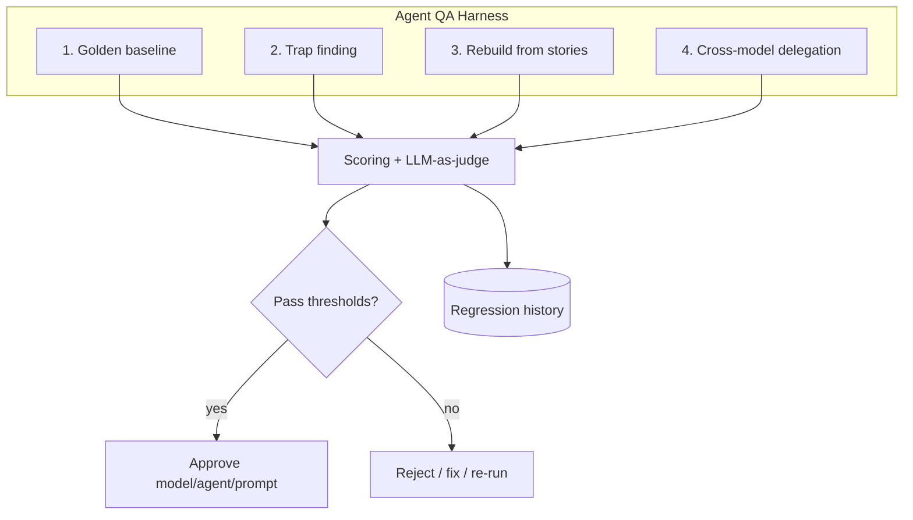
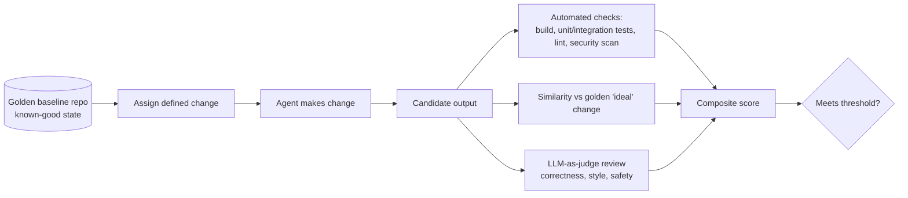
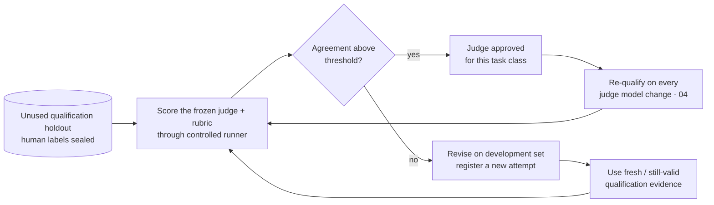
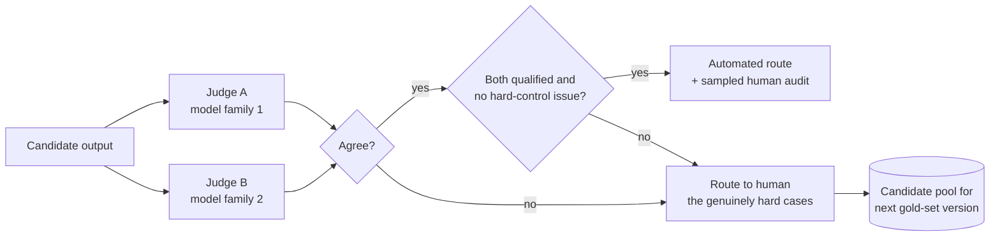
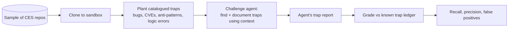
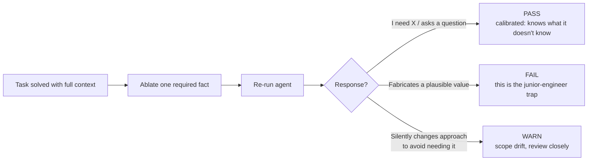
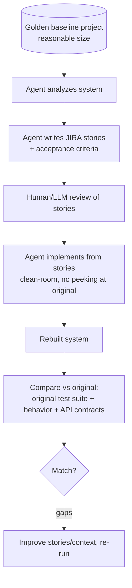
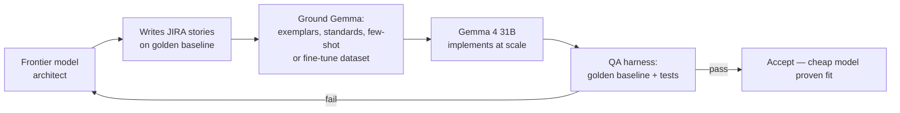

# 05 — Agent QA & Regression Framework

*Treat prompts and agents like production software: golden baselines, regression suites, adversarial traps, and rebuild challenges.*

**Concerns covered:** part of #5 (regression tests for prompts/agents), #7 (golden-baseline testing), #8 (planted-trap challenge across CES repos), #9 (agent writes JIRA stories then rebuilds the baseline), #10 (frontier model grounds/trains Gemma to write stories + implement).
**Related:** [09 Guardrails & Grounding](09-guardrails-and-grounding.md), [04 Drift Management](04-model-drift-management.md), [02 Model Selection](02-model-selection-and-fit.md), [03 OKF](03-knowledge-artifacts-and-okf.md).

---

## 1. Principle

Just as software has QA, **AI has AI-QA.** Prompts and agents are artifacts that can regress silently — when a model changes ([04](04-model-drift-management.md)), when a prompt is edited, or when context artifacts drift ([03](03-knowledge-artifacts-and-okf.md)). We need **repeatable, scored, automated** tests that gate adoption and run continuously.

This document defines four complementary QA techniques, all feeding one harness:

1. **Golden-baseline regression** (concern #7) — plus human-anchored judging ([§2.1](#21-human-anchored-gold-sets--fixing-the-circularity))
2. **Adversarial trap-finding** (concern #8) — plus **ablation traps** ([§3.2](#32-ablation-traps--testing-what-an-agent-does-when-it-doesnt-know)) and **grounding canaries** ([§3.3](#33-grounding-canaries--proving-the-agent-actually-read-the-artifact))
3. **Rebuild-from-stories challenge** (concern #9)
4. **Cross-model delegation validation** (concern #10)

How much of this any given agent owes is set by its **risk tier** ([§7.1](#71-scope-qa-to-risk-not-to-enthusiasm), [10 §5](10-agent-inventory-and-registry.md)) — the machinery is aimed at the high-blast-radius minority, not at everything.



---

## 2. Technique 1 — Golden-baseline regression (concern #7)

### Idea
Maintain **known-good reference repositories** ("golden baselines"). Task agents with defined changes, then **judge their output against the golden baseline** and check for drift via full regression testing plus LLM review.

### How it works


### What we score
- **Functional correctness** — does it build; do the baseline's tests still pass; do new tests pass?
- **Behavioral equivalence** — output/behavior matches the golden expected result.
- **Non-regression** — nothing previously passing now fails (drift detection).
- **Quality** — style, conventions, security (LLM-as-judge + static analysis).
- **Diff discipline** — no unrelated/scope-creep changes.

Code or text similarity to an "ideal" output is **diagnostic, not a default gate**. There are usually many correct implementations. Gate on observable behavior, contracts, invariants, and scoped changes; use exact/similarity scoring only where the output is genuinely canonical.

### Guardrails on the judge
LLM-as-judge is powerful but can be biased or over-confident ([04 §5](04-model-drift-management.md)). Mitigate:
- Use a **different model** to judge than the one under test.
- Give the judge the **golden reference + explicit rubric**, not just "is this good?"
- Spot-check judge verdicts with humans; track judge–human agreement.

### 2.1 Human-anchored gold sets — fixing the circularity

The honest problem with everything above: **we are using LLMs to judge LLMs, while simultaneously warning that LLMs drift and are over-confident.** A judge and a candidate from the same era share blind spots. If the judge quietly gets worse, every score in this framework quietly gets worse with it, and nothing tells us.

The only non-circular ground truth is human judgement. We don't need much of it — we need it in the right place.

**The gold set:**
- Size each critical task-class set for the required coverage and uncertainty, not a ceremonial number. **50–100 items is a planning range, not a sufficiency rule**; rare safety cases may need deliberate oversampling and common deterministic tasks may need fewer.
- **Labelled independently by two engineers**; disagreements resolved by a third. Record the disagreements — items humans argue about are the most informative items in the set.
- **Partitioned before tuning.** A development/calibration partition is used to write the rubric and choose judge settings. A sealed qualification holdout is inaccessible to prompt/rubric authors and the agent runtime except through the controlled evaluation runner.
- **Labels stay sealed.** Evaluation necessarily presents test inputs and candidate outputs to approved models; human labels, reference verdicts, and the full corpus never enter candidate context, few-shot examples, training, or provider-retained logs. Apply the deployment profile's retention/training terms ([02 §6](02-model-selection-and-fit.md)).
- Required for **R3 agents**; strongly recommended for R2 ([10 §5](10-agent-inventory-and-registry.md)).

Repeated model/rubric selection against the same qualification holdout **consumes it**. Record every attempt, limit peeking, and rotate/replenish the holdout when selection pressure or confidence demands it. Otherwise the judge is being trained on its exam indirectly.

**The judge must qualify before it may judge:**



- Use an agreement statistic that matches the label: **Cohen's κ** for nominal categories, weighted κ for ordered ratings, and an intraclass correlation or error metric for continuous scores. Always report class-wise error as well; one aggregate can hide a catastrophic minority class.
- A judge that cannot reach the agreement threshold is not a judge. Fix the rubric first (usually the real problem), then try a different model.
- **Re-qualify the judge whenever the judge model changes.** An unvalidated judge invalidates every score it has produced since.

> The uncomfortable rule this implies: if the judge fails re-qualification after a model upgrade, the scores it produced in the interim are suspect and the affected gates must be re-run. Build that expectation in now, while it is cheap to accept.

### 2.2 Judge panels & disagreement routing (making human review affordable)

Human review is the bottleneck, so spend it only where it changes the answer.



- Two judges from **different model families**, each independently qualified for this task class — same-family judges correlate and agreement means little.
- Agreement is only an **automation-routing signal**. It never overrides deterministic failures, safety invariants, or required human approval. Before automating a task class, measure the panel's **agreed-but-wrong rate** on the human gold set and keep a random human audit sample in production.
- Disagreement, near-threshold verdicts, novel inputs, and every hard-control case route to a human. R3 consequential decisions retain the human gate required by policy even when judges agree.
- **Judge disagreement rate is itself a monitored signal.** A sudden rise usually means a model changed underneath you ([12 §3](12-ai-incident-response-and-observability.md)), not that the work got harder.
- **Judge agreement is not independence.** A stable disagreement rate can coexist with shared blind spots, which is why the agreed-case audit is non-optional.
- Every human-resolved disagreement is a gold-set **candidate for the next version**. Partition it before tuning; never append labelled production cases directly into the current qualification holdout.

---

## 3. Technique 2 — Adversarial trap-finding (concern #8)

### Idea
Take a **percentage of CES repos**, clone them, **plant deliberate traps** (bugs, vulnerabilities, anti-patterns, subtle logic errors), and challenge agents to **find and document** them — using the provided context/artifacts. This tests whether an agent (and its context) actually *understands* the code, not just pattern-matches.

### How it works


### Trap categories (starter catalog)
| Category | Example trap |
| --- | --- |
| Security | Hard-coded secret, SQL injection, missing authz check, unsafe deserialization |
| Logic | Off-by-one, inverted condition, wrong operator, race condition |
| Data | Wrong units, silent truncation, timezone bug |
| Dependency | Vulnerable/pinned-wrong package, license violation |
| Context | Code contradicting the OKF artifact / design decision |
| Performance | N+1 query, unbounded loop, missing index usage |

### Scoring
- **Recall** — % of planted traps found (the headline metric).
- **Precision** — of reported issues, % that are real traps (penalize noise).
- **False positives** — invented issues (ties to over-confidence, [04 §5](04-model-drift-management.md)).
- **Documentation quality** — did it explain *why* it's a trap, citing the context/artifact it used?

### Why "using the context to find the traps" matters
Some traps are only detectable if the agent consults the **OKF artifact / design intent** ([03](03-knowledge-artifacts-and-okf.md)) — e.g., code that violates a documented decision. These **context-dependent traps** directly test whether our artifact strategy is working.

> Safety note: run trap-finding on **clones in an isolated sandbox** only. Never plant traps in live repos, and clearly label the trap ledger as test-only.

### 3.1 Contamination control — the failure that makes every score a lie

A fixed trap set decays in value the moment it exists, for three compounding reasons:

1. **Prompt overfitting.** Engineers tune prompts until they pass *these* traps. The score rises; real-world detection doesn't.
2. **Training-data leakage.** Anything that reaches a hosted provider may influence future models. A trap set used for two years is partially memorised, not solved.
3. **Human familiarity.** Reviewers stop looking carefully at cases they have seen fifty times.

The result is a slow, invisible drift toward scores that look excellent and mean nothing — the most dangerous failure mode in this entire document, because it is silent and it flatters us.

**Controls:**

| Control | How | Signal it produces |
| --- | --- | --- |
| **Sealed holdout** | Keep ~30% of traps in a set never used for tuning, never discussed in tickets, rotated annually | The number that is actually true |
| **Open/holdout gap** | Score both; compare | **A large gap = we are overfitting, not improving** |
| **Salting** | Rename identifiers, change values, relocate the trap between runs | Defeats memorisation of surface form |
| **Generated variants** | Programmatically produce N variants of each trap pattern | Tests the *pattern*, not the instance |
| **Quarterly refresh** | Retire the most-passed 20% of traps; replace from real incidents ([12 §7](12-ai-incident-response-and-observability.md)) | Keeps the set adversarial |
| **Access control** | Trap ledger in a restricted repo; not in any context an agent can read | Prevents accidental self-leak |

> **The headline diagnostic is the open/holdout gap.** If the open set scores 0.90 and the sealed holdout scores 0.62, the programme has been optimising for the test. That single comparison is worth more than any absolute score we report.

### 3.2 Ablation traps — testing what an agent does when it *doesn't* know

Every technique so far tests whether an agent finds the right answer when the answer is findable. **Nothing tests the more dangerous case: what it does when the answer is genuinely not available.** That is precisely the situation that produces confident fabrication and misleads junior engineers ([04 §5](04-model-drift-management.md)).

**Method — remove and observe:**

1. Take a task the agent solves correctly with full context.
2. **Delete exactly one required fact** from the context — an interface definition, a config value, a business rule.
3. Re-run.



**Score: abstention rate under ablation** — the percentage of ablated tasks where the agent asked, flagged, or declined rather than invented. Execution can be scored mechanically once the fixture is validated, but a domain expert must first confirm that the removed fact is truly necessary and that no alternative valid solution exists. Otherwise creative problem-solving is mislabelled as fabrication.

The third outcome deserves attention: an agent that quietly restructures the solution to avoid the missing information is *hiding* the gap rather than surfacing it. It looks like success and is arguably worse than fabrication, because nothing signals that a decision was made.

### 3.3 Grounding canaries — proving the agent actually read the artifact

We invest heavily in OKF bundles ([03](03-knowledge-artifacts-and-okf.md)) on the assumption that agents use them. **We have never verified that assumption.** An agent can produce a correct-looking answer entirely from training memory while ignoring the bundle completely — and every conventional test scores that as a pass.

**Method:** place a **canary** in a QA copy of the bundle — a unique, harmless, unguessable fact that exists nowhere else in the world:

```yaml
# in the QA overlay of okf://payments  —  NEVER in the production bundle
retry_policy:
  shadow_backoff_ceiling_ms: 4173   # canary value: unguessable, meaningless, unique
```

Then ask a question whose correct answer requires it.

| Answer | Verdict |
| --- | --- |
| `4173` | The agent genuinely read the artifact — grounding confirmed |
| A plausible round number (5000, 3000) | It guessed from training priors and presented it as fact |
| "Not specified" | Honest, but the retrieval or the linking is broken — fix the bundle |

**Score: grounding rate** — % of canary questions answered with the canary value. This proves that a specific synthetic fact reached the answer; it does **not** prove that all cited material was used correctly. Triangulate it with retrieval/tool logs, citation resolution, and source-ablation tests. Together these convert "we believe our artifacts are being used" into evidence.

> **Safety rules, non-negotiable:** canaries live **only** in clearly-labelled QA overlay bundles, never in production knowledge. Canary values must be obviously synthetic and operationally inert — never a plausible credential, endpoint, or threshold that could be acted on. Deliberately seeding false information into real knowledge bases is self-inflicted data poisoning; the control and the anti-pattern are separated only by discipline about where the canary lives.

---

## 4. Technique 3 — Rebuild-from-stories challenge (concern #9)

### Idea
Have an agent **write JIRA stories** that describe a reasonable-size golden-baseline project, then have agents **actually rebuild** the project from those stories and **test that the rebuild matches the original**. This validates the full loop: comprehension → specification → implementation → verification.

### How it works


### What this tests
- **Comprehension** — can the agent extract the real requirements from a system?
- **Specification quality** — are the stories complete, unambiguous, testable? (Missing requirements surface as rebuild gaps.)
- **Implementation fidelity** — does the rebuilt system pass the *original's* test suite and match its contracts?
- **Context sufficiency loop** — gaps reveal what context/artifacts were missing ([01](01-context-engineering-and-transparency.md), [03](03-knowledge-artifacts-and-okf.md)).

### Story quality rubric (starter)
- Independent, testable acceptance criteria (Given/When/Then).
- Explicit non-functional requirements (perf, security, data).
- References to the relevant OKF concepts.
- No hidden assumptions; open questions flagged.

### Scoring
- **Requirement coverage** — % of original behavior captured in stories.
- **Rebuild parity** — % of original tests passing on the rebuild; API/contract match.
- **Effort/cost** — tokens and iterations to reach parity (efficiency signal).

---

## 5. Technique 4 — Cross-model delegation validation (concern #10)

### Idea
Use a **strong (frontier) model to ground or train Gemma 4 31B** to (a) write the JIRA stories on the golden baseline and (b) implement the solution — proving we can **use the right model for the right job**: expensive reasoning where it counts, cheap/local execution at scale.

### Two paths to "grounding or training" Gemma
| Path | What it is | When to use |
| --- | --- | --- |
| **Grounding (context)** | Frontier model produces high-quality stories, examples, standards, and few-shot exemplars that are fed to Gemma **in-context** | Fast, cheap, reversible; start here. See context-vs-training ([01 §2](01-context-engineering-and-transparency.md)) |
| **Fine-tuning (weights)** | Curate a dataset (frontier-generated stories + gold implementations) and **fine-tune** Gemma | Only if in-context grounding is insufficient at volume; governed, evaluated |

> Start with **grounding**, not training. Fine-tuning is a heavier, governed effort and should be justified by evidence that grounding alone can't hit quality/cost targets.

### The delegation loop


### What we prove
- **Fit-for-purpose** — Gemma is good enough for story-writing/implementation *for these task classes*, backed by QA scores ([02](02-model-selection-and-fit.md)).
- **Economics** — cost per unit of work drops vs. frontier-only, with quality held (link to cost goals in [../AIAcrossCESMaximizingItsPotential.md §6](../AIAcrossCESMaximizingItsPotential.md)).
- **Data residency** — self-hosted Gemma keeps confidential work in-house ([02 §3](02-model-selection-and-fit.md)).

### Scoring
- Gemma's golden-baseline & rebuild scores vs. frontier's (quality gap).
- Cost/latency delta.
- Minimum grounding needed to close the quality gap (drives grounding-vs-fine-tune decision).

---

## 6. The unified harness

All four techniques share one harness so results are comparable and continuous.

| Component | Responsibility |
| --- | --- |
| **Fixtures** | Golden baselines, trap ledgers, rebuild targets — versioned, isolated clones |
| **Runner** | Executes tasks against a pinned model/agent/prompt |
| **Scorers** | Automated (build/tests/lint/security/similarity) + LLM-as-judge (different model) |
| **Report** | Per-run scores, deltas vs. history, flagged regressions |
| **Store** | Regression history feeding drift review ([04](04-model-drift-management.md)) and model register ([02](02-model-selection-and-fit.md)) |

### When the harness runs
- **On prompt/agent change** — regression gate before merge.
- **On model/version change** — the drift gate ([04](04-model-drift-management.md)).
- **On schedule** — catch silent server-side model changes and artifact drift.
- **On new golden baseline / trap set** — expand coverage.

### 6.1 Four cheap cross-checks the harness should run anyway

Once fixtures and a runner exist, these cost almost nothing extra and each catches a class of failure the four main techniques miss.

| Check | Method | Catches |
| --- | --- | --- |
| **Variance / flakiness** | Run every case **3×**; report score spread, not just the mean | Prompts that pass by luck. A case with high spread is a **flaky test** — treat it exactly as you would in CI: fix or quarantine it, never average it away |
| **Differential (N-version)** | Same task to two models; semantically diff the outputs | High-risk answers where no golden reference exists. **Divergence is the routing signal**, not an error — send those to a human ([§2.2](#22-judge-panels--disagreement-routing-making-human-review-affordable)) |
| **Budget assertions** | Assert token *and* iteration ceilings per case; fail the run on breach | Cost regressions and runaway loops — caught in QA rather than on the invoice ([11 §7](11-measurement-baselines-and-roi.md)) |
| **Shadow replay** | Replay sanitised **real** past sessions against a candidate model; diff against what actually shipped | Drift on the *real* task distribution rather than our curated one — the closest thing to a production trial with zero production risk |

**Shadow replay is the highest-value item here** and the one most often skipped. Curated fixtures reflect the tasks we thought to write down; replayed sessions reflect what people actually ask. When the two disagree, the fixtures are wrong.

> A quality bar with no variance measurement is a coin flip with a rubric. Reporting a single-run score for a stochastic system is the most common measurement error in AI evaluation — including in vendor benchmarks.

### 6.2 Test the release, then isolate the component

An "agent score" is uninterpretable unless the tested configuration can be reproduced. Every run records an immutable **evaluation manifest**:

```yaml
release_id: ces-agent-0042/2026.09.2
model: <provider + exact model/version + decoding settings>
prompt_hash: <system/developer/instruction bundle>
policy_version: <guardrail + action-policy versions>
tools: <schema versions + permission scopes>
retrieval: <strategy + corpus snapshot/index version>
fixtures: <open + sealed-holdout versions>
evaluators: <rubric + judge versions>
execution: <environment image + seeds/repetitions>
```

First test the **whole release** because users experience the whole system. When it regresses, change one component at a time (model, prompt, retrieval, tool contract, policy, or orchestrator) against the same paired cases. This attribution matrix distinguishes "the model got worse" from "retrieval stopped returning the policy" and prevents fixing the wrong layer.

### 6.3 Test actions at the tool boundary

For an agent with tools, prose quality is secondary to whether the runtime permits the correct side effect. Instructions are not authorization; these tests exercise the enforcement point itself ([09 §3.4](09-guardrails-and-grounding.md)).

| Contract test | Pass condition |
| --- | --- |
| **Authorization** | An unregistered tool, resource, or parameter is denied by runtime policy even when the model requests it persuasively |
| **Approval binding** | Approval names the exact actor, action, target, parameters, release, and expiry; any mutation or replay is rejected |
| **Idempotency & retry** | A timeout/retry cannot duplicate a ticket, message, payment, deploy, or destructive action |
| **Partial failure** | Multi-step work stops safely, reports committed steps, and does not claim rollback that did not occur |
| **Concurrency / stale state** | The runtime re-validates preconditions immediately before commit; changed state forces re-plan or re-approval |
| **Untrusted tool output** | A tool result containing instructions cannot expand scope, select a new tool, or alter policy |
| **Rollback / compensation** | The documented recovery path works in the sandbox and leaves an auditable receipt |

These tests run against fakes or isolated sandboxes in CI and against a canary environment before activation. R3 agents cannot pass on an LLM judge's opinion when an action-contract test fails.

---

## 7. Prompt/agent regression testing (concern #5)

Beyond whole-repo challenges, every reusable prompt/agent gets a lightweight test set:

- **Input/expected pairs** — representative tasks with expected properties (not always exact text).
- **Property assertions** — must ask a question when input is ambiguous; must not touch out-of-scope files; must include a plan; must cite sources.
- **Guardrail assertions** — refuses disallowed actions; respects data tier ([09](09-guardrails-and-grounding.md)).
- **Golden outputs where stable** — exact-match for deterministic prompts.

Store these beside the prompt as an artifact ([03 §5](03-knowledge-artifacts-and-okf.md), [06](06-collaboration-and-shared-prompt-hub.md)).

### 7.1 Scope QA to risk, not to enthusiasm

Not every agent earns this machinery. Required coverage is set by the agent's risk tier ([10 §5](10-agent-inventory-and-registry.md)):

| Technique | R0 | R1 | R2 | R3 |
| --- | :---: | :---: | :---: | :---: |
| Prompt property assertions (§7) | — | ✅ | ✅ | ✅ |
| Guardrail assertions ([09 §5](09-guardrails-and-grounding.md)) | — | ✅ | ✅ | ✅ |
| Tool/action contract tests (§6.3) | — | if tool-enabled | ✅ | ✅ |
| Golden baseline (§2) | — | — | ✅ | ✅ |
| Trap-finding (§3) | — | — | ✅ | ✅ |
| Ablation traps (§3.2) | — | — | ✅ | ✅ |
| Grounding canaries (§3.3) | — | — | if artifact-backed | ✅ |
| Human gold set + judge qualification (§2.1) | — | — | recommended | ✅ |
| Shadow replay (§6.1) | — | — | — | ✅ |
| Rebuild-from-stories (§4) | — | — | — | — |

Rebuild-from-stories remains **programme-level capability validation, not a per-agent gate**. A framework that demands everything of everyone gets adopted by no one. **Spend the assurance budget where the blast radius is.**

---

## 8. Governance & rollout

1. **Stand up the harness** with one golden baseline + one trap set.
2. **Add the rebuild challenge** on a reasonable-size project.
3. **Wire the drift gate** so model changes must pass ([04](04-model-drift-management.md)).
4. **Add cross-model delegation** (frontier → Gemma) once baselines are stable.
5. **Sample CES repos** progressively for trap-finding coverage.
6. **Publish scoreboards** to the AI hub ([06](06-collaboration-and-shared-prompt-hub.md)).

---

## 9. Metrics

| Technique | Headline metric | Threshold |
| --- | --- | --- |
| Golden baseline | Composite pass score | Non-inferiority vs. incumbent ([11 §6](11-measurement-baselines-and-roi.md)) |
| Trap-finding | Trap recall (+ precision) | Ratchet on last quarter's median |
| **Open vs. sealed-holdout gap** (§3.1) | Score difference | **< 0.10 — above that, we are overfitting** |
| **Ablation abstention rate** (§3.2) | % of ablated tasks where the agent asked instead of invented | Absolute floor; a drop is a No-Go on model change |
| **Grounding rate** (§3.3) | % of canary questions answered from the artifact | Ratchet upward; proves the OKF investment |
| Rebuild-from-stories | Rebuild parity (% original tests passing) | Baseline first |
| Cross-model delegation | Gemma score vs. frontier + cost delta | Quality within variance at lower cost |
| Prompt regression | % prompts passing property assertions | 100% for R1+ |
| **Judge–human agreement/error** (§2.1) | Label-appropriate agreement plus class-wise error vs. gold set | Outside pre-set tolerance ⇒ judge unusable |
| **Judge disagreement rate** (§2.2) | % routed to humans | Monitored — a spike means something changed |
| **Agreed-but-wrong rate** (§2.2) | % of agreed panel verdicts overturned by gold/audit | Must remain inside a pre-set risk tolerance or automation stops |
| **Score variance** (§6.1) | Spread across 3 runs | High spread ⇒ flaky case, fix or quarantine |
| **Action-contract pass rate** (§6.3) | Runtime boundary assertions | 100% for every required action contract |

All thresholds are derived from measured baselines using the rules in [11 §6](11-measurement-baselines-and-roi.md) — not chosen by intuition.

---

## 10. Open questions to refine

- Which repos and what percentage form the trap-finding sample?
- Who curates and secures the trap ledger (test-only, isolated), and who holds the sealed holdout?
- What is the "reasonable-size" rebuild project?
- Grounding-first policy for Gemma: what evidence justifies moving to fine-tuning?
- How many gold-set items can we realistically label and maintain per quarter? (Capacity, not ambition, should set this.)
- Do we have permission and a sanitisation path to replay real sessions (§6.1)?
- Who is accountable when the open/holdout gap widens — and what happens to the scores we already reported?
- What agreed-but-wrong rate is tolerable for each task/risk class, and how often are agreed verdicts human-audited?
- Which runtime owns the canonical action-policy and approval-receipt format used by §6.3?
