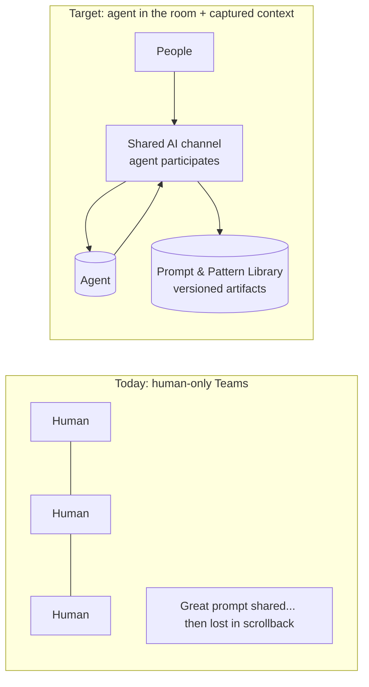
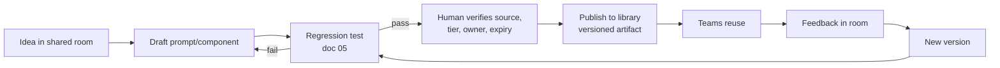
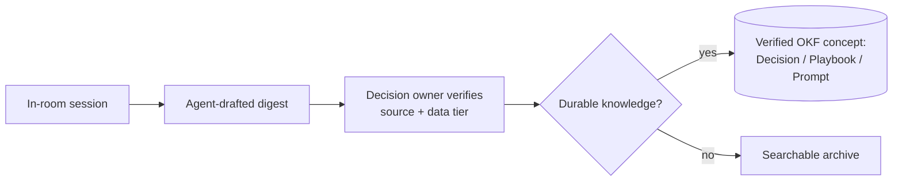

# 06 — Collaboration & Shared Prompt/Context Hub

*Put the agent in the room. Capture ideas, prompts, and the context they generate — don't lose them in human-only chats.*

**Concerns covered:** #6 (centralized chat where the agent is present; share ideas/prompts; save the resulting context).
**Related:** [03 Knowledge Artifacts & OKF](03-knowledge-artifacts-and-okf.md), [05 Agent QA](05-agent-qa-and-regression-framework.md), [09 Guardrails & Grounding](09-guardrails-and-grounding.md).

---

## 1. The problem

Great AI ideas and prompts are being shared in MS Teams — but those rooms have **only humans**. The agent isn't present to react, improve, or be tested, and the **valuable context is lost** in scrollback. We need a **centralized space where the agent is a participant** and where good prompts/patterns become **reusable, versioned artifacts** instead of ephemeral chat.



---

## 2. Two connected capabilities

1. **Agent-in-the-room collaboration** — a shared channel/space where people brainstorm *with* an agent that can respond, critique, and draft.
2. **Prompt & Pattern Library** — a curated, versioned store where the best prompts, instruction components, patterns, and their context become reusable artifacts ([03](03-knowledge-artifacts-and-okf.md)). Runnable agent specs remain canonical in the registry ([10](10-agent-inventory-and-registry.md)).

The first generates raw material; the second preserves and hardens it.

---

## 3. Agent-in-the-room collaboration

### What "good" looks like
- People can pose an idea and get the **agent's input** immediately, in the shared space (not private, siloed chats).
- Useful sessions can be **distilled**: the prompt/configuration, evidence, decisions, owners, and reusable context. Raw capture is minimized and follows the channel's retention policy.
- The agent can be invoked to **critique or improve** a proposed prompt, or run it against the QA harness ([05](05-agent-qa-and-regression-framework.md)).

### Design considerations
| Consideration | Guidance |
| --- | --- |
| **Surface** | A dedicated channel with an integrated agent (e.g., a bot in Teams/Slack, or a shared workspace). Choose one, standardize it. |
| **Data tier** | The channel's data classification gates which model can participate ([02](02-model-selection-and-fit.md)); never expose confidential data to unapproved models. |
| **Attribution** | Clearly label agent messages vs. human messages. |
| **Capture** | Every useful exchange can start a promotion draft; a named human verifies it against the source before publication. |
| **Guardrails** | The in-room agent follows the same guardrails as any agent ([09](09-guardrails-and-grounding.md)); treat pasted external content as untrusted (prompt-injection risk). |
| **Privacy** | Participants know the agent is present and exchanges may be retained. |

### Anti-goal
This is **not** a replacement for focused human discussion or for IDE work. It's a **shared thinking space** where the agent's perspective and the resulting context are preserved.

---

## 4. Prompt & Pattern Library

Turn one-off wins into reusable assets. Treat prompts, instructions, and patterns as **first-class, versioned components** — ideally as OKF concepts ([03 §5](03-knowledge-artifacts-and-okf.md)) linked from the agent releases that use them.

### Library entry schema
```yaml
---
type: Prompt            # or another reusable component type, not Agent Spec
title: GCP migration assessment prompt
description: Assesses a service for GCP readiness and produces a migration plan.
status: stable          # OKF concept lifecycle
generated: { by: human:<id>, at: 2026-09-02T00:00:00Z }
verified: { by: human:<id>, at: 2026-09-02T00:00:00Z }
stale_after: 2026-12-01T00:00:00Z
sources:
  - { id: origin, resource: <source discussion or ticket> }
model: <provider + exact model/version>   # ties to doc 02
data_tier: Internal
tags: [gcp, migration, assessment]
owner: <team/person>
version: 1.3
tested: true            # has a regression set in doc 05
---

## Prompt
<the actual prompt text>

## When to use / not use
## Example input & good output
## Known limitations / cautions
## Regression tests
<link to test set — doc 05 §7>
```

### Lifecycle


### Curation
- **AI Champions** ([README](README.md)) curate submissions and prevent duplication.
- Every published prompt has an **owner**, an immutable **version**, OKF v0.2 provenance/verification/freshness fields ([03](03-knowledge-artifacts-and-okf.md)), and (for anything reusable) a **regression set** ([05 §7](05-agent-qa-and-regression-framework.md)).
- Deprecate stale/underperforming prompts; a bad shared prompt scales harm.

---

## 5. Capturing context (the part usually lost)

The unique value: **save the context**, not just the prompt.

- **Session digests** — after a useful in-room session, the agent may draft a short digest: problem, evidence, options considered, decision, decision owner, open questions, and reusable prompt/snippet.
- **Human verification before promotion** — the decision owner checks the digest against the source; an agent summary is not evidence that the meeting reached that conclusion.
- **Promote to artifacts** — verified digests that contain durable knowledge become OKF concepts (Decision/Playbook/Prompt) with `sources`, `generated`, `verified`, and `stale_after` metadata ([03](03-knowledge-artifacts-and-okf.md)).
- **Link back without leaking** — artifacts reference an access-controlled originating discussion for provenance; the promoted artifact repeats only content permitted at its own data tier.



---

## 6. Governance

- **One sanctioned space** — avoid fragmenting across many bot channels.
- **Data-tier rules** posted in-channel; enforce approved-model participation ([02](02-model-selection-and-fit.md)).
- **Retention & privacy** policy agreed with security/compliance.
- **Data minimization by default** — do not retain raw conversations or hidden model reasoning merely because storage is available; retain the verified digest and source reference when that meets the purpose.
- **Injection awareness** — the in-room agent never executes actions from untrusted pasted content without human confirmation ([09](09-guardrails-and-grounding.md)).

---

## 7. Metrics

- # of prompts/patterns published and reused (reuse is the real signal)
- % of published prompts with regression tests
- # of session digests promoted to durable artifacts
- % of promoted artifacts human-verified, in-date, and traceable to an authorised source (target: 100%)
- Time-to-answer in the shared room vs. old private threads
- Duplicate-prompt rate (should fall as the library matures)

---

## 8. Open questions to refine

- Which platform hosts the in-room agent (Teams bot, Slack, dedicated workspace)?
- What data tier is allowed in the shared room, and which model participates?
- Retention policy for captured sessions?
- Where does the Prompt & Pattern Library physically live (repo/OKF bundle vs. portal)?
