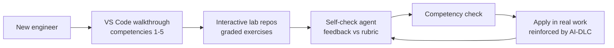

# 07 — Enablement & Interactive Training

*Teach the team, inside their tools, to drive AI well — ask questions, demand plans, understand designs, and never treat the agent as a black box.*

**Concerns covered:** #11 (interactive training within VS Code), #12 (ask questions; require plans with executive summaries + diagrams; understand the design/changes; not a black box).
**Related:** [01 Context Engineering & Transparency](01-context-engineering-and-transparency.md), [05 Agent QA](05-agent-qa-and-regression-framework.md), [08 AI-DLC](08-ai-dlc-process-and-integration.md).
**Platform design:** [Interactive AI Training Design](interactiveAITrainingDesign.md) — the VSIX client + Blazor training server, narration, and observable decision-trace architecture that delivers this curriculum.

---

## 1. Principle

Tools don't create good outcomes — **skilled operators** do. The gap in most orgs is not model access; it's that engineers haven't learned to **interrogate** the AI: to supply context, inspect evidence and actions, demand a plan, and verify. Training must happen **where they work (VS Code)**, be **interactive**, and be **reinforced by process** ([08](08-ai-dlc-process-and-integration.md)).

> Goal: every CES engineer can turn a vague task into a well-contexted, plan-first, verifiable AI collaboration — and knows when *not* to trust the output.

---

## 2. Core competencies (the curriculum)

| # | Competency | Outcome | Anchor doc |
| --- | --- | --- | --- |
| 1 | Context vs. training | Knows pasting docs ≠ training the model | [01 §2](01-context-engineering-and-transparency.md) |
| 2 | Supplying sufficient context (CLEAR) | Scopes tasks; gives constraints, locus, acceptance criteria | [01 §3](01-context-engineering-and-transparency.md) |
| 3 | Inspecting the decision trace | Challenges sources, assumptions, tool actions, and unsupported rationale | [01 §4.1](01-context-engineering-and-transparency.md) |
| 4 | Asking the AI questions | Prompts the agent to ask *back*; probes trade-offs | [01 §4.2](01-context-engineering-and-transparency.md) |
| 5 | Plan-first with exec summary + diagrams | Requires a design + diagram before code | [01 §4.3](01-context-engineering-and-transparency.md) |
| 6 | Choosing the right model | Matches model to task/data | [02](02-model-selection-and-fit.md) |
| 7 | Using artifacts/OKF | Points agents at the knowledge graph | [03](03-knowledge-artifacts-and-okf.md) |
| 8 | Verifying output | Runs QA habits; never blind-trusts | [05](05-agent-qa-and-regression-framework.md), [09](09-guardrails-and-grounding.md) |
| 9 | Spotting over-confidence | Recognizes confident-but-wrong; escalates | [04 §5](04-model-drift-management.md) |
| 10 | Guardrails & data tiers | Keeps sensitive data safe; injection-aware | [09](09-guardrails-and-grounding.md) |
| 11 | **Neutral framing / not leading the model** | Asks for options before revealing a preference; demands a dissent | [01 §4.4](01-context-engineering-and-transparency.md) |
| 12 | **Action authority & intervention** | Distinguishes proposal, approval, and runtime authorization; verifies the exact action; knows when and how to stop/escalate | [09 §3.4](09-guardrails-and-grounding.md), [12](12-ai-incident-response-and-observability.md) |

Competency #12 from your list — **demanding plans with executive summaries and diagrams so leadership and engineers actually understand the design** — is competency #5 above and is treated as a graded skill, not a nicety.

Competency #11 is the newest and the least intuitive: engineers are used to worrying about what the *model* gets wrong, not about how their own framing manufactured the answer. It is the competency most likely to be dismissed and most likely to improve output quality on day one.

### 2.1 Role-based proficiency, not one generic course

| Role | Required practical evidence |
| --- | --- |
| All AI users | Competencies 1–5, 8–11 on tasks matching their work |
| Agent builders / owners | Foundation plus model fit, evaluation manifests, guardrail tests, data handling, and failure analysis |
| R2/R3 operators and reviewers | Builder core plus competency 12: exact-action approval, bounded autonomy, stop/rollback, and incident declaration |
| Champions | Relevant practitioner track plus facilitation, scoring calibration, and accessibility/accommodation practice |

For R2/R3 agents, role-relevant proficiency is an **access prerequisite**, not an annual attendance checkbox ([10 §5](10-agent-inventory-and-registry.md)). Use an objective practical challenge and delayed reassessment; grant equivalent accessible ways to demonstrate the same skill. Record only current authorization/competency status in the agent-access system, not a leaderboard or individual productivity score ([11 §4.1](11-measurement-baselines-and-roi.md)).

---

## 3. Interactive training inside VS Code (concern #11)

Deliver learning in the IDE, not slide decks. Options, from lightest to richest:

| Mechanism | What it does | Effort |
| --- | --- | --- |
| **Walkthrough / Getting Started** | A built-in VS Code walkthrough with steps, checkboxes, and "try it" actions | Low–Med |
| **Interactive lab repos** | Cloneable repos with `TASK.md` exercises + a solution branch to compare | Low |
| **Guided prompt exercises** | Curated prompts in the shared library ([06](06-collaboration-and-shared-prompt-hub.md)) that teach a skill when run | Low |
| **`.instructions.md` scaffolds** | Repos ship with instruction files that model good practice by default | Low |
| **Self-check agent** | An agent mode that reviews the learner's session and coaches ("you didn't ask for a plan") | Med |
| **Custom walkthrough extension** | A CES VS Code extension packaging labs + progress tracking | High |

### Recommended starting shape
1. A **VS Code walkthrough** covering competencies 1–5 (context, decision traces, questions, plan-first).
2. A set of **interactive lab repos** (one per competency) with graded exercises and solution branches.
3. A **self-check agent** that reviews a learner's approach and gives feedback against the rubric (§5).



---

## 4. Lab design pattern

Each lab is a small repo the learner clones and works in VS Code:

```
lab-03-plan-first/
├── TASK.md            # the exercise + what "good" looks like
├── src/               # starting code
├── RUBRIC.md          # how it's graded (self or agent)
└── solution/          # reference approach to compare against
```

**Example — "Plan-first" lab (`TASK.md`):**
> Add feature X. **Before writing any code**, get the agent to produce: an executive summary, a Mermaid design diagram, a change list, risks/assumptions, and a verification plan. Only then implement. Compare your plan to `solution/PLAN.md`.

This mirrors the golden-baseline idea from [05](05-agent-qa-and-regression-framework.md): learners compare their work to a reference.

### 4.1 Five lab mechanics that measure skill instead of completion

Most corporate AI training measures attendance and self-reported confidence. Both are close to worthless. These five mechanics produce **objective** signals — and four are lifted directly from how we test the agents themselves ([05](05-agent-qa-and-regression-framework.md)). What we do to validate models, we should be willing to do to validate ourselves.

| Mechanic | How it works | What it objectively measures |
| --- | --- | --- |
| **Planted-flaw review** | The learner is given an AI-generated plan containing a known, deliberately planted flaw — a security hole, an invented API, a wrong assumption stated confidently. They must find and articulate it. | Evidence-review literacy. This is [05 §3](05-agent-qa-and-regression-framework.md) trap-finding applied to humans, scored the same way: recall and precision. |
| **Executor-model implementability** | A pinned lower-cost model implements the learner's spec in repeated isolated runs. The same model also runs a reference spec as a control; if the control fails, the trial is invalid rather than a learner failure. | Spec usability, scored by acceptance tests while separating model variance/capability from the learner's contribution. The training-side mirror of cross-model delegation ([05 §5](05-agent-qa-and-regression-framework.md)). |
| **Calibration scoring** | For each verdict ("this plan is sound", "this is a flaw") the learner also states a confidence. Score correctness *weighted by confidence*. | Whether the learner knows what they don't know. **We demand calibration from models ([04 §5](04-model-drift-management.md)); it is only fair — and far more useful — to measure it in ourselves.** |
| **Ablation lab** | The learner is handed a task with a critical fact deliberately missing. Passing means noticing and asking; failing means producing a confident answer. | Whether the learner has absorbed the habit we require of agents ([05 §3.2](05-agent-qa-and-regression-framework.md)). |
| **Incident-derived labs** | Build labs from real, sanitised artefacts that actually fooled a competent engineer ([12 §6](12-ai-incident-response-and-observability.md), fault class F5). | Realism. The most effective labs in the curriculum, because the failure is real and the learner knows a colleague missed it too. |

> The executor-model implementability test is a strong objective mechanic, but not a standalone grade. Require the reference-spec control, repeated runs, and the learner's observable process evidence. It teaches that **volume is not clarity** without pretending every executor failure came from the specification.

### 4.2 Grade the process, not just the artefact (the obvious cheat)

There is an unavoidable irony: a learner can ask an AI to complete the lab about not blindly trusting AI. Grade only the deliverable and we will certify precisely the behaviour we are trying to eliminate.

**Countermeasures:**
- **Grade the observable session, not just the output.** The rubric (§5) scores *how* the learner worked — questions, source checks, plan revisions, tool/test results, and intervention decisions. Capture those events, not hidden chain-of-thought; minimize and protect the transcript.
- **Rotate lab variants** so answers can't be passed around; the flaw moves and the values change (the same contamination control we apply to trap sets, [05 §3.1](05-agent-qa-and-regression-framework.md)).
- **Supervised challenge for the final competency check** — live screen-share or an equivalent accessible/asynchronous format where an unexpected constraint appears mid-task. Score the response to the constraint, not presentation confidence or speed.
- **Name the irony in the lab briefing.** Said out loud, it stops being a cheat and becomes the lesson.

### 4.3 Accessibility, privacy, and psychological safety

- Every visual/audio exercise has keyboard-operable, captioned, transcript, and screen-reader-compatible equivalents; time limits are adjustable where speed is not the competency.
- Do not require public screen-sharing, voice input, or disclosure of disability. Offer an equivalent supervised or recorded path.
- Use synthetic or sanitised repositories. Lab transcripts can contain code, mistakes, and personal data; apply the purpose, access, and retention limits in [11 §4.1](11-measurement-baselines-and-roi.md).
- Individual results go to the learner and authorised coach. Managers and leadership receive cohort-level capability and decay signals, with small-group suppression.
- A failed practice attempt is coaching data, not a performance event. Only demonstrated current proficiency controls access to R2/R3 duties.

---

## 5. Grading rubric (self- or agent-assessed)

For a plan-first exercise, the learner's session should demonstrate:

- [ ] Provided sufficient context (CLEAR) before asking for code
- [ ] Required and reviewed a **plan with an executive summary**
- [ ] Plan includes a **design diagram**
- [ ] Elicited **clarifying questions / assumptions** from the agent
- [ ] Inspected the **sources, assumptions, action trace, and verification evidence**; challenged at least one unsupported claim/risk
- [ ] Defined a **verification plan** and ran it
- [ ] Did **not** accept output as a black box

The **self-check agent** scores against this rubric and coaches on gaps.

### 5.1 Proving the training worked (four levels of evidence)

Completion is not learning; learning is not behaviour change; behaviour change is not business outcome. Be explicit about which one we are claiming, and label it with the evidence grade from [11 §8.1](11-measurement-baselines-and-roi.md).

| Level | Question | How we measure it | Grade |
| --- | --- | --- | --- |
| **1. Completion** | Did they do it? | Lab completion rate | A — and nearly meaningless alone |
| **2. Capability** | Can they do it *now*? | Objective lab scores (§4.1): flaw-detection recall, implementability pass, calibration | A |
| **3. Retention** | Can they still do it in 90 days? | Scheduled delayed reassessment on an **unseen variant** | A |
| **4. Transfer** | Does their real work improve? | Correlate competency status with their real QA/rework metrics ([11](11-measurement-baselines-and-roi.md)) | B |

**Decay testing is the level everyone skips.** Tell learners at enrolment that a delayed reassessment will occur, then schedule it at ~90 days using an unseen variant without disclosing the item. The gap between the day-one score and the day-90 score is the **decay curve** — and it answers the question that should drive programme design: *how often are refreshers actually needed?* Surprise is not required for valid evidence; unseen content is.

**For level 4, use the staggered rollout as a control group** ([11 §8.2](11-measurement-baselines-and-roi.md)). Teams trained in wave 1 versus teams not yet trained, compared over the same window, turns "engineers say training helped" into a defensible comparison at no extra cost.

> Publish this caveat alongside any level-4 claim: the people who volunteer for training first are not a random sample — they are the already-motivated. Say so. A stated limitation is more persuasive than a hidden one.

---

## 6. Reinforcement (training doesn't stick without process)

- **Bake rubric into AI-DLC** — plan-first and verification are process steps, not optional ([08](08-ai-dlc-process-and-integration.md)).
- **Champions model it** — champions demonstrate good sessions in the shared room ([06](06-collaboration-and-shared-prompt-hub.md)).
- **Review culture** — code review checks that AI changes came with a reviewed plan.
- **Refreshers on drift** — when models change, short updates on new failure modes ([04](04-model-drift-management.md)).

---

## 7. Rollout

1. Author the VS Code walkthrough + first 5 labs.
2. Build the self-check coaching agent (reuses the QA harness ideas, [05](05-agent-qa-and-regression-framework.md)).
3. Pilot with one team; refine rubric and exercises.
4. Make labs discoverable via the shared hub ([06](06-collaboration-and-shared-prompt-hub.md)).
5. Track competency completion and correlate with quality metrics.

---

## 8. Metrics

- % of engineers completing each competency lab (level 1 — report it, never lead with it)
- **Planted-flaw detection recall & precision** (level 2 — the real capability signal)
- **Executor-model implementability pass rate**, paired with reference-spec control success (level 2)
- **Learner calibration score** — confidence-weighted accuracy
- **90-day decay** — score drop on a disclosed, delayed unseen-variant reassessment (sets the refresher cadence)
- Rubric pass rate (especially plan-first, evidence review, and action intervention)
- Post-training change in rework rate / QA scores, trained vs. not-yet-trained cohorts ([05](05-agent-qa-and-regression-framework.md), [11 §8.2](11-measurement-baselines-and-roi.md))
- Reduction in "black-box acceptance" and F5 human-review incidents ([12 §6](12-ai-incident-response-and-observability.md))

---

## 9. Open questions to refine

- VS Code walkthrough vs. full custom extension — how far do we invest first? (The [platform design](interactiveAITrainingDesign.md) is deliberately staged behind proof that the content works.)
- Who authors and maintains the lab repos — and who refreshes variants so answers can't be shared?
- Is competency completion advisory or required to use certain models/workflows? (See the authority question in [08 §4.1](08-ai-dlc-process-and-integration.md).)
- How do we grade sessions automatically without over-relying on an over-confident judge ([04 §5](04-model-drift-management.md), [05 §2.1](05-agent-qa-and-regression-framework.md))?
- Which weaker model do we standardise on for the implementability test, and does it need pinning like any other ([04](04-model-drift-management.md))?
