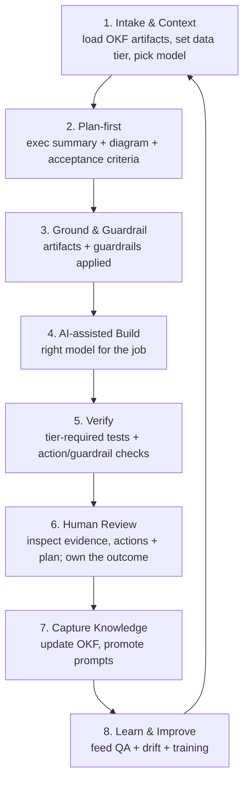
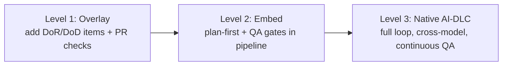
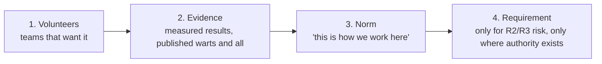

# 08 — AI-DLC Process & Integration

*Build the delivery process starting with AI — and give teams a way to integrate this framework into the processes they already run.*

**Concerns covered:** #13 (build AI-DLC starting with AI, not Agile-last; integrate with teams' existing processes since they already have their own).
**Related:** all other documents — this is where they operationalize.

---

## 1. Principle

Most teams bolt AI onto the *end* of a traditional Agile flow — code first, then maybe ask AI to help. **AI-DLC (AI Development Life Cycle) inverts that: AI is a first-class participant from intake to release**, with humans accountable at every gate. The point isn't to replace Agile; it's to redesign the loop so context, planning, verification, and knowledge capture are AI-native — and quality is enforced by the mechanisms in docs [01](01-context-engineering-and-transparency.md)–[09](09-guardrails-and-grounding.md).

> **AI-first, human-accountable.** The AI drafts, plans, and verifies; a named human owns every decision and merge.

---

## 2. The AI-DLC loop

### Stage-by-stage (with owning docs)

| Stage | What happens | Owning doc |
| --- | --- | --- |
| **1. Intake & Context** | Frame the task; load the right OKF artifacts; classify data tier; select the model | [01](01-context-engineering-and-transparency.md), [02](02-model-selection-and-fit.md), [03](03-knowledge-artifacts-and-okf.md) |
| **2. Plan-first** | Agent produces exec summary + design diagram + change list + acceptance criteria; human approves | [01 §4.3](01-context-engineering-and-transparency.md) |
| **3. Ground & Guardrail** | Apply grounding + guardrails; confirm data-tier compliance | [09](09-guardrails-and-grounding.md) |
| **4. AI-assisted Build** | Implement with the fit-for-purpose model; cross-model delegation where useful | [02](02-model-selection-and-fit.md), [05 §5](05-agent-qa-and-regression-framework.md) |
| **5. Verify** | Run the tier-required deterministic, regression, guardrail, and tool/action-contract checks; R2/R3 add golden-baseline/trap QA | [05](05-agent-qa-and-regression-framework.md), [10 §5](10-agent-inventory-and-registry.md) |
| **6. Human Review** | Human inspects the plan, sources, assumptions, diff, tool/action trace, and verification evidence; owns the outcome | [01](01-context-engineering-and-transparency.md), [09 §3.4](09-guardrails-and-grounding.md) |
| **7. Capture Knowledge** | When durable knowledge changed, update an adopted/maintained OKF bundle or promote a human-verified reusable prompt; otherwise mark not applicable | [03](03-knowledge-artifacts-and-okf.md), [06](06-collaboration-and-shared-prompt-hub.md) |
| **8. Learn & Improve** | Feed results into QA regression, drift review, and training | [04](04-model-drift-management.md), [05](05-agent-qa-and-regression-framework.md), [07](07-enablement-and-interactive-training.md) |

---

## 3. Gates (quality is enforced, not hoped for)

Each applicable stage has an exit gate **proportionate to the agent/task risk tier** ([10 §5](10-agent-inventory-and-registry.md)). A hard safety or action-authorization failure always blocks; expensive assurance and knowledge-maintenance gates apply only where the tier and adopted practices require them.

| Gate | Pass criteria |
| --- | --- |
| Context gate | CLEAR checklist satisfied; artifacts loaded; data tier set ([01](01-context-engineering-and-transparency.md)) |
| Plan gate | For non-trivial work: approved plan with exec summary + diagram + acceptance criteria ([01](01-context-engineering-and-transparency.md)) |
| Build gate | Builds; scoped diff; guardrails respected ([09](09-guardrails-and-grounding.md)) |
| Verify gate | Tier-required tests pass; any tool/action contracts pass; R2/R3 meet applicable golden-baseline thresholds ([05](05-agent-qa-and-regression-framework.md)) |
| Review gate | Human inspected observable decision evidence and signed off; exact consequential actions were separately approved |
| Capture gate | If durable knowledge changed in an adopted bundle/library, the human-verified update passes CI; otherwise explicitly N/A ([03](03-knowledge-artifacts-and-okf.md), [06](06-collaboration-and-shared-prompt-hub.md)) |

---

## 4. Integration with existing processes (the realistic part)

Teams already run Scrum, Kanban, SAFe, or their own hybrid. **Do not force a rip-and-replace.** Map AI-DLC stages onto whatever they already do.

### Mapping cheatsheet
| Existing ceremony/artifact | AI-DLC integration |
| --- | --- |
| Backlog refinement | Add **Intake & Context** + require **artifacts linked** on stories |
| Story writing | Agent drafts stories; enforce **plan-first acceptance criteria** ([05 §4](05-agent-qa-and-regression-framework.md)) |
| Sprint planning | Select model per task; flag data tier |
| Definition of Ready (DoR) | Add: context sufficient (CLEAR), artifacts linked |
| Definition of Done (DoD) | Add: plan reviewed; applicable QA/guardrail gates passed; durable knowledge updated when changed |
| Code review / PR | Add: inspect plan, sources, assumptions, action trace, test evidence, and scope |
| Retro | Add: AI quality signals, drift observations, prompt improvements |
| CI/CD | Add: OKF validate + agent regression + guardrail checks |

### Integration levels (meet teams where they are)

- **Level 1 — Overlay:** Minimal change. Add AI items to DoR/DoD and PR checklist. Any team can start here this sprint.
- **Level 2 — Embed:** Plan-first and QA/guardrail gates run in the pipeline; OKF in CI.
- **Level 3 — Native:** The full AI-DLC loop with cross-model delegation and continuous regression/drift.

> A team's current maturity ([README maturity model](README.md)) suggests where to start. Progress is by choice + evidence, not mandate.

### 4.1 Authority — what is required, what is recommended

The framework is silent on the most practical question a team will ask: *"do I actually have to?"* Ambiguity here is fatal. A gate that is unclear about its own force gets ignored, and the programme's credibility goes with it.

**Be explicit and keep the mandatory list short.**

| Force | Applies to | Who can grant an exception |
| --- | --- | --- |
| **Required — non-negotiable** | Data-tier compliance; named human accountable for every merge; registration of every deployed/runnable agent ([10](10-agent-inventory-and-registry.md)); the tier-required controls for **R2/R3** agents | Security/Compliance, in writing, time-boxed |
| **Required — with a dated exception path** | Model version pinning; guardrail inheritance; plan-first on non-trivial changes | AI Enablement Lead + Engineering Manager |
| **Recommended — evidence-backed** | OKF bundles; integration Levels 2–3; competency labs; prompt library contribution | No exception needed — it is a recommendation |
| **Optional — team's choice** | Which mid-tier model, IDE surface, ceremony mapping | Team |

Two rules keep this honest:

- **Nothing is added to the Required list without a named accountable owner and a demonstrated risk.** If we cannot say what goes wrong without it, it is a recommendation.
- **Sunset clause.** Every gate is reviewed annually and must justify itself with evidence — what it caught, what it cost — or it is removed. Publish the removals. A programme that visibly deletes its own ceremony earns the right to add some.

### 4.2 Adoption is a people problem (the part process docs omit)

Teams already have a process, a backlog, and a reason to be sceptical. Process design does not overcome that; sequencing and incentives do.

**The adoption sequence — never start at step 4:**

Mandating first inverts this and produces malicious compliance: gates satisfied on paper, judgement disengaged. That is strictly worse than no gate, because it manufactures false assurance.

**Objections you will actually hear, and the honest answer:**

| Objection | Weak answer | Honest answer |
| --- | --- | --- |
| "This slows us down." | "Quality matters." | Partly true, and only at first. We measure cycle time **and** rework together ([11 §3](11-measurement-baselines-and-roi.md)); if the pair doesn't improve within a quarter, the gate goes. |
| "AI writes bad code — this legitimises it." | "Modern models are good." | Agreed that unreviewed AI code is a risk. That is what the review gate and QA harness are *for*. This programme is the sceptic's ally, not the enthusiast's. |
| "We already do this." | "Do it more formally." | Then Level 1 costs you almost nothing — show us your evidence and we will adopt *your* pattern as the standard. |
| "This is surveillance of my team." | *(silence)* | Metrics are reported at team and programme level, never used for individual performance management. Put that in writing and honour it — the first breach ends the programme's credibility permanently. |
| "My domain is different." | "The framework is general." | Probably correct in the specifics. Bring the exception; if it holds, the framework changes. Several of these documents exist because someone pushed back. |

**Incentives that actually move behaviour:**

- **Make the good path the easy path.** Repo templates, instruction files, and library prompts that ship correct by default beat any policy. Most adoption is won here, not in governance.
- **Champion time is real, funded time** — roughly 20% — and it appears in performance goals. An unfunded champion is a volunteer who will quietly stop.
- **Recognise the sceptics who engage.** The engineer who finds the flaw in our framework is doing the work we most need. Say so publicly.
- **Never punish a reported failure.** Registration amnesty ([10 §2](10-agent-inventory-and-registry.md)) and blameless post-mortems ([12 §6](12-ai-incident-response-and-observability.md)) are the same principle: visibility is worth more than compliance theatre.
- **Kill something for every thing you add.** When a gate goes in, retire a ceremony it replaces. Process debt compounds exactly like technical debt, and teams are tracking whether we ever pay ours down.

---

## 5. RACI (who does what)

| Activity | Enablement Lead | AI Quality | Platform & Ops | Champion | Agent/task owner | Eng Manager | Security/FinOps |
| --- | --- | --- | --- | --- | --- | --- | --- |
| Define AI-DLC standard | A/R | C | C | C | I | C | C |
| Adapt to team process | C | I | I | R | R | A | C |
| Run the loop per task | I | I | I | C | A/R | C | I |
| QA harness & evaluation gates | C | A/R | C | C | C | I | C |
| Registry, runtime policy & action controls | C | C | A/R | C | R | I | C |
| Drift review / No-Go recommendation | A | R | C | C | I | I | C |
| Data-tier/guardrail compliance | C | C | R | C | R | A | A |

*A = Accountable, R = Responsible, C = Consulted, I = Informed.*

> Role definitions, staffing sequence, and decision rights are in [newCESTeamRoles](../newCESTeamRoles.md). This table says *what* each role does in the loop; that document says *who they are and when to hire them*.

---

## 6. Rollout plan

1. **Publish the AI-DLC standard** (this doc) and the Level 1 overlay checklist.
2. **Pilot Level 1** with 1–2 teams; add DoR/DoD + PR items.
3. **Wire pipeline gates** (OKF validate, agent regression, guardrails) for Level 2.
4. **Select a flagship team** to reach Level 3 (native) as a reference implementation.
5. **Publish playbooks** per starting process (Scrum/Kanban/SAFe) via the hub ([06](06-collaboration-and-shared-prompt-hub.md)).
6. **Review quarterly**; refine gates and thresholds.

---

## 7. Anti-patterns

| Anti-pattern | Fix |
| --- | --- |
| AI added only at coding stage | AI-first intake + plan-first |
| Mandating one process for all teams | Integration levels; map to existing ceremonies |
| Gates as paperwork, not enforcement | Automate gates in CI/PR |
| Skipping human review because "AI did it" | Review gate is non-negotiable |
| Durable knowledge changes but is not captured | Update the adopted bundle/library when knowledge changes; otherwise N/A |

---

## 8. Metrics

- % of teams at each integration level (trend upward)
- % of stories with linked artifacts + reviewed plans
- Gate pass rates (context, plan, verify, review, capture)
- Cycle time and rework rate before vs. after AI-DLC
- QA/drift signals flowing back into training ([07](07-enablement-and-interactive-training.md))

---

## 9. Open questions to refine

- What is the minimum Level 1 overlay every CES team adopts first?
- Which team is the Level 3 flagship?
- How prescriptive are the gates vs. team autonomy? (§4.1 is the current answer — challenge it.)
- How do we measure AI-DLC ROI credibly for leadership? (Method in [11 §8](11-measurement-baselines-and-roi.md).)
- Who signs the written commitment that team metrics are never used for individual performance management (§4.2)?
- Which existing ceremony do we retire when Level 1 lands?
