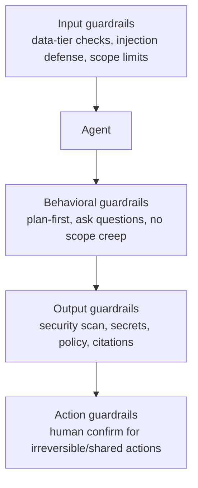

# 09 — Guardrails & Grounding

*Keep agents inside safe, correct bounds — and anchor their answers in verifiable sources.*

**Concerns covered:** part of #5 (grounding an agent with guardrails is important); responsible-use exposure (IP, fairness, compliance) per **R6** of the [Architect Review](architect-review-and-recommendations.md).
**Related:** [01 Context Engineering & Transparency](01-context-engineering-and-transparency.md), [05 Agent QA](05-agent-qa-and-regression-framework.md), [04 Drift Management](04-model-drift-management.md), [08 AI-DLC](08-ai-dlc-process-and-integration.md), [12 Incident Response](12-ai-incident-response-and-observability.md).

> **Scope note:** this document is **prevention**. What happens when prevention fails — detection, containment, recovery, and learning — is [12 Incident Response & Observability](12-ai-incident-response-and-observability.md). Prevention without detection is half a safety system.

---

## 1. Two distinct ideas — don't conflate them

| | **Grounding** | **Guardrails** |
| --- | --- | --- |
| Purpose | Make answers *true* — anchored in real sources | Keep behavior *safe/correct* — inside bounds |
| Mechanism | Provide + require use of authoritative context | Constraints, policies, checks on inputs/outputs/actions |
| Failure it prevents | Hallucination, stale/invented facts | Data leaks, unsafe actions, scope creep, injection |
| Owning practice | OKF artifacts, retrieval, citations ([03](03-knowledge-artifacts-and-okf.md)) | Instructions, policy checks, allow/deny lists, review |

Both are required. Grounding without guardrails is accurate but unsafe; guardrails without grounding are safe but wrong.

---

## 2. Grounding

### Principle
Prefer answers grounded in **provided, verifiable sources** over model memory. Model memory is stale, generic, and hallucination-prone; grounded answers are current and checkable.

### Practices
- **Point agents at artifacts** — OKF bundles as the source of truth ([03](03-knowledge-artifacts-and-okf.md)); progressive disclosure keeps it cheap.
- **Retrieval over recall** — pull the relevant slice; don't rely on what the model "remembers."
- **Require citations** — for factual/technical claims, cite the file/artifact/source used. Uncited claims are treated as unverified.
- **Ground-then-generate** — instruct the agent to gather and cite context *before* proposing solutions.
- **Freshness** — prefer current repo/artifact state over training-era knowledge (especially for fast-moving ecosystems, e.g., cloud APIs — ties to model choice in [02](02-model-selection-and-fit.md)).

### Grounding checklist
```markdown
- [ ] Authoritative sources provided (OKF/code/docs)
- [ ] Agent instructed to use + cite them
- [ ] Claims trace to a source (no uncited facts)
- [ ] Freshness verified (repo/artifact over memory)
```

---

## 3. Guardrails

### Categories


### 3.1 Input guardrails
- **Data-tier gate** — classify data before it reaches a model; route confidential to local/VPC only ([02 §3](02-model-selection-and-fit.md), [../AIAcrossCESMaximizingItsPotential.md §5](../AIAcrossCESMaximizingItsPotential.md)).
- **Prompt-injection defense** — treat tool/web/document/pasted content as **untrusted input**. It must never silently trigger actions, change scope, or exfiltrate data. Suspicious instructions in content are flagged, not obeyed.
- **Scope limits** — declare which files/systems are in bounds.

### 3.2 Behavioral guardrails
- **Plan-first** on non-trivial tasks ([01 §4.3](01-context-engineering-and-transparency.md)).
- **Assumptions + clarifying questions** required on ambiguity ([01 §4.2](01-context-engineering-and-transparency.md)).
- **Uncertainty flags** — the agent must express uncertainty rather than fabricate (counters over-confidence, [04 §5](04-model-drift-management.md)).
- **No unrequested scope creep** — stay within the task.

### 3.3 Output guardrails
- **Security** — generated code follows OWASP Top 10; run SAST + secret scanning on AI output.
- **Policy/compliance** — no secrets, PII, or license violations in output.
- **Citation enforcement** — factual claims cite sources (grounding, §2).
- **Format/contract** — structured outputs validated against a schema where required.

### 3.4 Action guardrails
- **The model proposes; the runtime authorizes.** A prompt or model decision is never an access-control decision. Deny by default and enforce the registered tool, resource, action, and parameter scope outside the model.
- **Human-in-the-loop for irreversible or consequential actions** — deletes, force-push, production changes, external/customer messages, security-policy changes, and material financial actions require explicit per-action confirmation.
- **Least privilege** — give each agent/environment its own workload identity and short-lived credentials with the minimum scope. Do not share human tokens or credentials across agents.
- **Reversibility bias** — prefer reversible actions; sandbox destructive experiments (e.g., trap-finding on clones, [05 §3](05-agent-qa-and-regression-framework.md)).

#### The action envelope

Every tool-enabled agent has a versioned, machine-enforced envelope that declares:

```yaml
principal: <agent workload identity>
release_id: <immutable agent configuration>
allowed_tools:
    - tool: jira.create
        resources: [project:CES]
        parameter_constraints: { issue_type: [Task, Story] }
        max_calls_per_run: 5
approval:
    required_for: [external_message, production_write, destructive_action]
expires: <policy expiry>
```

For bounded R3 autonomy, only **reversible actions inside this pre-approved envelope** may proceed without a person approving each call. Anything outside the envelope, any changed target/parameter, or any irreversible/customer-affecting action stops for approval or is denied.

#### Approval integrity

"Approve" is not a reusable permission. The approval receipt binds the **actor, exact canonical action, target, parameters, expected side effects, agent release/policy version, approver, and expiry**. The runtime re-checks authorization and preconditions immediately before commit; a changed action or changed state invalidates the receipt. This closes both approval replay and time-of-check/time-of-use gaps.

- Show the approver a concise diff/preview, affected resources, data leaving the boundary, and rollback/compensation path — not a generic confirmation box.
- Separate propose/plan permission from execute permission. The component interpreting untrusted content should not also be able to grant itself new capabilities.
- Require idempotency keys or equivalent deduplication for retried side effects, and explicit partial-failure/compensation behavior for multi-step work.
- Treat tool output as untrusted data. It cannot authorize another call, alter the action envelope, or satisfy human approval.

---

## 4. Layering guardrails (defense in depth)

No single layer is sufficient.

| Layer | Where | Example |
| --- | --- | --- |
| **Instruction** | System / `.instructions.md` / AGENTS.md | "Ask before irreversible actions; cite sources" |
| **Structural** | Tooling / permissions | Workload identity; deny-by-default action envelope; sandboxed clone |
| **Automated check** | CI / pipeline | SAST, secret scan, guardrail assertions ([05 §7](05-agent-qa-and-regression-framework.md)) |
| **Human** | Review gate | Human owns the merge ([08](08-ai-dlc-process-and-integration.md)) |

---

## 5. Guardrails as testable artifacts

Guardrails are only real if they're **tested**. Every guardrail gets an assertion in the QA harness ([05 §7](05-agent-qa-and-regression-framework.md)):

- Feed inputs that *should* trip the guardrail; confirm the agent refuses/flags/asks.
- Include **prompt-injection test cases** (malicious content in a document/tool result).
- Include **data-tier violation attempts** (confirm the agent won't send confidential data to a disallowed model).
- Exercise authorization, approval mutation/replay, retry/idempotency, stale-state, partial-failure, and rollback cases at the actual tool boundary ([05 §6.3](05-agent-qa-and-regression-framework.md)).
- Re-run on every model change (guardrail drift is real, [04](04-model-drift-management.md)).

### Guardrail spec (template — store as OKF concept, [03 §5](03-knowledge-artifacts-and-okf.md))
```yaml
---
type: Guardrail
title: No confidential data to public models
description: Blocks confidential-tier content from non-approved models.
tags: [data-tier, security]
status: stable
generated: { by: human:<id>, at: 2026-09-02T00:00:00Z }
verified: { by: human:<id>, at: 2026-09-02T00:00:00Z }
stale_after: 2026-12-01T00:00:00Z
sources:
    - { id: data-policy, resource: <authoritative CES data policy> }
severity: high
---

## Rule
<the constraint in plain language>

## Enforcement layers
- Instruction: <...>
- Structural: <...>
- Automated check: <...>
- Human: <...>

## Action policy (if tool-enabled)
- Principal: <workload identity>
- Allowed tool/resource/parameter envelope: <...>
- Exact actions requiring approval: <...>
- Idempotency / rollback contract: <...>

## Test cases
- Given <input> → expect <refuse/flag/ask>
```

---

## 6. Responsible AI — the exposures beyond security

Everything above protects the system. This section protects the **organisation and the people affected by it**. It is deliberately scoped to what CES plausibly faces — not a generic responsible-AI binder.

### 6.1 Intellectual property & licensing

The risk nobody sees until legal asks. AI-generated code carries three distinct issues, and they need different answers:

| Exposure | The actual risk | Control |
| --- | --- | --- |
| **Inbound licence contamination** | Generated code closely reproduces a copyleft-licensed source, obliging us to licence terms we never agreed to | Enable the provider's public-code filter where available; run licence/similarity scanning on AI-assisted changes exactly as we do for dependencies |
| **Ownership of output** | Whether we own, and can enforce rights over, AI-generated material varies by jurisdiction and is unsettled | Legal states our position once, in writing; engineers should not each be improvising an answer |
| **Outbound leakage of our IP** | Our proprietary code becomes training data for someone else's model | Governed by the data-tier table (§3.1) plus contractual terms — **verify the vendor's training-on-input terms per plan, and re-verify at renewal** |

> The outbound case is the most commonly mishandled: teams assume enterprise terms exclude training on their input. Sometimes they do; sometimes only on a specific plan tier. **Check the contract, not the marketing page**, and record the answer next to the tool in the tooling table.

### 6.2 Bias & fairness — apply the trigger test

Do not import a fairness programme we don't need. **Apply this test instead:**

> Does this agent's output influence a decision **about a person** — hiring, performance, access, eligibility, prioritisation of their request, or anything they could reasonably contest?

| Answer | Obligation |
| --- | --- |
| **No** (the overwhelming majority — coding, refactoring, docs, ops) | Standard guardrails only. Nothing further. |
| **Yes** | Escalates to **R3** ([10 §4](10-agent-inventory-and-registry.md)) and requires: documented decision criteria, human decision-maker of record, outcome monitoring across affected groups, a contestability path, and sign-off from Legal/HR before launch |

Being explicit that most CES agents fall in the "No" column is what makes the "Yes" column credible and enforceable, rather than boilerplate everyone learns to skip.

One bias risk *does* apply universally and is easy to miss: **AI-generated tests, review comments, and documentation inherit the model's assumptions about what "normal" looks like** — naming, examples, accessibility, locale, and edge cases involving names, addresses, or dates. Cheap fix: keep it on the review checklist and in the trap catalogue ([05 §3](05-agent-qa-and-regression-framework.md)).

### 6.3 Compliance & disclosure

| Question | Who answers it | Why it matters now |
| --- | --- | --- |
| Does CES process regulated data (health, financial, personal) through any agent? | Compliance partner | Determines whether R6 is a checklist item or a programme |
| Do customer contracts restrict AI processing of their data or require disclosure? | Legal / account teams | Contractual breach is easier to trigger than regulatory breach and is often overlooked |
| Do we need to disclose AI involvement in deliverables? | Legal + delivery leads | Increasingly a client expectation; better decided once than per-engagement |
| Which jurisdictions' AI rules apply to us? | Compliance partner | Obligations follow the customer's location as much as ours |

**These are open questions, not answers.** Recording them honestly — with named owners and a date — is more useful than fabricating a compliance posture we haven't verified. Whether this section stays a section or becomes its own document depends entirely on the first answer.

### 6.4 Transparency to people, not just to engineers

The programme's transparency work ([01 §4](01-context-engineering-and-transparency.md)) helps engineers inspect sources, assumptions, actions, and verification evidence. There is a second audience: **whoever receives the output.**

- **Attribution** — agent messages in shared spaces are labelled as such ([06](06-collaboration-and-shared-prompt-hub.md)). Never let a human mistake an agent for a colleague.
- **Accountability of record** — a named human owns every AI-assisted deliverable. "The AI wrote it" is never an explanation for a defect.
- **Traceability** — for R3 agents, we can reconstruct what informed a given output ([12 §3](12-ai-incident-response-and-observability.md)). If we can't explain a decision after the fact, we were not entitled to automate it.

---

## 7. Anti-patterns

| Anti-pattern | Fix |
| --- | --- |
| Guardrails only in a system prompt | Defense in depth (§4) |
| Trusting content from tools/web/pasted docs | Treat as untrusted; injection defense |
| Grounding "encouraged" but not required | Enforce citations; uncited = unverified |
| Guardrails never tested | Guardrail assertions in QA ([05](05-agent-qa-and-regression-framework.md)) |
| Agents with broad write/prod access | Least privilege + human confirm |
| Approval as a generic "continue" button | Bind approval to the exact action, state, release, and expiry (§3.4) |
| Relying on the prompt to restrict tools | Enforce a deny-by-default action envelope outside the model (§3.4) |
| Shared human/API credentials across agents | One workload identity per agent/environment; short-lived credentials (§3.4) |
| Assuming guardrails survive model upgrades | Re-test on drift ([04](04-model-drift-management.md)) |
| Assuming enterprise terms exclude training on our input | Verify the contract per plan tier (§6.1) |
| A generic responsible-AI policy nobody reads | Trigger test (§6.2) — obligations only where they apply |
| Prevention with no detection or response | Pair with [12](12-ai-incident-response-and-observability.md) |

---

## 8. Metrics

- Guardrail assertion pass rate (per model, per release)
- Prompt-injection test catch rate
- Data-tier violations caught pre-send (target: 100%)
- Uncited-claim rate in AI output (trend to zero)
- Security findings in AI output caught pre-merge vs. escaped
- % of R3 agents with a named accountable human and a traceable output path (§6.4)
- Licence/similarity scan coverage on AI-assisted changes (§6.1)
- % of tool-enabled agents with a machine-enforced action envelope
- Action-contract assertion pass rate: authorization, approval binding, retry, stale state, and rollback ([05 §6.3](05-agent-qa-and-regression-framework.md))
- Approval denials/expiries/replays by action class (a sudden change is a drift or attack signal)

---

## 9. Open questions to refine

- What is the canonical CES guardrail set every agent inherits by default?
- Where do guardrail specs live (shared OKF bundle) and who owns them?
- What actions always require exact per-action human approval across CES, and which reversible actions may enter a pre-approved R3 envelope?
- Which platform owns workload identities, action-policy evaluation, and signed approval receipts?
- How do we standardize prompt-injection test cases across teams?
- **Does CES process regulated data or make decisions about people through any agent?** This single answer decides whether §6 stays a section or becomes its own document.
- What are our vendors' actual contractual terms on training with our input, per plan?
- Do any client contracts require disclosure of AI involvement?
