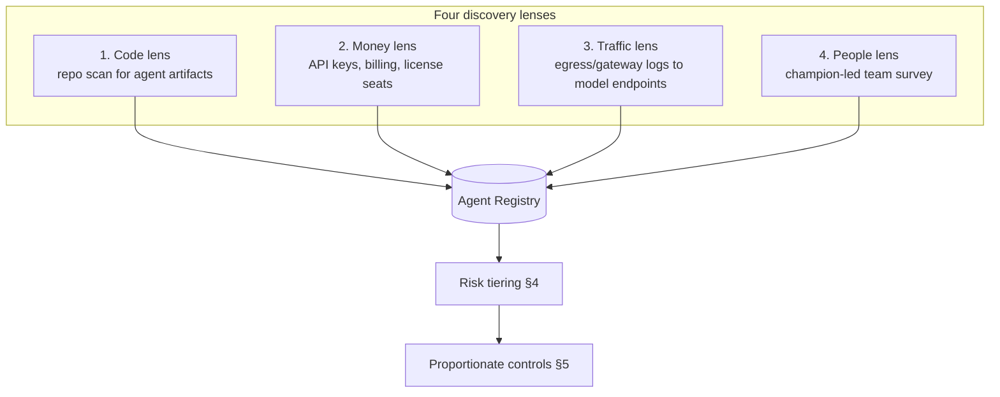
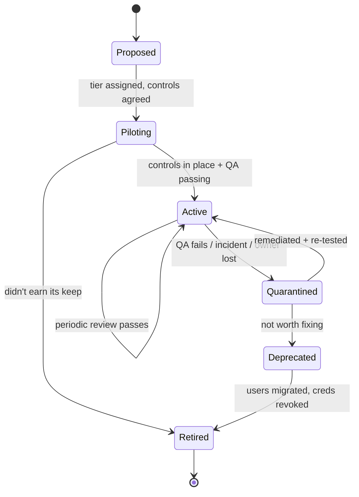

# 10 — Agent Inventory, Risk Tiering & Lifecycle Registry

*You cannot govern, QA, or drift-check an agent you have never counted. This is the foundation the rest of the framework stands on.*

**Concerns covered:** the root concern behind all 13 — *"there are already many agents in use across CES and the quality is my primary worry."* Implements **R1** from the [Architect Review](architect-review-and-recommendations.md).
**Related:** [05 Agent QA](05-agent-qa-and-regression-framework.md), [04 Drift Management](04-model-drift-management.md), [09 Guardrails & Grounding](09-guardrails-and-grounding.md), [11 Measurement & ROI](11-measurement-baselines-and-roi.md), [12 Incident Response](12-ai-incident-response-and-observability.md).

---

## 1. The gap this closes

Every other document in this program assumes we know **which agents exist**. None of them establishes it. Today the honest answer is:

- We don't know how many agents run across CES.
- We don't know which models they call, at what version, against what data tier.
- We don't know who owns them, or whether anyone still does.
- We therefore improve the agents we can *see*, and inherit the risk of the ones we can't.

> **Rule:** every deployed or runnable agent is registered. During the discovery amnesty, an unregistered agent is confined to a Public-data sandbox with no external side effects until intake and tiering are complete. Registration is the price of admission, not paperwork after the fact.

### What counts as an "agent" here

Register a **deployed or runnable configuration**, not every file it consumes. The practical test is: *does a repeatable runtime identity/configuration select a model for a defined purpose and possibly invoke tools or affect another system?* If yes, it is an agent record. Prompts, instructions, policies, and knowledge bundles are versioned **components linked from that record**.

| Classification | Example | Governed where |
| --- | --- | --- |
| **Agent** — runnable custom mode or packaged configuration | A custom agent mode with a defined purpose, model, policy, and tool set | This registry |
| **Agent** — scripted or automated model call | CI job, script, Power Automate flow, scheduled task | This registry |
| **Agent** — embedded or shared service | Product feature, Teams bot, API service, autonomous workflow | This registry |
| **Component** — instruction/persona/prompt | `AGENTS.md`, `.instructions.md`, `.prompt.md`, reusable prompt | Prompt/pattern library ([06](06-collaboration-and-shared-prompt-hub.md)); link its version here |
| **Component** — knowledge/policy/tool contract | OKF bundle, guardrail set, tool schema | Owning artifact repository; link its version here |
| **Neither** | One-off ad-hoc chat with no reuse or automation | Normal tool-use policy |

This keeps the denominator honest. Counting one agent plus twelve instruction files as thirteen agents inflates coverage while hiding the one runtime identity that can act.

---

## 2. Discovery — how we find what already exists

Do this once as a sweep, then keep it continuous. **Use four independent lenses**, because each one misses different agents.



| Lens | Method | Finds | Misses |
| --- | --- | --- | --- |
| **Code** | Org-wide search for `AGENTS.md`, `*.instructions.md`, `*.prompt.md`, `chatmodes`, SDK imports (`openai`, `anthropic`, `google.generativeai`, `ollama`), model endpoint URLs | Committed, versioned agents | Anything not in git |
| **Money** | Provider billing/console: API keys, projects, seats. Attribute each key to a human owner | Scripted and API agents, shadow spend | Free/local models (Gemma) |
| **Traffic** | Network/proxy logs for calls to model endpoints, including self-hosted Gemma | Shadow AI and undocumented tools | Anything on a personal device/network |
| **People** | AI Champion runs a 15-minute team inventory using the intake template (§3.2) | Informal agents, personal workflows, intent | Whatever people forget |

**Reconcile the four lists.** An entry found by the money or traffic lens but *not* by the code or people lens is the highest-priority investigation — that is shadow AI by definition.

> Discovery is an amnesty, not an audit. Say so explicitly. If registering an agent gets someone in trouble, you will never see the risky ones. Register first, fix second.

---

## 3. The registry

### 3.1 Record schema

One record per agent. Store it as an OKF concept (`type: Agent Spec`, [03 §5](03-knowledge-artifacts-and-okf.md)) so it is versioned, diffable, and readable by agents themselves.

```yaml
---
type: Agent Spec
title: GCP migration assessor
description: Assesses a service for GCP readiness and drafts a migration plan.
status: stable                  # OKF concept lifecycle: draft | stable | deprecated
generated: { by: human:<id>, at: 2026-09-02T00:00:00Z }
verified: { by: human:<id>, at: 2026-09-02T00:00:00Z }
stale_after: 2026-12-01T00:00:00Z
agent_id: ces-agent-0042
release_id: ces-agent-0042/2026.09.2
owner: <named human>            # a person, not a team alias
backup_owner: <named human>
team: <delivery team>
agent_status: Active            # Proposed | Piloting | Active | Quarantined | Deprecated | Retired
purpose: <one sentence, plain language>
model: gemini-x.y               # exact pinned version, not "latest"
model_rationale: GCP ecosystem grounding ([02])
fallback_model: <model + version>
prompt_version: <immutable hash/version>
policy_version: <guardrail/action-policy version>
data_tier: Internal             # Public | Internal | Confidential | Restricted
autonomy: Suggests              # Suggests | Acts-with-approval | Acts-autonomously
blast_radius: Repo              # Sandbox | Repo | Team-system | Shared-prod | Customer-facing
risk_tier: R2                   # derived — see §4
tools: [read_repo, write_branch, jira_create]
runtime_identity: <agent-specific workload identity>
action_policy: <versioned tool/resource/parameter envelope>
approval_mode: <none | exact-action | bounded-reversible-envelope>
context_sources: [okf://payments, docs/adr/]
guardrails: [gr-data-tier, gr-human-confirm-writes]
qa_status: Passing              # Passing | Failing | Never-tested
last_qa_run: 2026-08-28
last_drift_check: 2026-08-15
review_due: 2026-11-15
monthly_cost_estimate: <currency>
depends_on: [ces-agent-0017]    # agent-to-agent dependencies
incidents: [inc-2026-07-03]
---
```

**Non-negotiable fields:** `owner`, `release_id`, `model` (pinned version), `data_tier`, `autonomy`, `blast_radius`, and `agent_status`. A tool-enabled agent also requires `runtime_identity`, `action_policy`, and `approval_mode`. Everything else can be filled in later; without these fields you cannot reproduce, tier, authorize, or stop the deployed release.

### 3.2 Intake template (what a champion asks a team)

```markdown
1. What does it do, in one sentence?
2. Who is the named human who owns it?
3. Which model and version does it call? Is the version pinned?
4. What is the most sensitive data it can see?
5. Can it change anything on its own — and what is the worst thing it could change?
6. What tools can it call, under which workload identity and action policy? Which exact actions require approval?
7. What would break, and who would notice, if it produced a wrong answer for a week?
8. Has anyone ever tested it? How do you know it still works?
```

Question 7 is the one that surfaces real risk. Question 8 usually gets an uncomfortable silence — that is the point.

---

## 4. Risk tiering (the mechanism that makes this framework affordable)

Applying the full QA, drift, and guardrail programme to every agent is unaffordable and would kill adoption. Applying it to none is negligence. **Tier the agents and make controls proportionate.**

Risk tier is derived from three axes, not one. The rules below set a **minimum tier**, not a numeric score that can average one danger away:

$$\text{Risk} = f(\text{Blast radius} \times \text{Autonomy} \times \text{Data tier})$$

| Axis | Levels (ascending) |
| --- | --- |
| **Blast radius** | Sandbox → Repo → Team-system → Shared-prod → Customer-facing |
| **Autonomy** | Suggests → Acts-with-approval → Acts-autonomously |
| **Data tier** | Public → Internal → Confidential → Restricted |

### Tier assignment
| Tier | Definition | Typical example |
| --- | --- | --- |
| **R0 — Trivial** | Sandbox/Repo blast radius, suggests only, Public/Internal data | Commit-message drafter; formatting helper |
| **R1 — Standard** | Repo blast radius, suggests or acts-with-approval, Internal data | Coding agent producing PRs a human reviews |
| **R2 — Elevated** | Team-system reach, acts-with-approval, **or** Confidential data | GCP migration assessor; agent that files Jira and edits infra IaC |
| **R3 — Critical** | Shared-prod or customer-facing, **or** acts autonomously, **or** Restricted data | Anything that writes to production, messages customers, or makes decisions affecting people |

**Escalation rules (apply the highest that matches):**
- Any autonomous write to a shared system ⇒ **R3**, regardless of data tier.
- Any Confidential data ⇒ **R2** minimum. Restricted ⇒ **R3**.
- Any customer-visible output ⇒ **R3**.
- An agent that invokes another agent inherits **at least the higher of the two tiers**, then the composed workflow is re-tiered for its combined data access, actions, and blast radius.

> The last rule is deliberate: agent-to-agent chains are where risk compounds invisibly. The registry's `depends_on` field exists to make those chains visible before we ever consider orchestration ([Architect Review §4](architect-review-and-recommendations.md)).

---

## 5. Proportionate controls (tier → required controls)

This table is the single most useful artefact in the programme. It tells any team exactly what they owe for the agent they have — no more, no less.

| Control | R0 | R1 | R2 | R3 |
| --- | :---: | :---: | :---: | :---: |
| Registered with named owner (§3) | ✅ | ✅ | ✅ | ✅ |
| Model version pinned ([04](04-model-drift-management.md)) | — | ✅ | ✅ | ✅ |
| Inherits the default guardrail set ([09](09-guardrails-and-grounding.md)) | ✅ | ✅ | ✅ | ✅ |
| Named human accountable for outcomes | ✅ | ✅ | ✅ | ✅ |
| Human review before any consequential/irreversible effect | ✅ | ✅ | ✅ | ✅ |
| Machine-enforced action envelope ([09 §3.4](09-guardrails-and-grounding.md)) | if tool-enabled | if tool-enabled | ✅ | ✅ |
| Role-relevant operator/reviewer competency ([07](07-enablement-and-interactive-training.md)) | — | recommended | ✅ | ✅ |
| Prompt regression tests ([05 §7](05-agent-qa-and-regression-framework.md)) | — | ✅ | ✅ | ✅ |
| Golden-baseline / trap QA ([05](05-agent-qa-and-regression-framework.md)) | — | — | ✅ | ✅ |
| Human-anchored gold eval set ([05 §2.1](05-agent-qa-and-regression-framework.md)) | — | — | — | ✅ |
| Drift gate before any model change ([04](04-model-drift-management.md)) | — | opportunistic | ✅ | ✅ |
| Runtime logging/observability ([12](12-ai-incident-response-and-observability.md)) | — | — | ✅ | ✅ |
| Kill switch tested ([12 §5](12-ai-incident-response-and-observability.md)) | — | — | — | ✅ |
| Named incident responder + rollback plan | — | — | — | ✅ |
| Periodic review | annual | annual | quarterly | quarterly |
| Second-model cross-check on high-stakes output | — | — | — | ✅ |

**Read it as a budget:** the programme's expensive machinery (golden baselines, gold eval sets, drift gates, observability) is aimed at the R2/R3 minority. Most agents are R0/R1 and owe only registration, pinning, guardrail inheritance, and human review.

**R3 is a risk label, not permission to run autonomously.** An autonomous tool-enabled agent may act without per-call approval only on reversible operations inside the registered, machine-enforced envelope. Any changed target/parameter, irreversible action, production/security-policy change, or customer-facing effect requires exact approval as defined in [09 §3.4](09-guardrails-and-grounding.md). Bounded autonomous runs still receive the documented post-run review, and the named human remains accountable.

---

## 6. Lifecycle



### Stage requirements
| Stage | Entry requirement | Exit requirement |
| --- | --- | --- |
| **Proposed** | Intake form completed; tier assigned | Owner accepts the controls for that tier |
| **Piloting** | Controls implemented; limited user group | QA passing at required level; cost understood |
| **Active** | All tier controls green | Passes periodic review |
| **Quarantined** | QA failure, incident, drift regression, or orphaned | Root cause fixed and re-tested, or deprecated |
| **Deprecated** | Replacement identified; users notified | Traffic drained |
| **Retired** | — | **Credentials revoked, keys rotated, endpoints disabled, entry archived (never deleted)** |

### Two lifecycle steps everyone skips

1. **Orphan sweep.** Monthly, check every `owner` and `backup_owner` against the HR directory. An agent whose owner has left the team is **automatically Quarantined** until re-owned. Orphaned agents with live credentials are the most common enterprise AI risk and the easiest to fix.
2. **Real retirement.** "Nobody uses it any more" is not retirement while the API key still works. Retirement means credentials revoked and access removed — verified, not assumed.

---

## 7. Where the registry lives

Do not build a portal. In priority order:

1. **A git-versioned OKF bundle** (`/okf/agents/`) — diffable, PR-reviewable, agent-readable, zero build cost. **Start here.**
2. A generated dashboard rendered from that bundle (read-only view for leadership).
3. A dedicated system — **only** if the bundle demonstrably fails at scale. Not before.

The registry is validated in CI with the same OKF validator ([03 §7](03-knowledge-artifacts-and-okf.md)), plus registry-specific lints:

```markdown
- [ ] `owner` resolves to a current employee
- [ ] `agent_status` is valid and `Quarantined` agents cannot execute
- [ ] `release_id` resolves to immutable prompt, policy, tool-contract, retrieval, and model versions
- [ ] `model` is an exact version, not "latest"/"default"
- [ ] `risk_tier` matches what §4 derives from the three axes
- [ ] every tool-enabled agent has a unique workload identity and a valid action/approval policy
- [ ] every control required by the tier (§5) is satisfied or has a dated exception
- [ ] `review_due` is not in the past
- [ ] `depends_on` targets exist and are registered
```

An agent failing a hard lint gets an issue opened against its owner automatically. This is how the registry stays true without a full-time librarian.

---

## 8. Anti-patterns

| Anti-pattern | Why it hurts | Fix |
| --- | --- | --- |
| Registry as a one-time spreadsheet | Accurate for a week, misleading for a year | Git + CI lints + orphan sweep |
| Same controls for every agent | Either unaffordable or negligent | Risk tiering (§4–§5) |
| Team aliases as owners | Nobody is accountable | Named human + named backup |
| Registration used to punish | Drives agents underground | Amnesty framing |
| "Retired" without revoking credentials | Live capability, no owner, no monitoring | Retirement checklist (§6) |
| Tiering by data sensitivity alone | Misses autonomous agents on non-sensitive data | Three-axis model (§4) |
| Registering every prompt file as an agent | Inflates the denominator and obscures the deployed runtime | Register the runnable release; link component versions (§1, §3) |
| Shared human/API identity | Cannot attribute or contain one agent safely | Per-agent/environment workload identity + short-lived credentials |

---

## 9. Metrics

| Metric | Why it matters | Target |
| --- | --- | --- |
| Registered agents (count, by tier) | The baseline everything else needs | Grows then plateaus |
| Discovery reconciliation gap | Agents found by money/traffic lens but unregistered | → 0 |
| % of R2/R3 agents meeting all required controls | The real safety number | 100% |
| Orphaned agents | Live capability, no owner | 0 |
| % with pinned model versions (R1+) | Drift exposure | 100% |
| Median age of last QA run for R2/R3 | Staleness of assurance | < 30 days |
| Tool-enabled agents with unique workload identity + enforced action policy | Whether least privilege is real | 100% |
| Median time from Deprecated to verified credential/access revocation | Proves the lifecycle actually closes | Inside the approved retirement SLA |

> The most telling early metric is the **reconciliation gap**. If the money lens shows twelve API keys and the registry shows four agents, you have just measured your unknown risk for the first time.

---

## 10. Open questions to refine

- Who runs the first discovery sweep, and do we have access to billing and egress logs?
- What is the amnesty window, and who communicates it so teams trust it?
- Does an existing CMDB/service catalogue already have a slot we should extend rather than duplicate?
- Who arbitrates a disputed risk tier — the owner, the enablement lead, or security?
- What is the exception process when a team genuinely cannot meet an R2/R3 control, and who signs it?
