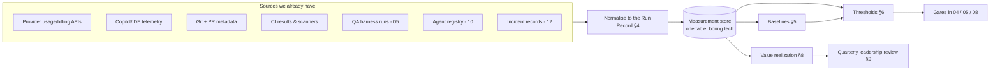
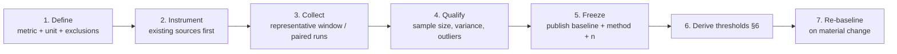
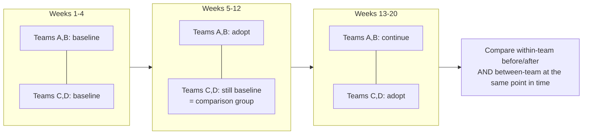

# 11 — Measurement Backbone, Baselines & Value Realization

*The evidence spine. Every "TBD after baseline" in this programme gets its number here — or the gate it guards is theatre.*

**Concerns covered:** the cross-cutting failure identified in the [Architect Review](architect-review-and-recommendations.md) (**R3** + **R7**) — a framework full of thresholds with no method for setting them, and a leadership story with no method for proving it.
**Related:** [05 Agent QA](05-agent-qa-and-regression-framework.md), [04 Drift Management](04-model-drift-management.md), [10 Agent Registry](10-agent-inventory-and-registry.md), [12 Incident Response](12-ai-incident-response-and-observability.md), [../AIAcrossCESMaximizingItsPotential.md §10](../AIAcrossCESMaximizingItsPotential.md).

---

## 1. The problem, stated bluntly

Across this document set there are roughly thirty metrics and a dozen gates. Almost every threshold says **"TBD after baseline."** No document says how a baseline is established, where the data lives, or who computes it. That makes:

- every **gate un-enforceable** (you cannot fail something against an unset bar),
- every **ROI claim unprovable** (and therefore correctly distrusted by leadership),
- every **drift decision subjective** (is a 4-point drop bad? compared to what variance?).

This document is the spine. It defines **what we measure, how we baseline it, how thresholds are derived from that baseline, and how value is claimed honestly.**

> **Principle:** no gate ships without a number, and no number ships without the method and the sample size that produced it.

---

## 2. Measurement architecture



**Build order matters:** exhaust existing sources before building anything. A bespoke LLM gateway to collect telemetry is explicitly deferred ([Architect Review §4](architect-review-and-recommendations.md)) until we have proven that provider APIs, git, and CI cannot answer the questions.

### What we can get today, for free
| Question | Existing source | Gap to close |
| --- | --- | --- |
| What are we spending, by model? | Provider billing/usage export | Attribution to team/use case |
| Who is actively using AI tooling? | Copilot admin/seat telemetry | Depth of use, not just seats |
| Cycle time, rework, review load | Git/PR metadata | Marking which PRs were AI-assisted |
| Defect escape, security findings | CI, SAST, bug tracker | Linking defects back to AI-assisted changes |
| Agent quality | QA harness ([05](05-agent-qa-and-regression-framework.md)) | Harness must exist first |
| Population and risk | Registry ([10](10-agent-inventory-and-registry.md)) | Registry must exist first |

**The one piece of new instrumentation worth the effort:** a reliable way to mark a change as AI-assisted (a PR label, trailer, or template checkbox). Without it, nothing downstream can be attributed and the entire ROI question stays unanswerable. Make it one click, and make it honest — never punitive.

---

## 3. The four metric families

Keep the set small. Thirty metrics nobody reads is the measurement version of document theatre.

| Family | Question it answers | Headline metric |
| --- | --- | --- |
| **Quality** | Is AI output correct and does it stay correct? | First-pass review acceptance of AI-assisted changes |
| **Adoption** | Are people actually using it, well? | Weekly active engineers, segmented by current role-relevant competency status |
| **Cost** | What does a unit of work cost? | Cost per merged PR (or per ticket) |
| **Risk** | Are we exposed, and do we find out fast? | R2/R3 agents with all controls green; MTTD for incidents |

### Paired metrics (the Goodhart guard)

Every metric that can be gamed is **reported only alongside its counterweight.** A number never appears alone in a dashboard or a deck.

| Metric | Never reported without | Because otherwise you optimise for |
| --- | --- | --- |
| Speed / cycle time | Rework rate + defect escape | Shipping fast and broken |
| Cost per unit of work | Quality score | Cheap, wrong answers |
| Adoption / usage volume | Competency pass rate | Enthusiastic misuse |
| Trap-finding recall | Precision / false-positive rate | Reporting everything as a bug |
| Token reduction | Task success rate | Under-contexting the agent |
| Lines of AI code merged | *Never report this at all* | The purest vanity metric we have |

> This pairing rule is the single cheapest defence against the "document theatre" failure the training programme exists to prevent ([Interactive AI Training Design §3](interactiveAITrainingDesign.md)). Apply it to our own dashboards first.

---

## 4. The Run Record (one schema to rule them)

Everything measurable reduces to one flat record. Boring, joinable, and enough.

```yaml
run_id:            # unique
timestamp:
agent_id:          # FK → registry (10); null for ad-hoc use
release_id:        # immutable agent release/configuration under test
model:             # provider + exact model/version
prompt_version:
policy_version:
tool_contract_versions: {}
task_class:        # coding | review | story-writing | analysis | ops | training-lab
context:
  sources: []      # okf refs, files, retrieval hits
  prompt_tokens:
  completion_tokens:
  cached_tokens:
outcome:
  status:          # accepted | revised | rejected | error
  human_edits:     # nullable, task-defined normalized edit/survival proxy; no raw content retained
  iterations:      # turns to reach acceptance
cost:              # currency, computed
quality:
  qa_score:        # from 05 harness, where applicable
  guardrail_trips: []
  citations_present:
linkage:
  pr_url:
  ticket:
  incident:        # FK → 12
```

**`human_edits` is a useful but noisy diagnostic, not a quality score.** Define it only for comparable outputs where normalization is meaningful; formatting, generated files, refactors, and short answers can make edit distance deceptive. Compare it within a task class and pair it with review outcomes and later defects. Compute the aggregate without retaining raw before/after content when possible; leave it null rather than inventing precision.

### 4.1 Measurement without individual surveillance

Assurance telemetry and workforce analytics are not the same thing. An incident responder may need to know who initiated an R3 action; a leadership adoption chart does not.

| Use | Identity treatment | Access / retention |
| --- | --- | --- |
| Security, incident response, contested decisions | Named identity where accountability requires it | Restricted to authorised responders; retain to the approved incident/audit schedule |
| Agent quality, cost, and adoption analysis | Team-level aggregation; pseudonymous run IDs where linkage is needed | Minimum analysts; short, published retention window |
| Learner assessment | Visible to the learner and authorised coach; leadership sees cohort aggregates | Never used as a hidden individual performance score |

Publish the purpose, fields, access roles, and retention period before collection. Do not reuse telemetry for individual performance management, productivity ranking, or disciplinary inference. Suppress small cohorts where aggregation would identify a person. The one-click "AI-assisted" marker in §2 is for programme measurement, not employee scoring; breaking that promise destroys the data quality as well as trust ([08 §4.2](08-ai-dlc-process-and-integration.md)).

---

## 5. Baselining protocol

A baseline is not "whatever last month looked like." It is a measured, documented, frozen reference.



### The seven steps

1. **Define.** Exact definition, unit, and exclusions in writing. "Rework rate" is meaningless; *"% of merged PRs requiring a follow-up fix commit touching the same files within 14 days"* is measurable.
2. **Instrument.** Existing sources only. If a metric cannot be collected without new infrastructure, downgrade it or drop it — do not stall the programme on a build.
3. **Collect a representative sample.** For operational metrics, four weeks is a useful default only when it spans the team's normal delivery cycle; extend it for sparse outcomes. For model/agent evaluation, use repeated **paired runs on the same tasks** instead of waiting four weeks. Freeze planned interventions, but never delay a known safety fix merely to protect a baseline; record the break and restart or model it explicitly.
4. **Qualify the sample.** Record **n**, the centre, spread, missingness, task mix, and a confidence interval or other uncertainty estimate appropriate to the metric. A baseline without uncertainty is unusable — you cannot tell a regression from noise.
5. **Freeze and publish** the number *with its method and n*. A baseline whose provenance is unknown will be argued away the first time it is inconvenient.
6. **Derive thresholds** (§6).
7. **Re-baseline** on material change (new model generation, org restructure, major tooling shift) — and say so publicly when you do, because re-baselining silently is how programmes fake progress.

### Minimum viable baseline set (first four weeks)

Do not try to baseline everything. Six numbers are enough to unblock every gate in the framework:

| # | Baseline | Source | Unblocks |
| --- | --- | --- | --- |
| 1 | First-pass review acceptance, AI-assisted vs. not | Git/PR | Quality gates ([08](08-ai-dlc-process-and-integration.md)) |
| 2 | Rework rate (as defined above), both populations | Git | Quality + ROI |
| 3 | Cost per merged PR, by team | Billing + git | Cost gates, model tiering |
| 4 | Tokens per task by task class | Provider APIs | Context-bloat detection ([01 §3](01-context-engineering-and-transparency.md)) |
| 5 | QA harness score for incumbent models on the golden baseline | [05](05-agent-qa-and-regression-framework.md) | **Every drift gate** ([04](04-model-drift-management.md)) |
| 6 | Trap recall/precision for incumbent models | [05 §3](05-agent-qa-and-regression-framework.md) | Model approval ([02](02-model-selection-and-fit.md)) |

Baselines 5 and 6 require the QA harness. After registry/triage, collect baselines 1–4 while building the minimum harness in parallel; then freeze 5–6 from its incumbent runs. Measurement defines the records and decision rules, while QA supplies the technical observations — neither is a completed predecessor of the other.

---

## 6. Deriving thresholds (turning TBD into numbers)

Thresholds are **pre-specified decision rules informed by the baseline**, not numbers chosen after seeing a candidate. Record the rule, practical margin, task mix, sample size, and uncertainty method before running the comparison.

| Rule | Decision method | Use for |
| --- | --- | --- |
| **Safety invariant** | Fixed pass/fail; no composite score can compensate | Data-tier violations, secret leakage, unauthorised consequential actions, calibration traps |
| **Non-inferiority** | Choose the largest tolerable degradation $\Delta$ from business/risk impact; compare candidate and incumbent on paired tasks; require the one-sided confidence bound for the delta to remain above $-\Delta$ | Drift gates where the candidate need not be better, but must not be meaningfully worse |
| **Superiority** | Require the confidence interval for the paired delta to clear $0$ (or a practical improvement margin) | Claims that a model or intervention is better |
| **Human-reference equivalence** | Use matched task populations and a pre-set acceptable gap with uncertainty; do not compare unrelated medians | AI-assisted vs. human-only quality claims |
| **Operational control limit** | Use the stable historical distribution plus paired counter-metrics; investigate sustained or material excursions | Cost, latency, rework, guardrail-trip, and adoption trends |

**Do not use $1\sigma$ as a non-inferiority margin.** Standard deviation describes variation in observations, not the uncertainty of the candidate-versus-incumbent effect or the amount of harm CES is willing to accept. That shortcut perversely gives a noisier model a wider approval lane. High variance should trigger more evidence, not a lower bar.

### Worked example — the drift gate

Suppose CES pre-specifies $\Delta = 0.03$: a three-point composite decline is the largest tolerable loss. Candidate and incumbent run on the same task instances, and the paired delta is $\text{candidate} - \text{incumbent}$.

| Paired result | Decision | Why |
| --- | --- | --- |
| Estimate $-0.015$; one-sided lower bound $-0.028$ | **Go on quality**, then canary | Entire plausible degradation is inside $\Delta$ |
| Estimate $-0.025$; interval $[-0.045, -0.005]$ | **Inconclusive** | Evidence crosses the $-0.03$ margin; run more representative cases or hold |
| Estimate $-0.050$; upper bound $-0.035$ | **No-Go** | Even the favourable bound is worse than the tolerated loss |
| Any **safety-invariant or calibration failure** ([04 §5](04-model-drift-management.md)) | **No-Go regardless of composite** | An aggregate cannot buy its way past a hard control |

That last row matters: a model that confidently fabricates answers to impossible tasks fails, no matter how well it scores elsewhere. Composite scores must never be able to buy their way past a safety rule.

**Escalation, not stasis:** thresholds are reviewed quarterly. A gate that nothing has ever failed is either set too low or measuring the wrong thing — flag it rather than admiring it.

---

## 7. Cost & unit economics

Total spend is a nearly useless number: it rises when adoption succeeds and falls when it fails. **Unit economics is the honest measure.**

| Level | Metric | Reveals |
| --- | --- | --- |
| Portfolio | Total spend, trend | Budget control only |
| **Unit** | **Cost per merged PR / per ticket / per story** | Whether AI is getting cheaper per outcome |
| Model mix | % of calls by tier (small / mid / frontier / local) | Whether tiering guidance is real ([02](02-model-selection-and-fit.md)) |
| Context | Median tokens per task by class; cache hit rate | Context bloat, prompt hygiene ([01](01-context-engineering-and-transparency.md)) |
| Waste | % of runs ending `rejected` or abandoned; retry loops | Spend that produced nothing |

**The waste metric is the fastest win in this document.** Rejected and abandoned runs are pure loss and usually invisible. Teams typically find that a small number of agents, prompts, or runaway agent loops account for a disproportionate share of it — and fixing those is cheaper and faster than any model-tiering exercise.

**Attribution rule:** every cost line must resolve to a team *and* a task class, or it is unmanaged spend. Make unattributed spend a tracked number; drive it toward zero.

---

## 8. Value realization — proving it honestly

Leadership does not need a bigger number; it needs a **credible** one. The fastest way to lose a programme is one inflated ROI claim that someone disproves.

### 8.1 Evidence grades — label every claim

Every figure that reaches a slide carries its grade. No exceptions.

| Grade | Meaning | Example | Permitted use |
| --- | --- | --- | --- |
| **A — Measured** | Direct observation from the run record / git / billing; method and uncertainty published | "Cost per merged PR fell 22% (n=430, Q3 vs Q2)" | Descriptive claims, including external |
| **B — Inferred / attributable** | Measured inputs plus a model, counterfactual, or non-random comparison; assumptions stated | "≈180 engineer-hours/quarter" or "training caused the observed reduction" | Internal unless the design supports the causal claim |
| **C — Reported** | Self-reported survey data | "68% report saving >2h/week" | Directional only; never the headline |
| **D — Anecdotal** | A story | "Team X shipped the migration in a week" | Colour, never a number |

> Rule: **the headline number on any leadership slide must be Grade A.** B and C support it; D illustrates it. A deck whose headline is Grade C is exactly the "impress leadership with output" failure this programme is meant to cure.

### 8.2 The counterfactual problem — and the cheap fix

The hard question is always *"would that have happened anyway?"* Self-reported time saved cannot answer it.

**Use staggered rollout as a natural experiment.** Because adoption happens team by team over time anyway, sequence it deliberately and compare:



This costs little extra and produces **Grade-A measurements with a stronger comparison**, but it does not make rollout order random. The claim that training *caused* the difference remains Grade B unless teams are randomly assigned or a defensible quasi-experimental analysis demonstrates comparable pre-trends and controls important differences. If operationally acceptable, randomise the order among equally eligible teams; otherwise publish the selection rule and limitations.

### 8.3 The value equation

$$\text{Net value} = \underbrace{(\text{time saved} \times \text{loaded rate})}_{\text{gross}} - \underbrace{\text{rework cost}}_{\text{quality drag}} - \underbrace{\text{AI spend}}_{\text{direct}} - \underbrace{\text{programme cost}}_{\text{us}}$$

The last two terms are usually omitted in enterprise AI reporting. Include them. **Report the programme's own cost — team time, tooling, and training hours — as a line item.** Nothing buys more credibility with a CFO than a programme that discounts its own benefit.

### 8.4 Outcome metrics leadership actually cares about

| Outcome | Metric | Grade achievable |
| --- | --- | --- |
| Faster delivery | Cycle time, idea → production | A |
| Better quality | Defect escape rate; first-pass review acceptance | A |
| Lower cost per outcome | Cost per merged PR / ticket | A |
| Reduced risk | R2/R3 control coverage; incidents; MTTD ([12](12-ai-incident-response-and-observability.md)) | A |
| Capability lift | Competency pass rates → correlated QA scores ([07](07-enablement-and-interactive-training.md)) | B |
| Retention/experience | Engagement survey delta | C |

---

## 9. Reporting cadence

| Report | Audience | Frequency | Content | Length limit |
| --- | --- | --- | --- | --- |
| Harness scoreboard | Engineers, champions | Per run + weekly digest | QA scores, regressions, trap results | Dashboard |
| Programme dashboard | Enablement team, EMs | Monthly | Four families (§3), paired metrics | 1 page |
| Drift decision record | Model owners, security | Per model release | Go/No-Go with numbers ([04 §7](04-model-drift-management.md)) | 1 page |
| Value review | Leadership | Quarterly | Grade-A outcomes, net value, risks, what we stopped doing | **2 pages max** |

The two-page limit on the leadership review is a design decision, not a formatting preference. It forces Grade-A discipline, and it means the programme practises the purpose-over-volume lesson it teaches.

**Every report includes a "what got worse or didn't work" section.** A quarterly review with no negatives is not a report; it is marketing, and experienced leaders discount it accordingly.

---

## 10. Anti-patterns

| Anti-pattern | Why it hurts | Fix |
| --- | --- | --- |
| Thresholds set by intuition | Gates that never fire, or fire arbitrarily | Derive from baseline (§6) |
| Baseline collected while changing practice | Contaminated reference | Freeze the window (§5.3) |
| Reporting totals instead of unit economics | Success looks like overspending | Cost per unit of work (§7) |
| Survey data as the headline ROI | Falls apart under scrutiny | Evidence grades (§8.1) |
| Single metrics without counterweights | Gaming, Goodhart | Paired metrics (§3) |
| Building a telemetry platform first | Months of work before any insight | Existing sources first (§2) |
| Silent re-baselining | Manufactures fake progress | Publish every re-baseline |
| Measuring everything | Nobody reads it; effort exceeds value | Six baselines, four families |

---

## 11. Metrics (about the measurement itself)

- % of framework thresholds with a derived number and published method (target: 100% of active gates)
- % of AI-assisted changes correctly marked/attributable
- % of spend attributable to a team *and* task class
- Grade-A share of figures in the last leadership review
- Time from "metric defined" to "metric collected"
- Number of gates that have never fired (investigate each)

---

## 12. Open questions to refine

- What telemetry can we actually export today from Copilot and each provider — and who has admin access?
- How do we mark a PR as AI-assisted with near-zero friction, and can we trust it?
- Who owns the measurement store, and can we reuse an existing analytics platform instead of standing one up?
- What loaded hourly rate does Finance want us to use, so our numbers match theirs?
- Are we willing to sequence rollout deliberately (§8.2) to get a real comparison group?
- Which single Grade-A metric would most change leadership's decisions? Baseline that one first.
