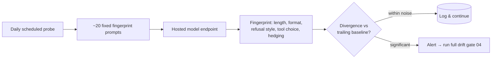
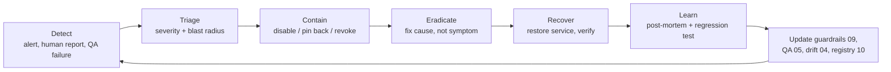
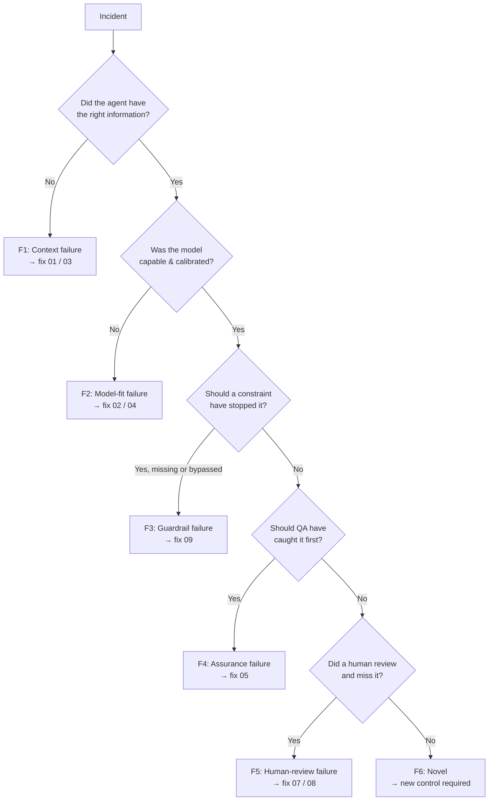

# 12 — AI Incident Response & Runtime Observability

*Prevention is half a safety system. This is the other half: seeing what agents actually do in production, and knowing exactly what to do when one goes wrong.*

**Concerns covered:** the gap identified in the [Architect Review](architect-review-and-recommendations.md) (**R5**) — [09](09-guardrails-and-grounding.md) is entirely preventive; nothing in the framework covered detection, containment, or recovery.
**Related:** [09 Guardrails & Grounding](09-guardrails-and-grounding.md), [10 Agent Registry](10-agent-inventory-and-registry.md), [05 Agent QA](05-agent-qa-and-regression-framework.md), [04 Drift Management](04-model-drift-management.md), [11 Measurement](11-measurement-baselines-and-roi.md).

---

## 1. Why this exists

Guardrails ([09](09-guardrails-and-grounding.md)) assume we can anticipate the failure. Some we can. The rest arrive as surprises: a model silently updated server-side, a prompt-injection payload in a dependency's README, an agent whose scope quietly widened after a refactor, a confidently wrong recommendation that a junior engineer shipped three sprints ago and nobody caught.

Given the number of agents already live across CES ([10](10-agent-inventory-and-registry.md)), an incident is a **when**, not an if. The measure of a mature programme is not zero incidents — it is **short time-to-detect, contained blast radius, and an incident that can never happen the same way twice.**

> **The rule that makes this document worth having:** *every incident ends with a regression test in the QA harness.* If it doesn't, we have paid the cost of the incident and bought nothing with it.

---

## 2. What counts as an AI incident

| Category | Example |
| --- | --- |
| **Correctness** | Confidently wrong output reached production, a customer, or a decision |
| **Data exposure** | Confidential/Restricted content sent to a model or tier that wasn't approved |
| **Injection** | Untrusted content (web, doc, dependency, ticket, tool result) altered agent behaviour |
| **Runaway** | Agent looped, over-consumed tokens, or exceeded its intended scope |
| **Unauthorised action** | Agent wrote, deleted, deployed, or messaged beyond its remit |
| **Drift** | Behaviour changed without a version change (silent server-side model update) |
| **Grounding failure** | Agent fabricated a source, an API, a metric, or a policy that does not exist |
| **Dependency** | An upstream provider outage, deprecation, or policy change broke an agent |

**Not an incident:** an agent producing a wrong draft that the human review caught. That is the system working. Log it as a quality signal ([11](11-measurement-baselines-and-roi.md)); do not run an incident process on it. Over-declaring incidents is how incident processes die.

### Severity

| Sev | Definition | Response | Post-mortem |
| --- | --- | --- | --- |
| **SEV1** | Customer impact, data exposure (Confidential/Restricted), or unauthorised production change | Immediate; page the owner; contain within the hour | Mandatory, within 5 business days |
| **SEV2** | Internal system impact, wrong output merged and shipped internally, significant unplanned spend | Same business day | Mandatory |
| **SEV3** | Contained failure with no external impact; recurring quality defect from one agent | Next business day | Lightweight |
| **SEV4** | Near miss — a guardrail or human caught it | Log only | Trend review; **counted, never punished** |

> **Track SEV4 near misses deliberately.** They are free information about where the next SEV1 will come from, and they are the only category that gets *more* honest when you make reporting them safe.

---

## 3. Runtime observability — what to log

You cannot respond to what you cannot see. Required for **R2/R3** agents ([10 §5](10-agent-inventory-and-registry.md)); optional and cheap for R1.

| Field | Why it's needed in an incident |
| --- | --- |
| `session_id`, `agent_id`, `run_id` | Correlate across systems; join to the Run Record ([11 §4](11-measurement-baselines-and-roi.md)) |
| `release_id` + component manifest | Reconstruct the exact prompt, policy, retrieval, tool contracts, environment, and evaluator versions tested ([05 §6.2](05-agent-qa-and-regression-framework.md)) |
| `deployment_profile` + model/provider/exact version | Answers "did the model or data-handling endpoint change?" in seconds instead of days |
| `initiating_user` / trigger | Who or what started this, and was it expected |
| `runtime_principal` | Which workload identity actually exercised authority; must resolve to one agent/environment |
| `context_sources` (versioned refs/hashes, not contents) | What it was grounded on; whether a poisoned or stale source was in scope |
| `tool_request` + canonical action digest + result/receipt ref | The action trail — the single most important forensic evidence, without copying sensitive payloads |
| `authorization_decision` + action-policy version | Why the runtime allowed/denied the tool, resource, and parameters ([09 §3.4](09-guardrails-and-grounding.md)) |
| `approval_receipt` hash/ref, approver, expiry | Proves whether the exact consequential action was approved and whether approval was mutated/replayed |
| `resources_touched` (files, tables, endpoints) | **Blast radius**, computed rather than guessed |
| `guardrail_events` (triggered / bypassed) | Which defence fired, which didn't |
| `tokens` + cost | Runaway detection |
| `outcome` + human decision | Whether a human accepted, edited, or rejected it |
| `citations_claimed` | Enables automated fabrication checks (§4) |

**Log references, not payloads.** Store artefact IDs, canonical action digests, file paths, receipts, and hashes — not confidential content itself. An observability store that accumulates the sensitive data you were protecting is a new incident waiting to happen. Scrub before write, use append-only/tamper-evident storage for R3 audit events, and set purpose-based access and retention under [11 §4.1](11-measurement-baselines-and-roi.md).

### Detection signals worth automating

| Signal | Detects | Cheap implementation |
| --- | --- | --- |
| Cost/token spike vs. that agent's own median | Runaway loops, prompt bloat | Threshold alert from the run record |
| Tool/resource/parameter outside the registered action envelope | Scope creep, hijack, confused deputy | Alert on runtime-policy denial; never rely on historical pattern alone |
| Approval mutation, replay, or expired receipt | Approval laundering / stale consent | Verify signed receipt digest at commit |
| Guardrail trip rate change | Guardrail drift after a model update | Weekly trend per agent |
| Citation that resolves to nothing | Fabricated sources | Automated link/path resolution on `citations_claimed` |
| Resources touched outside declared scope | Unauthorised action | Diff against registry `blast_radius` |
| **Canary probe divergence** | **Silent server-side model swap** | See §4 |

### The canary probe (silent-swap detection)

Hosted models change beneath you without a version bump — the failure mode [04 §10](04-model-drift-management.md) asks about and cannot currently answer.

**Fix:** run a small, fixed set of ~20 fingerprint prompts against every hosted model on a daily schedule. They should be chosen for *stylistic and structural* sensitivity, not just correctness — response length, formatting habits, refusal phrasing, tool-choice preference, and hedging language shift long before accuracy does. Store the response fingerprints; alert on a statistically significant divergence from the trailing distribution.



This costs a few cents a day and converts an unanswerable question into a monitored one. It is the highest-leverage item in this document.

---

## 4. The response loop



| Phase | Actions | Time target (SEV1) |
| --- | --- | --- |
| **Detect** | Alert fires or a human reports it. Any engineer can declare an incident — no approval needed | — |
| **Triage** | Identify the agent in the registry; confirm severity; compute blast radius from `resources_touched` | 15 min |
| **Contain** | Disable the agent (§5), pin back to the prior model version, revoke credentials, halt in-flight runs | 60 min |
| **Eradicate** | Fix the actual cause using the fault taxonomy (§6) — not just the visible symptom | Varies |
| **Recover** | Re-enable behind the QA harness; verify with the new regression test; canary before full restore | Varies |
| **Learn** | Blameless post-mortem; **new regression test merged**; framework docs updated | 5 business days |

**Containment default:** when severity is uncertain, **contain first and investigate second.** An agent disabled for two hours in error is a minor inconvenience; an agent left running during an investigation is how a SEV2 becomes a SEV1.

---

## 5. The kill switch (the capability nobody builds until they need it)

Every R3 agent must have a **tested** way to be stopped. Untested kill switches do not exist.

| Level | Mechanism | Stops |
| --- | --- | --- |
| **1. Agent disable** | Feature flag / config toggle in the registry that the runtime honours | One agent, immediately |
| **2. Credential revoke** | Rotate or revoke the agent's token/key | The agent and anything sharing that credential |
| **3. Model pin-back** | Force the previous known-good model version | All agents on a bad model release |
| **4. Provider cut-off** | Block the endpoint at the network/gateway | Everything using that provider |

**Requirements:**
- The switch is operable by someone who did not build the agent, using a documented runbook, without needing a deploy.
- Every R3 agent's Level-1 disable path is **exercised quarterly** in a safe environment and after material runtime changes. Level 3 and provider cut-off paths are rotated across shared deployments quarterly and tested after their control plane changes. This is a fire drill, not a document.
- Flipping a switch is **never** treated as an overreaction in a review. Make it socially free to use.
- The registry ([10](10-agent-inventory-and-registry.md)) records who can flip it and when it was last tested.

---

## 6. The AI fault taxonomy (blameless post-mortem, made specific)

Generic post-mortems produce generic actions ("be more careful"). AI failures have a small, well-defined set of failure surfaces — **classify every incident into one and the corrective action becomes obvious and assignable.**



| Fault | Meaning | Corrective action lands in |
| --- | --- | --- |
| **F1 — Context** | Missing, stale, or misleading context/artifact | [01](01-context-engineering-and-transparency.md), [03](03-knowledge-artifacts-and-okf.md) — fix the artifact and its freshness check |
| **F2 — Model fit** | Wrong model for the task, or drift/over-confidence | [02](02-model-selection-and-fit.md), [04](04-model-drift-management.md) — re-tier the task, add a caution note |
| **F3 — Guardrail** | A constraint was missing, weak, or bypassed | [09](09-guardrails-and-grounding.md) — add the guardrail **and its test** |
| **F4 — Assurance** | The QA harness should have caught this and didn't | [05](05-agent-qa-and-regression-framework.md) — add the case; ask what else that gap hides |
| **F5 — Human review** | The reviewer accepted output they should have questioned | [07](07-enablement-and-interactive-training.md), [08](08-ai-dlc-process-and-integration.md) — a training lab, not a reprimand |
| **F6 — Novel** | Genuinely new failure mode | New control; consider whether the framework has a structural blind spot |

**F5 is the one to handle with care.** Blaming the reviewer teaches everyone to stop reporting. The correct response to a repeated F5 is to ask *"what made this hard to catch?"* and turn the answer into a training lab ([07 §4](07-enablement-and-interactive-training.md)) — ideally using the real (sanitised) artefact that fooled a competent engineer. Those make the most effective labs in the entire curriculum, because they are real.

### Post-mortem template

```markdown
# AI Incident Post-Mortem — <id>
- Severity: <SEV1-4>   Detected by: <alert | human | QA>   Date: <date>
- Agent: <agent_id + registry link>   Model + version: <exact>
- Timeline: detected → contained → recovered (with timestamps)

## What happened
<plain language, 5 sentences, no jargon>

## Blast radius
<systems, data, people, customers actually affected — computed from logs, not estimated>

## Fault classification
<F1-F6 + why> (multiple faults allowed — most real incidents have two)

## Why our defences didn't catch it
- Guardrail layer: <which layer failed, per 09 §4>
- Authorization/approval: <principal, action policy, decision, approval receipt>
- QA coverage gap: <what the harness didn't test>
- Detection gap: <why time-to-detect was what it was>

## Corrective actions
| Action | Owner | Due | Doc updated |
|---|---|---|---|
| **Regression test added to harness (mandatory)** | | | [05](05-agent-qa-and-regression-framework.md) |

## What we got right
<name the controls and people that worked — this section is not optional>
```

---

## 7. Feeding the framework (the loop that pays for itself)

An incident is expensive information. Extract all of it:

| Incident artefact | Becomes |
| --- | --- |
| The triggering input | A **regression test case** ([05 §7](05-agent-qa-and-regression-framework.md)) — mandatory |
| The failure pattern | A new **planted trap** in the trap ledger ([05 §3](05-agent-qa-and-regression-framework.md)) |
| The missing constraint | A new **guardrail spec + test** ([09 §5](09-guardrails-and-grounding.md)) |
| The model behaviour | A line in the **model caution note** ([04 §7](04-model-drift-management.md)) |
| The human miss | A **training lab** built from the real artefact ([07](07-enablement-and-interactive-training.md)) |
| The detection delay | A new **observability signal** (§3) |
| The registry inaccuracy | A **registry lint** ([10 §7](10-agent-inventory-and-registry.md)) |

> Measure this conversion. **"% of incidents that produced a merged regression test"** is the single best indicator of whether the programme is learning or just reacting. Target: 100% for SEV1–SEV3.

---

## 8. Roles during an incident

Keep it small; most AI incidents need three people, not a bridge call.

| Role | Who | Does |
| --- | --- | --- |
| **Incident lead** | Whoever declared it, until handed over | Owns severity, comms, and the timeline |
| **Agent owner** | From the registry ([10](10-agent-inventory-and-registry.md)) | Contains, diagnoses, remediates |
| **Enablement/QA** | AI Quality Engineer ([newCESTeamRoles](../newCESTeamRoles.md)) | Reproduces it, writes the regression test |
| **Security** | On call | SEV1 data-exposure and injection cases only |
| **Comms** | EM or lead | Only when customers or other teams are affected |

Use the existing company incident process and severity language wherever one exists. **Do not create a parallel AI incident process** — that is how AI becomes an exotic special case instead of normal engineering.

---

## 9. Anti-patterns

| Anti-pattern | Why it hurts | Fix |
| --- | --- | --- |
| Prevention-only safety programme | No detection, no recovery, no learning | This document |
| Untested kill switch | Fails exactly when needed | Quarterly drill (§5) |
| Blaming the reviewer (F5) | Kills reporting; incidents go underground | Blameless + build a lab |
| Post-mortem with no regression test | Same failure returns | Mandatory test (§7) |
| Logging full prompt/response payloads | Creates a new data-exposure surface | Log references + scrub + retain briefly |
| Separate "AI incident" process | Exoticises AI, splits muscle memory | Extend the existing process |
| Declaring incidents for caught drafts | Process fatigue; real signals get lost | Caught by review = quality signal, not incident |
| Assuming hosted models are stable | Silent swaps go unnoticed for weeks | Daily canary probe (§3) |

---

## 10. Metrics

| Metric | Target |
| --- | --- |
| **MTTD** — mean time to detect, by severity | ↓, trend published |
| **MTTC** — mean time to contain | SEV1 < 1 hour |
| % of incidents producing a merged regression test | 100% (SEV1–3) |
| Repeat-incident rate (same fault class, same agent) | → 0 |
| SEV4 near misses reported | ↑ early (means reporting is trusted), then ↓ |
| Kill-switch drills completed | 100% of R3 agents, quarterly |
| Canary-probe alerts → confirmed drift | Tracked (tune to keep false positives low) |
| % of R2/R3 agents with required logging live | 100% |

> Note the deliberate inversion: a **rising** near-miss count early in the programme is good news. It means people trust the process enough to report. Explain this to leadership before the first dashboard, not after.

---

## 11. Open questions to refine

- Which existing incident management process and tool do we extend, and what severity language do we inherit?
- Where do agent runtime logs live, what is the retention period, and who approves it?
- Who is on call for AI incidents outside business hours — and is that proportionate to current risk?
- What is the authority to disable a production agent, and can it be exercised without the owner present?
- Do our self-hosted Gemma deployments emit the fields in §3, or does that need instrumentation?
- What is the disclosure threshold — when do customers or leadership have to be told?
