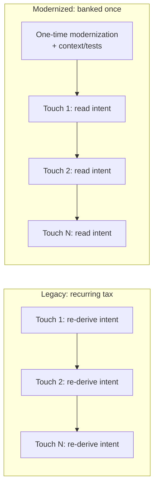
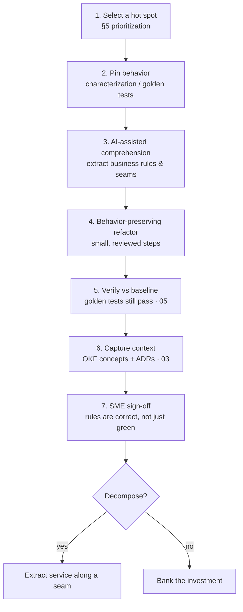

# 13 — Legacy Modernization for AI-Friendliness

*Spending comprehension tokens once, up front, so every future agent and developer spends far fewer.*

**Concerns covered:** modernizing 20+ year-old applications so both humans and AI agents can understand, change, and safely decompose them.
**Related:** [01 Context Engineering](01-context-engineering-and-transparency.md), [03 Knowledge Artifacts & OKF](03-knowledge-artifacts-and-okf.md), [05 Agent QA & Regression](05-agent-qa-and-regression-framework.md), [08 AI-DLC Process](08-ai-dlc-process-and-integration.md), [09 Guardrails & Grounding](09-guardrails-and-grounding.md), [11 Measurement & ROI](11-measurement-baselines-and-roi.md).

---

## 1. The problem

Much of CES runs on code that is 20+ years old: long procedural methods, mixed concerns, implicit business rules, dead branches, and naming that only makes sense to the one SME who has lived with it. The logic *is* recoverable — a junior developer or an agent can figure it out — but only by **burning a large amount of context (tokens) and time re-deriving intent every single time** the code is touched.

That re-derivation happens on every bug fix, every feature, every audit, every onboarding, and every agent run. The comprehension cost is paid **repeatedly** and never banked.

> The core insight: **comprehension cost on unstructured legacy code is a recurring tax; modernization converts it into a one-time investment.** Well-structured, modern code with good context is not cosmetic — it is a compounding asset.

---

## 2. The token economics

Treat "tokens to understand a unit of code" as a first-class metric.

Let:
- $C_{legacy}$ = tokens an agent/developer spends to safely understand the code *each time* it is touched.
- $C_{modern}$ = the same cost after modernization (lower, because intent is explicit).
- $N$ = number of future comprehension events (fixes, features, audits, agent runs, onboardings).
- $M$ = one-time modernization cost (human + AI tokens + review).

Modernization pays off when:

$$M + N \cdot C_{modern} < N \cdot C_{legacy}$$

which rearranges to a break-even touch count:

$$N^{*} = \frac{M}{C_{legacy} - C_{modern}}$$

The strategic consequence is simple: **hot, hard-to-understand, business-critical code crosses $N^{*}$ quickly and should be modernized first.** Cold, stable, rarely-touched code may never cross it and should be left alone (see §5). This is the same "enough context, not too much" discipline from [01](01-context-engineering-and-transparency.md), applied to the source itself.

Record $C_{legacy}$, $C_{modern}$, and $M$ per pilot component under [11](11-measurement-baselines-and-roi.md); do not quote a ROI multiple until measured on CES code.

---

## 3. What "AI-friendly code" actually means

AI-friendliness and human-friendliness are the **same target**. Both readers benefit from intent that is on the surface rather than in someone's head.

| Property | Legacy symptom | AI-friendly form |
| --- | --- | --- |
| **Small units** | 800-line method, deep nesting | Short, single-purpose functions with clear names |
| **Explicit business rules** | Magic numbers, implicit branches | Named constants, guard clauses, rules stated as code |
| **Separation of concerns** | I/O, validation, calculation, logging interleaved | Pure calculation isolated from side effects |
| **Types & contracts** | Stringly-typed, untyped dictionaries | Explicit types, value objects, clear signatures |
| **Determinism seams** | Hidden globals, static state | Injected dependencies, testable boundaries |
| **Tests as the contract** | None; behavior is folklore | Characterization/golden tests that pin behavior |
| **Context artifacts** | Tribal knowledge | Linked OKF concepts, ADRs, code maps ([03](03-knowledge-artifacts-and-okf.md)) |
| **No dead weight** | Commented-out code, unreachable branches | Removed; history lives in git |

The single highest-value move is **exposing the business logic**: pull the rules out of the procedural tangle so they can be read, tested, and later split into services.

---

## 4. The modernization process (behavior-preserving)

Modernization is **refactoring, not rewriting**. The behavior must not change unless a change is explicitly decided and recorded. AI accelerates every step but does not own the decision.

1. **Pin behavior first.** Before touching anything, generate characterization tests that capture *current* behavior — including quirks. These become the contract the refactor must satisfy (ties to the golden-baseline method in [05](05-agent-qa-and-regression-framework.md)).
2. **Comprehend with AI, decide with humans.** Use a strong model to summarize the code, list inferred business rules, flag dead code, and propose seams. Treat its output as *claims with evidence*, verified against tests and the SME ([01](01-context-engineering-and-transparency.md), [09](09-guardrails-and-grounding.md)).
3. **Refactor in small, reviewed steps.** Each step is behavior-preserving and passes the golden tests. No step both changes structure *and* changes behavior.
4. **Capture the recovered intent** as OKF concepts and ADRs so the comprehension is banked, not re-derived next time ([03](03-knowledge-artifacts-and-okf.md)).
5. **SME validates the rules, not just the green build.** A passing test proves behavior was preserved; only the SME confirms the *extracted rules* are the real rules.

---

## 5. Prioritization — do not modernize everything

Modernizing cold code is waste. Score candidates and modernize the top of the list:

$$\text{Priority} \sim \text{TouchFrequency} \times \text{ComprehensionDifficulty} \times \text{BusinessCriticality}$$

- **Touch frequency** — how often humans/agents read or change it (git history, agent logs).
- **Comprehension difficulty** — proxy by size, cyclomatic complexity, and measured tokens-to-understand.
- **Business criticality** — blast radius if it breaks.

Cold, stable, low-criticality code stays as-is; wrap it behind a stable interface if an agent must call it. This mirrors OKF capacity gating in [03 §6.1](03-knowledge-artifacts-and-okf.md): invest where it compounds.

---

## 6. Exposing business logic for microservices

Legacy decomposition fails when teams split by technical layer instead of by **business capability**. The modernization step that matters is making the seams visible:

- **Isolate pure business rules** from I/O, persistence, and transport. Pure functions are the easiest to extract and test.
- **Identify bounded contexts** — clusters of rules and data that change together — as candidate service boundaries.
- **Make side effects explicit** (injected clients, not hidden globals) so a boundary can be drawn without surprise coupling.
- **Prefer the strangler-fig pattern**: route new behavior to the extracted service while the monolith still runs; migrate incrementally, never big-bang.

The goal of the demo in §8 is exactly this: turn a procedural blob into modern code **with the business rules surfaced**, so a human can see where a service boundary could later be drawn.

---

## 7. Guardrails and anti-patterns

**Guardrails**
- Behavior-preserving by default; any intended behavior change is a separate, recorded decision.
- Golden tests are the merge gate ([05](05-agent-qa-and-regression-framework.md)); no green tests, no merge.
- Human + SME review is mandatory — modernization can silently drop an undocumented rule the tests didn't cover.
- Ground the model in the actual code and tests; never let it invent APIs or "improve" behavior unasked ([09](09-guardrails-and-grounding.md)).

**Anti-patterns**
- **Big-bang rewrite** — highest-risk, discards banked behavior; prefer incremental refactor + strangler-fig.
- **Modernizing cold code** — spends the investment where $N < N^{*}$.
- **Trusting an AI refactor without characterization tests** — you cannot prove behavior was preserved.
- **Losing the SME's implicit rules** — tests plus SME sign-off, not tests alone.
- **Splitting by layer, not capability** — produces distributed spaghetti.

---

## 8. Interactive demonstration

The training platform includes a **Modernize legacy** scene that makes this concrete ([Interactive AI Training Design](interactiveAITrainingDesign.md), [07](07-enablement-and-interactive-training.md)):

1. **Top box** — old, complicated procedural code (editable; a sample is provided).
2. **Modernize** — a strong model (Claude Opus 5.0) refactors it behavior-preservingly.
3. **Second box** — the modernized code.
4. **Third box** — a plain-language explanation, the **business rules it exposed**, and **candidate microservice boundaries**.

It is a teaching illustration, not a production modernization pipeline: the real process still requires characterization tests, SME sign-off, and verification against a golden baseline (§4).

---

## 9. Measurement

Track under [11](11-measurement-baselines-and-roi.md):

- **Tokens-to-comprehend** for a representative task, before vs after modernization.
- **Change lead time** and **defect rate** on modernized vs legacy components.
- **Onboarding time** for a junior developer to make a safe change.
- **Modernization cost** ($M$) and realized **break-even touch count** ($N^{*}$) per component.

If the measured numbers do not clear the break-even bar, stop modernizing that class of code — the discipline is to invest where it compounds, not everywhere.

---

## 10. Summary

Legacy comprehension is a recurring token tax. Modernization — done as behavior-preserving refactoring, pinned by golden tests, grounded in the real code, captured as OKF context, and signed off by the SME — converts that tax into a one-time, compounding investment. Target the hot, hard, critical code first, expose the business rules, and draw microservice seams only once the logic is visible.
