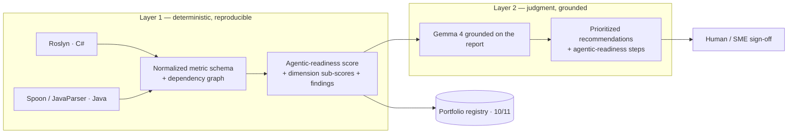

# 14 — Auditing Repositories for Agentic Readiness (Code)

*Rating hundreds of repos deterministically first, then grounding a model to write the recommendations — so the numbers are reproducible and the judgment is cheap.*

**Concerns covered:** how to audit large numbers of C# and Java repositories at scale and objectively decide whether each is modern and "agentic-ready." This document covers the **code** dimension; the **context** dimension (OKF, docs, ADRs) is covered next.
**Related:** [01 Context Engineering](01-context-engineering-and-transparency.md), [02 Model Selection](02-model-selection-and-fit.md), [03 Knowledge Artifacts & OKF](03-knowledge-artifacts-and-okf.md), [05 Agent QA & Regression](05-agent-qa-and-regression-framework.md), [10 Agent Inventory & Registry](10-agent-inventory-and-registry.md), [11 Measurement & ROI](11-measurement-baselines-and-roi.md), [13 Legacy Modernization](13-legacy-modernization-for-ai.md).

---

## 1. The problem

We have **hundreds of repositories**, a mix of C# and Java, spanning 20 years. We need to know, at portfolio scale, which are modern and **agentic-ready** — easy for an AI agent (and a junior developer) to understand and change safely — and which are liabilities.

Two naive approaches both fail at scale:

- **Manual SME review** — accurate but does not scale to hundreds of repos and re-derives the same judgment repeatedly.
- **LLM-only review** — a model reading every repo is expensive, **non-deterministic** (different score each run), hard to compare across repos, and prone to inventing metrics it cannot actually measure.

---

## 2. The architecture: deterministic rating, then grounded narrative

Split the audit into two layers with a strict contract between them.

**The contract:** Layer 1 produces the numbers; they are **authoritative, reproducible, and cache-able**. Layer 2 (the model) may **cite and interpret** the numbers but must never invent or change them. This is the same discipline as the model-comparison harness ([05 §2](05-agent-qa-and-regression-framework.md)) and keeps cost and variance under control.

Why this ordering:
- **Reproducible** — the same commit always yields the same score; you can gate merges and trend over time.
- **Cheap at scale** — static analysis runs in CI/nightly across hundreds of repos without model cost.
- **Comparable** — one normalized schema means C# and Java repos land on the same leaderboard.
- **Grounded** — the model spends tokens on *judgment and phrasing*, not on re-deriving metrics it can't reliably compute.

---

## 3. Tooling

| Language | Tool | Role |
| --- | --- | --- |
| C# | **Roslyn** (`Microsoft.CodeAnalysis.CSharp`) | Parse to a syntax tree/graph; compute complexity, size, nesting, dependency edges, doc coverage, test detection |
| Java | **Spoon** | Rich AST analysis and source transformation (also enables automated refactors later) |
| Java | **JavaParser** | Lightweight AST parsing for metrics where transformation is not needed |

All three emit into **one normalized metric schema** so the scoring model is language-agnostic. Roslyn and Spoon can also resolve semantic/type information for a more accurate dependency graph when a full build is available; syntax-only analysis is the fast path for portfolio sweeps.

> Static analysis only — **never execute audited code.** The auditor reads source; it does not run it.

---

## 4. The metric schema and rating

Per method: cyclomatic complexity, length, max nesting, parameter count.
Per type: method/field counts, public surface, size, and **dependency edges** to other in-repo types (the graph).
Per repo: aggregates plus documentation coverage, test presence, magic-number and TODO/HACK counts, console-I/O-in-logic, and nullable/typing signals.

These roll up into six **dimension scores (0–100)**, combined by fixed weights into an overall **agentic-readiness score** and an A–F grade:

| Dimension | Weight | What it rewards |
| --- | --- | --- |
| Modularity | 0.20 | Small methods and types, single responsibility |
| Complexity | 0.22 | Low cyclomatic complexity |
| Clarity | 0.18 | Named constants over magic numbers, shallow nesting, no TODO debt |
| Documentation | 0.12 | Documented public contract |
| Testability | 0.16 | Tests present, dependency-injection seams |
| Explicitness | 0.12 | Explicit types, nullable enabled, side effects separated |

Weights are a **starting profile**; calibrate them against SME-labeled repos before enforcing gates ([11](11-measurement-baselines-and-roi.md)). The point is that the weighting is **explicit and versioned**, not hidden in a model's head.

---

## 5. What "agentic-ready" means for code

The audit dimensions are proxies for one goal: **intent on the surface, not in someone's head.** Agentic-ready code is code an agent can safely change without re-deriving it every time ([13](13-legacy-modernization-for-ai.md)):

- Small, single-purpose units with low complexity and shallow nesting.
- **Business rules exposed** as named constants and cohesive methods, not buried in procedural branches.
- Tests as the behavioral contract, so an agent's change can be verified ([05](05-agent-qa-and-regression-framework.md)).
- A documented public API and a clear dependency graph that reveals seams.
- Paired with **context artifacts** — OKF concepts, ADRs, code maps ([03](03-knowledge-artifacts-and-okf.md)) — which the *context* audit will score separately.

---

## 6. Grounding (and later training) Gemma 4

Use the **right tool for the job** ([02](02-model-selection-and-fit.md)). The deterministic layer does the measuring; a smaller, cheaper model (Gemma 4) writes the recommendations because the hard reasoning — the metrics — is already done.

- **Ground** Gemma on the deterministic report (scores, findings, metrics, graph). It produces a summary, strengths, prioritized fixes, and concrete agentic-readiness steps — each tied to the numbers.
- **Train/tune** Gemma over time on SME-approved audit write-ups so its narrative matches house style and priorities, escalating only hard cases to a frontier model ([05 §10 grounding a smaller model](05-agent-qa-and-regression-framework.md)).
- **Never** let the model overwrite the rating; if it disagrees, that is a finding for a human, not a score change ([09](09-guardrails-and-grounding.md)).

---

## 7. Operating at portfolio scale

- Run Layer 1 in **CI and nightly sweeps** across all repos; store results keyed by repo + commit in the registry ([10](10-agent-inventory-and-registry.md)) and measurement backbone ([11](11-measurement-baselines-and-roi.md)).
- Produce a **portfolio heatmap and ranking**; trend scores over time to prove modernization is working.
- **Gate** new merges from regressing below a repo's baseline; **prioritize** modernization spend using the score × touch-frequency × criticality lens from [13 §5](13-legacy-modernization-for-ai.md).
- Only invoke the model layer where a human will read the output (a targeted repo, a PR, a modernization candidate) — the deterministic score is enough for the sweep itself.

---

## 8. Guardrails and anti-patterns

**Guardrails**
- Deterministic numbers are authoritative; the model narrates, it never rescoring.
- Static analysis only — audited code is never executed.
- Weights and thresholds are versioned and calibrated against SME labels before gating.
- Human/SME sign-off before a low score drives a decision (deprecate, rewrite, invest).

**Anti-patterns**
- **LLM-as-scorer** — non-reproducible, expensive, gameable; use it for judgment, not measurement.
- **One score, no dimensions** — hides *why* a repo is weak; keep the sub-scores.
- **Auditing without calibration** — a rating nobody validated is theater; label a sample and check agreement.
- **Metric worship** — a high score is necessary, not sufficient; the SME still owns correctness of business rules.

---

## 9. Interactive demonstration

The training platform includes an **Audit Repo (code)** scene ([Interactive AI Training Design](interactiveAITrainingDesign.md), [07](07-enablement-and-interactive-training.md)):

1. **Top box** — a small, editable C# project.
2. **Run audit** — Roslyn produces the deterministic report: overall score and grade, six dimension scores, findings, per-type metrics, and the **type dependency graph**.
3. **Third box** — Gemma 4's recommendations, grounded on that report: summary, strengths, prioritized fixes, and concrete agentic-readiness steps.

It demonstrates the two-layer contract end to end. Java support (Spoon / JavaParser) reuses the same normalized schema and scoring, and is the next extension.

---

## 10. Summary

Auditing hundreds of repos is tractable when you separate **measurement from judgment**: deterministic static analysis (Roslyn for C#, Spoon/JavaParser for Java) produces a reproducible agentic-readiness rating and dependency graph; a grounded, cheaper model turns that rating into prioritized, human-readable recommendations. Numbers first, narrative second, SME last — run at portfolio scale, gated in CI, and trended over time. The **context** audit is the companion to this code audit and comes next.
