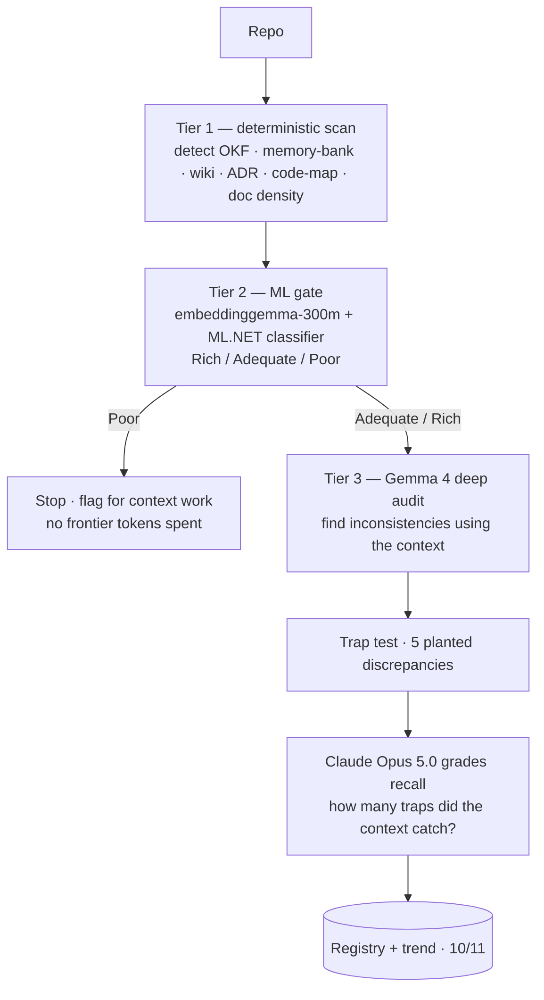

# 15 — Auditing Repositories for Agentic Readiness (Context)

*Deciding cheaply, across thousands of repos, whether the context is good enough for an agent — then proving it with a trap test, not an opinion.*

**Concerns covered:** how to audit the **context** of thousands of repositories (OKF bundles, memory banks, wikis, ADRs, doc comments) and objectively decide whether that context is sufficient for an AI agent to work safely. Companion to the **code** audit in [14](14-repo-audit-agentic-readiness.md).
**Related:** [01 Context Engineering](01-context-engineering-and-transparency.md), [02 Model Selection](02-model-selection-and-fit.md), [03 Knowledge Artifacts & OKF](03-knowledge-artifacts-and-okf.md), [05 Agent QA & Regression](05-agent-qa-and-regression-framework.md), [09 Guardrails & Grounding](09-guardrails-and-grounding.md), [10 Agent Inventory](10-agent-inventory-and-registry.md), [11 Measurement & ROI](11-measurement-baselines-and-roi.md), [14 Repo Audit — Code](14-repo-audit-agentic-readiness.md).

---

## 1. The problem, and why context is different from code

The code audit ([14](14-repo-audit-agentic-readiness.md)) answers *"is the code structured well?"* The context audit answers a harder question: *"is there enough documented, trustworthy knowledge for an agent to understand this repo without re-deriving everything?"*

Two things make context harder to audit than code:

- **Presence is not usefulness.** A repo can have a wiki, a README, and an OKF folder and still be useless — stale, contradictory, or disconnected from the code. Counting artifacts is necessary but not sufficient.
- **The real test is functional.** The only honest measure of context is whether it lets someone (or an agent) *answer questions and catch mistakes they could not catch from the code alone.*

So the audit needs both a cheap structural signal **and** a functional proof.

---

## 2. The three-tier funnel

At the scale of thousands of repos, you cannot run a frontier model over every repo. Use a funnel that spends effort in proportion to promise.

- **Tier 1 — deterministic scan (free, reproducible).** Detect the presence and shape of context structures and measure doc-comment density, prose ratio, and cross-links. Same discipline as the code audit: numbers first.
- **Tier 2 — ML gate (cheap, learned).** `embeddinggemma-300m` produces embeddings of the context; **ML.NET** classifies the repo as Rich / Adequate / Poor from the embeddings plus the Tier-1 features. This is the scale enabler — a **Poor** verdict stops the funnel before any frontier tokens are spent. Use the **right tool for the job** ([02](02-model-selection-and-fit.md)): a 300M embedding model + a small classifier is the correct instrument for a portfolio sweep.
- **Tier 3 — Gemma 4 deep audit + trap test (functional proof).** Only repos that pass the gate get the expensive audit. Gemma uses the context to find inconsistencies. Then the **trap test** validates the context objectively: plant known discrepancies the context should reveal, and measure how many Gemma catches. **Claude Opus 5.0** grades recall against the known traps — an independent grader ([05 §2](05-agent-qa-and-regression-framework.md)).

---

## 3. The trap test — the heart of the method

This makes context quality **measurable** instead of subjective, and directly realizes concern #8 (plant traps and challenge agents to find them) from [05](05-agent-qa-and-regression-framework.md).

1. Take code plus its documented context (rules, ADRs, OKF concepts).
2. Plant **N known discrepancies** that are only detectable by reading the context — e.g., the code uses a 2.5% rate while the rule says 1.5%, or omits a documented grace period.
3. Give Gemma the code + context (never the trap list) and ask it to find inconsistencies.
4. An independent grader (Claude) compares Gemma's findings to the known traps and reports **traps found / total**, plus false positives.

The score is a **recall of context-dependent defects**. High recall means the context is genuinely useful; low recall means the context is decorative. Rotate and expand the trap bank so agents cannot memorize it ([05](05-agent-qa-and-regression-framework.md)).

---

## 4. Tooling

| Tier | Tool | Role |
| --- | --- | --- |
| 1 | Deterministic scanner (in-process) | Detect OKF / memory-bank / wiki / ADR / code-map; measure doc density, prose ratio, links |
| 2 | [`embeddinggemma-300m`](https://huggingface.co/google/embeddinggemma-300m) via ONNX Runtime | Embed the context for semantic signal |
| 2 | [ML.NET](https://www.nuget.org/packages/Microsoft.ML/) (+ [`Microsoft.Extensions.ML`](https://www.nuget.org/packages/Microsoft.Extensions.ML/) for pooled prediction) | Classify Rich / Adequate / Poor from embeddings + structural features |
| 3 | Gemma 4 | Deep audit — find inconsistencies using the context |
| 3 | Claude Opus 5.0 | Independent grader of the trap test |

**Honest implementation note.** In the interactive demo, Tiers 1 and 2 run fully in .NET. The **real `embeddinggemma-300m` int8 ONNX model runs in-process** (ONNX Runtime + the Gemma SentencePiece tokenizer) and embeds every item in a small labeled corpus at startup; each 768-dim embedding is **PCA-reduced and concatenated with the deterministic structural features**, then trained through a real ML.NET `SdcaMaximumEntropy` multiclass classifier. At audit time the same structural + embedding features drive the prediction, and a rich/poor prototype cosine is shown as an interpretability signal. If the model files are absent the service **fails soft** to structural-only features. The labeled corpus is illustrative and is replaced with SME-labeled CES repos before production gating; the trap test and Claude grading are implemented end to end.

---

## 5. Training the gate over time

The Tier-2 classifier is only as good as its labels.

- **Seed** with a small SME-labeled set (Rich / Adequate / Poor) to bootstrap.
- **Grow** the training set from trap-test outcomes: repos whose context reliably catches traps are strong positive labels; repos that pass Tier 2 but fail the trap test are the most valuable *hard negatives* — they look context-rich but aren't.
- **Recalibrate** thresholds against a sealed holdout so the gate is not tuned on its own exam ([05 §holdout discipline](05-agent-qa-and-regression-framework.md)).
- **Version** the model, the seed set, and the trap bank; record them with each audit ([11](11-measurement-baselines-and-roi.md)).

This closes the loop: the functional trap test supervises the cheap gate.

---

## 6. Guardrails and anti-patterns

**Guardrails**
- Presence ≠ usefulness — never pass a repo on structure alone; the trap test is the proof.
- The grader is a **different model** than the auditor, with ground-truth traps ([05](05-agent-qa-and-regression-framework.md)).
- Gemma never sees the trap list; leaking it invalidates the recall measure.
- Deterministic + ML numbers are authoritative for the gate; models supply judgment, not the score ([09](09-guardrails-and-grounding.md)).
- Static analysis only — audited code is never executed.

**Anti-patterns**
- **Counting artifacts as quality** — a stale wiki scores high structurally and fails the trap test.
- **Frontier model on every repo** — defeats the purpose; the funnel exists to avoid this.
- **A fixed trap bank** — agents memorize it; rotate and expand.
- **Ungrounded model score** — if the model invents the readiness number, it is not reproducible or comparable.

---

## 7. Interactive demonstration

The training platform includes an **Audit Repo (context)** scene ([Interactive AI Training Design](interactiveAITrainingDesign.md), [07](07-enablement-and-interactive-training.md)):

1. **Block 1** — code together with its documented context (editable; a sample with a documented late-fee policy and an implementation is provided).
2. **Block 2** — the initial audit by the deterministic scan + ML.NET classifier (embeddinggemma-300m in production): detected structures, a readiness score, and a Rich/Adequate/Poor gate. A **Poor** gate stops here.
3. **Block 3** — Gemma 4's deep audit: an overview and the gaps it found using the context.
4. **Block 4** — Claude Opus 5.0's trap-test grade: how many of the 5 planted discrepancies Gemma caught, what it missed, and any false positives, with the ground-truth traps revealed after grading.

It demonstrates the full funnel and the functional proof on one screen.

---

## 8. Summary

Context quality cannot be judged by counting artifacts, and it cannot be judged at portfolio scale by a frontier model on every repo. The answer is a funnel: a **deterministic scan** and a **cheap ML gate** (embeddinggemma-300m + ML.NET) decide who deserves a deep look, and a **trap test graded by an independent model** proves — as a recall number — whether the context actually lets an agent catch what the code alone cannot. Numbers gate, the trap test proves, the SME owns the labels, and the loop trains the gate over time. Together with the code audit ([14](14-repo-audit-agentic-readiness.md)), this tells CES which repos are truly agentic-ready.
