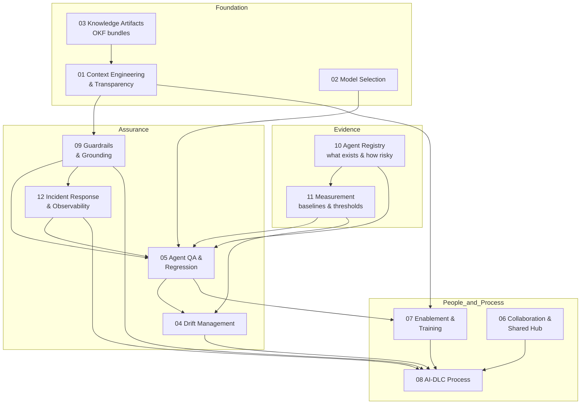
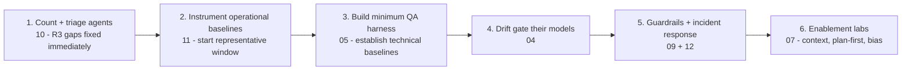

# AI Across CES — Program Documentation Hub

*Cross Enterprise Services — a senior-architect framework for running AI agents with quality, transparency, and cost discipline.*

**Owner:** AI Enablement Lead / Architect
**Status:** Draft v0.1 — living documents, built to be refined
**Last updated:** 2026-09-02

---

## Why this exists

There are already many agents in use across CES, and the primary concern is **quality**. This document set turns that concern into an engineering discipline: how we give agents enough context, pick the right model, verify their work, catch model drift, share knowledge, and teach our people — so that AI is a transparent, tested capability rather than a black box.

Parent strategy: [../AIAcrossCESMaximizingItsPotential.md](../AIAcrossCESMaximizingItsPotential.md)

**New to this?** Start with [../OverviewOfNewAITeam.md](../OverviewOfNewAITeam.md) — a plain-language summary of every area and why it matters. Team structure and decision rights are in [../newCESTeamRoles.md](../newCESTeamRoles.md).

---

## How the documents map to your concerns

Each of the 13 concerns you raised is owned by a document below. Nothing is lost; several concerns are deliberately grouped where they reinforce each other.

| # | Your concern | Owning document |
| --- | --- | --- |
| 1 | Agents need enough context; not a black box; inspect sources, assumptions, actions, and questions | [01 — Context Engineering & Transparency](01-context-engineering-and-transparency.md) |
| 2 | Right LLM for the job (Opus vs Gemini for GCP migration, etc.) | [02 — Model Selection & Fit-for-Purpose](02-model-selection-and-fit.md) |
| 3 | Correct context artifacts & shared structures understood by all LLMs (OKF) | [03 — Knowledge Artifacts & OKF](03-knowledge-artifacts-and-okf.md) |
| 4 | Process to check for drift when an LLM version changes, before adoption | [04 — Model & Version Drift Management](04-model-drift-management.md) |
| 5 | Regression tests for prompts/agents; grounding & guardrails; context-vs-training confusion | [09 — Guardrails & Grounding](09-guardrails-and-grounding.md) + [01](01-context-engineering-and-transparency.md) (context vs training) + [05](05-agent-qa-and-regression-framework.md) (regression) |
| 6 | Centralized chat with the agent *in the room*; capture shared ideas/prompts + context | [06 — Collaboration & Shared Prompt/Context Hub](06-collaboration-and-shared-prompt-hub.md) |
| 7 | Golden-baseline testing: agents change a repo, judged vs baseline, drift + LLM review | [05 — Agent QA & Regression Framework](05-agent-qa-and-regression-framework.md) |
| 8 | QA context: clone a % of CES repos, plant traps, challenge agents to find & document them | [05 — Agent QA & Regression Framework](05-agent-qa-and-regression-framework.md) |
| 9 | Agent writes JIRA stories to rebuild the golden baseline, then rebuilds & tests to match | [05 — Agent QA & Regression Framework](05-agent-qa-and-regression-framework.md) |
| 10 | Strong LLM grounds/trains Gemma 4 (31B) to write stories + implement — right tool for the job | [05 — Agent QA & Regression Framework](05-agent-qa-and-regression-framework.md) + [02](02-model-selection-and-fit.md) |
| 11 | Interactive training inside VS Code | [07 — Enablement & Interactive Training](07-enablement-and-interactive-training.md) + [Interactive AI Training Design](interactiveAITrainingDesign.md) |
| 12 | Team learns to ask questions; demand plans with executive summaries + diagrams; not a black box | [07 — Enablement & Interactive Training](07-enablement-and-interactive-training.md) + [01](01-context-engineering-and-transparency.md) |
| 13 | Build the AI-DLC process starting with AI; integrate with teams' existing processes | [08 — AI-DLC Process & Integration](08-ai-dlc-process-and-integration.md) |
| + | Interactive multimedia training platform (VSIX client, model adapters, Blazor UI, narration, observable decision traces); teach purpose over "document theater" | [Interactive AI Training Design](interactiveAITrainingDesign.md) |

### Added after the architect review

Three gaps were identified by the [self-critique](architect-review-and-recommendations.md) and are now owned by documents of their own. They are foundational rather than additional — the original nine assumed all three existed.

| Gap | Why it was missing-critical | Owning document |
| --- | --- | --- |
| We don't know which agents exist, who owns them, or how risky they are | Every other document assumes this is known; none established it | [10 — Agent Inventory, Risk Tiering & Lifecycle Registry](10-agent-inventory-and-registry.md) |
| Every threshold said "TBD after baseline", with no baselining method | Un-enforceable gates and unprovable ROI | [11 — Measurement Backbone, Baselines & Value Realization](11-measurement-baselines-and-roi.md) |
| Guardrails covered prevention only — no detection, containment, or learning | Prevention without response is half a safety system | [12 — AI Incident Response & Runtime Observability](12-ai-incident-response-and-observability.md) |

The remaining review recommendations were applied **inside** existing documents rather than as new ones: operator-induced prompting bias ([01 §4.4](01-context-engineering-and-transparency.md)), human-anchored evaluation that fixes the LLM-judging-LLM circularity ([05 §2.1](05-agent-qa-and-regression-framework.md)), responsible-AI exposure — IP, fairness, compliance ([09 §6](09-guardrails-and-grounding.md)), OKF capacity gating ([03 §6.1](03-knowledge-artifacts-and-okf.md)), change management and authority ([08 §4.1–4.2](08-ai-dlc-process-and-integration.md)), and build gates on the training platform ([Interactive Design §14.1](interactiveAITrainingDesign.md)).

---

## The documents

1. [01 — Context Engineering & Transparency](01-context-engineering-and-transparency.md)
2. [02 — Model Selection & Fit-for-Purpose](02-model-selection-and-fit.md)
3. [03 — Knowledge Artifacts & OKF](03-knowledge-artifacts-and-okf.md)
4. [04 — Model & Version Drift Management](04-model-drift-management.md)
5. [05 — Agent QA & Regression Framework](05-agent-qa-and-regression-framework.md)
6. [06 — Collaboration & Shared Prompt/Context Hub](06-collaboration-and-shared-prompt-hub.md)
7. [07 — Enablement & Interactive Training](07-enablement-and-interactive-training.md)
8. [08 — AI-DLC Process & Integration](08-ai-dlc-process-and-integration.md)
9. [09 — Guardrails & Grounding](09-guardrails-and-grounding.md)
10. [10 — Agent Inventory, Risk Tiering & Lifecycle Registry](10-agent-inventory-and-registry.md)
11. [11 — Measurement Backbone, Baselines & Value Realization](11-measurement-baselines-and-roi.md)
12. [12 — AI Incident Response & Runtime Observability](12-ai-incident-response-and-observability.md)
13. [13 — Legacy Modernization for AI-Friendliness](13-legacy-modernization-for-ai.md)
14. [14 — Auditing Repositories for Agentic Readiness (Code)](14-repo-audit-agentic-readiness.md)
15. [15 — Auditing Repositories for Agentic Readiness (Context)](15-repo-audit-context-readiness.md)
16. [16 — A Model-Native Language for the Business-Logic Layer (CLARA)](16_pocLLMOwnLanguage.md)
17. [17 — Does the Representation Change What an Agent Gets Right? (CLARA A/B Test)](17_pocLLMOwnLanguageTest.md)

**Leadership & team:**
- [Overview of the New AI Team](../OverviewOfNewAITeam.md) — plain-language executive summary of every area and its importance. **Start here if you are new.**
- [New CES Team Roles](../newCESTeamRoles.md) — role definitions, staffing sequence, decision rights, and document ownership.
- [My New Director Role](MyNewDirectorRole.md) — the leadership objectives this programme is now steered by.
- [Enhancing the Current Interactive Training](enhancingCurrentInteractiveTraining.md) — design that turns those objectives into a phased curriculum, and the corrections applied to earlier claims.

**Platform design:**
- [Interactive AI Training Design](interactiveAITrainingDesign.md) — the multimedia training platform (VSIX client ↔ training server ↔ Blazor UI) that delivers the enablement curriculum in [07](07-enablement-and-interactive-training.md). Staged behind explicit build gates (§14.1).

**Meta / review:**
- [Architect Review & Recommendations](architect-review-and-recommendations.md) — self-critique of this framework, prioritized recommendations, an explicit "do not build" list, and a minimum critical path. Read this before expanding the framework.

---

## How everything fits together

**Read it as:** we first establish **what exists and how it is measured** (evidence), which makes **guardrails, QA, drift control, and incident response** (assurance) enforceable, on top of good **context, artifacts, and model choice** (foundation) — all of it operationalized day to day by our **people and process**.

---

## The minimum critical path

If only six things happen, these are they — in this order. Everything else is valuable but sequenced behind this spine ([Architect Review §5](architect-review-and-recommendations.md)).

> **Start with the agents you already have, riskiest first.** Do not delay a known safety fix to preserve a clean baseline. Operational baselining and minimum-harness construction overlap; the harness produces the two technical baselines it needs to gate later releases ([11 §5](11-measurement-baselines-and-roi.md)).

---

## Maturity model (self-assessment)

Use this to place each team and track progress. Details live in each document.

| Level | Name | Hallmarks |
| --- | --- | --- |
| 0 | **Ad hoc** | Agents used casually; no shared prompts; output trusted blindly; no QA |
| 1 | **Aware** | Runnable agents registered with named owners and immutable release/model versions; basic prompt hygiene; outputs remain human-reviewed |
| 2 | **Managed** | Shared artifacts (OKF), model-selection guidance, code review of AI output, baselines measured |
| 3 | **Assured** | Golden-baseline & trap-finding QA, drift checks on new models, guardrails enforced, incidents detected and stopped |
| 4 | **Optimized** | AI-DLC end to end, cross-model delegation, continuous regression, measured ROI at Grade A |

> Level 1 now begins with **registration**, not prompt hygiene. Knowing what you have is the first honest step out of ad hoc.

---

## Governance & cadence (program level)

| Activity | Frequency | Output |
| --- | --- | --- |
| AI Champions sync | Weekly | Wins, blockers, new patterns |
| Agent QA review | Bi-weekly | Golden-baseline, trap, ablation & canary results |
| Model/version drift review | On release + quarterly | Go/No-Go for new model adoption |
| Silent-swap canary probe | Daily (automated) | Alert when a hosted model changes beneath us ([12 §3](12-ai-incident-response-and-observability.md)) |
| Registry & orphan sweep | Monthly | Ownership, tier accuracy, reconciliation gap ([10](10-agent-inventory-and-registry.md)) |
| Artifact (OKF) health check | Monthly | Coverage, staleness, validator status |
| Metrics & ROI review | Monthly | Paired metrics; quality, adoption, cost ([11](11-measurement-baselines-and-roi.md)) |
| Kill-switch drill | Quarterly | Proof that R3 agents can actually be stopped ([12 §5](12-ai-incident-response-and-observability.md)) |
| Framework refinement | Quarterly | Updates to these documents — **including what we delete** |

---

## Glossary (shared language — expand freely)

| Term | Meaning |
| --- | --- |
| **Agent** | A deployed or runnable configuration that uses a model for a repeatable purpose and may invoke tools or affect another system. Prompts/instructions are linked components, not separate agents. |
| **Agent release** | One immutable combination of model, prompts, policies, retrieval, tools, and runtime environment — the unit QA tests and operations deploy. |
| **Context** | Everything provided to the model *at inference time* for one session/request. |
| **Training / fine-tuning** | Changing model *weights* offline. Not the same as context. See [01](01-context-engineering-and-transparency.md). |
| **Grounding** | Anchoring answers in provided, verifiable sources rather than model memory. |
| **Guardrail** | A constraint that keeps an agent within safe, correct bounds. |
| **Decision trace** | Observable sources, assumptions, options, tool/action records, approvals, and verification results. It is not private chain-of-thought. See [01 §4.1](01-context-engineering-and-transparency.md). |
| **Action envelope** | Machine-enforced tools, resources, parameters, limits, and approval rules available to one agent release. See [09 §3.4](09-guardrails-and-grounding.md). |
| **Golden baseline** | A known-good reference repo/output used to judge agent changes. See [05](05-agent-qa-and-regression-framework.md). |
| **Drift** | A change in model behavior across versions that alters output quality/safety. See [04](04-model-drift-management.md). |
| **OKF** | Open Knowledge Format — linked Markdown knowledge graph for agents. See [03](03-knowledge-artifacts-and-okf.md). |
| **AI-DLC** | AI Development Life Cycle — a delivery process designed around AI first. See [08](08-ai-dlc-process-and-integration.md). |
| **Risk tier (R0–R3)** | An agent's risk level, derived from blast radius × autonomy × data tier. Decides which controls it owes. See [10 §4](10-agent-inventory-and-registry.md). |
| **Blast radius** | How far a mistake by this agent could spread — sandbox, repo, team system, shared production, customer. See [10 §4](10-agent-inventory-and-registry.md). |
| **Gold set** | A small, sealed, human-labelled evaluation set that anchors LLM-as-judge scoring. See [05 §2.1](05-agent-qa-and-regression-framework.md). |
| **Ablation trap** | Deliberately removing a required fact to test whether the agent asks or fabricates. See [05 §3.2](05-agent-qa-and-regression-framework.md). |
| **Grounding canary** | A unique synthetic fact planted in a QA copy of an artifact to prove an agent actually read it. See [05 §3.3](05-agent-qa-and-regression-framework.md). |
| **Evidence grade (A–D)** | How well-supported a reported number is: measured, inferred, self-reported, or anecdotal. See [11 §8.1](11-measurement-baselines-and-roi.md). |
| **Paired metric** | A metric that may never be reported without its counterweight (speed with rework, cost with quality). See [11 §3](11-measurement-baselines-and-roi.md). |

---

*These are working documents. Every section is meant to be challenged, extended, and refined by the CES community.*
