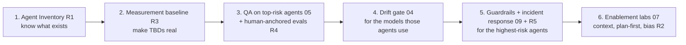

# Architect Review & Recommendations

*A self-critique of the AI-Across-CES framework by its author (Claude Opus 4.8, acting SME), prepared for a second-opinion review by Claude Opus 5.0 and by you.*

**Status:** Recommendations **implemented and independently re-audited** — see the status table in [§9](#9-implementation-status-updated-2026-09-02), the second-opinion pass in [§10](#10-second-opinion-review--explicit-disagreements-and-removals), and the independent SME audit in [§11](#11-independent-sme-audit--contracts-not-more-documents). Sections 0–8 are preserved unchanged as the original critique.
**Date:** 2026-09-02 (original) · 2026-09-02 (implementation, second opinion, and independent SME audit)
**Scope reviewed:** [README](README.md), [01](01-context-engineering-and-transparency.md)–[09](09-guardrails-and-grounding.md), [Interactive AI Training Design](interactiveAITrainingDesign.md), and the parent [AIAcrossCESMaximizingItsPotential.md](../AIAcrossCESMaximizingItsPotential.md).
**Independent audit scope:** the complete current corpus — [01](01-context-engineering-and-transparency.md)–[12](12-ai-incident-response-and-observability.md), training design, strategy, overview, roles, hub, and this review.

---

## 0. How I approached this — and my own biases (disclosure)

You made a sharp point: directing an LLM can inject bias, and I hadn't been given room to push back. So this review is deliberately **adversarial toward my own work**. Before the recommendations, here are biases you should discount for as you read:

- **Additive bias.** My training pulls me toward "add more" — more docs, more process, more controls. I have actively resisted this; see §4 (things I recommend *not* doing).
- **Completeness bias.** I tend to make frameworks look exhaustive. Exhaustive is not the same as useful; a framework nobody adopts is worthless.
- **Fluency-as-correctness risk.** I write confidently. Confident prose is not evidence. Where I assert numbers or capabilities, I've flagged what is unverified (§2, item S6).
- **Self-consistency pressure.** Having authored these docs, I'm motivated to defend them. I've tried to attack them instead.

**Net recommendation up front:** the single most valuable thing you can do is **not add anything** first — it's to **prune and sequence** what already exists into a minimum critical path (§5). The framework is currently broad and could itself become shelfware — the exact "document theater" failure we warn teams about.

---

## 1. Honest verdict on the current framework

**Strengths (keep):**
- Coverage is genuinely complete against your 13 concerns; the concern→doc mapping holds.
- The separation of **grounding vs guardrails**, **context vs training**, and **model-selection vs QA** is sound and non-obvious — those are the parts most orgs get wrong.
- The QA framework ([05](05-agent-qa-and-regression-framework.md)) and drift gate ([04](04-model-drift-management.md)) are the strongest, most differentiated pieces.

**Core weakness:** the framework describes an *end state* well but under-specifies the *starting move* and the *evidence spine*. Almost every threshold says "TBD after baseline," yet nothing defines **how baselines are established, where the data lives, or what the first 90 days actually prioritize** beyond per-doc rollouts. That's the gap most likely to cause failure.

---

## 2. Self-critique of specific documents (real weaknesses)

| # | Where | Weakness | Severity |
| --- | --- | --- | --- |
| S1 | [05](05-agent-qa-and-regression-framework.md) + [04](04-model-drift-management.md) | **Circular reliance on LLM-as-judge.** We use LLMs to judge LLMs, while simultaneously warning (correctly) that LLMs drift and are over-confident. Who watches the watcher? There's a mention of "judge–human agreement" but no human-anchored gold set as the ultimate ground truth. | High |
| S2 | All | **Thresholds are all "TBD."** A framework of gates with no numbers can't actually gate anything. Needs a baseline methodology (see R3). | High |
| S3 | [03](03-knowledge-artifacts-and-okf.md) | **OKF maintenance burden underweighted.** We flag staleness but assume capacity to maintain bundles + CI validation that may not exist. Risk: bundles rot and become misleading — worse than none, as the doc itself admits. Needs an explicit "capacity check before adopting" gate. | Medium |
| S4 | [interactiveAITrainingDesign](interactiveAITrainingDesign.md) | **Ambition/cost risk.** A VSIX client + Blazor server + narration + streaming is a real product. Building it before cheaper enablement (labs, walkthroughs from [07](07-enablement-and-interactive-training.md)) proves demand is a classic over-build. Should be explicitly staged *behind* validated content. | Medium |
| S5 | [interactiveAITrainingDesign §7](interactiveAITrainingDesign.md) | **Unverified Gemma-3 TTS assumption.** I flagged it, but it remains an architectural dependency on an unconfirmed capability. Must be verified before P2. | Medium |
| S6 | [03](03-knowledge-artifacts-and-okf.md) | **Cited metrics are the tool author's, not ours** (e.g., "2,762-line doc → 83 concepts / ~40k→~1.5k tokens"). Legitimate as illustration, but must not be presented internally as *our* measured result. | Low |
| S7 | [08](08-ai-dlc-process-and-integration.md) | **Change-management/incentives absent.** Teams "already have their own process"; the doc covers technical integration levels but not resistance, incentives, or who has authority to require gates. Adoption is a people problem as much as a process one. | Medium |
| S8 | [02](02-model-selection-and-fit.md) | **Model-fit matrix is asserted, not evidenced** (e.g., "Gemini for GCP"). The doc says it's a hypothesis, which is honest — but there's no lightweight bake-off method to *cheaply* validate a row before committing. | Low |

---

## 3. Recommendations I genuinely stand behind

Each is justified as a *real gap*, not a reflex. Ordered by value. Confidence = my honest conviction it's worth it.

### R1 — Agent Inventory & Lifecycle Registry  *(highest value)*
- **What:** A catalog of every agent already in use across CES: owner, purpose, model+version, data tier, risk tier, QA status, last drift check, dependencies.
- **Why it's a real gap:** Your *stated primary concern* is the quality of the **many agents that already exist**. You cannot govern, QA, or drift-check what you haven't inventoried. Every other doc assumes we know what agents exist — none establishes that. This is the missing foundation.
- **Form:** New short doc + a living register (could be an OKF concept type, [03 §5](03-knowledge-artifacts-and-okf.md)).
- **Effort:** Low-Medium. **Confidence:** Very high.
- **Risk if skipped:** The whole QA/drift/guardrail program floats above an unknown population; you improve the agents you can see and miss the risky ones you can't.

### R2 — Human-induced bias in prompting  *(you surfaced this yourself)*
- **What:** A section in [01](01-context-engineering-and-transparency.md) on how the *operator's* framing biases the model — leading questions, anchoring, premature direction — and countermeasures: ask the model to propose options **before** you steer, request an explicit dissent/steelman, use neutral framing, and separate "here's the goal" from "here's how I'd do it."
- **Why it's a real gap:** You described exactly this failure in yourself ("I introduce a bias… I don't take the time to let the LLM make recommendations"). [01](01-context-engineering-and-transparency.md) covers giving *enough* context but not the *distorting* effect of how context is framed. This is a distinct, high-frequency quality risk.
- **Form:** Add to [01](01-context-engineering-and-transparency.md) (no new doc).
- **Effort:** Low. **Confidence:** Very high.

### R3 — Measurement backbone & baselining method
- **What:** One doc defining: how we establish baselines, what telemetry we capture (quality, cost/tokens, adoption, drift), where it lives, and how the "TBD" thresholds get set from real data. The single spine that every other doc's metrics feed.
- **Why it's a real gap:** Pervasive "TBD after baseline" with no baselining method makes every gate un-enforceable and every ROI claim unprovable (S2). It also directly serves your "don't impress leadership with documents — show real outcomes" principle.
- **Form:** New doc (this one earns its place).
- **Effort:** Medium. **Confidence:** High.

### R4 — Human-anchored evaluation (fixing the judge circularity)
- **What:** A small, human-labeled **gold evaluation set** per critical task class that anchors LLM-as-judge; track judge-vs-human agreement and recalibrate judges on every model change.
- **Why it's a real gap:** Resolves S1 — the framework currently risks grading AI with AI that has the same blind spots. Human anchoring is the only non-circular ground truth.
- **Form:** Add to [05](05-agent-qa-and-regression-framework.md) (section), not a new doc.
- **Effort:** Medium (labeling effort is the cost). **Confidence:** High.

### R5 — AI incident response & production observability
- **What:** What happens *after* something goes wrong in real use: detection, containment/rollback, blameless post-mortem, and feedback into guardrails/QA/drift. Plus minimal runtime observability (logging/tracing of agent actions in production, not just in QA).
- **Why it's a real gap:** [09](09-guardrails-and-grounding.md) is all *prevention*; there is no *response*. Prevention without detection+response is half a safety system. Given many live agents (R1), incidents are a when, not an if.
- **Form:** New short doc.
- **Effort:** Medium. **Confidence:** Medium-High.

### R6 — Responsible AI: IP/licensing, bias/fairness, compliance
- **What:** Coverage of AI-generated **code IP/licensing** risk, output **bias/fairness** where decisions affect people, and any **regulatory** obligations CES data carries. Currently only security (OWASP) and data-tier are covered.
- **Why it's a real gap:** Enterprise programs are expected to address these; a gap here is a legal/reputational exposure, not a nicety. But scope it to *what CES actually faces* — don't import a generic RAI binder.
- **Form:** New short doc **only if** CES touches regulated data / customer-facing decisions; otherwise a section in [09](09-guardrails-and-grounding.md).
- **Effort:** Medium. **Confidence:** Medium (depends on your regulatory exposure — a question for you).

### R7 — Value-realization / ROI method for leadership
- **What:** A lightweight, credible way to show leadership outcome (not output): time-to-value, rework reduction, defect-escape rate, cost-per-unit-of-work trend — tied to R3's telemetry.
- **Why it's a real gap:** The parent doc mentions a quarterly ROI review but no method. Directly reinforces your headline lesson (purpose/outcomes over volume of documents).
- **Form:** Section within R3's measurement doc (not separate).
- **Effort:** Low (if R3 exists). **Confidence:** Medium-High.

---

## 4. Things I deliberately recommend NOT doing (anti-over-engineering)

To prove this isn't reflexive addition, here is what I would **decline** to build now, and why:

| Not now | Why not |
| --- | --- |
| **Multi-agent orchestration framework** | Premature. Build the agent *registry* (R1) first; only design orchestration if the registry shows real agent-to-agent usage causing compounding errors. |
| **Fine-tuning pipeline for Gemma** | [05](05-agent-qa-and-regression-framework.md) already says grounding-first. Don't stand up training infra until in-context grounding is *proven* insufficient with evidence. |
| **The full interactive training platform, immediately** | Validate cheap enablement (labs/walkthroughs) first; stage the VSIX+Blazor platform behind proven content demand (S4). |
| **A bespoke internal LLM gateway/proxy** | Tempting for cost/telemetry, but adopt only if existing tooling can't provide the R3 telemetry. Don't build infra to solve a measurement problem you haven't tried to solve with existing tools. |
| **Certification/exam program for engineers** | Competency labs ([07](07-enablement-and-interactive-training.md)) are enough initially. Formal certification adds bureaucracy before we know it changes behavior. |
| **Expanding the doc set further** | The framework is already at the edge of "too much to adopt." Consolidate and sequence (§5) before writing more. |

---

## 5. The minimum critical path (my strongest recommendation)

If you did **only these, in this order**, you'd capture ~80% of the value and avoid document theater:

Everything else (OKF rollout, AI-DLC levels, the training platform, cross-model delegation) is **valuable but sequenced after** this spine is proving value. Notably: **start with the agents you already have and the ones that are riskiest** — not with net-new process.

---

## 6. Summary table for the reviewer (Opus 5.0) and for you

| ID | Recommendation | Form | Effort | Confidence | Decision needed |
| --- | --- | --- | --- | --- | --- |
| R1 | Agent Inventory & Lifecycle Registry | New doc + register | Low-Med | Very high | Approve? |
| R2 | Human-induced prompting bias | Edit [01](01-context-engineering-and-transparency.md) | Low | Very high | Approve? |
| R3 | Measurement backbone & baselines | New doc | Med | High | Approve? |
| R4 | Human-anchored evals (judge fix) | Edit [05](05-agent-qa-and-regression-framework.md) | Med | High | Approve? |
| R5 | Incident response + observability | New doc | Med | Med-High | Approve? |
| R6 | Responsible AI (IP/bias/compliance) | Doc or [09](09-guardrails-and-grounding.md) section | Med | Med | Depends on regulatory exposure |
| R7 | ROI/value-realization method | Section in R3 | Low | Med-High | Approve? |
| — | Multi-agent, fine-tuning infra, LLM gateway, certification, more docs | **Defer** | — | — | Confirm defer |

---

## 7. Questions I need answered before implementing any of this

1. **R1:** Do we have any existing inventory of the agents in use, or do we start from zero?
2. **R3:** What telemetry can we already get from current tools (Copilot, API dashboards) before building anything?
3. **R6:** Does CES handle regulated data or make customer-affecting decisions? (Determines if R6 is a doc or a section.)
4. **Capacity:** Realistically, how much effort exists to *maintain* what we create (esp. OKF bundles, gold eval sets)? This should gate how much we adopt.
5. **Authority:** Who can actually *require* teams to adopt gates vs. only recommend? (Shapes S7 / [08](08-ai-dlc-process-and-integration.md).)

---

## 8. A note on the review you're running

Having Opus 5.0 review Opus 4.8 is a good instinct — but note the failure mode from [04 §5](04-model-drift-management.md): a newer, more confident model may *rewrite* rather than *critique*, and confidence isn't correctness. Ask it to (a) **disagree explicitly** with specific items above, (b) cite *why*, and (c) flag anything it would **remove**, not just add. A review that only adds is subject to the same additive bias I disclosed in §0.

---

## 9. Implementation status (updated 2026-09-02)

The recommendations above have now been applied. Status is recorded here so this review does not become a stale wish-list.

| ID | Recommendation | Status | Where it landed |
| --- | --- | --- | --- |
| R1 | Agent Inventory & Lifecycle Registry | **Done** | [10 — Agent Inventory, Risk Tiering & Lifecycle Registry](10-agent-inventory-and-registry.md) |
| R2 | Human-induced prompting bias | **Done** | [01 §4.4](01-context-engineering-and-transparency.md) + competency #11 in [07 §2](07-enablement-and-interactive-training.md) |
| R3 | Measurement backbone & baselines | **Done** | [11 — Measurement, Baselines & Value Realization](11-measurement-baselines-and-roi.md) |
| R4 | Human-anchored evals (judge fix) | **Done** | [05 §2.1](05-agent-qa-and-regression-framework.md) (gold sets, judge qualification) + [§2.2](05-agent-qa-and-regression-framework.md) (judge panels, disagreement routing) |
| R5 | Incident response + observability | **Done** | [12 — AI Incident Response & Runtime Observability](12-ai-incident-response-and-observability.md) |
| R6 | Responsible AI (IP/bias/compliance) | **Done, as a section** | [09 §6](09-guardrails-and-grounding.md) — scoped via a trigger test; becomes its own doc only if the regulated-data answer requires it |
| R7 | ROI/value-realization method | **Done** | [11 §8](11-measurement-baselines-and-roi.md) — evidence grades, staggered-rollout counterfactual |
| S3 | OKF maintenance burden | **Done** | [03 §6.1](03-knowledge-artifacts-and-okf.md) — capacity gate; a bundle isn't created unless it can be maintained |
| S4/S5 | Training platform over-build & unverified TTS | **Done** | [Interactive Design §14.1](interactiveAITrainingDesign.md) — per-phase build gates; P2 blocked pending a working spike |
| S6 | Cited metrics attributed to the tool's authors | **Done** | [03 §2](03-knowledge-artifacts-and-okf.md) — re-attributed; our own figure comes from the pilot |
| S7 | Change management, incentives, authority | **Done** | [08 §4.1–4.2](08-ai-dlc-process-and-integration.md) + decision rights in [newCESTeamRoles §6](../newCESTeamRoles.md) |
| S8 | Model-fit matrix asserted, not evidenced | **Done** | [02 §4.1](02-model-selection-and-fit.md) — the one-day bake-off protocol |
| — | Multi-agent orchestration, fine-tuning infra, LLM gateway, certification, more docs | **Still deferred** | Deferral confirmed; §4 stands |

**Net doc count: 9 → 12.** That is an increase, and it deserves scrutiny given §0's additive-bias warning. The defence: all three additions are *foundational* rather than elaborative — the original nine silently assumed an agent inventory, a measurement method, and an incident path all existed. None did. No new *elaborative* documents were added, and the framework's expansion stops here.

---

## 10. Second-opinion review — explicit disagreements and removals

*Requested by §8. Recorded as the reviewer's own judgement, including where it contradicts the original author.*

### 10.1 Where I disagree with the review above

| # | Item in §1–§7 | Disagreement | Why |
| --- | --- | --- | --- |
| D1 | R6 framed as depending on regulatory exposure | **Partly wrong.** IP/licensing exposure applies *regardless* of regulatory status | Copyleft contamination and vendor training-on-input terms bite any organisation that ships code. Only the *bias/fairness* half is conditional. This is why [09 §6](09-guardrails-and-grounding.md) separates the two rather than gating both on the same question |
| D2 | S1 framed as "who watches the watcher?" | **Understated.** Judge circularity isn't just an accuracy risk; it is a **silent-invalidation** risk | If the judge model degrades, every historical score degrades with it and nothing signals it. That is why [05 §2.1](05-agent-qa-and-regression-framework.md) requires judge *re-qualification* on change, and why the scores produced by a failed judge must be treated as suspect. The original review didn't follow the consequence through |
| D3 | S2 "thresholds are all TBD" | **Right diagnosis, incomplete cause.** The deeper problem is no measurement of **variance** | A threshold without a known spread cannot distinguish regression from noise, so even a well-intentioned number would have been unusable. [11 §5](11-measurement-baselines-and-roi.md) makes variance a required output of every baseline |
| D4 | §5 critical path starts at "Agent Inventory" | **Agreed, but it omits the hardest part** | The inventory only works if registration is an amnesty. That is a *political* precondition, not a technical one, and it belongs in the critical path as step zero. Now stated in [10 §2](10-agent-inventory-and-registry.md) |
| D5 | The framework's implicit assumption that OKF bundles are read by agents | **Never verified anywhere** | We were about to spend real effort on artifacts on faith. [05 §3.3](05-agent-qa-and-regression-framework.md) grounding canaries now measure it. If the grounding rate is low, [03](03-knowledge-artifacts-and-okf.md) needs rethinking, not expanding |
| D6 | QA techniques applied uniformly across agents | **Unaffordable as written** | The original [05](05-agent-qa-and-regression-framework.md) implied every agent gets golden baselines and trap tests. That would either bankrupt the effort or be ignored. Risk-tiered coverage ([05 §7.1](05-agent-qa-and-regression-framework.md), [10 §5](10-agent-inventory-and-registry.md)) is a correction, not an addition |

### 10.2 What I would remove

Removal is the harder discipline, so it is stated explicitly:

| Remove / demote | Why |
| --- | --- |
| **"Self-reported time saved" as a headline metric** (parent strategy §10) | It is Grade C. Demoted to supporting evidence only. It is the single most likely number to be publicly disproved, and one disproof costs more credibility than the metric ever earns |
| **"Lines of AI code merged"** — should it ever be proposed | Pure vanity; it rewards volume, which is the exact failure the training programme teaches against. Named in [11 §3](11-measurement-baselines-and-roi.md) as never to be reported |
| **The rebuild-from-stories challenge as a recurring gate** ([05 §4](05-agent-qa-and-regression-framework.md)) | Genuinely valuable as a **one-off capability probe**; far too expensive as a routine gate. Demoted in [05 §7.1](05-agent-qa-and-regression-framework.md) to programme-level validation, not a per-agent requirement |
| **P2 narration in the training platform**, until verified | An architectural dependency on an unconfirmed capability. Blocked, not scheduled ([§14.1](interactiveAITrainingDesign.md)) |
| **Fixed annual training refreshers** | An unmeasured cadence copied from compliance training. Replaced with decay testing, which derives the cadence from evidence ([07 §5.1](07-enablement-and-interactive-training.md)) |
| **Any gate that has never fired after a year** | Added as a standing sunset rule ([08 §4.1](08-ai-dlc-process-and-integration.md)). Untriggered gates are either mis-set or measuring nothing, and both cost trust |

### 10.3 My own biases, disclosed in turn

Symmetry requires this, since §0 set the precedent:

- **Novelty bias.** Techniques like grounding canaries and ablation traps are intellectually satisfying, which is exactly why they warrant suspicion. Mitigation: each is scoped to R2/R3 agents, produces a single number, and can be deleted if that number never changes a decision.
- **Reviewer's advantage.** It is far easier to critique a framework than to write one. The original nine documents did the harder work; this review edits at the margins and should not be mistaken for the larger contribution.
- **Same-family blind spots.** I am architecturally similar to the author of the documents I am reviewing. We likely share failure modes neither of us can see — which is precisely the argument for the human-anchored gold set in [05 §2.1](05-agent-qa-and-regression-framework.md), and for a human reading this review sceptically rather than adopting it.
- **Confident prose, again.** This review is written in the same fluent, assured register the original correctly flagged as a risk. Discount accordingly; the numbers in [11](11-measurement-baselines-and-roi.md) are the only things here that should carry real weight, and none of them exist yet.

---

## 11. Independent SME audit — contracts, not more documents

This pass read the complete corpus, traced the registry → release → QA → authorization → observability → incident loop, checked training claims against their assessment design, and challenged factual assumptions against the linked specifications. It added **no new document** and left the framework's core architecture intact.

### 11.1 Findings that required correction

| # | Finding | Why it mattered | Corrected in |
| --- | --- | --- | --- |
| I1 | **Exposed "reasoning" was treated as a primary QA signal and platform transport** | Private chain-of-thought is not a stable or universal interface; a generated rationale can be wrong too. Auditable transparency is sources, assumptions, actions, approvals, and verification evidence | [01 §4.1](01-context-engineering-and-transparency.md), [07](07-enablement-and-interactive-training.md), [Interactive Design](interactiveAITrainingDesign.md), [08](08-ai-dlc-process-and-integration.md) |
| I2 | **The non-inferiority gate used $1\sigma$ as the tolerated loss** | Observation variance is neither effect uncertainty nor business tolerance; the rule made noisier models easier to approve | [11 §6](11-measurement-baselines-and-roi.md), [04](04-model-drift-management.md), [02 §4.1](02-model-selection-and-fit.md) |
| I3 | **Two LLM judges agreeing implied acceptance** | Different model families can share blind spots. The missing measure was agreed-but-wrong error on human labels plus a continuing audit sample | [05 §2.2](05-agent-qa-and-regression-framework.md) |
| I4 | **Action safety relied on broad human confirmation and least-privilege prose** | A model request is not authorization. Approval replay, changed parameters/state, duplicate retries, partial failure, and confused-deputy paths need deterministic runtime controls and tests | [09 §3.4](09-guardrails-and-grounding.md), [05 §6.3](05-agent-qa-and-regression-framework.md), [10](10-agent-inventory-and-registry.md), [12](12-ai-incident-response-and-observability.md) |
| I5 | **The registry counted prompt/instruction files as agents and omitted its own Quarantined schema state** | This inflated the denominator and obscured the runnable identity that carries risk. QA also lacked one immutable release unit spanning model, prompt, retrieval, tools, policy, and environment | [10 §1–§3](10-agent-inventory-and-registry.md), [05 §6.2](05-agent-qa-and-regression-framework.md) |
| I6 | **OKF examples targeted legacy v0.1 metadata while linking the v0.2 spec** | Without `sources`, `generated`, `verified`, `status`, and `stale_after`, consumers could not distinguish generated, human-checked, and stale knowledge. Critical computed claims also lacked deterministic attestation | [03](03-knowledge-artifacts-and-okf.md), [06](06-collaboration-and-shared-prompt-hub.md), [09](09-guardrails-and-grounding.md), [10](10-agent-inventory-and-registry.md) |
| I7 | **Training confounded learner skill with model failure and used surprise reassessment** | Executor variance needs a reference-spec control; valid retention testing needs unseen items, not undisclosed surveillance. High-risk access also needs role-based practical proficiency and accessible equivalents | [07](07-enablement-and-interactive-training.md), [Interactive Design](interactiveAITrainingDesign.md), [11 §4.1](11-measurement-baselines-and-roi.md) |
| I8 | **The critical path required six baselines before building the harness that produces two of them** | It was circular and could delay known R3 remediation for measurement purity | [README](README.md), [Overview](../OverviewOfNewAITeam.md), [Strategy](../AIAcrossCESMaximizingItsPotential.md), [Roles](../newCESTeamRoles.md) |

### 11.2 External triangulation used

- [NIST AI RMF Generative AI Profile](https://www.nist.gov/publications/artificial-intelligence-risk-management-framework-generative-artificial-intelligence) — lifecycle risk, measurement, and evaluation framing.
- [OWASP Agentic AI — Threats and Mitigations](https://genai.owasp.org/resource/agentic-ai-threats-and-mitigations/) — agentic threat-model cross-check; CES controls remain risk-tiered rather than importing a generic checklist.
- [Anthropic extended-thinking documentation](https://platform.claude.com/docs/en/build-with-claude/extended-thinking) — current APIs describe **summarized thinking blocks**, supporting the decision not to make hidden cognition an assurance interface.
- [Official OKF v0.2 specification](https://github.com/GoogleCloudPlatform/knowledge-catalog/blob/main/okf/SPEC.md) — provenance, trust, lifecycle, actor conventions, and attested computations.

These references challenged internal claims; they do not substitute for CES policy, contracts, task data, or measured outcomes.

### 11.3 What survived and what remains deliberately deferred

The strongest prior decisions survived: inventory first, risk-tiered controls, human accountability, human-anchored evaluation, paired metrics, incident-to-regression learning, manual training before platform spend, and the refusal to build a gateway/fine-tuning/multi-agent programme without evidence. No additional process forum, maturity level, role, or document was justified.

The remaining gaps are empirical decisions that prose cannot honestly settle: the authoritative CES data policy; actual vendor plan/region/retention terms; the discovered agent population; feasible VS Code model adapters; the runtime that will enforce action policies and approval receipts; the pinned OKF v0.2 validator; and measured sample sizes/margins for each critical task class. Each needs a named owner and evidence, not another recommendation.

### 11.4 Bias disclosure for this pass

- **Control bias:** an assurance review naturally sees enforceable contracts as the answer. Mitigation: controls were added only where an existing claim was unauditable or internally contradictory, and were scoped by risk tier.
- **Standards bias:** current public guidance can be mistaken for local truth. Mitigation: external material was used to disconfirm assumptions; CES policy and measured task performance remain authoritative.
- **Architecture bias:** precise runtime contracts can outrun platform capability. Mitigation: the training adapter and action-policy designs now have explicit feasibility spikes/build gates rather than assumed implementation.

---

*Recommendations from §1–§7 remain implemented as recorded in §9. Sections 10 and 11 preserve the two later review passes. The framework's net document count remains frozen; future additions require evidence of a structural gap and should be paired with consolidation or deletion.*
