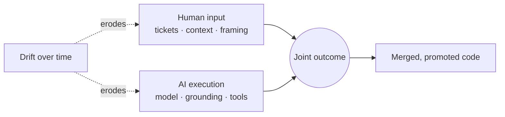
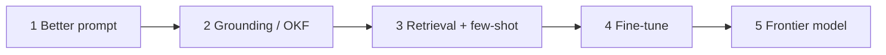
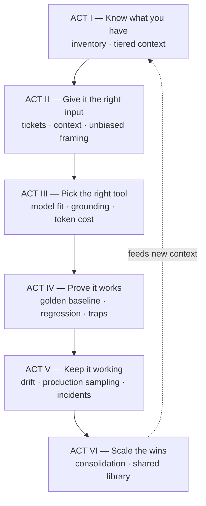
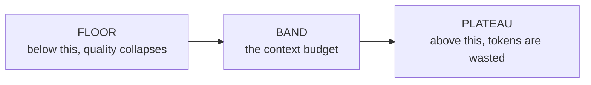

# Enhancing the Interactive Training Program — Director's Design

*Turning six leadership objectives into a curriculum that proves the AI is doing its job, the humans are giving it the right input, and neither is drifting.*

**Status:** Design proposal for the Director of AI — written to be argued with, not accepted.
**Source:** [MyNewDirectorRole.md](MyNewDirectorRole.md)
**Platform:** [poc-interactive-training](../poc-interactive-training/README.md) — 20 scenes existed when this was written (0–19). The platform now has 39; most of the gaps marked 🔴 below have since been built as scenes 22–34 (production sampling and fine-tuning remain open — see the gap table on scene 1). Count-based statements in this document are a historical snapshot.
**Related:** [07 Enablement](07-enablement-and-interactive-training.md) · [05 Agent QA](05-agent-qa-and-regression-framework.md) · [10 Registry](10-agent-inventory-and-registry.md) · [11 Measurement](11-measurement-baselines-and-roi.md) · [Interactive Design](interactiveAITrainingDesign.md)

---

## 1. The thesis your objectives are really about

Your closing line is the actual architecture:

> *"…the LLM is doing its job properly and the human team is providing the correct input and guidance and together the team and the LLM are successful and that the success doesn't drift."*

That describes a **joint human–AI system** with three independent failure modes. Almost every AI programme measures only the first one.

| Failure mode | Symptom | Who usually gets blamed | Objective that addresses it |
| --- | --- | --- | --- |
| **AI underperforms** | Wrong code, hallucinated APIs | The model | 2b, 2c, 4 |
| **Human input is poor** | Vague ticket, missing context, leading prompt | *The model* (wrongly) | 2a, 2d |
| **Drift** | It used to work | Nobody, until an incident | 4, and a gap (§4) |

**Recommendation R1 — make attribution a first-class curriculum outcome.** When quality drops, leadership's first question is "is it the model, the ticket, or the context?" The programme should be able to answer that with evidence, not opinion. This is the single highest-value framing change I would make to your document, and it costs nothing — it is a re-ordering, not new work. ([sampleApproaches.md §4](sampleApproaches.md) already identifies the same triad independently, which is corroboration rather than agreement-by-construction.)

---

## 2. Coverage analysis — where the current program already stands

Twenty scenes exist. Here is the honest mapping against your six objectives.

| Your objective | Status | Existing scene(s) | Gap |
| --- | --- | --- | --- |
| **1** Interactive training, extensible | 🟡 Partial | The whole platform (20 scenes) | No **contribution path**, no success-story library, no "how-to" index, no release-notes channel. [06](06-collaboration-and-shared-prompt-hub.md) has **no scene at all**. |
| **1a/1b** Real-world scenarios, internal-only | 🟢 Covered | 16 COBOL, 18 trap hunt, 12/13 audits | Hosting/auth is a platform task, not curriculum ([Interactive Design §14.1](interactiveAITrainingDesign.md)). |
| **2a** JIRA story quality | 🟢 Covered | **17 Ticket quality gate** | Enhance to grade with a **no-marginal-cost model** (your Gemma idea) and publish the rubric. |
| **2b** Golden baseline repo | 🟢 Covered | **16 COBOL** (executable oracle), **19 Drift scorecard** | Strongest asset you have. Generalise beyond COBOL. |
| **2c** Regression coverage adequacy | 🔴 **Missing** | — | Nothing asks *"do the existing tests actually cover the risk this change introduces?"* |
| **2d** Context testing via throwaway JIRAs | 🟡 Partial | **13 Audit context** (trap test) | No **ephemeral test-ticket harness** using real data that is never committed. |
| **3a** Introduce free/open models | 🟢 Covered | 8 comparison, 13, 15 | — |
| **3b** Grounding Gemma | 🟢 Covered | **16** (arms A/B/C), 15 | Best-in-class already; reuse this harness. |
| **3c** Train Gemma on domain knowledge | 🔴 **Missing** | — | And needs a **correction** — see §3. |
| **3** Token-allowance guidance | 🔴 **Missing** | — | No scene on cost per outcome or model routing. |
| **4a–c** Context sufficiency curve | 🔴 **Missing** | — | **The most original idea in your document has no scene.** |
| **4** Production sampling of agent work | 🔴 **Missing** | 19 is closest | Sampling method undefined — see §3. |
| **5** Common functional / non-functional code audit | 🔴 **Missing** | — | No cross-repo scene. |
| **6** Cortex / AMP / repo three-tier context | 🔴 **Missing** | — | 13 audits *one* repo; no portfolio hierarchy. |

**Plus five curriculum competencies from [07 §2](07-enablement-and-interactive-training.md) that have no scene** — these are already ratified doctrine, not new scope:

| # | Competency | Why it belongs in your programme |
| --- | --- | --- |
| **11** | Neutral framing / not leading the model | You raised this yourself. [07](07-enablement-and-interactive-training.md) calls it *"most likely to be dismissed and most likely to improve output quality on day one."* |
| **12** | Action authority & intervention | An R2/R3 **access prerequisite**. The platform currently models the opposite — the per-call approval prompt was removed from the VSIX client. |
| **5** | Plan-first with exec summary + diagrams | Directly serves "help my leadership understand." |
| **10** | Guardrails & data tiers, injection-aware | Objective 2d ships **real data** around. This is the control that keeps it legal. |
| **4** | Making the agent ask back | Cheapest quality win available. |

---

## 3. Corrections and challenges to the objectives

You asked me to correct where necessary. These are the six places I would push back before this goes to leadership.

### C1 — "Zero token code like Gemma 4" is the wrong phrase 🔴 *fix before presenting*
Gemma is **open-weight**, not free. There is no per-token vendor invoice, but there is GPU, hosting, ops and evaluation cost. If you tell leadership "zero token" and Finance later produces a GPU bill, the programme's credibility takes the hit.

**Say instead:** *"no per-token vendor cost; cost moves from variable to fixed infrastructure."* Then defend it with the unit economics in [11 §7](11-measurement-baselines-and-roi.md) — cost **per merged PR**, not tokens.

### C2 — "Train Gemma with domain knowledge" — ground first, tune last
Fine-tuning is the expensive answer to a question grounding usually answers. Tuning freezes knowledge at a point in time, adds a retraining treadmill, risks eval-set contamination, and is hard to audit. Grounding ([03](03-knowledge-artifacts-and-okf.md), [15](15-repo-audit-context-readiness.md)) is cheaper, inspectable, and updates the moment the artifact updates.

**Recommended ladder — do not skip a rung:**

Tune **only** when a measured gap survives rungs 1–3, and record the evidence. This is also your best cost story: most "we need to fine-tune" requests are context problems.

### C3 — Objective 4's scoring will be circular unless you anchor it
Steps 4a–c ask an LLM to produce a plan and then score its quality. If an LLM scores the LLM, you have the judge-circularity problem in [05 §2.1](05-agent-qa-and-regression-framework.md). Three fixes, all required:

1. **Anchor on execution where possible** — the golden baseline (2b) knows the right answer; grade against it, not against opinion.
2. **Human-calibrate the judge** before trusting it, and keep a sealed holdout.
3. **Repeat runs.** A single score on a stochastic system is noise ([11](11-measurement-baselines-and-roi.md)). Minimum n=5 per context level, report median and spread.

### C4 — Objective 2d ships real data; classify it first 🔴 *governance risk*
*"Real changes and real test data, but not checked in"* is an excellent test design **and** a data-exfiltration path if the data carries PII or confidential content. Not-checked-in ≠ not-sent-to-a-model.

**Required before 2d runs:** data-tier classification and scrub rules ([09](09-guardrails-and-grounding.md)), a named owner, retention/deletion, and a rule that only artifact **references** are logged, never payloads ([12](12-ai-incident-response-and-observability.md)).

### C5 — "Review a percentage" — weight the sample by risk, not by volume
A flat percentage spends your scarcest resource (senior review time) uniformly across work with wildly different blast radius. Sample **weighted by risk tier** ([10 §4](10-agent-inventory-and-registry.md)): near-100% of R3, a meaningful slice of R2, spot-checks of R0/R1. Same budget, far more risk covered.

### C6 — Two prerequisites are missing from the objective list entirely
- **Agent inventory.** Objective 4 says "monitor each agent's effectiveness." You cannot monitor a population you have not enumerated. [10](10-agent-inventory-and-registry.md) is **Phase 0**, not a later nicety.
- **Incident response.** You are sampling code *already promoted to production*. When a sample turns up something harmful, there must be a declared path to contain and roll back ([12](12-ai-incident-response-and-observability.md)). Without it, objective 4 finds problems it cannot act on.

---

## 4. The leadership narrative — sequencing the curriculum

Your ask: *introduce these topics to leadership in a logical order that shows AI must be considered at every step.* Executives do not follow a feature list; they follow a **value chain with a control at each link**.

I recommend restructuring the 20 existing + 9 proposed scenes into **six acts**. The scene order in the app changes; no existing scene is discarded.

### The acts in leadership language

| Act | The question leadership is actually asking | Objectives | Scenes |
| --- | --- | --- | --- |
| **I — Know what you have** | *"What are we even running this on?"* | 6, (10) | 1–3 OKF · **NEW 22** Cortex/AMP/repo tiers · 12–13 audits · **NEW 30** risk tiering |
| **II — Give it the right input** | *"Is the problem the AI, or how we're asking?"* | 2a, 2d | 17 ticket gate · **NEW 25** bias lab · **NEW 29** plan-first · **NEW 27** ephemeral test tickets · 7 prompt challenge |
| **III — Pick the right tool** | *"Why are we paying for the big model?"* | 3a–c | 8 comparison · 9 LLM support · 15/16 grounding arms · **NEW 24** token economics |
| **IV — Prove it works** | *"How do you know it's right?"* | 2b, 2c | 16 COBOL oracle · 18 trap hunt · **NEW 21** regression adequacy · 10 round-trip |
| **V — Keep it working** | *"Will it still be right in six months?"* | 4 | **NEW 20** context sufficiency curve · 19 drift scorecard · **NEW 26** action authority · incident path |
| **VI — Scale the wins** | *"How does this become an asset, not a pilot?"* | 5, 1 | **NEW 23** common-code audit · **NEW 28** pattern library · 11/14 modernization |

**Recommendation R2 — build a "Leadership walkthrough" mode.** A guided path that plays one scene per act with a 60-second executive summary, the control it demonstrates, and the metric it produces — then hands off to the full curriculum. Same content, two audiences, one build. This is the cheapest way to satisfy *"help my leadership understand my approach."*

**Recommendation R3 — every act ends with a number.** Leadership retains metrics, not demos. Act I → context readiness score. Act II → ticket pass rate. Act III → cost per merged PR. Act IV → trap recall. Act V → drift delta. Act VI → duplication reduction. These are already produced by existing scenes; they simply are not surfaced as an act-level scorecard.

---

## 5. New scenes — specifications

Nine new scenes close every gap in §2. Build cost assumes reuse of machinery that already exists in the platform.

### ⭐ NEW 20 — Context Sufficiency Curve *(flagship — build first)*
**Objective 4a–c.** Your best idea; nothing like it exists in the platform.

The agent is asked to produce a **plan and its context inventory** for a v1.0 → v1.1 change — deliberately *not* the code, exactly as you specified. The same task is then re-run across a context ladder while everything else is frozen.

| Rung | Context supplied |
| --- | --- |
| 0 | Ticket only |
| 1 | + repo README |
| 2 | + OKF concept + ADR |
| 3 | + code map + tests |
| 4 | + full repo dump |

Each rung is run **n≥5 times**; quality is scored against the golden baseline (execution where possible, human-anchored rubric otherwise, per C3). The output is a curve with two decision points:

**Why this is the strategic centrepiece:** the plateau is your **token-allowance policy, derived from evidence rather than opinion** — it directly delivers objective 3's "how to best spend their token allowance." The floor is your minimum context standard, which tells every team exactly which artifacts they must maintain. One scene answers two objectives and produces a number leadership can govern with.

*Reuses:* scene 15/16 A/B/C harness, existing scoring. **Cost: High. Value: Highest.**

### NEW 21 — Regression Coverage Adequacy
**Objective 2c.** Given an enhancement, does the existing suite cover *its* risk? Map changed behaviour → covering tests; flag uncovered risk. Innovation: mutate the change, and if tests still pass, the suite is decorative. Deterministic, no judge needed.
*Reuses:* Roslyn analyzer (scene 12). **Cost: Medium.**

### NEW 22 — Portfolio Context Map (Cortex / AMP ID / Repo)
**Objective 6.** Three-tier drill-down with a readiness score per tier.

| Tier | Scope | Purpose | Precedence |
| --- | --- | --- | --- |
| 1 Cortex | All repos | Routing — *"where does this belong?"* | Never overrides Tier 3 |
| 2 AMP ID | Department / repo group | Shared conventions, ownership | Overridden by Tier 3 on specifics |
| 3 Repo | Single repo | Complete context artifacts | **Authoritative on specifics** |

**Recommendation R4 — publish the precedence rule now.** Hierarchies fail when tiers disagree and nobody said who wins. Tier 3 is closest to the code and wins on specifics; Tier 1 exists for routing only. Also cascade staleness: a stale Tier 1 entry must not silently imply a fresh Tier 3.
*Reuses:* scene 13 scoring + embeddinggemma. **Cost: Medium.**

### NEW 23 — Common Code Audit (functional vs non-functional)
**Objective 5.** Cluster semantically similar logic across repos, split into **functional** (business duplication → consolidation candidates) and **non-functional** (enterprise concerns → shared-library candidates), then size the consolidation prize.
**Innovation:** the platform already loads **embeddinggemma-300m** for the context audit — reuse it to embed and cluster code units across repos. Near-zero new infrastructure for a portfolio-scale capability.
*Reuses:* embeddinggemma + ML.NET (already running). **Cost: Medium.**

### NEW 24 — Token Economics & Model Routing
**Objective 3.** Same task down the escalation ladder (C2); show quality vs cost per outcome and where the cheap model is sufficient. Publishes the routing policy and consumes NEW 20's plateau. Corrects the "zero token" framing in-band (C1).
*Reuses:* scene 8 comparison harness. **Cost: Low.**

### NEW 25 — Neutral Framing Lab *(competency 11)*
Same question asked three ways — leading, neutral, dissent-demanded — with answers compared side by side so the learner watches their own framing move the output. Then requires a **dissent request** as standard practice.
**Why it matters to you personally:** you have twice said you do not want to introduce bias. This is the scene that teaches the organisation to hold that standard.
*Reuses:* scene 8 columns. **Cost: Low. Value: High.**

### NEW 26 — Action Authority & Intervention *(competency 12)* 🔴
Proposal vs approval vs runtime authorization; verify the **exact** action; stop/rollback; declare an incident. **Restore the approval-mode demonstration in the VSIX** (as a toggle so demos stay fast) — the platform currently teaches unattended execution by omission, which contradicts [09 §3.4](09-guardrails-and-grounding.md) and [10](10-agent-inventory-and-registry.md).
*Reuses:* the bridge's task-confirmation path (removed; restore behind a setting). **Cost: Low. Priority: High.**

### NEW 27 — Ephemeral Test-Ticket Harness
**Objective 2d.** Real change, real data, never committed — with the C4 controls visible on screen: data tier, scrub, owner, TTL, references-not-payloads logging. Teaches the control *while* running the test.
*Reuses:* scenes 13/18 trap machinery. **Cost: Medium.**

### NEW 28 — Pattern & Success-Story Library
**Objective 1.** The contribution path [06](06-collaboration-and-shared-prompt-hub.md) specifies and the platform lacks: submit a prompt/pattern/success story, **with a curation gate** — evidence of outcome, context it depends on, and known failure modes.
**Recommendation R5:** gate contributions. [06](06-collaboration-and-shared-prompt-hub.md) is explicit that *a bad shared prompt scales harm*. An ungated library is a hallucination amplifier with good intentions.
*Reuses:* rubric scoring. **Cost: Medium.**

### NEW 29 — Plan-First with Executive Summary + Diagram *(competency 5)*
Agent must produce exec summary, diagram, and risk list **before** code; learner grades it. Directly serves the leadership-comprehension objective and is graded doctrine already.
*Reuses:* rubric scoring. **Cost: Low.**

---

## 6. Anti-drift — the part most programmes skip

Your closing concern is that *success doesn't drift*. Drift is not one thing, and the fix differs by cause. Attribution (R1) is what makes this actionable.

| Drift type | Detect with | Cadence | Owner |
| --- | --- | --- | --- |
| **Ticket quality drift** | NEW 17 pass rate trend | Per sprint | Team lead |
| **Context drift** | 13 + NEW 22 readiness trend, `stale_after` breaches | Monthly | Repo owner |
| **Model / version drift** | 19 vs golden baseline, pinned versions | Per model release ([04](04-model-drift-management.md)) | AI Quality |
| **Human skill drift** | Delayed re-assessment ([07](07-enablement-and-interactive-training.md)) | Semi-annual | Enablement |
| **Trap-bank decay** | Rotate 20% quarterly ([05](05-agent-qa-and-regression-framework.md)) | Quarterly | AI Quality |

**Recommendation R6 — one joint scorecard per sampled ticket.** Score the **human input** and the **AI output** on the same work item. Over time the two lines separate, and you can prove which side is degrading. Most organisations only ever plot the AI line and then argue about the cause.

---

## 7. Phasing — the minimum critical path

Not everything at once. This order maximises evidence per unit of effort and gives leadership a number early.

| Phase | Build | Why this order | Outcome |
| --- | --- | --- | --- |
| **0 — Prerequisites** | Agent inventory ([10](10-agent-inventory-and-registry.md)) · data-tier rules (C4) · incident path ([12](12-ai-incident-response-and-observability.md)) | Objectives 2d and 4 are unsafe or unmeasurable without these | You can name and tier every agent |
| **1 — Prove the thesis** | **NEW 20** curve · **NEW 26** action authority · **NEW 25** bias lab | One flagship + two cheap high-value fixes; produces the token-budget number | A defensible context budget |
| **2 — Close QA gaps** | **NEW 21** regression · **NEW 27** ephemeral tickets · enhance 17 with a no-marginal-cost grader | Completes objective 2 | Agentic-readiness QA is whole |
| **3 — Portfolio scale** | **NEW 22** tiers · **NEW 23** common code | Needs Phase 0 inventory to be meaningful | Consolidation strategy with a sized prize |
| **4 — Institutionalise** | **NEW 24** economics · **NEW 28** library · **NEW 29** plan-first · Leadership mode (R2) | Turns the programme into an asset | Self-sustaining, extensible curriculum |

**Do not build yet:** cross-org federation, a bespoke analytics warehouse, or fine-tuning infrastructure. Each needs evidence from Phases 1–3 first — consistent with the "do not build" discipline in [architect-review](architect-review-and-recommendations.md).

---

## 8. What I would challenge in my own recommendation

You asked for no bias. Discount for these:

1. **I am an LLM designing a curriculum about supervising LLMs.** I will over-value model-legible artifacts (OKF, CLARA, structured context) because they are what I consume well. A human SME may reasonably conclude that good tests and good code review outperform half of this.
2. **NEW 20 is expensive and unproven at CES scale.** The curve is theoretically sound and I believe it is your best idea — but the plateau may prove noisy on real repos. Pilot it on **one** repo before promising leadership a token-budget policy.
3. **Nine new scenes is a lot.** The honest minimum that satisfies the spirit of your document is four: **20, 21, 22, 26**. Everything else is high-value but deferrable.
4. **I have not measured any of this.** Every number this programme produces should carry an evidence grade ([11](11-measurement-baselines-and-roi.md) §A/B/C). Nothing here is Grade A yet.

---

## 9. Open questions for the Director

1. Which repo is the **golden baseline** for objective 2b — CardDemo (stable, synthetic) or a real CES repo (representative, but it drifts)?
2. Does the AMP-ID tier (objective 6) map to an existing org structure, or is it being defined here? Precedence (R4) depends on the answer.
3. Who owns the **data-tier decision** for objective 2d's real test data — you, Security, or the repo owner?
4. Is the token allowance a **hard budget** or a soft signal? NEW 24 is a governance tool in the first case and a coaching tool in the second.
5. Do you want the approval-mode restoration (NEW 26) to be the **default** in the platform, or a demo toggle?

---

## 10. Summary

The current programme already covers **half** of your objectives well — ticket quality, grounding strategies, golden-baseline verification, and repo audits are genuinely strong. What is missing is the **portfolio view** (objectives 5, 6), the **context-economics evidence** (objective 4), and the **human-input competencies** the framework already ratified but never built.

Three things would make this land with leadership:

1. **Sequence it as six acts**, each ending in a number (§4, R2/R3).
2. **Build the Context Sufficiency Curve first** (§5) — it converts your token-allowance objective from an opinion into a measured policy.
3. **Fix the two credibility risks before presenting**: the "zero token" framing (C1) and the missing approval-mode demonstration (C6/NEW 26).

The programme's purpose is not to prove AI works. It is to make the **joint** human–AI system measurable, attributable, and stable — so that when quality moves, you know which half moved, and why.
