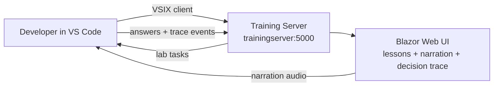
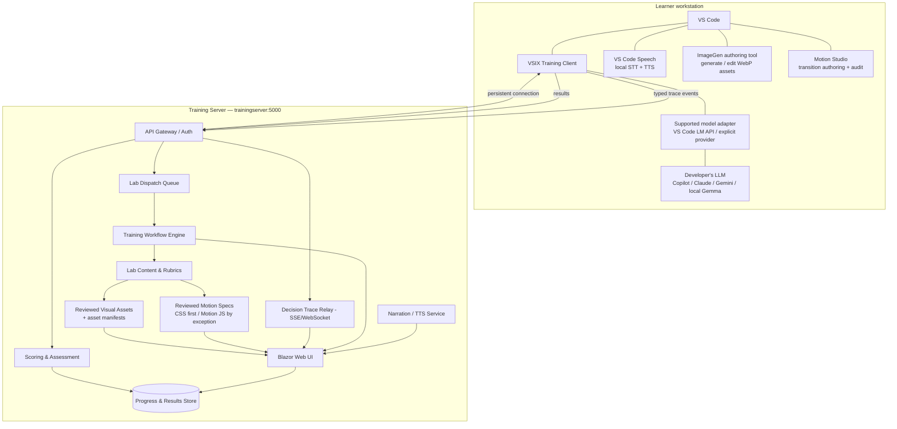
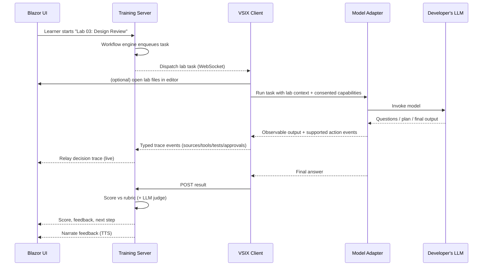
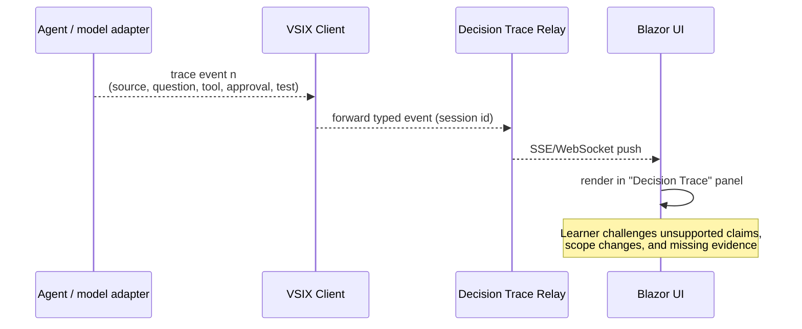
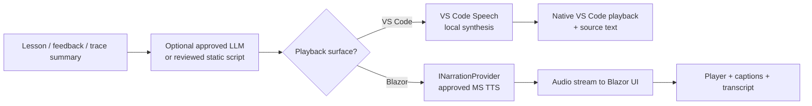
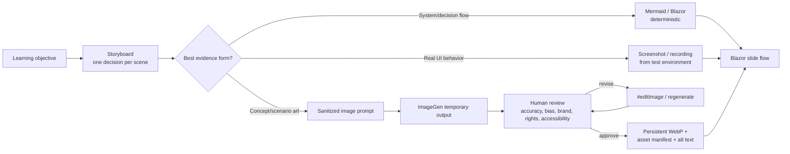
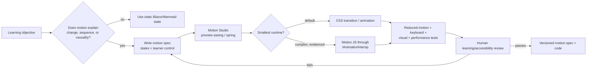
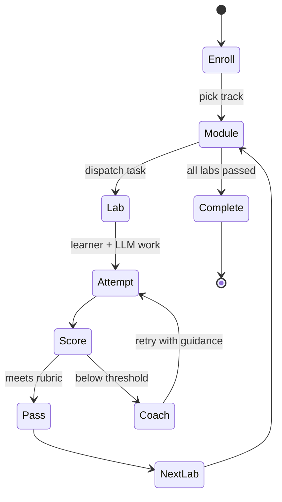
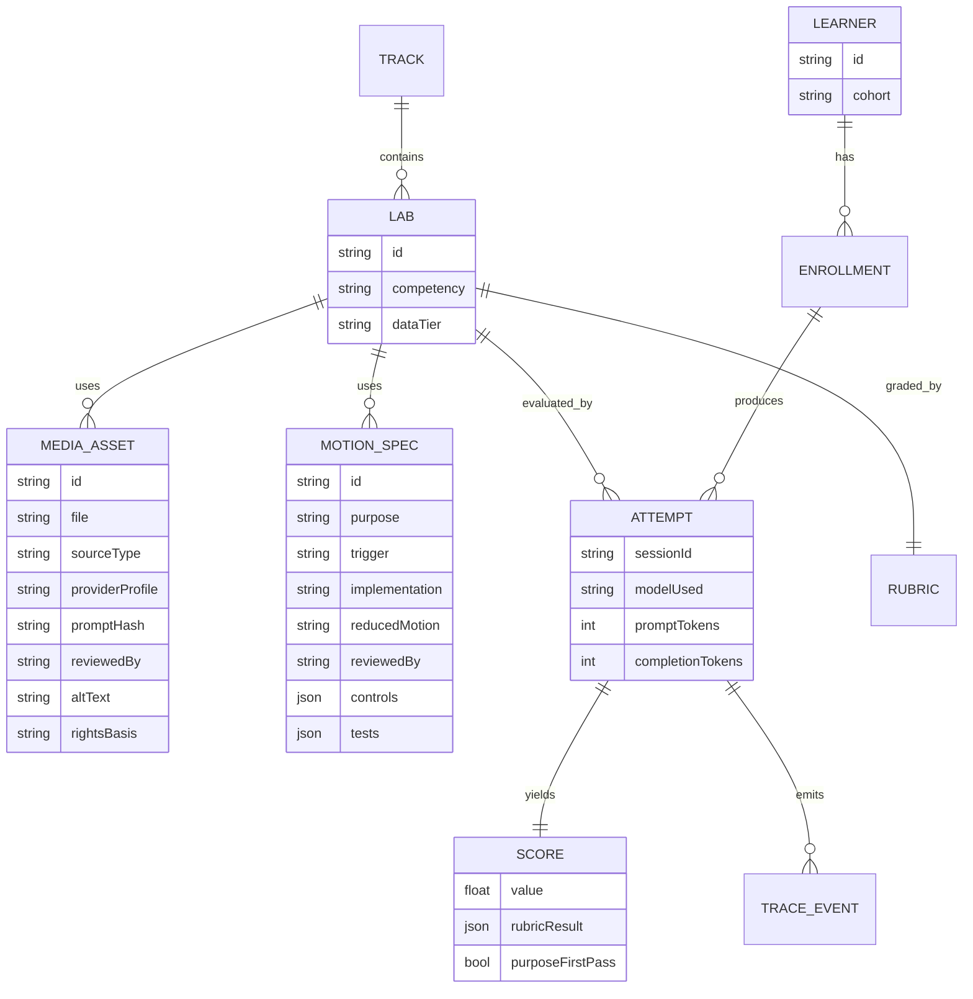

# Interactive AI Training — Design & Architecture

*A multimedia, hands-on training platform that teaches CES teams to use AI well — with visual slide flows, live narration, observable decision traces, and real labs driven from VS Code.*

**Owner:** AI Enablement Lead / Architect
**Status:** Draft v0.1 — living design, built to be refined
**Last updated:** 2026-09-02
**Related:** [07 — Enablement & Interactive Training](07-enablement-and-interactive-training.md) (this is the platform that delivers it), [01 Context & Transparency](01-context-engineering-and-transparency.md), [05 Agent QA](05-agent-qa-and-regression-framework.md), [09 Guardrails & Grounding](09-guardrails-and-grounding.md), [08 AI-DLC](08-ai-dlc-process-and-integration.md), [README](README.md).
**Runnable feasibility POC:** [POC Interactive Training Program](../pocInteractiveTraainingProgram.md) — Blazor lesson, localhost bridge, packaged VSIX client, grounded Gemma narration text, visible GPT fallback, and Claude coaching review.

---

## 1. Executive Summary (read this first)

We are building an **interactive training experience** that teaches every CES engineer how to work *with* AI the right way — not by watching slides, but by **doing real labs inside VS Code** while an AI coach talks them through it.

In plain terms:

- Each developer connects **their own AI (LLM) through a small VS Code add-on** (a "VSIX client"). That add-on quietly listens to a **central training server** for the next lab or challenge.
- The training server runs a **web app (Blazor UI)** that composes responsive slide flows from structured lesson content and reviewed visual assets, narrates them, and shows an **observable decision trace**: questions, sources, plan revisions, tool actions, approvals, and verification results. It never claims that a model's private chain-of-thought is visible or proves correctness.
- Learners practice the skills that actually matter: **giving the AI enough context, reviewing its design/plan before code, spotting over-confident or wrong answers, and verifying results** — the same principles documented across this program.

**The most important lesson we're teaching:** AI makes it trivial to generate *a lot* of impressive-looking documents. Some people mistake volume for value — producing piles of AI-written material to look knowledgeable to leadership. **Leadership already knows AI can churn out documents.** What they actually want, and what this training instills, is the discipline to start from a **clear, well-reasoned goal that follows the organization's principles** — and to produce only what serves that goal. We are training **judgment, not output volume.**

Think of it as a **flight simulator for working with AI**: safe, hands-on, narrated, and measured — so the whole team levels up together with consistent quality.



---

## 2. Goals & learning objectives

The platform delivers the competencies defined in [07 §2](07-enablement-and-interactive-training.md), plus a headline behavioral goal unique to this design.

| Objective | What the learner can do afterward | Anchor |
| --- | --- | --- |
| **Purpose before output** (headline) | Starts from a clear, principle-aligned goal; resists "document theater" | §3 |
| Context sufficiency | Supplies scoped, sufficient context (CLEAR) | [01 §3](01-context-engineering-and-transparency.md) |
| Design/plan review | Demands and critiques a plan with exec summary + diagram before code | [01 §4.3](01-context-engineering-and-transparency.md) |
| Evidence/action literacy | Inspects sources, assumptions, tool actions, and verification evidence; catches unsupported claims | [01 §4.1](01-context-engineering-and-transparency.md) |
| Asking questions | Gets the AI to ask *back*; probes trade-offs | [01 §4.2](01-context-engineering-and-transparency.md) |
| Spotting over-confidence | Recognizes confident-but-wrong output | [04 §5](04-model-drift-management.md) |
| Right model for the job | Chooses fit-for-purpose models | [02](02-model-selection-and-fit.md) |
| Grounding & guardrails | Grounds answers; respects data tiers; injection-aware | [09](09-guardrails-and-grounding.md) |
| Verification | Verifies against tests/golden baselines | [05](05-agent-qa-and-regression-framework.md) |

---

## 3. The headline lesson: purpose over "document theater"

This is important enough to design the curriculum around it.

**The anti-pattern:** Because AI can generate volumes of polished text, some team members produce large document sets to *appear* expert or to impress leadership — mistaking **quantity of output** for **quality of thinking**.

**The truth we teach:**
- Leadership **already understands** AI can generate documents at scale — volume impresses no one.
- Value comes from a **well-reasoned goal aligned to organizational principles**, and producing **only what advances that goal**.
- A tight, purpose-driven one-pager beats a 50-page AI-generated binder nobody needs.

**How the platform teaches it (experientially, not by lecture):**
- A dedicated lab: *"The Document Trap."* The learner is tempted to generate a large deliverable; the AI coach and rubric reward **defining the goal, the audience, and the principle it serves first**, then producing the **minimum artifact** that satisfies it.
- The scoring rubric explicitly **penalizes unfocused volume** and **rewards goal clarity, principle-alignment, and fitness-for-purpose**.
- The narration reinforces: *"Before you generate — what's the goal, who's it for, which principle does it serve, and what is the smallest thing that achieves it?"*

**The Purpose-First checklist** (taught and reused):
```markdown
- [ ] Goal stated in one sentence
- [ ] Audience and the decision they need to make
- [ ] Organizational principle(s) this serves
- [ ] The minimum artifact that achieves the goal
- [ ] What we are deliberately NOT producing
```

---

## 4. System architecture

### 4.1 Components



| Component | Responsibility |
| --- | --- |
| **VSIX Training Client** | VS Code extension; subscribes to the dispatch queue, invokes a supported model adapter with explicit user consent, returns answers, and emits observable trace events. Also drives the in-IDE training workflow. |
| **VS Code Speech** | Installed Microsoft extension (`ms-vscode.vscode-speech`, v0.16.0 reviewed) providing local/offline speech-to-text and text-to-speech in native VS Code chat/editor surfaces. It is the preferred first path for in-IDE voice accessibility, subject to the integration boundary in §7.4. |
| **ImageGen authoring tool** | Installed third-party extension (`marquaye.vscode-imagegen`, v1.2.4 reviewed). Exposes `#generateImage` and `#editImage` agent tools plus a manual editor; produces optimized WebP assets. Candidate authoring dependency subject to §7.5–§7.8, not a learner-runtime dependency. |
| **Motion Studio authoring tool** | Installed third-party extension (`motion.motion-vscode-extension`, v6.2.0 reviewed). Visually previews/edits CSS and Motion easings/springs and can generate CSS `linear()` springs. AI documentation context and `/motion-audit` require a separate MCP installation (§7.11); the extension alone is not an agent tool. |
| **Model adapter** | Uses a supported host API (for example the VS Code Language Model API) or an explicit approved provider/local adapter. Declares capabilities; it does not intercept another extension's private chat or hidden reasoning. |
| **Developer's LLM** | The model the learner already uses in VS Code — the "worker" that performs lab tasks. Kept model-agnostic ([02](02-model-selection-and-fit.md)). |
| **API Gateway / Auth** | Single entry at `:5000`; authenticates clients, enforces data-tier rules and rate limits. |
| **Lab Dispatch Queue** | Holds pending lab tasks per learner/cohort; clients consume from it. |
| **Training Workflow Engine** | Orchestrates lab sequence, gating, retries, and progression. |
| **Lab Content & Rubrics** | Versioned lab definitions, exercises, reference solutions, scoring rubrics. |
| **Reviewed Visual Assets** | Versioned images and safe provenance manifests used by Blazor slide flows; generated assets never become trusted course content without review. |
| **Reviewed Motion Specs** | Purpose-bound state transitions with CSS/Motion implementation, reduced-motion behavior, controls, performance evidence, and named review. |
| **Scoring & Assessment** | Grades submissions (automated + LLM-as-judge with a *different* model, [05 §2](05-agent-qa-and-regression-framework.md)). |
| **Narration / TTS Service** | Turns lesson/coach text into speech (see §7). |
| **Decision Trace Relay** | Fans out typed, observable events from the client to the Blazor UI via SSE/WebSocket. |
| **Blazor Web UI** | The multimedia front end: lessons, narration playback, decision/evidence trace, progress. |
| **Progress & Results Store** | Learner progress, scores, minimized trace events, and cohort analytics under the retention policy. |

### 4.2 Connectivity model (reconciling "client monitors a port/queue")

A server cannot reliably POST *into* a developer's machine (firewalls/NAT). So the client **subscribes** to the server's queue over a persistent connection and **returns results via POST**. This preserves your mental model (a queue on the central server that the client monitors) while working in real networks.

- **Primary:** WebSocket (bidirectional) between VSIX client and server — lab tasks pushed down, results/trace events pushed up.
- **Fallback:** Server-Sent Events (SSE) for server→client + HTTPS POST for client→server, or HTTP long-poll where sockets are blocked.
- **The "port/queue" abstraction:** the client is logically "monitoring the training queue at `trainingserver:5000`"; the transport underneath is a managed subscription, not an inbound open port on the laptop.

> Security: use **HTTPS/WSS**, not plain HTTP, even internally. See §9.

### 4.3 Model integration boundary (prove this in P0)

There is no universal API that lets one VS Code extension drive and observe every installed AI assistant. The client must not depend on screen scraping, private extension APIs, or interception of another assistant's conversation.

Each approved adapter declares what it can do: invoke a model, stream final output, surface tool calls/results, identify the exact model, and report token usage. Unsupported capabilities degrade explicitly; they are never fabricated. P0 must prove one end-to-end approved adapter and a second materially different adapter before the design may claim model independence. Learners must see and consent to the model, data tier, and trace fields sent for each lab.

---

## 5. Interaction flows

### 5.1 Lab dispatch & answer



### 5.2 Streaming the observable decision trace

The learner watches what can be inspected and verified — the concrete embodiment of "never a black box" ([01 §4](01-context-engineering-and-transparency.md)).



  **Pedagogical use:** learners are prompted to flag an unsupported assumption, missing source, unapproved action, or absent verification result in the live trace. A model-generated rationale may be displayed as labelled output, but it is never represented as a faithful internal chain-of-thought or scored as proof.

---

## 6. The dispatch & results protocol (API contract)

A minimal, versioned contract. All endpoints under `https://trainingserver:5000`, authenticated (§9).

### 6.1 Client subscribes to the queue
`GET /api/v1/queue/subscribe` → upgrades to WebSocket (or SSE). Server pushes `LabTask` messages.

### 6.2 `LabTask` (server → client)
```json
{
  "type": "LabTask",
  "sessionId": "b1f2…",
  "labId": "design-review-01",
  "learnerId": "u123",
  "instructions": "Produce a plan-first design review for the change in /src.",
  "context": { "files": ["src/…"], "okfBundleRef": "okf://payments" },
  "constraints": { "dataTier": "Internal", "requirePlan": true, "requireQuestions": true },
  "stream": { "decisionTrace": true },
  "expires": "2026-09-02T18:00:00Z"
}
```

### 6.3 `TraceEvent` (client → server, streamed)
```json
{
  "type": "TraceEvent",
  "sessionId": "b1f2…",
  "seq": 12,
  "eventType": "source | question | plan_revision | tool_call | approval | verification",
  "summary": "Ran the authorization tests; 18 passed",
  "refs": ["run:test-4821"]
}
```

Trace events contain inspectable facts and references, not hidden chain-of-thought, secrets, raw credentials, or full sensitive payloads.

### 6.4 `LabResult` (client → server)
`POST /api/v1/results`
```json
{
  "type": "LabResult",
  "sessionId": "b1f2…",
  "labId": "design-review-01",
  "plan": { "executiveSummary": "…", "diagramMermaid": "flowchart…", "changes": [], "assumptions": [], "openQuestions": [], "verificationPlan": "…" },
  "answer": "…",
  "modelUsed": "claude-opus-x / gemini-y / gemma-4-31b",
  "tokens": { "prompt": 1200, "completion": 800 }
}
```

### 6.5 `Feedback` (server → client / UI)
```json
{ "type": "Feedback", "sessionId": "b1f2…", "score": 0.82, "rubric": {"purposeFirst": true, "planPresent": true, "questionsAsked": false}, "narrationText": "Good plan. You skipped clarifying questions on the data model…", "next": "design-review-02" }
```

**Design notes**
- **Versioned** (`/v1`) so the contract can evolve without breaking clients.
- **`dataTier`** on every task gates which model may run it ([02](02-model-selection-and-fit.md), [09](09-guardrails-and-grounding.md)).
- **Idempotency keys** on results to tolerate reconnects.
- **`modelUsed`/`tokens`** captured for cost + model-fit analytics.

---

## 7. Multimedia & narration (TTS)

The AI coach **talks** the learner through lessons and feedback, and can narrate a reviewed decision-trace summary where that improves accessibility. Raw tool payloads, credentials, and hidden chain-of-thought are never narration inputs.

**New available capability:** Microsoft **VS Code Speech** is installed. Its published behavior covers STT and TTS in VS Code chat/editor surfaces, processes voice audio locally without requiring an internet connection, supports 26 languages, and can automatically read chat responses via `accessibility.voice.autoSynthesize`. This materially lowers the cost of validating voice interaction inside VS Code; it does not, by itself, provide narration to a separate Blazor browser UI.

### 7.1 Approved provider policy
| Capability | Approved | Not approved | Notes |
| --- | --- | --- | --- |
| Narration script authoring (text) | Approved LLM such as **Gemma 3**, subject to the model register | Unregistered models | Optional; static human-authored scripts are the default for fixed lessons |
| In-IDE Text-to-Speech | **VS Code Speech** (`ms-vscode.vscode-speech`) | Any unapproved audio endpoint | Preferred first adapter; local audio processing; native VS Code surfaces only until §7.4 proves more |
| In-IDE Speech-to-Text | **VS Code Speech** (`ms-vscode.vscode-speech`) | **Whisper — not approved** | Optional learner voice input; local audio processing; text enters the normal task/data-tier controls |
| Blazor/browser Text-to-Speech | Approved Microsoft speech library/service behind `INarrationProvider` | Reusing VS Code Speech without a supported bridge | Separate surface and adapter; required only if narration must play in Blazor rather than VS Code |

### 7.2 Important architectural clarification (SME note)
- **TTS vs STT:** *Whisper is a speech-to-**text** (transcription) model, not text-to-speech* — so it would not produce narration regardless; it remains excluded. VS Code Speech supplies both capabilities locally for native VS Code interactions.
- **Gemma is a language model, not a native audio synthesizer.** The clean design is a two-part **Narration Service**:
  1. **Script authoring** — the LLM (e.g., Gemma 3) *writes/curates the narration script* (tone, phrasing, pacing, emphasis cues).
  2. **Audio synthesis** — VS Code Speech renders it locally inside supported VS Code surfaces; an approved `INarrationProvider` renders it when the Blazor UI must own playback.
- Script authoring and synthesis are different roles, not interchangeable providers. If an LLM is not needed to rewrite dynamic feedback, skip script generation and send reviewed text directly to the selected speech adapter.

### 7.3 Narration Service design

- **Two explicit adapters:** `IVsCodeSpeechAdapter` for supported in-IDE integration and `INarrationProvider` for Blazor-owned audio. Script generation remains upstream of both.
- **Captions + transcript always on** (accessibility, WCAG) — never audio-only.
- **Caching** applies only to Blazor/provider-generated audio. VS Code Speech audio remains local and is not captured or uploaded.

### 7.4 VS Code Speech integration boundary and spike

The installed extension contributes a VS Code `speechProvider` and uses the proposed `speech` extension API. Its stable end-user capabilities are usable now: voice input in chat (`Ctrl+I`), editor dictation (`Ctrl+Alt+V`), local TTS for chat responses, language selection via `accessibility.voice.speechLanguage`, and optional automatic synthesis via `accessibility.voice.autoSynthesize`.

Do **not** assume our custom VSIX can call its recognizer/synthesizer as a stable library. A Marketplace extension generally cannot build a durable dependency on another extension's proposed API without platform support. P0 therefore treats VS Code Speech as an **installed user-facing accessibility capability**; a small spike determines whether a supported command/API integration exists for the training client.

The spike passes only if it proves:

```markdown
- [ ] Start/stop speech from an approved supported surface without private APIs or UI automation
- [ ] Receive only the transcribed text needed by the lab; raw microphone audio stays local
- [ ] Synthesize approved lesson/feedback text without capturing generated audio
- [ ] Preserve keyboard, text-only, caption/transcript, and screen-reader alternatives
- [ ] Respect microphone consent, selected language, cancellation, and concurrent-session behavior
- [ ] Work on supported CES workstation platforms with the pinned extension/VS Code versions
```

If the programmatic spike fails, there is no architecture failure: learners use VS Code Speech directly in native chat/editor flows, while the training VSIX exchanges text and the Blazor UI uses its separate `INarrationProvider` only where browser playback is necessary.

### 7.5 ImageGen role: visual assets, not slide composition

**ImageGen is installed and exposes native Copilot tools** for generating (`#generateImage`) and editing (`#editImage`) images. It supports a manual review UI, persistent or temporary outputs, configurable aspect ratios, automatic WebP compression, and provider-call duration metrics.

Use it to author:

- scenario illustrations and visual metaphors,
- section backgrounds and transition art,
- before/after images for critique labs,
- visual states that demonstrate a learner flow,
- optional thumbnails and facilitator materials.

Do **not** use raster image generation for slide text, code, architecture labels, decision traces, tables, or process diagrams. Blazor owns layout and readable text; Mermaid or native Blazor components own diagrams and state transitions; real screenshots or recordings show actual product behavior. This keeps slides responsive, searchable, localizable, screen-reader accessible, and correctable without regenerating an image.

> **Design boundary:** ImageGen creates and edits visual assets. It does not create the slide deck contract. A slide remains structured content rendered by Blazor, with images referenced as optional assets.

### 7.6 Storyboard-to-asset workflow



**Default to `saveMode: "temporary"` while exploring.** Persist only the selected asset under a course-owned path such as `assets/training/<module>/<scene>.webp`. This prevents discarded generations from becoming repository debris and makes the human approval boundary explicit.

Each persistent asset has a reviewable manifest beside it:

```yaml
asset_id: context-lab-01-ambiguity
file: assets/training/context-lab/ambiguity.webp
purpose: Scenario image showing an ambiguous handoff
source_type: generated                # generated | edited | screenshot | licensed
provider_profile: <approved ImageGen provider + model/version>
prompt_hash: <hash of sanitized prompt>
generated_at: <ISO-8601 timestamp>
reviewed_by: <named human>
reviewed_at: <ISO-8601 timestamp>
alt_text: <meaning conveyed by the image>
rights_basis: <generated terms | source licence/permission>
data_tier: Public
```

The manifest, git history, and provider receipt are the canonical provenance. XMP prompt metadata may supplement them but is not the control of record.

### 7.7 Provider, privacy, and provenance controls

ImageGen is a third-party extension that sends prompts and, for edits, source images to the configured external provider. **Installation is not approval.** Before production authoring:

1. Security reviews the extension publisher/repository, version, permissions, dependency/update path, and provider network destinations.
2. The exact image provider/model/key/plan is entered in the approved deployment-profile register ([02 §6](02-model-selection-and-fit.md)); provider terms govern prompt/image retention, training use, rights, and region.
3. Keys are entered only through `ImageGen: Set API Key` and VS Code SecretStorage. Never place keys in prompts, manifests, source control, or shared MCP configuration.
4. Run `ImageGen: Run Health Check`, then a synthetic Public-data fixture, before enabling agent calls.
5. Prompts and input images default to **Public, synthetic, or explicitly approved** material. Internal branding, screenshots, customer data, faces, code, architecture, and incident artifacts require classification before sending.
6. Keep `imagegen.embedPromptMetadata` enabled only for sanitized Public prompts. Disable it when a prompt may reveal internal context; record a safe prompt hash and provider profile in the asset manifest instead.
7. Human review checks factual fidelity, unintended text/logos, stereotypes, accessibility purpose, brand fit, and rights before persistence or publication.

Generated imagery is never evidence of how a system works. Where factual inspection matters, use deterministic diagrams or real, sanitized captures.

### 7.8 Agent and MCP integration boundary

The preferred authoring path inside VS Code is the extension's native language-model tools:

- `#generateImage`: text-to-image, persistent or temporary WebP output.
- `#editImage`: edit a workspace image, URL, data URL, or Markdown image reference; provider support varies.

Only the dedicated multimedia-authoring agent receives these tools, after approval; general coding/review agents do not need them. Tool calls use bounded output directories, temporary mode by default, request timeouts, size limits, and explicit approval before a generated file is promoted into course content.

ImageGen also ships an optional stdio MCP server for non-VS Code agents. Do not enable it merely because it exists: it is a separate runnable agent/tool surface with environment-based credentials and must be registered, threat-modelled, and constrained independently ([10](10-agent-inventory-and-registry.md), [09 §3.4](09-guardrails-and-grounding.md)). Native VS Code tools are the first path for this design.

Ordinary learner sessions use pre-generated, reviewed assets. **No live image generation is required at runtime.** A future lab that explicitly teaches image generation may invoke it only in a Public-data sandbox with quotas, temporary output, visible provider/cost, and human selection.

### 7.9 Motion Studio role: animation authoring, not a second UI framework

**Motion Studio is installed** and provides visual transition editing, real-time preview, reusable easing/spring values, CSS spring generation, current Motion documentation/examples, and a performance-audit workflow. Use it to make training motion deliberate and testable:

- slide/scene entry and exit that preserves spatial continuity,
- step-by-step reveal of a process or architecture flow,
- state transitions that demonstrate cause and effect,
- progress and feedback transitions that orient rather than distract,
- optional before/after performance demonstrations.

Blazor remains the UI and slide runtime. **Do not introduce React or Vue merely to use Motion Studio.** The preferred implementation order is:

1. **CSS transitions/animations** authored and previewed in Motion Studio, including generated `linear()` springs where browser support and fallback are verified.
2. **Web Animations API or a small Blazor-native implementation** when CSS cannot express the state sequence cleanly.
3. **Motion for JavaScript via a narrow JS-interop adapter** only when complex sequencing, gestures, or interruption behavior produces measured learning value that the first two options cannot deliver.

The extension helps author and inspect animation code; it is not shipped to learners and does not control the runtime.

### 7.10 Purpose-first motion workflow



Each published motion behavior has a small contract:

```yaml
motion_id: context-flow-reveal
purpose: Reveal how missing context causes an unsupported assumption
trigger: learner-advances-step
states: [context, assumption, consequence]
implementation: css                 # css | web-animations | motion-js
duration_ms: <measured value>
easing: <token/reference>
interruptible: true
controls: [next, previous, replay, pause]
reduced_motion: immediate-state-change
fallback: cubic-bezier(...)
reviewed_by: <named human>
tests: [keyboard, reduced-motion, final-state, performance, visual-regression]
```

Motion is driven by the lesson state machine, not an uninterruptible wall-clock timeline. Narration, captions, decision-trace events, and animation share scene/step IDs so pause, replay, back, and changed playback speed remain synchronized.

### 7.11 Accessibility, performance, licensing, and MCP boundary

**Accessibility and learner control**

- Respect `prefers-reduced-motion`; the reduced path must preserve meaning and expose the correct final/intermediate state without movement.
- Provide pause, replay, previous/next, and keyboard controls for instructional sequences. Never make task success depend on reaction speed unless that is the explicit competency.
- Avoid continuous decorative loops, parallax, large zoom/pan, surprise motion, and more than three flashes per second.
- Keep text and controls present in the semantic DOM; animation must not be the only carrier of information.

**Performance and determinism**

- Animate transform/opacity where appropriate; avoid layout-thrashing properties and cumulative layout shift.
- Test representative low-spec CES hardware at normal and reduced motion. Record dropped-frame/long-task evidence against a pre-set budget rather than relying on visual smoothness alone.
- Run browser profiling and automated reduced-motion/visual-regression checks. `/motion-audit` may propose improvements, but an AI-generated audit is advisory and never replaces measured browser evidence.
- Pin any Motion runtime package and test it through the normal dependency, security, accessibility, and browser-compatibility gates. Provide a CSS/no-motion fallback for unsupported `linear()` easing.

**Licensing and external context**

- Motion Studio is a third-party authoring dependency. Review its version, update path, telemetry/network behavior, and terms before standardizing it.
- Motion+ features, tokens, and premium examples have a separate licence. Use them only for authorized users and do not copy/distribute premium source into CES templates unless the licence permits it.
- Authentication tokens are entered through the extension's authentication flow and never committed, logged, or placed in prompts.

**MCP is separate and optional.** Installing Motion Studio does not install its MCP server. The MCP adds current documentation/example context and AI workflows such as `/motion-audit`; if adopted, register it as a separate tool surface, restrict its tools/network/context, review premium-content access, and keep credentials out of shared configuration ([10](10-agent-inventory-and-registry.md), [09 §3.4](09-guardrails-and-grounding.md)). Start with the visual editor and deterministic browser measurements; add MCP only if it measurably improves authoring quality or audit efficiency.

---

## 8. Training workflow engine

The workflow drives learners through labs; the **VSIX client** can also initiate/advance training locally.



- **Tracks** map to competencies ([07 §2](07-enablement-and-interactive-training.md)); labs gate on rubric pass.
- **VSIX-driven mode:** a learner can start "Next lab" from a VS Code command; the client requests the next task from the queue.
- **Instructor/cohort mode:** an instructor can broadcast a lab to a cohort and watch aggregate decision-trace/progress signals on the Blazor UI; individual traces remain restricted to the learner and authorised coach.
- **Adaptive difficulty:** repeated failures on a competency trigger easier scaffolded labs; consistent passes unlock advanced ones.

---

## 9. Lab catalog (initial)

Each lab is a self-contained exercise with context, task, rubric, and reference solution — mirroring [07 §4](07-enablement-and-interactive-training.md).

| Lab | Teaches | Success = |
| --- | --- | --- |
| **The Document Trap** | Purpose over volume (§3) | Defines goal/audience/principle; produces minimal fit-for-purpose artifact |
| Context sufficiency | Scoping context (CLEAR) | Gives constraints/locus/acceptance before asking for code |
| Design review (plan-first) | Exec summary + diagram before code | Reviews and improves an AI plan; catches a flaw |
| Evidence/action literacy | Inspecting the decision trace | Flags an unsupported claim, missing source, or unapproved action |
| Spot the over-confidence | Calibration awareness | Identifies a confident-but-wrong recommendation |
| Right model for the job | Model selection | Picks correct model for a GCP vs. general vs. confidential task |
| Ground & guard | Grounding + guardrails | Cites sources; blocks a data-tier violation; resists an injection |
| Verify it | Verification habits | Validates output against tests/golden baseline |
| **Spec it for an executor model** | Specification clarity | A pinned lower-cost model runs learner and reference specs; repeated acceptance-test results isolate spec quality from model failure ([07 §4.1](07-enablement-and-interactive-training.md)) |
| **Don't lead the witness** | Neutral framing | Rewrites a leading prompt neutrally; elicits options and a dissent before deciding ([01 §4.4](01-context-engineering-and-transparency.md)) |
---

## 10. Assessment, scoring & analytics

- **Automated checks** where deterministic (plan present, diagram present, questions asked, data-tier respected).
- **LLM-as-judge** for qualitative quality — using a **different model** than the learner's, with an explicit rubric and human spot-checks ([05 §2](05-agent-qa-and-regression-framework.md)).
- **Purpose-First scoring** is first-class: goal clarity, principle-alignment, and fitness-for-purpose are graded; **unfocused volume is penalized** (§3).
- **Analytics dashboard** (Blazor): completion, rubric pass rates, common failure modes, model usage/cost per learner — feeding [07 metrics](07-enablement-and-interactive-training.md).

---

## 11. Security, privacy & guardrails

The platform touches developer machines, LLMs, and possibly real code — so it must follow [09](09-guardrails-and-grounding.md) rigorously.

| Area | Control |
| --- | --- |
| **Transport** | HTTPS/WSS only; no plain HTTP even internally |
| **AuthN/AuthZ** | SSO/OAuth for UI; signed client tokens for VSIX; per-cohort authorization |
| **Data tier** | Every `LabTask` carries a `dataTier`; server refuses to dispatch confidential content to non-approved models ([02](02-model-selection-and-fit.md)) |
| **Prompt injection** | Lab content and any submitted text are **untrusted**; the client never executes actions from lab content without explicit user action ([09 §3.1](09-guardrails-and-grounding.md)) |
| **Sandboxing** | Labs run on **cloned/sandbox repos**, never live production code (aligns with [05 §3](05-agent-qa-and-regression-framework.md)) |
| **Least privilege** | VSIX client requests minimal VS Code permissions; no broad workspace write without consent |
| **PII/secrets** | Trace summaries scrubbed before storage; hidden chain-of-thought is never collected; retention and access follow [11 §4.1](11-measurement-baselines-and-roi.md) |
| **Voice privacy** | VS Code Speech processes audio locally; the platform stores no raw microphone or synthesized audio from it. Transcribed text is previewed/consented and then follows the lab's normal data-tier and retention rules |
| **Microphone access** | Voice is optional and user-initiated; OS/VS Code microphone permission is explicit; equivalent keyboard/text controls are always available |
| **Image-provider boundary** | Image prompts/source images leave VS Code for the configured provider; permit only approved deployment profiles and classified inputs (§7.7) |
| **Image provenance** | Persistent course assets require a manifest, named reviewer, alt text, rights basis, provider profile, and git review; embedded XMP never replaces the manifest |
| **Generated-content safety** | Temporary output by default; no live generation in normal learner sessions; inspect unintended text/logos, bias, fidelity, and accessibility before persistence |
| **Credentials** | ImageGen keys remain in VS Code SecretStorage; never copy them into prompts, repositories, manifests, logs, or MCP files |
| **Motion accessibility** | Every instructional animation has keyboard controls, synchronized scene IDs, a meaningful `prefers-reduced-motion` path, and no flashing/automatic motion that violates accessibility requirements |
| **Motion supply chain** | Pin and review any Motion runtime dependency separately from the authoring extension; Motion+ content/token and optional MCP remain licensed, restricted dependencies |
| **Motion MCP** | Disabled by default; if enabled, register and constrain it independently. Its AI audit/context is advisory and cannot replace browser measurements or human review |
| **Auditability** | All dispatches/results logged with session IDs for review |
| **Model approval** | Only approved models (incl. Gemma 3 for narration) participate; enforced server-side |

> Injection-alert behavior: if lab content or a tool result contains instructions attempting to change scope or exfiltrate data, the client flags it to the learner (which itself becomes a teachable moment in the "Ground & guard" lab).

---

## 12. Technology stack & deployment

| Layer | Choice | Rationale |
| --- | --- | --- |
| Front end | **Blazor** (Server or WASM) | As specified; rich .NET UI, easy SignalR/SSE integration |
| Realtime | SignalR / WebSocket + SSE fallback | Decision-trace + dispatch streaming |
| Backend | ASP.NET Core (`:5000`) | Natural fit with Blazor; strong auth libraries |
| Queue | In-proc + durable (e.g., Redis/DB-backed) | Per-learner lab dispatch, survives reconnects |
| Storage | Relational DB (progress/results/minimized trace events) + object store (audio cache) | Analytics + media with explicit retention |
| In-IDE speech | **VS Code Speech** v0.16.0 (`ms-vscode.vscode-speech`) | Installed; local/offline STT + TTS on native VS Code surfaces; pin/test version before rollout |
| Blazor narration | Optional script authoring + approved Microsoft TTS via `INarrationProvider` | Separate from VS Code Speech; build only when browser-owned playback is required |
| Visual asset authoring | **ImageGen** v1.2.4 (`marquaye.vscode-imagegen`) native `#generateImage` / `#editImage` tools | Candidate third-party authoring dependency; WebP output; security/provider approval required; not a slide runtime |
| Motion authoring | **Motion Studio** v6.2.0 (`motion.motion-vscode-extension`) | Visual CSS/Motion transition editing and preview; authoring-only; Motion+ and MCP are separate optional dependencies |
| Slide/flow rendering | Structured lesson schema + Blazor components + Mermaid + CSS motion tokens | Responsive, testable, localizable, and accessible; generated images and Motion JS remain optional |
| Complex animation runtime | Optional Motion for JavaScript behind `IAnimationInterop` | Exception path only; no React/Vue dependency; pinned package, lifecycle cleanup, reduced-motion and CSS fallback required |
| VS Code client | **VSIX** extension (TypeScript) + explicit model adapters | Subscribes to queue, invokes supported APIs, emits observable trace events |

**Deployment**
- Central server reachable at `trainingserver:5000` (behind TLS termination; use `https://`).
- VSIX distributed via internal extension gallery; auto-updates.
- Environments: dev → staging → prod; lab content versioned in git and validated in CI (reuse the OKF/rubric validation idea, [03 §7](03-knowledge-artifacts-and-okf.md)).

---

## 13. Data model (core entities)



---

## 14. Delivery roadmap

| Phase | Scope | Outcome |
| --- | --- | --- |
| **P0 — Walking skeleton** | VSIX ↔ server WebSocket; one lab; results POST; basic Blazor page; native VS Code Speech usability; ImageGen health/security/provider spike; one Motion Studio-authored CSS transition with tested reduced-motion path | End-to-end dispatch works; speech, visual, and motion-authoring boundaries are known |
| **P1 — Decision-trace streaming** | Live sources/questions/actions/tests panel | Evidence-based transparency demonstrated |
| **P2 — Multimedia** | Reviewed ImageGen asset pipeline + CSS-first Motion Studio workflow + in-IDE VS Code Speech; optional Motion JS/`INarrationProvider` only for demonstrated needs; captions/transcript/alt text/reduced motion | Multimedia coaching without rasterized slides, gratuitous animation, or duplicated infrastructure |
| **P3 — Workflow + scoring** | Tracks, gating, rubric scoring, LLM-judge, Purpose-First grading | Real training program |
| **P4 — The Document Trap + full catalog** | All labs in §9; analytics dashboard | Headline lesson live |
| **P5 — Cohort/instructor mode + hardening** | Broadcast labs, security review, scale | Org-wide rollout |

### 14.1 Build gates — earn each phase before you build it

This platform is a real product: a VS Code extension, a real-time server, a Blazor front end, narration, and a content pipeline. Building it before cheap enablement proves the content works is the most expensive mistake available to this programme — and it would be a textbook case of the "document theatre" failure the platform exists to teach against, just rendered in C# instead of Markdown.

**So each phase has an entry gate. No gate, no build.**

| Phase | Entry gate — must be true *before* starting | Evidence |
| --- | --- | --- |
| **P0** | The manual version of at least **3 labs has been run with real engineers** and measurably improved their scores; one approved model adapter is feasible; VS Code Speech works as an optional native flow; ImageGen produces one reviewed visual; Motion Studio produces one purposeful CSS transition with equivalent reduced-motion behavior ([07 §5.1](07-enablement-and-interactive-training.md), level 2) | Lab scores + adapter/speech matrix + ImageGen manifest + motion spec/tests |
| **P1** | A second materially different adapter works, and learners demonstrably struggle to reconstruct sources/actions/results without a trace | Adapter contract tests + flaw-detection scores |
| **P2** | Storyboards identify scenes where imagery or motion adds measured learning value; ImageGen assets and motion specs pass provenance/accessibility review; native VS Code Speech shows value; add Motion JS or Blazor narration only for demonstrated needs | Asset/motion review records + with/without learner results + native-speech evidence + stated exception needs |
| **P3** | Manual grading is the actual bottleneck — measured in hours/week, not asserted | Champion time logs |
| **P4** | Content demand exceeds what champions can deliver by hand | Waiting list / unmet requests |
| **P5** | P0–P4 in steady use by more than one team for a full quarter | Usage + retention data |

**The cheap alternative to build first:** a VS Code walkthrough plus cloneable lab repos plus a champion on a screen-share delivers roughly 80% of the learning value for roughly 5% of the effort ([07 §3](07-enablement-and-interactive-training.md)). If that fails to change behaviour, **a platform will not rescue the content** — it will merely make failing content more expensive and harder to change.

**Current evidence changes the dependency, not the gate.** VS Code Speech removes the need to build an in-IDE STT/TTS engine: use its native local capabilities in manual/P0 trials now. Programmatic VSIX integration and Blazor-owned playback remain unverified and cannot be inferred from installation. P2 stays gated until evidence shows which surface learners need; an LLM script-authoring step remains optional and must justify its added cost and data flow.

**ImageGen changes authoring, not delivery.** It removes the need to build an image-generation integration for the initial content pipeline, but it does not justify generating more images or building raster slide decks. P2 earns each persistent asset against a storyboard purpose and learner evidence. If deterministic diagrams, real captures, or unillustrated Blazor components communicate the idea better, use them.

**Motion Studio changes transition authoring, not the Blazor architecture.** Start with CSS values produced and previewed by the editor. Do not add a JavaScript animation runtime, MCP server, Motion+ dependency, or more movement merely because the tool is installed. Each escalation must solve a demonstrated interaction/learning problem and preserve a complete reduced-motion path.

**Buy-before-build check.** Before P3, confirm that an existing LMS or developer-training platform cannot host the content with the VSIX handling only the IDE-side interaction. The genuinely novel parts of this design are the **VS Code integration** and the **observable decision trace**; scoring, tracks, progress, and cohorts are commodity capabilities we should not rebuild by accident.

---

## 15. Metrics

- Learner completion & rubric pass rates per competency
- **Purpose-First pass rate** and reduction in "document-theater" submissions (headline)
- Decision-trace review accuracy (did learners catch unsupported assumptions/actions/evidence gaps?)
- Over-confidence detection rate in the calibration lab
- Correct model-selection rate
- Post-training change in real-work QA scores ([05](05-agent-qa-and-regression-framework.md)) and rework rate
- Platform: dispatch latency and stream reliability
- Speech: opt-in usage, task completion with/without voice, recognition correction rate by supported language, local speech latency, accessibility defects; Blazor TTS cost/latency only if that adapter is built
- Visuals: asset acceptance/rejection rate, temporary-to-persistent ratio, % persistent assets with manifest/alt text/rights review (target 100%), provider cost/latency, page-weight impact
- Learning effect: comprehension or task-success delta for scenes with the reviewed visual versus the same scene without it; no improvement means remove the asset
- Motion: % instructional animations with reviewed motion specs and passing reduced-motion/keyboard/final-state tests (target 100%); long tasks/dropped frames/layout shift on representative hardware; `/motion-audit` findings confirmed by measurement
- Motion learning effect: comprehension/task-success delta with motion versus an equivalent static step sequence; no improvement or increased accessibility burden means remove the motion

---

## 16. Open questions to refine

- **VSIX integration:** does a supported stable command/API let the training client coordinate VS Code Speech, or must it remain a user-operated native capability (§7.4)?
- **Surface need:** is native VS Code speech sufficient, or does evidence require Blazor-owned narration and therefore a separate provider?
- Which of the 26 supported speech languages need CES language-pack validation, and what recognition-correction threshold is acceptable?
- **ImageGen approval:** which provider/model/plan is permitted, what data tier may its prompts and source images contain, and are its output rights acceptable for CES training?
- Should `imagegen.embedPromptMetadata` be disabled by policy and replaced with the safe asset manifest, or retained for Public prompts only?
- Which training scenes genuinely need generated imagery versus Mermaid, Blazor-native animation, or real sanitized screenshots?
- Does any non-VS Code authoring workflow justify registering the optional ImageGen MCP server, or can it remain disabled?
- **Motion runtime:** can CSS/Web Animations satisfy every evidenced scene, or does any interaction justify Motion JS and `IAnimationInterop`?
- **Motion MCP/Motion+:** do current documentation, premium examples, or `/motion-audit` provide enough measured value to justify separate licensing, registration, and security review?
- Which browsers and CES device tiers must support CSS `linear()` springs, and what fallback token is approved?
- **Transport:** WebSocket vs SSE+POST as the standard, given internal firewall rules.
- **Blazor Server vs WASM** for the decision-trace latency/security trade-off.
- **Data-tier policy for labs:** are labs strictly Internal/Public, or do some cohorts need confidential (local-Gemma-only) labs?
- **Retention** of minimized trace events and audio — how long, where, and visible to whom?
- Who authors and maintains the **lab catalog and rubrics** (ties to [06](06-collaboration-and-shared-prompt-hub.md), [07](07-enablement-and-interactive-training.md))?

---

*Living design — every section is meant to be challenged, prototyped, and refined. Start with the P0 walking skeleton to de-risk the client↔server↔LLM loop before investing in narration and content.*
