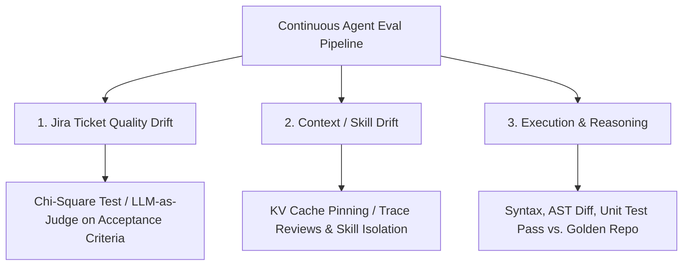

# Sample Approaches — Source Material for Interactive Training Content

*A curated, detail-preserving collection of four worked AI-engineering approaches, organized for direct reuse as lessons, labs, and real examples inside the interactive training program.*

**Status:** Source material / raw input for lesson authoring
**Owner:** AI Enablement Lead
**Origin:** Captured research/chat threads (COBOL modernization, GCP design audit, agent drift testing)
**Related:** [05 — Agent QA & Regression Framework](05-agent-qa-and-regression-framework.md), [07 — Enablement & Interactive Training](07-enablement-and-interactive-training.md), [13 — Legacy Modernization for AI-Friendliness](13-legacy-modernization-for-ai.md), [14 — Repo Audit: Agentic Readiness](14-repo-audit-agentic-readiness.md), [Interactive AI Training Design](interactiveAITrainingDesign.md)

---

## How to use this document

This file is **raw lesson fuel**, not a finished lesson. It holds four independent, self-contained approaches, each with runnable/quotable artifacts (code, diagrams, prompts, tables) exactly as captured, so no detail is lost when the interactive training program later turns them into modules. Each approach ends with a **Training Integration Notes** block suggesting how the Blazor/VSIX interactive lesson (see [pocInteractiveTraainingProgram.md](../pocInteractiveTraainingProgram.md)) could turn it into a real, runnable example.

| # | Approach | Core theme | Best-fit training module |
| --- | --- | --- | --- |
| 1 | AST / DDG / PDG-guided COBOL → Java modernization | Structural-artifact grounding for legacy migration | OKF progressive disclosure, context engineering |
| 2 | GNUcobol intermediate-C roadmap for COBOL → Java at scale | Using the compiler to resolve semantics the source leaves ambiguous — **mechanism corrected, see §2.2.1** | Model selection & fit, large-scale migration governance |
| 3 | Auditing an LLM+human GCP design before sandbox access | Security/cost/architecture review of AI-assisted infra design | Guardrails & grounding, agent QA |
| 4 | Testing for agent drift & baselining against golden application code | Continuous evaluation pipeline, golden-dataset methodology | Agent QA & regression framework, measurement/ROI |

---

## Approach 1 — AST / DDG / PDG-Guided COBOL-to-Java Modernization

### 1.1 Problem framing

An LLM modernizes legacy Enterprise COBOL to Java by combining natural-language capability with structured program-analysis artifacts: the **Abstract Syntax Tree (AST)**, **Data Dependency Graph (DDG)**, and **Program Dependence Graph (PDG)**.

LLMs are good at code generation but frequently struggle with COBOL's global variable state (`DATA DIVISION`) and complex control-flow logic (`GO TO`, `PERFORM THRU`), leading to **functional hallucinations**. Injecting AST, DDG, and PDG structural metadata directly into the prompt context — or using them as a syntax-validation skeleton — lets the LLM map semantic boundaries, untangle spaghetti logic, and refactor data structures cleanly into modern object-oriented Java (e.g., Spring Boot).

### 1.2 Phase 1 — Input legacy COBOL

Synthetic legacy Enterprise COBOL snippet representing a basic employee payroll calculation:

```cobol
IDENTIFICATION DIVISION.
PROGRAM-ID. PAYROLL.
DATA DIVISION.
WORKING-STORAGE SECTION.
01  WS-EMPLOYEE.
    05  WS-EMP-ID       PIC X(5) VALUE "E101".
    05  WS-HOURS        PIC 9(2) VALUE 45.
    05  WS-RATE         PIC 9(2)V99 VALUE 20.00.
    05  WS-PAY          PIC 9(4)V99 VALUE 0.
PROCEDURE DIVISION.
0001-MAIN-LOGIC.
    IF WS-HOURS > 40
        PERFORM 0002-OVERTIME-CALC
    ELSE
        PERFORM 0003-REGULAR-CALC
    END-IF.
    DISPLAY "FINAL PAY: " WS-PAY.
    STOP RUN.

0002-OVERTIME-CALC.
    MULTIPLY WS-RATE BY 40 GIVING WS-PAY.
    COMPUTE WS-PAY = WS-PAY + ((WS-HOURS - 40) * WS-RATE * 1.5).

0003-REGULAR-CALC.
    MULTIPLY WS-RATE BY WS-HOURS GIVING WS-PAY.
```

### 1.3 Phase 2 — Building the structural artifacts (pre-LLM processing)

Before the LLM processes the code, static analysis engines generate structured JSON/graph representations.

**1. Abstract Syntax Tree (AST)** — hierarchical, grammatical breakdown of the syntax. The LLM uses it to map legacy grammar constructs (like `PIC X(5)`) to modern data types (`String`) without blindly parsing COBOL strings.

```json
{
  "Program": "PAYROLL",
  "DataDivision": {
    "WorkingStorage": [
      { "Level": 5, "Name": "WS-EMP-ID", "Type": "Alphanumeric", "Length": 5 },
      { "Level": 5, "Name": "WS-HOURS", "Type": "Numeric", "Length": 2 }
    ]
  },
  "ProcedureDivision": {
    "Paragraphs": [
      {
        "Name": "0001-MAIN-LOGIC",
        "Body": {
          "IfStatement": {
            "Condition": "WS-HOURS > 40",
            "TrueBranch": { "Perform": "0002-OVERTIME-CALC" },
            "FalseBranch": { "Perform": "0003-REGULAR-CALC" }
          }
        }
      }
    ]
  }
}
```

**2. Data Dependency Graph (DDG)** — traces how data flows between variables. Because COBOL uses global `WORKING-STORAGE` declarations, it's hard to tell what data is modified where. The DDG explicitly shows the LLM that `WS-PAY` depends on both `WS-RATE` and `WS-HOURS`, telling it these variables must be passed into a refactored calculation method or grouped into an encapsulated class.

```text
[WS-RATE]  ──(reads)──> [0002-OVERTIME-CALC] ──(writes)──> [WS-PAY]
[WS-HOURS] ──(reads)──> [0002-OVERTIME-CALC] ──(writes)──> [WS-PAY]
```

**3. Program Dependence Graph (PDG)** — maps both data dependencies and control-flow dependencies (the conditions dictating whether a line executes). It tells the LLM that paragraph `0002-OVERTIME-CALC` is entirely conditional on `IF WS-HOURS > 40`, which the LLM turns directly into an object-oriented business-logic condition.

### 1.4 Phase 3 — LLM prompt construction

The migration pipeline combines the raw COBOL source with its graph representations inside an engineered instruction prompt:

```text
System: You are an expert migration engineer translating Enterprise COBOL to Java Spring Boot.
Context:
--- RAW COBOL ---
[COBOL Source Code here]
--- AST EXTRACT ---
[AST JSON here]
--- DATA DEPENDENCIES (DDG) ---
- WS-PAY depends on WS-RATE, WS-HOURS via 0002-OVERTIME-CALC
--- CONTROL DEPENDENCIES (PDG) ---
- 0002-OVERTIME-CALC execution depends on: WS-HOURS > 40

Task: Generate a thread-safe, modular Java class using Spring Service architecture.
Encapsulate the state into a domain model to eliminate global state issues.
```

### 1.5 Phase 4 — Final LLM output (modernized Java)

By reading the global-state variables in the DDG, the LLM groups them into a reusable domain model (`PayrollRequest`). By reading the control conditions in the PDG, the LLM maps the paragraphs into structured methods instead of raw global paragraphs.

```java
package com.migration.payroll.model;

import java.math.BigDecimal;

/**
 * Encapsulates the legacy WORKING-STORAGE global variables
 * into a modern, thread-safe domain object.
 */
public class PayrollRequest {
    private String employeeId;
    private int hours;
    private BigDecimal rate;

    public PayrollRequest(String employeeId, int hours, BigDecimal rate) {
        this.employeeId = employeeId;
        this.hours = hours;
        this.rate = rate;
    }

    public String getEmployeeId() { return employeeId; }
    public int getHours() { return hours; }
    public BigDecimal getRate() { return rate; }
}
```

```java
package com.migration.payroll.service;

import com.migration.payroll.model.PayrollRequest;
import org.springframework.stereotype.Service;
import java.math.BigDecimal;

@Service
public class PayrollService {

    private static final int REGULAR_HOURS_CAP = 40;
    private static final BigDecimal OVERTIME_MULTIPLIER = new BigDecimal("1.5");

    /**
     * Modernized calculation logic extracted via AST and PDG control flows.
     */
    public BigDecimal calculatePay(PayrollRequest request) {
        if (request.getHours() > REGULAR_HOURS_CAP) {
            return calculateOvertimePay(request);
        } else {
            return calculateRegularPay(request);
        }
    }

    private BigDecimal calculateRegularPay(PayrollRequest request) {
        return request.getRate().multiply(BigDecimal.valueOf(request.getHours()));
    }

    private BigDecimal calculateOvertimePay(PayrollRequest request) {
        BigDecimal regularPay = request.getRate().multiply(BigDecimal.valueOf(REGULAR_HOURS_CAP));
        int overtimeHours = request.getHours() - REGULAR_HOURS_CAP;
        BigDecimal overtimeRate = request.getRate().multiply(OVERTIME_MULTIPLIER);
        BigDecimal overtimePay = overtimeRate.multiply(BigDecimal.valueOf(overtimeHours));
        return regularPay.add(overtimePay);
    }
}
```

### 1.6 Why this approach scales for millions of lines of code

When modernizing massive enterprise codebases, relying entirely on raw LLM processing hits memory, context-window, and accuracy walls. Feeding structural graphs into the pipeline acts as an architectural guide:

- The **AST** enforces proper vocabulary transformation.
- The **DDG** resolves where variable values morph across procedures.
- The **PDG** strips out dead paths and deep `GO TO` nests, turning flat spaghetti programs into neat object-oriented modules.

### 1.7 Training Integration Notes

- **Real example to embed:** the full `PAYROLL` COBOL → AST/DDG/PDG → Java pipeline above is small enough to run end-to-end in a lesson step and large enough to show real structural reasoning.
- **Lesson idea:** show the learner the COBOL source, ask them to predict which variables belong in the DDG before revealing it, then reveal the generated Java and have them map each COBOL paragraph to its Java method.
- **OKF tie-in:** the AST/DDG/PDG triad is a natural fit for the OKF "progressive disclosure" visual tree already planned in [pocInteractiveTraainingProgram.md](../pocInteractiveTraainingProgram.md) — each artifact is a disclosure layer.
- **Guardrail tie-in:** frame "functional hallucination" (e.g., an LLM inventing behavior not backed by the DDG/PDG) as a grounding-failure example for [09 — Guardrails & Grounding](09-guardrails-and-grounding.md).

---

## Approach 2 — COBOL → Intermediate C (GNUcobol) → Java at Scale

### 2.1 Problem framing

Using **GNUcobol** to compile COBOL into intermediate C code is an architectural workaround for large migration projects. It solves a major bottleneck: LLMs natively struggle to reason through COBOL's layout, lack of scoped variables, and implicit side effects, because their training distribution on COBOL is thin compared to C.

> **Local install:** the download at `C:\Users\tkrro\Downloads\gnucobol-3.2_win` is a **source distribution** and contains no `cobc.exe`. A working prebuilt GnuCOBOL 3.2rc1 (MinGW x64) from [mridoni/gnucobol-binaries](https://github.com/mridoni/gnucobol-binaries/releases) is installed at `C:\Users\tkrro\tools\gnucobol-3.2rc1`. Setup, the non-obvious `COB_CONFIG_DIR` fix, and verified commands are in [training-fixture/cobol/README.md](../poc-interactive-training/training-fixture/cobol/README.md).
>
> **The approach works, but not for the reason given below.** The mechanism is semantic disambiguation, not legibility. See [§2.2.1](#221-correction--what-gnucobol-actually-emits-and-why-it-still-works) before building a lesson on this material.

By shifting the source paradigm from **COBOL → Java** to **COBOL → Intermediate C → Java**, the LLM gets a "Rosetta Stone" that preserves decades of dense subject-matter-expert (SME) business logic.

### 2.2 Why the C roadmap solves the LLM knowledge problem

```text
[Legacy COBOL] ──(GNUcobol Compiler)──> [Structured C Code] ──(LLM Refactoring)──> [Modern Java]
     │                                         │
     └── Highly abstract global state          └── Clear function blocks, pointers,
         & structural gaps memory maps             & predictable procedural execution
```

Direct compilation into C unlocks three critical advantages:

1. **Explicit memory maps** — COBOL's `REDEFINES` and flat `DATA DIVISION` are notoriously difficult for LLMs to track. GNUcobol flattens these into explicit C struct offsets, pointers, and memory blocks, showing the LLM exactly how data is structured in memory.
2. **Flattened control flow** — complex legacy patterns like `PERFORM THRU` or overlapping `GO TO` loops are resolved by the compiler into structured C loop variations, switch blocks, or sequential execution. The LLM no longer has to guess the execution path.
3. **Rich LLM context** — LLMs are saturated with C source training data. The model understands semantic logic, pointer math, and data modifications far better in C, drastically minimizing functional hallucinations of core business rules.

### 2.2.1 Correction — what GnuCOBOL actually emits, and why it still works

*Added after running the real compiler. The reasoning in §2.2 is right about the outcome and wrong about the mechanism. A first correction to this section over-swung and has itself been revised — both errors are recorded because the pattern matters.*

**The claimed mechanism does not hold.** Real `cobc -C` output for a calculation:

```c
if (((int)cob_cmp_numdisp (b_17 + 5, 2, 40LL, 0) > 0))
  goto l_5;
cob_decimal_set_field (d_0, &f_20);
cob_decimal_mul (d_0, dc_1);
```

This is libcob runtime IR, not idiomatic C. Control flow is `goto` chains; arithmetic is `cob_decimal_*` calls. The "LLMs are saturated with C training data" argument does not transfer, because no training corpus contains code shaped like this. **Do not sell this approach on legibility.**

**The real mechanism is semantic disambiguation.** The compiler resolves the things that are genuinely undecidable by reading COBOL — and those are precisely the frontiers that stall a migration. From the `HARDPAY` fixture, which exercises `REDEFINES`, `COMP-3`, `PERFORM THRU` and `ROUNDED`:

```c
static cob_u8_t b_17[21];                     /* WS-RAW-RECORD */
static cob_field f_22 = {3, b_17 + 6, &a_5};  /* WS-HOURS-PACKED */
static cob_field f_23 = {4, b_17 + 9, &a_6};  /* WS-RATE */

a_5 = {0x12, 4, 1, 0x0001}   /* packed decimal, 4 digits, scale 1, signed */
a_6 = {0x12, 6, 2, 0x0001}   /* packed decimal, 6 digits, scale 2, signed */
```

That is a **complete resolution of a `REDEFINES` overlay** — named field, exact byte offset, exact length, type, digits, scale and sign. The storage buffers are anonymous; the field descriptors are not. This is the hardest thing to get right migrating COBOL by hand.

Control flow is resolved the same way:

```c
/* PERFORM 0100-GROSS THRU 0300-NET */
frame_ptr->perform_through = 7;
/* Line: 27 : Paragraph 0100-GROSS : HARDPAY.cbl */
/* Line: 32 : Paragraph 0200-BONUS : HARDPAY.cbl */
/* Line: 39 : Paragraph 0300-NET   : HARDPAY.cbl */
/* Implicit PERFORM return */
```

The `THRU` fall-through range is settled, the implicit return is made explicit, and every construct carries a line-and-paragraph back-reference to the source.

**What the compiler settles that a reader cannot:**

| Frontier | What the COBOL shows | What the compiler settles |
| --- | --- | --- |
| `REDEFINES` overlay | two names over one storage area | exact offset, length and type per field |
| `COMP-3` / `USAGE` | `PIC S9(3)V9 COMP-3` | 3 bytes, 4 digits, scale 1, signed, sign nibble |
| `PERFORM THRU` | a paragraph range | resolved fall-through and explicit return |
| `ROUNDED`, implicit `MOVE` truncation | keyword only | exact `cob_decimal_*` rounding semantics |
| Dead paragraphs | not visible | unreachable labels |
| Runtime surface | invisible | the exact `libcob` calls used, which maps to Java library choices |

**How to use it in practice.** The model does not read the generated C as better code; it **queries** it for facts it would otherwise guess. Extract the field table, the control-flow resolution and the runtime call list into the prompt. Do not paste the whole file — most of it is `cob_decimal` plumbing that wastes context.

**And it runs.** `HARDPAY` outputs `NET: +010696.81`, which cannot be derived by reading the source. That makes GnuCOBOL simultaneously a **disambiguation oracle** (what does this mean?) and a **test oracle** (is the Java right?). Both are stronger claims than the original legibility argument.

### 2.3 Step 1 — Extracting data structures (the C state map)

> The C below is **synthetic** — it is what the original capture assumed GnuCOBOL produces. The real compiler emits field descriptors with exact offsets and packed-decimal attributes instead (see §2.2.1, which carries the same information in a less pretty form). Retained to show the original reasoning; do not present it as compiler output.

GNUcobol translates the global `WORKING-STORAGE` into structured C types. The LLM reads this C roadmap to map structural dependencies and encapsulate them into decoupled Java domain models.

```c
/* Synthetic Generated C Roadmap from GNUcobol */
struct cobol_field {
    unsigned char data[5];
};

struct ws_employee_t {
    struct cobol_field ws_emp_id;  /* PIC X(5) */
    int ws_hours;                  /* PIC 9(2) */
    double ws_rate;                /* PIC 9(2)V99 */
    double ws_pay;                 /* PIC 9(4)V99 */
};
```

**LLM strategy:** the LLM parses this C struct and immediately recognizes a cohesive object footprint. It generates a thread-safe Java class (`EmployeeRecord`) with appropriate object types, cleanly isolating the global state.

### 2.4 Step 2 — Parsing procedural business logic

> Also **synthetic**. Real output is `cob_decimal_*` runtime calls and resolved `goto` labels. The execution order it encodes is correct and useful; the shape is not what is shown here (§2.2.1).

Instead of struggling with implicit COBOL keywords, the LLM reads predictable, sequential C instructions where calculations and local-logic adjustments are fully laid bare.

```c
/* Synthetic Generated C Roadmap for Calculations */
void payroll_logic(struct ws_employee_t *emp) {
    if (emp->ws_hours > 40) {
        /* Overtime path */
        emp->ws_pay = emp->ws_rate * 40;
        emp->ws_pay += (emp->ws_hours - 40) * emp->ws_rate * 1.5;
    } else {
        /* Regular path */
        emp->ws_pay = emp->ws_rate * emp->ws_hours;
    }
}
```

**LLM strategy:** the LLM treats the C code as a rigorous pseudo-code guide. Because C enforces strong logical blocks, the LLM maps this directly into clean, object-oriented branch logic.

### 2.5 Step 3 — Injecting the C roadmap into the prompt

> Corrected shape. Inject the **extracted facts**, not the raw generated C — most of the file is `cob_decimal` plumbing that wastes context (§2.2.1).

The automation harness supplies the LLM with the legacy COBOL snippet (to anchor original business names/comments) and the compiler-resolved facts (to anchor exact layout and execution semantics).

```text
System: You are an enterprise migration assistant converting legacy modules to Spring Boot.
Context:
--- RECOVERY SOURCE (COBOL) ---
0002-OVERTIME-CALC.
    MULTIPLY WS-RATE BY 40 GIVING WS-PAY.
--- FUNCTIONAL ROADMAP (C) ---
emp->ws_pay = emp->ws_rate * 40;
emp->ws_pay += (emp->ws_hours - 40) * emp->ws_rate * 1.5;

Task: Generate a Spring Boot service method that matches the functional math layout of the C roadmap while using clean domain modeling from your structural mapping.
```

### 2.6 Scaling the strategy across 62 million lines of code

Given a project with 4 million lines already migrated, maintaining consistency and accuracy across the remaining 58 million lines requires rigid automation checks around the intermediate-C paradigm:

- **Automated segmenting** — break large COBOL programs, via GNUcobol compilation units, into manageable C structural files that stay within the LLM's optimal attention span/context bounds.
- **Abstracting the runtime** — GNUcobol relies on its underlying support library (`libcobol`). When the LLM finds calls to internal `libcobol` math or I/O functions (e.g., `cob_add`, `cob_display`), use a pre-mapped dictionary telling the LLM to swap those calls for modern Java ecosystem equivalents (e.g., Spring JDBC, standard math libraries).
- **Differential verification testing** — **this is the durable value of the approach.** Because GnuCOBOL produces a compiling, running program, you can execute the legacy behaviour with test inputs, capture the precise state transitions, and use those exact outputs as an automated verification harness for the newly generated Java services. Correctness is then decided by execution rather than by review or by an LLM judge.

### 2.7 Training Integration Notes

- **Real example to embed:** contrast Approach 1 (direct AST/DDG/PDG) with a raw, ungrounded prompt using the *same* payroll snippet, and grade both with the GnuCOBOL-built executable as the oracle. See [trainingSampleOverview.md](trainingSampleOverview.md) tab 16.
- **Lesson idea:** have the learner run differential verification manually — execute the compiled COBOL with sample inputs, capture outputs, then check the LLM-generated Java against those captured outputs. A concrete, hands-on grounding/verification exercise where no model grades the result.
- **Model-selection tie-in:** the original "LLMs are saturated with C, thin on COBOL" framing is a good [02 — Model Selection & Fit-for-Purpose](02-model-selection-and-fit.md) discussion *provided* it is paired with §2.2.1 — the lesson is that a plausible-sounding representation swap must be verified before it is adopted.
- **Legacy-modernization tie-in:** cross-link into [13 — Legacy Modernization for AI-Friendliness](13-legacy-modernization-for-ai.md) as a large-scale (62M LOC) case study, with the correction attached.

---

## Approach 3 — Auditing an LLM+Human GCP Design Before Sandbox Access

### 3.1 Problem framing

Approach for auditing a Google Cloud Platform (GCP) architecture design produced by a **hybrid LLM+human development team**, prior to granting access to the GCP sandbox environment. Because an AI was involved in the design, the audit must watch for common LLM pitfalls — hallucinated GCP features, outdated API configurations, or overly permissive security defaults — before granting sandbox access.

An effective audit uses a structured, multi-layered review across five pillars.

### 3.2 Pillar 1 — Security & Identity (highest priority)

Since the team is about to enter a sandbox, strict boundaries must be enforced to prevent accidental data exposure or lateral movement into production.

- **Least-privilege IAM** — the design should specify custom IAM roles or strict predefined roles. Guard against the common LLM trap of using broad `roles/owner` or `roles/editor` for service accounts.
- **Service account hardening** — verify human developers and LLM agents use distinct service accounts. Check that keyless authentication (e.g., Workload Identity Federation) is preferred over downloadable JSON keys.
- **Network perimeter** — look for a clear VPC layout: public IPs minimized, Cloud NAT used for outbound-only internet access, and Identity-Aware Proxy (IAP) designated for secure administrative access.

### 3.3 Pillar 2 — Architecture & AI-specific hallucinations

LLMs frequently reference deprecated GCP products or invent parameters that don't exist.

- **Component verification** — cross-reference all suggested GCP services against current documentation; ensure the LLM hasn't suggested deprecated tools (e.g., older AI Platform features instead of modern Vertex AI).
- **Quotas and limits** — check whether the design accounts for sandbox quotas, especially GPU allocations (e.g., Nvidia H100/A100) if the team is building or fine-tuning models.

### 3.4 Pillar 3 — Resource & cost governance

A sandbox environment can quickly rack up massive bills if unmonitored, especially with AI/ML services involved.

- **Cost guardrails** — the design should incorporate Budgets and Alerts at the project level.
- **Automated lifecycles** — verify a plan exists to delete or spin down expensive resources automatically (e.g., shutting down Vertex AI Notebooks or Compute Engine instances overnight via Cloud Scheduler).
- **Resource labeling** — require a strict labeling schema (e.g., `team:human-llm`, `env:sandbox`, `ttl:30days`) to track who or what generated a resource.

### 3.5 Pillar 4 — Hybrid team operations (human vs. LLM)

Auditing a design built by a collaborative team means understanding how both entities interact with the cloud.

- **Traceability** — the design must clarify how actions taken by the LLM agent are logged. Ensure Cloud Logging is enabled so you can distinguish a human developer's action from an automated AI agent's action.
- **Infrastructure as Code (IaC)** — insist the design uses Terraform or Config Connector. It is much safer to audit an LLM-generated Terraform plan than to let an LLM click around the GCP Console manually.

### 3.6 Pillar 5 — Direct comparison: manual vs. AI-assisted auditing

To expedite the process, an LLM can help audit the design the development LLM created.

| Audit focus | What human reviewers do best | What AI auditors do best |
| --- | --- | --- |
| Business logic | Aligning the design with company compliance policies and risk tolerance | Evaluating if code syntax matches standard frameworks |
| Security blindspots | Catching subtle, context-dependent architectural flaws | Scanning configurations for missing flags (e.g., missing encryption keys) |
| GCP feature drift | Knowing internal organizational constraints and preferred vendors | Checking if specific API versions or product names are deprecated |

### 3.7 Clarifying questions to tailor a pre-access checklist

- What specific GCP services (e.g., Vertex AI, GKE, BigQuery) are central to the design?
- Will the LLM agent have direct write-access to deploy resources in the sandbox, or will humans handle all deployment?
- Are there strict data-compliance requirements (e.g., HIPAA, PCI-DSS) that even the sandbox must adhere to?

### 3.8 Training Integration Notes

- **Real example to embed:** present a small synthetic Terraform/IaC snippet with 2-3 deliberately planted flaws (an `roles/owner` grant, a missing budget alert, an undocumented public IP) and have the learner find them against the five-pillar checklist — mirrors the "plant traps, challenge agents to find them" QA pattern already planned in [05 — Agent QA & Regression Framework](05-agent-qa-and-regression-framework.md).
- **Lesson idea:** use the human-vs-AI-auditor comparison table as an interactive sorting exercise (drag each audit finding to "human strength" or "AI strength").
- **Guardrails tie-in:** the "hallucinated GCP features / deprecated APIs" failure mode is a direct real-world illustration for [09 — Guardrails & Grounding](09-guardrails-and-grounding.md).

---

## Approach 4 — Testing for Agent Drift & Baselining Against Golden Application Code

### 4.1 Problem framing

Standard approaches to test whether an agent is drifting over time due to Jira ticket quality, agent context/skills degradation, or upstream model changes — and how to baseline against a golden application codebase.

Testing an AI software-engineering agent for behavioral drift requires isolating the variable causing the degradation. Degradation is typically caused by three core triggers: decaying Jira ticket quality, unmanaged agent context/skills, or underlying upstream LLM model updates. A continuous evaluation pipeline against a **"Golden Application Code"** baseline is the standard industry approach to identifying, diagnosing, and fixing agent drift.

### 4.2 Part 1 — Standard approaches to test for agent drift

Implement a continuous multi-dimensional evaluation pipeline. Each test run should record a structured snapshot of the operating state: model version, prompt hash, tool registry state, and retrieval source IDs.

```text
                ┌──────────────────────────────────────────────┐
                │        Continuous Agent Eval Pipeline        │
                └──────────────────────┬───────────────────────┘
                                       │
         ┌─────────────────────────────┼─────────────────────────────┐
         ▼                             ▼                             ▼
┌──────────────────┐          ┌──────────────────┐          ┌──────────────────┐
│ 1. Jira Ticket   │          │ 2. Context /     │          │ 3. Execution     │
│    Quality Drift │          │    Skill Drift   │          │    & Reasoning   │
└────────┬─────────┘          └────────┬─────────┘          └────────┬─────────┘
         │                             │                             │
         ▼                             ▼                             ▼
  Chi-Square Test /             KV Cache Pinning /            Syntax, AST Diff,
  LLM-as-a-Judge on             Trace Reviews &               Unit Test Pass
  Acceptance Criteria           Skill isolation               vs. Golden Repo
```

#### 4.2.1 Testing Jira quality drift

Jira quality drift occurs when tickets lack rigorous specifications, turning the prompt into a moving target.

**Test approach:** treat the Jira issue as the formal contract. Use an LLM-as-a-Judge program to evaluate incoming Jira tickets against a strict structural rubric before the agent handles them.

**Metrics:**
- **Completeness score** — does it contain unambiguous Acceptance Criteria (AC)?
- **Context linkage** — are relevant components, files, or technical specs explicitly mapped (e.g., via the Atlassian Teamwork Graph or Confluence links)?
- **Statistical topic drift** — run regular Chi-Square (χ²) distribution tests on the vocabulary/topics of the incoming backlog. A shifting distribution indicates product requirements are pivoting away from what the agent was optimized to build.

#### 4.2.2 Testing agent context & skill drift

Context drift occurs when an agent loses track of the initial objective because the context window fills with verbose terminal logs, linter errors, and irrelevant file data.

**Test approach:** monitor the agent's reasoning traces and intermediate payloads. Track trajectory length (number of turns taken to solve a known problem).

**Metrics:**
- **Goal fidelity** — use an LLM judge to scan intermediate steps and score whether the agent is still working the original task or has veered into unprompted refactoring.
- **Skill call accuracy** — ensure only specialized tools/skills are invoked based on problem type (e.g., verifying a unit-test specialist isn't executing UI-test tools).

### 4.3 Part 2 — Baselining against a golden application code base

To mathematically prove an agent is drifting, run it against a static Golden Dataset consisting of a frozen version of the codebase ("Golden App Code") paired with deterministic benchmarks.

**Step 1 — Curate the golden evaluation dataset.** Assemble a compact registry of 30–50 historical engineering tasks (feature requests, bug fixes, flaky-test refactors) where the ideal human-written solution is known. For each evaluation case, store:
- The Jira ticket state (exact original description and acceptance criteria).
- The golden codebase state (exact Git commit hash prior to the fix).
- The target solution Git diff (the ideal human patch file).
- The verification oracle (a deterministic test suite that passes only if the code is correct).

**Step 2 — Establish the execution sandbox.** Automate a pipeline that runs on a schedule or upon any agent update:
1. Check out the baseline golden codebase state into a clean, ephemeral container.
2. Initialize the agent with the target configuration (prompts, skills, model version).
3. Feed the agent the golden Jira ticket state.

**Step 3 — Run the drift scorecards.** Once the agent outputs its patch, measure drift across three independent layers:

| Evaluation layer | Metric / method | What it detects |
| --- | --- | --- |
| Functional layer | Run the Verification Oracle (unit/integration tests) | Functional regressions: did the agent fail to fix the bug, or did it break existing code? |
| Syntactic & structural layer | Parse the output into an AST; check via a code diff against the human patch | Style drift: is the agent generating unmaintainable, verbose logic, or ignoring project architecture conventions? |
| Semantic / behavioral layer | Use an LLM judge to read the agent's reasoning trace against a deterministic scoring rubric | Reasoning drift: is the agent taking 40 steps to solve a problem that used to take 5 steps? |

**Step 4 — Mitigate and adjust.** If the scorecard identifies functional drops or ballooning trace lengths, apply engineering safeguards:
- **Pin model versions** — upstream provider updates can quietly degrade performance; roll back or lock down exact LLM versions.
- **Behavioral anchoring** — pin vital instruction representations at the infrastructure layer, or compress execution histories into concise procedural memories to combat long-turn context degradation.
- **Context engineering gates** — strip junk logs and enforce strict markdown/YAML boundaries on external knowledge sources to ensure high context quality.

### 4.4 Further reading captured with the source material

These external sources were attached to the original research and are preserved here for later fact-checking/citation when the lesson is authored (not verified/endorsed — treat as pointers, not ground truth):

- UPP Global Technology — "From Drift to Control: Building a Continuous Evaluation Pipeline"
- Atlassian — "Context engineering for coding agents"
- Failproof AI — "Agent Context Drift - How to Keep Agents on Task"
- Prassanna Ravishankar — "Agent Drift in AI Systems"
- Atlassian — "How We Cut up to 80% of Engineering 'Chores' Using AI Agents in Jira"
- iris-eval.com — "Eval Drift: The Silent Quality Killer for AI Agents"
- Atlan — "How to Test Context Quality for AI Agents: A 2026 Guide"
- Robots & Pencils — Engineering Archives (artifacts/ evidence-with-the-work pattern)
- ElixirData — "AI Agent Drift Detection: Monitoring Model & Decision Drift"
- Medium (Oleksii Samara) — "Not Every Test Should Be an AI Agent"
- DEV Community — "Managing AI Agent Drift Over Time: A Practical Framework for Reliability"
- Medium (Kumaran Ponnambalam) — "Agent Drift: Measuring and managing performance degradation in AI Agents"
- arXiv — "ContextNest: Verifiable Context Governance for Autonomous AI Agents"
- TestMu AI — "How Agent Skills Make AI Reliable for Test Automation"
- TestMu AI — "Guide to Web Services Testing: Types, Tools, & Best Practices"

### 4.5 Training Integration Notes

- **Real example to embed:** this is a near-direct match for the golden-baseline design already called for in [05 — Agent QA & Regression Framework](05-agent-qa-and-regression-framework.md) §"golden-baseline testing" — use this material to flesh out that document's worked example, and reuse the drift-scorecard table verbatim as a lesson rubric.
- **Lesson idea:** give the learner a golden Jira ticket + golden commit + a deliberately "drifted" agent patch, and have them fill out the three-layer drift scorecard (functional / syntactic / semantic) themselves before revealing the scored answer.
- **Diagram reuse:** the ASCII pipeline diagram in §4.2 can be redrawn as a Mermaid flowchart for the Blazor illustration:



---

## Cross-cutting themes for lesson design

These recur across all four approaches and are good candidates for a shared "core concepts" module before the four worked examples:

1. **Structural grounding beats raw prompting** — AST/DDG/PDG (Approach 1), the compiler-resolved field and control-flow maps (Approach 2, §2.2.1), and reasoning traces (Approach 4) all give the LLM a verifiable skeleton instead of trusting free-form generation. **But the stated reason for a grounding technique must be verified, not assumed** — Approach 2 works for a different reason than its author believed.
2. **Hallucination is a named, expected failure mode** — "functional hallucinations" (Approach 1), "hallucinated GCP features/deprecated APIs" (Approach 3) — both need a concrete detection mechanism, not just caution.
3. **Golden baselines are the recurring verification pattern** — differential verification against the compiled legacy program (Approach 2) and golden-codebase drift scorecards (Approach 4) are the same idea applied at different scales. Both decide correctness by execution rather than by review.
4. **Human/AI division of labor is explicit, not assumed** — Approach 3's comparison table is the clearest statement of this and should be reused as a template in other modules (e.g., who reviews security vs. who reviews style).
5. **Everything is logged and attributable** — traceability of human vs. LLM actions (Approach 3) and operating-state snapshots (model version, prompt hash, tool registry, retrieval source IDs) (Approach 4) are both instances of the same observability requirement.
