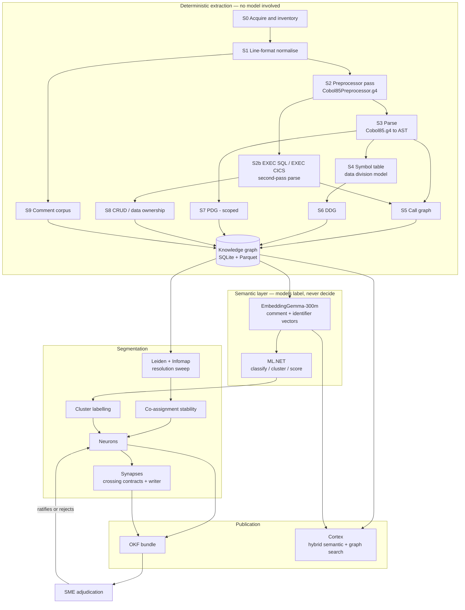
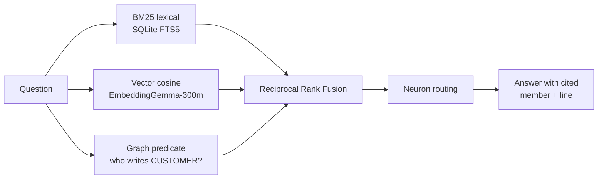

# Design — Domain Segmentation of a 62M-Line IBM Enterprise COBOL Estate

**Status:** draft for review
**Author:** senior developer, CES AI
**Date:** 2026-09-08
**Goal:** derive defensible business-domain boundaries over the estate, and publish them as reviewable knowledge.
**Explicit non-goal:** migrating code to Java. No Java is generated by anything in this document.

---

## 1. What this is and is not

This design builds a **map**, not a migration. It answers "what are the domains, where are their edges, and which one can we cut first" — the question that must be settled before any Java is written, and the question 62M lines of undocumented COBOL currently makes unanswerable.

| In scope | Out of scope |
| --- | --- |
| Parse the estate with ANTLR, deterministically | Generating Java |
| Build AST, call graph, DDG, scoped PDG, knowledge graph | Refactoring COBOL |
| Extract the in-code notes into context documentation | Replacing SME judgement |
| Cluster programs into domains ("neurons") with stability measurement | Auto-approving a boundary |
| Provide semantic + structural search over the whole estate ("cortex") | Deciding migration order without a human |
| Emit the result as an OKF bundle | Physically splitting repositories (see §14) |

The migration layer — AST/DDG/PDG-guided translation with GnuCOBOL as a differential oracle — already exists and is proven at program scale in [poc-interactive-training/server/Services/CobolToolchain.cs](poc-interactive-training/server/Services/CobolToolchain.cs) and [MigrationSamples.cs](poc-interactive-training/server/Services/MigrationSamples.cs). **This design feeds that layer; it does not replace it.**

---

## 2. Evidence this rests on, and what it proves

| Evidence | What it establishes | What it does *not* establish |
| --- | --- | --- |
| 47 programs migrated to C# last year, outputs matched against the mainframe | The differential-oracle method is sound at program scale | Nothing about domain boundaries |
| Expanded to 200+ programs; COBOL SMEs agreed with the classifications | The in-code notes carry real signal — this is measured, not assumed | Agreement was on thousands of lines, not millions |
| Some programs found deprecated and no longer needed | Dead-code detection works and is valuable enough to be a first-class output | The dead fraction across 62M LOC |

**Treat the 200+ SME-agreed programs as a labelled corpus.** Split it: a training/tuning portion and a **sealed hold-out that is never inspected during development**. Every domain-assignment change is scored against the hold-out. Without this, the pipeline will be tuned until it agrees with itself.

This is the single most valuable asset in the programme. Most estates attempting this have no ground truth at all.

---

## 3. Architecture



**One rule governs the whole diagram:** everything left of the semantic layer is deterministic and reproducible byte-for-byte. Models label and narrate. **No model assigns a program to a domain, names a data owner, or sets a boundary.**

---

## 4. Stage 0 — Acquisition and inventory

Before parsing anything, know what exists and what runs.

**Inputs:** PDS unloads of COBOL source, copybook libraries (all SYSLIBs), JCL/PROC libraries, BMS map assembler source, DB2 catalog extract, CICS CSD extract, scheduler definitions.

**Outputs:** a manifest row per member — library, member, SHA-256, line count, detected type, codepage.

**Non-obvious requirements:**

- **Codepage.** Source arrives as EBCDIC (usually CP037 or CP1047). Convert once, record which. A wrong codepage silently corrupts literals and the `¬`/`|` characters used in conditions.
- **Sequence numbers in columns 1–6.** Some estates have them, some are blank, some contain garbage from decades of editors. Strip deterministically, never parse.
- **Columns 73–80.** Identification area. Frequently holds change-ticket IDs — capture it, do not discard it (see §12).
- **Liveness join.** Join the manifest to 12–24 months of SMF type 30 records, CICS statistics and scheduler run history. **Programs with no execution record in the window are quarantined from clustering** and reported as deprecation candidates. In estates this age 30–50% is typical; you already found this pattern in the 200-program run. Do not build a domain map over dead code — it distorts every cluster.

**Self-check:** every manifest row hashes, converts and re-hashes identically. Any member failing round-trip is quarantined with a reason, never silently dropped.

---

## 5. Stage 1 — Line-format normalisation

**This stage is mandatory and is the most common reason ANTLR COBOL pipelines fail on real mainframe source.**

The `Cobol85` grammars assume normalised, essentially free-format input. Enterprise COBOL fixed format is not that:

| Columns | Meaning | Handling |
| --- | --- | --- |
| 1–6 | Sequence number | Strip |
| 7 | Indicator | `*` or `/` → comment; `-` → continuation; `D` → debugging line |
| 8–11 | Area A | Division/section/paragraph/level-01 headers |
| 12–72 | Area B | Statements |
| 73–80 | Identification | Capture as metadata, then strip |

The grammar's `COMMENTLINE` rule matches `*>` (free-format). A fixed-format `*` in column 7 will not match and will shred the parse. Likewise `-` continuation lines must be **joined before lexing**, including the awkward case of a literal split mid-string across the boundary.

**Output:** normalised free-format text, plus a **line map** from every normalised line back to `(library, member, original line, original column)`. Every downstream fact must carry a position that resolves through this map. Without it you cannot cite evidence, and uncitable evidence will not survive SME review.

**Self-check:** normalise → re-emit fixed format → compare against the original ignoring stripped areas. Mismatches are reported, not tolerated.

---

## 6. Stage 2 — Preprocessor pass (`Cobol85Preprocessor.g4`)

Grammar: [antlr/grammars-v4 `cobol85/Cobol85Preprocessor.g4`](https://github.com/antlr/grammars-v4/blob/master/cobol85/Cobol85Preprocessor.g4) (MIT, © Ulrich Wolffgang / ProLeap). Action-free, per the repository's convention — we generate the C# target and attach behaviour via listeners, keeping the grammar file unmodified and upstream-mergeable.

The rules that matter, verbatim from the grammar:

```antlr
copyStatement : COPY copySource (NEWLINE* (directoryPhrase | familyPhrase | replacingPhrase | SUPPRESS))* NEWLINE* DOT ;
copySource    : (literal | cobolWord | filename) ((OF | IN) copyLibrary)? ;
replacingPhrase : REPLACING NEWLINE* replaceClause (NEWLINE+ replaceClause)* ;
execCicsStatement : EXEC CICS charData END_EXEC DOT? ;
execSqlStatement  : EXEC SQL charDataSql END_EXEC DOT? ;
compilerOptions   : (PROCESS | CBL) (COMMACHAR? compilerOption | compilerXOpts)+ ;
```

### 6.1 Three findings that shape the design

**(a) `EXEC SQL` and `EXEC CICS` bodies are *not* parsed.** They are captured as `charData` / `charDataSql` — opaque token soup. This is the correct grammar design, but it means **the CRUD matrix and the CICS call graph cannot come from this grammar.** They require a second pass (§7). A plan that assumes otherwise will produce an empty data-ownership matrix and nobody will notice until the boundaries look absurd.

**(b) `COPY ... REPLACING` with pseudo-text (`== ... ==`) rewrites the included source.** Two programs including the same copybook with different `REPLACING` clauses do not have the same data layout. Record the copybook edge *and* the replacement set; layout comparison must use the post-replacement form.

**(c) The grammar captures compiler options from `CBL`/`PROCESS` statements** — including `TRUNC(BIN|OPT|STD)`, `NUMPROC`, `ARITH`, `QUOTE`/`APOST`, `NSYMBOL`, `CODEPAGE`.

> **This resolves an open item raised earlier.** Rather than asking someone which `TRUNC` the mainframe build uses, mine `CBL`/`PROCESS` statements across the estate **and** `PARM=` on every compile step in the JCL, then report the distribution. If the estate is not uniform — and it usually is not — that is a finding that changes the oracle configuration per program, and every downstream number depends on it.

### 6.2 COPY resolution

Resolution follows **SYSLIB concatenation order** from the compile JCL, not filesystem order. Same member name in two libraries resolves to the first. Getting this wrong compiles against the wrong record layout with **no error**.

For every `COPY`, emit an edge carrying: requested name, `OF`/`IN` library if stated, resolved library, position in the concatenation, whether resolution was ambiguous, and the `REPLACING` set.

**Self-check:** count unresolved `COPY` statements. Publish it. An unresolved copybook is a hole in the data-ownership matrix, which is the primary domain signal — it must be visible, not absorbed.

---

## 7. Stage 2b — `EXEC` block second pass

Take the `charData` blocks captured in §6 with their positions, and parse them with focused mini-parsers.

**SQL** — extract statement kind and every table with its access mode:

| Statement | Access recorded |
| --- | --- |
| `SELECT ... FROM t` | `READS t` |
| `INSERT INTO t` | `WRITES t` |
| `UPDATE t SET` | `UPDATES t` (record columns) |
| `DELETE FROM t` | `DELETES t` |
| `DECLARE c CURSOR FOR SELECT` | `READS`; if `FOR UPDATE` also `UPDATES` |
| `EXEC SQL INCLUDE` | copybook edge, same as `COPY` |

Resolve unqualified table names using the bind `QUALIFIER` from the JCL bind step — the GAM sample shows this explicitly (`QUALIFIER(GAMUSER)`, `BIND PACKAGE(GAMPKG)`, `PLAN(GAMPLAN)`). Unqualified names resolved against the wrong qualifier merge two domains' tables into one node.

**CICS** — each command becomes a typed edge:

| Command | Edge | Note |
| --- | --- | --- |
| `LINK PROGRAM(x)` | `CICS_LINK` | returns |
| `XCTL PROGRAM(x)` | `CICS_XCTL` | **does not return** — distinct control semantics, must not be merged with `LINK` |
| `START TRANSID(t)` | `CICS_START` | asynchronous; a weak coupling, weight accordingly |
| `READ/WRITE/REWRITE/DELETE FILE(f)` | VSAM CRUD | feeds the ownership matrix |
| `READQ/WRITEQ TS\|TD` | queue edge | a real inter-program channel; commonly missed |
| `SEND/RECEIVE MAP(m) MAPSET(s)` | `USES_MAP` | presentation binding |

`PROGRAM(WS-FIELD)` is a dynamic reference — treat exactly like dynamic `CALL` (§9.2).

**Self-check:** every captured `EXEC` block either parses or is logged verbatim with its position. Report parse rate per dialect. Silent skipping is prohibited.

---

## 8. Stage 3 — Parse and AST

Grammar: [`cobol85/Cobol85.g4`](https://github.com/antlr/grammars-v4/blob/master/cobol85/Cobol85.g4), C# target via `Antlr4.Runtime.Standard`.

**Generation needs no Java.** The official ANTLR tool is a Java program, but [`antlr-ng`](https://github.com/antlr-ng/antlr-ng) is a Node reimplementation that emits the same C# and needs only Node 20+. Either way, generate **once** and commit the output: the grammar does not change, so regenerating a 1.9 MB parser on every build buys nothing and costs offline-safety. Treat it like `--calibrate-corpus` — an explicit, occasional step.

### 8.0 The contract between the two grammars — measured, not assumed

Feeding real COBOL straight to `Cobol85.g4` produces roughly a hundred syntax errors per program, all beginning at `EXEC`. That is not a grammar gap. The lexer says why:

```antlr
EXECSQLTAG  : '*>EXECSQL' ;
EXECSQLLINE : EXECSQLTAG WS ~('\n'|'\r'|'}')* ('\n'|'\r'|'}') ;
```

The main grammar **never sees `EXEC SQL`**. It sees a `*>EXECSQL` marker comment carrying the whole block on **one** line, which the preprocessor stage must emit. And `execCicsStatement : EXECCICSLINE+` has no `DOT_FS`, so the sentence-terminating period has to survive as a separate token rather than being absorbed into the marker.

Measured on the GAM fixture, error counts across three attempts: **88–136 → 1–4 → 0**. Get this wrong and a working grammar looks broken.

### 8.1 The COBOL 85 → Enterprise COBOL gap

The requirement is IBM Enterprise COBOL; the grammar is COBOL 85 with many IBM extensions. **Do not extend the grammar speculatively. Measure the gap.**

Run the parser over the whole estate and triage failures:

| Bucket | Action |
| --- | --- |
| Grammar gap — valid Enterprise COBOL the grammar rejects | Fork, add the rule, add a regression fixture |
| Preprocessor artefact — bad COPY resolution or normalisation | Fix upstream stage, not the grammar |
| Genuinely broken source | Quarantine, report to SMEs (often a real finding) |
| Not COBOL | Reclassify in inventory |

Constructs to test for explicitly, as they are Enterprise-specific and common: `LOCAL-STORAGE SECTION`, `GOBACK`, `PROCEDURE DIVISION ... RETURNING`, `XML GENERATE`/`XML PARSE`, `JSON GENERATE`/`JSON PARSE`, `ALLOCATE`/`FREE`, `INVOKE` and OO syntax, `FUNCTION` intrinsics, `NATIONAL`/`PIC N` items, `EXEC DLI`.

**Gate:** publish **parse coverage** as a headline number on every run, and never let a downstream stage average over a low-coverage subset. A 90% parse rate means 10% of the estate is invisible to the graph — and invisible programs cluster nowhere, which looks like a clean boundary.

### 8.2 AST persistence

Do not hold 62M lines of AST in memory. Per compilation unit, persist a normalised node table:

```
ast_node(unit_id, node_id, parent_id, ordinal, rule_name, token_start, token_end, src_line, src_col)
ast_token(unit_id, token_id, type, text, src_line, src_col)
```

Parquet per unit, partitioned by library. This makes the AST **queryable** rather than only walkable, which is what the later stages need.

### 8.3 Determinism and incrementality

- Node IDs are content-derived: `sha256(type ‖ canonical_key)`, e.g. `program:GAM0VMM`, `table:GAMUSER.CUSTOMER`. Stable across runs and machines.
- Extraction is cached on `(member_hash, resolved_copybook_set_hash, extractor_version)`. Only changed inputs re-extract.
- Fixed seeds, sorted iteration everywhere. **Same inputs must produce a byte-identical graph**, because the drift gate (§17) is a diff.

Parsing 62M lines is embarrassingly parallel and one-time. The resulting graph — roughly 40–60k programs and 10–20k copybooks — is *small*. **The extraction is big; the graph is not.**

---

## 9. Stage 5 — Call graph

### 9.1 Node and edge schema

Nodes: `Program`, `Paragraph`, `Section`, `Copybook`, `DataItem`, `File`, `Table`, `Column`, `Transaction`, `Map`, `Mapset`, `Job`, `JobStep`, `DDName`, `Plan`, `Package`, `Queue`, `CommentBlock`, `Neuron`.

Every edge carries the same envelope:

```
edge(src_id, dst_id, kind, evidence_member, evidence_line, rule_id, confidence, weight, attrs_json)
```

`confidence` ∈ { `exact`, `resolved`, `inferred` }. **An edge with no citable position is a defect, not a low-confidence edge.**

| Kind | Source | Notes |
| --- | --- | --- |
| `INCLUDES` | `COPY`, `EXEC SQL INCLUDE` | carries `REPLACING` set |
| `CALLS_STATIC` | `CALL 'LIT'` | `exact` |
| `CALLS_DYNAMIC` | `CALL WS-ITEM` | `resolved` or `inferred`; see below |
| `CICS_LINK` / `CICS_XCTL` / `CICS_START` | §7 | distinct kinds, never merged |
| `READS` / `WRITES` / `UPDATES` / `DELETES` | SQL + VSAM + FD | the ownership signal |
| `RUNS` | JCL `EXEC PGM=` | job step to program |
| `ALLOCATES` | JCL `DD` | carries `DISP`, which distinguishes read from write intent |
| `ROUTES_TO` | CICS CSD | transaction to program |
| `USES_MAP` | BMS | presentation |
| `DEFINES` | data division | copybook to data item |

### 9.2 Dynamic `CALL` — the edge that decides whether the graph is trustworthy

`CALL WS-PROGRAM-NAME` is typically 5–20% of call sites. Unresolved, the graph is wrong *in a way that looks right*: clusters appear clean precisely because the edges joining them are absent.

Resolution ladder, most to least reliable:

1. **Constant propagation** — the item is set by `MOVE 'GAM0VSI' TO WS-PGM` on all reaching paths. `resolved`.
2. **Level-88 / VALUE clause enumeration** — a fixed candidate set. `resolved`, fan-out to all candidates.
3. **Table-driven dispatch** — the item is loaded from a control table or file. `inferred`; the candidate set comes from the table's data, which must be extracted.
4. **CICS PPT / CSD cross-reference** — the name exists as a defined program. `inferred`.
5. **Unresolvable.** Record explicitly as an edge to a `Program:UNKNOWN` sentinel.

**Publish dynamic-call resolution coverage as a headline metric alongside parse coverage.** Clustering results computed at 70% resolution and at 95% resolution are different results, and the difference must be visible on the page.

### 9.3 Edge weighting

Unweighted call graphs lie. A `CALL` passing a 3,000-byte commarea is not the coupling a `CALL` passing a return code is.

```
weight = w_kind × log(1 + linkage_bytes) × log(1 + exec_frequency)
```

`linkage_bytes` from the `LINKAGE SECTION` / commarea layout; `exec_frequency` from SMF where available, else 1. Publish the weighting formula in the OKF decision record — it materially changes the partition and must be arguable.

### 9.4 Utility extraction — do this before clustering or nothing will separate

Date routines, error handlers, logging, checkpoint/restart, sort exits. Called by everything; left in, every domain merges into one.

Deterministic classifier:

```
fan_in_percentile ≥ 95
AND fan_out ≤ small
AND writes_no_business_data
AND parameter_footprint is narrow and stable
```

Extract these to a `platform` partition **before** partitioning, and publish the list. It is independently valuable — those are the future shared Java libraries.

---

## 10. Stage 6 — Data Dependency Graph

Per program: def-use over the data division, tracing `MOVE`, `COMPUTE`, arithmetic verbs, `SET`, `INITIALIZE`, `STRING`/`UNSTRING`, `READ INTO`, `WRITE FROM`, and SQL host-variable binding.

COBOL specifics that a generic DDG will get wrong:

- **`REDEFINES`** — writing one alias mutates every overlapping alias. Model at byte-range granularity, not name granularity. (The GnuCOBOL fact extractor already demonstrates the resolved form: name, offset, length, digits, scale, sign.)
- **Group moves** — `MOVE WS-GROUP TO WS-OTHER` is a dependency on every elementary item beneath, subject to the group's byte layout.
- **`OCCURS` / subscripting** — index-dependent; over-approximate to the whole table rather than guessing an element.
- **`RENAMES` (level 66)** and **`FILLER`** overlaps.

**Cross-program DDG** is what actually matters for domains: `LINKAGE SECTION` items linked to the caller's arguments, file record areas linked to the dataset, SQL host variables linked to columns. That is the flow that crosses a boundary and becomes a synchronisation contract.

**Scope control:** full interprocedural DDG across 62M LOC is not tractable and is not needed. Compute intra-program DDG everywhere (cheap, parallel), and **interprocedural flow only at declared interfaces** — commarea, file record, host variable. Domain boundaries live at interfaces, not inside paragraphs.

---

## 11. Stage 7 — Program Dependence Graph, deliberately scoped

Control dependence over the CFG, with the COBOL constructs that make it hard: `PERFORM THRU` ranges and fall-through, `PERFORM VARYING`, `GO TO`, `GO TO ... DEPENDING ON`, `ALTER` (rare, catastrophic, must be detected), `EVALUATE`, level-88 conditions, declaratives and `USE` procedures.

**PDG is *not* built estate-wide.** At 62M LOC it would be hundreds of millions of nodes and it answers a question about statements, not domains. Build it for:

1. Programs flagged as boundary objects (§13.3) — control structure explains *why* they resist partition.
2. Programs in the domain selected for migration — this is where the migration layer consumes it.
3. Dead-paragraph detection, which is cheap and feeds the deprecation report.

**POC decision (agreed):** for the IBM demo code only, the PDG is built **dynamically and in memory, on request, for one program at a time**, and never cached. At five programs the cost is trivial and it validates the extractor before the scoping rule starts to matter. This is a fixture-scale convenience and explicitly **not** a precedent for the estate — the rule above stands unchanged.

Record the scope decision in the OKF bundle so nobody later assumes estate-wide PDG exists.

---

## 12. Stage 9 — The notes become context documentation

The 200-program result showed the notes carry real signal. This stage industrialises that, with the discipline that keeps it honest.

### 12.1 Comment typing — deterministic, before any model

Classify every comment block by structure:

| Type | Signal value |
| --- | --- |
| **Program header banner** | Highest — purpose, author, function |
| **Maintenance / change log** | See §12.2 — the hidden asset |
| **Paragraph-preceding block** | High — describes the business step |
| **Inline** | Medium |
| **Commented-out code** | **Negative — must be excluded** |
| **Boilerplate / copyright** | Zero — deduplicate and drop |

**Commented-out code detection reuses the parser:** strip the comment marker and attempt to parse the text as COBOL statements. If it parses, it is dead code, not documentation. In old estates this is a large fraction of comment volume, and embedding it poisons the corpus with the vocabulary of logic that no longer runs. Structurally detectable, so detect it structurally.

Deduplicate boilerplate by hash before embedding — a banner repeated in 40,000 programs contributes nothing but dominates the vector space.

### 12.2 Maintenance-log mining — an independent domain signal, free

Enterprise COBOL programs conventionally carry a change history in the header:

```
*  05/12/1998  JSMITH   PR#4471  ADD DEALER REBATE TO INVOICE TOTAL
*  11/03/2004  MJONES   CR-1182  Y2K REMEDIATION FOLLOW-UP
```

Parse these into `(program, date, author, ticket, description)`. Two things follow:

1. **Co-change clustering.** Programs sharing a ticket ID changed together for a business reason. This is a domain oracle derived from *observed behaviour over decades*, entirely independent of the static graph. Where co-change and the structural partition agree, you have a boundary defensible to a steering committee. Where they disagree, you have found either an eroded boundary or a bad cut.
2. **Change velocity per domain.** Feeds migration sequencing — a domain nobody has touched in eight years is a different proposition from one changing monthly.

Most estates have no source-control history reaching back that far. **The comment blocks are the history.** Combined with the ticket IDs frequently parked in columns 73–80, this is the highest-value, lowest-cost signal in the whole design, and it exists only because the notes are good.

### 12.3 Naming-convention induction

The code is consistent, so the naming standard encodes domain — but the standard itself is probably undocumented. Derive it rather than hand-coding patterns:

For each character position in the program name, compute entropy across the estate and mutual information with the structural cluster assignment. High-MI positions carry domain. In the GAM sample, `GAM0VMM` / `GAM0VMI` / `GAM0VII` / `GAM0VSI` clearly encode structure positionally; the point is to **derive** that positional grammar from 40,000 names, publish it as a decision record, and then treat naming/graph disagreements as findings.

This converts institutional knowledge nobody wrote down into a verified artifact.

### 12.4 Generation, provenance and the verification tier

Gemma 4 drafts the domain narrative **from the comment corpus only**. Deterministic facts — members, owners, crossing flows, coverage numbers — are injected into frontmatter from the graph and are never model-authored.

Every generated concept carries `sources` pointing at exact member and line, and `verified: null` until an SME signs.

**State the verification policy explicitly, because 62M LOC will never be fully human-verified:**

| Tier | Scope | Requirement |
| --- | --- | --- |
| T1 | Domain boundaries, write ownership, crossing contracts, migration-sequencing decisions | **Human SME verification mandatory** |
| T2 | Domain narratives, cluster labels | SME spot-check at a stated sampling rate |
| T3 | Per-program code maps | Machine-generated, machine-verified against the graph on every run, `verified: null` permanently |

An unstated policy will be read as "all of this was reviewed."

### 12.5 Measure comment accuracy before trusting it at scale

The 200-program result is strong evidence, but it is 200 programs of a consistent subset. Before generating documentation for tens of thousands:

Sample ~400 programs **stratified by last-change date** — the risk is concentrated in programs changed long after their comments were written — and have SMEs rate each header against actual behaviour. Publish the accuracy figure. It sets the T2 sampling rate and it is the honest answer when someone asks how much of this is trustworthy.

A comment that was true in 1998 and false since 2004 is indistinguishable from a good one, to a model.

---

## 13. Stages 11–12 — Neurons: the semantic layer and segmentation

### 13.1 Definitions, so the metaphor stays rigorous

| Term | Definition | Derived by |
| --- | --- | --- |
| **Neuron** | A business domain: a ratified set of programs, the data it owns, and its contracts | Deterministic partition + SME ratification |
| **Synapse** | A data flow crossing a neuron boundary — a record or table with a named writer and a direction | Deterministic, from the CRUD matrix |
| **Cortex** | The router: hybrid semantic + structural search that finds the right neuron(s) for a question | EmbeddingGemma + graph query |

The metaphor is a naming convention, not an architecture claim. **The cortex retrieves. It never decides a boundary.**

### 13.2 What EmbeddingGemma is for — and what it is not for

Embeddings cluster COBOL by **form, not subject**. The estate is stylistically uniform, so raw-source embeddings will group all report writers together, all edit programs together, across every domain — the exact opposite of what is wanted.

So:

- **Embed the comment corpus and identifier vocabulary.** Not the procedure division.
- **Use it to label and tie-break the structural partition. Never to produce it.**
- Concretely: Leiden yields cluster 37; embedding its members' comments and finding the centroid, with Gemma 4 drafting from the nearest exemplars, yields the name *"Dealer Invoicing and Rebates"* — which is what makes the map reviewable by a business SME.

**Recalibrate the similarity threshold.** The 0.863 in [CommonCodeAuditService.cs](poc-interactive-training/server/Services/CommonCodeAuditService.cs) was measured on C# trading repositories with an 0.011-wide margin. It will not transfer to COBOL. Re-run `--calibrate-corpus` against a COBOL corpus with known duplicate pairs and publish the new distribution. A threshold carried over unmeasured is a guess wearing a measurement's clothes.

**Chunking:** `EncodeDocument` already windows past the 512-token limit and mean-pools ([EmbeddingGemmaEncoder.cs](poc-interactive-training/server/Services/EmbeddingGemmaEncoder.cs)). For the KB, prefer **semantic chunks** — one vector per program header, one per paragraph-with-its-comment — over fixed windows. Retrieval should return "the paragraph that computes the rebate," not "window 3 of GAM0VMM."

### 13.3 Partitioning

**Graph partitioning is not ML.NET's job.** Keep the two clearly separated:

| Task | Tool |
| --- | --- |
| Graph community detection | **Leiden** (guarantees well-connected communities; Louvain does not) and **Infomap** (flow-based, respects direction), implemented in C# with fixed seeds |
| Embedding clustering, cluster labelling, doc-quality scoring | **ML.NET** — KMeans, SDCA, the existing PCA pipeline |

Never run KMeans on the graph. Never run Leiden on the vectors.

**Multi-layer input.** Partition the weighted union of:

| Layer | Weight rationale |
| --- | --- |
| Copybook co-inclusion (TF-IDF weighted) | Strongest domain signal; a copybook is a data contract |
| Write-ownership co-occurrence | A domain is defined by what it may mutate |
| JCL job-step co-membership | Job streams encode the business process |
| Call / LINK / XCTL, weighted (§9.3) | Real but sparse |
| Co-change from maintenance logs (§12.2) | Independent behavioural evidence |

**Bipartite projection trap:** projecting program×copybook naively turns one popular copybook into a 4,000-program clique. Weight by copybook specificity (TF-IDF over inclusion counts) or run bipartite community detection directly.

**Resolution sweep, not a single resolution.** Run γ across a range, 100+ seeds each, and compute the **co-assignment matrix**: for each program pair, the fraction of runs placing them together.

$$
S_{ij} = \frac{1}{R}\sum_{r=1}^{R} \mathbb{1}\!\left[c_i^{(r)} = c_j^{(r)}\right]
$$

- $S_{ij}$ near 1 across the sweep → a stable core. Report as settled.
- $S_{ij}$ mid-range → **boundary object.** Route to an SME. Do not let the algorithm decide.

This is the same discipline as the "Adjudicate" verdict on the regression tab: **report the ambiguity rather than guess it.**

Expect *opening balance* to surface here — a balance is the boundary object every product domain touches and accounting owns. It will land in whichever cluster has the most write sites rather than the one that owns it conceptually. That is the algorithm working correctly and telling you it needs a human.

### 13.4 Synapses and the cut-cost ledger

For every proposed boundary, enumerate crossing flows:

```
synapse(from_neuron, to_neuron, artifact, artifact_kind, direction,
        writer_program, reader_programs, volume_per_day, evidence)
```

- **Read-only crossings** are cheap — a feed or a view.
- **Write crossings are close to fatal** — each is a dual-write risk, a synchronisation contract, and a reconciliation job for the whole strangler period.

**Rank domains by cut cost, never by modularity score.** Modularity is not a business argument, and the smallest domain is usually the most entangled utility.

### 13.5 Migration sequencing

| Criterion | Why |
| --- | --- |
| Write-ownership purity | Can this domain own its data outright? |
| Crossing write-flow count | Each one is a sync contract for years |
| Batch-window independence | Does its JCL interleave with other domains' steps? |
| Oracle availability | Can production volumes be replayed for differential testing? |
| Change velocity (§12.2) | Migrating a frozen domain delivers little |
| SME availability | The scarcest resource in the programme |

### 13.6 Validation — the part that makes this defensible

1. **Sealed hold-out.** Score neuron assignment against the SME-agreed programs never used in tuning. Publish accuracy per run.
2. **Co-change agreement.** Percentage of maintenance-log co-changes falling inside a single neuron. An independent check on a structural result.
3. **Naming-convention agreement.** Percentage matching the induced positional grammar. Disagreements are investigated, not averaged away.
4. **Perturbation.** Remove 5% of edges at random; measure partition drift. A partition that reorganises under small perturbation is not a finding.
5. **Coverage honesty.** Parse coverage, dynamic-call resolution, copybook resolution and liveness coverage are printed with every result. A boundary computed at 70% call resolution is a different claim from one at 95%.

---

## 14. Stage 13 — The cortex

**Hybrid retrieval is mandatory here.** Pure vector search fails badly on this corpus: `GAM0VMM` and `WS-DLR-REBATE-AMT` are exact-match tokens that embeddings handle poorly, and they are exactly what people search for.



- **BM25** over comment text, identifiers, program names — SQLite FTS5, already in the stack.
- **Vector** over semantic chunks (§13.2).
- **Graph predicates** for structural questions. "Who writes `CUSTOMER`?" is a query, not a similarity search, and answering it by embedding would be a category error.
- **Fusion** by RRF, which needs no score calibration between the arms.

**Scale:** ~200k chunks × 768 float32 ≈ 600 MB. Brute-force SIMD cosine is a few milliseconds per query. **Start brute-force, measure, and add an ANN index only if the measurement demands it.** Do not import a vector database to solve a problem you have not yet observed.

**Every cortex answer cites member and line.** An uncitable answer is not an answer — it is a plausible sentence.

---

## 15. Stage 14 — OKF emission

Targets **OKF v0.2** plus the CES profile (`status`, `generated`, `verified`, `stale_after`, `sources`), consistent with [training-fixture/okf/index.md](poc-interactive-training/training-fixture/okf/index.md).

**OKF is not a graph database.** Do not express 60k programs as markdown links — the result is an unnavigable hairball and git will crawl.

| Layer | Store | Volume |
| --- | --- | --- |
| Concepts, boundaries, decisions, ownership | OKF, human-curated | hundreds |
| Code maps | OKF, **generated and regenerable** | tens to low hundreds |
| The graph | SQLite + Parquet, queryable | millions of edges |

```
okf/
  index.md                              # estate entry point, coverage metrics, how to traverse
  neurons/<neuron>.md                   # meaning, members, owned data, synapses, status, velocity
  boundary-objects/opening-balance.md   # contested concepts — the highest-value files here
  contracts/<artifact>.md               # crossing layouts, named writer, direction, volume
  decisions/adr-NNN-*.md                # why this cut, edge weighting, TRUNC dialect, PDG scope
  code-map/<neuron>.md                  # GENERATED — regenerated every run, diff-gated
  platform/utilities.md                 # the extracted shared-service list
```

**One concept per domain, per boundary object, per decision — never one per program.**

---

## 16. The GAM fixture

[IBM Global Auto Mart COBOL Sample](https://github.com/IBM/idz-utilities/tree/master/COBOL-Samples/Global%20Auto%20Mart%20COBOL%20Sample). From the tutorial, the actual inventory:

| Artifact | Members |
| --- | --- |
| COBOL programs | `GAM0VMI`, `GAM0VMM`, `GAM0VII`, `GAM0VSI`, `GAM0VDB` |
| Copybooks | `GAM0BCD`, `GAM0BDD`, `GAM0BED`, `GAM0BMD`, `GAM0BPD`, `GAM0BUD` |
| BMS maps (assembler) | `GAM0MC1`, `GAM0MC2`, `GAM0MC3` |
| JCL | `GAM0VCDB` (create/populate DB2), `GAMCSDUP` (CICS resource definitions) |
| CICS transactions | `GBMI`, `GBMM`, `GBII`, `GBSI` |
| DB2 | plan `GAMPLAN`, package `GAMPKG`, qualifier `GAMUSER` |

Compiler configuration from the tutorial, which the pipeline must reproduce: `GAM0VII` and `GAM0VMI` use **CICS only**; `GAM0VMM` and `GAM0VSI` use **DB2 and CICS**. The CSD mapping is stated explicitly — `GBMI → GAM0VMI`, `GBMM → GAM0VMM`, `GBII → GAM0VII`, `GBSI → GAM0VSI`, all four DB2TDs to the `GBMI` DB2ENTRY.

### Why this is the right Phase-1 fixture

It exercises **every edge type in the schema** at a size where the entire graph can be hand-verified: `COPY` inclusion, `EXEC CICS`, `EXEC SQL`, BMS map binding, JCL/DD, transaction routing, DB2 bind qualification. CardDemo — already wired into the platform — does not have the CICS/BMS/transaction layer.

The tutorial is also the **notes corpus** for validating §12: prose describing what the programs do, independent of the source comments, giving a cross-check on generated documentation.

### What it cannot validate — state this plainly

| Validated | Not validated |
| --- | --- |
| Extraction correctness on every edge kind | Anything about scale |
| Preprocessor, parser, CRUD, CICS second pass | Parse coverage on 40 years of drift |
| OKF emission and the drift gate | Dynamic-call resolution (GAM has little) |
| Cortex query mechanics | Clustering — **5 programs is one domain** |

**Do not run clustering on GAM and report a result.** With 5 programs it is arithmetic theatre. GAM proves the plumbing. Clustering is first meaningfully exercised in Phase 3.

**Licensing:** the IBM sample carries an "as-is" licence requiring that original path names are not reused and copyright notices are preserved. Vendor it under a clearly marked third-party directory with the notice intact.

---

## 17. Verification: every stage self-checks

Following the platform's existing principle — a broken control must be visible before anyone demonstrates it.

| Stage | Self-check | On failure |
| --- | --- | --- |
| S0 Inventory | Codepage round-trip per member | Quarantine with reason |
| S1 Normalise | Re-emit and compare to original | Report, do not proceed |
| S2 Preprocess | Unresolved COPY count; ambiguous SYSLIB resolutions | Publish as coverage gap |
| S2b EXEC | Parse rate per dialect; unparsed blocks logged verbatim | Never skip silently |
| S3 Parse | **Parse coverage %**, triaged by bucket | Block downstream averaging |
| S5 Call graph | **Dynamic-call resolution %**; every edge has a position | Edge without position = defect |
| S6 DDG | `REDEFINES` overlaps resolved at byte granularity | Report unresolved overlays |
| S8 CRUD | Every table qualified; unqualified count published | Unqualified merges domains |
| S9 Comments | Commented-out code excluded; dedup ratio reported | — |
| S11 Embed | Threshold recalibrated on COBOL corpus | Refuse the carried-over 0.863 |
| S12 Partition | Co-assignment stability; hold-out accuracy | Publish, never suppress |
| S14 OKF | **Generated code maps regenerated and diffed against committed** | **Fail the build** |

That last row is the anti-stale-bundle control, and it is the same pattern as the autopilot manifest contract test that diffs authored data against markup at startup.

---

## 18. Scaling to 62M lines

| Concern | Approach |
| --- | --- |
| Parse throughput | Embarrassingly parallel per compilation unit; content-addressed cache means only changed members re-extract |
| AST volume | Parquet per unit, partitioned by library; never fully in memory |
| Graph size | ~60k program nodes, single-digit millions of edges — **small**; SQLite handles it comfortably |
| Embedding volume | ~200k semantic chunks; int8 ONNX already in the stack |
| PDG | Scoped, never estate-wide (§11) |
| Reproducibility | Deterministic IDs, fixed seeds, sorted iteration → byte-identical graph → diffable |

The reassuring conclusion: **the expensive part is one-time and parallel; the analytical artifact is small.**

---

## 19. Risks and open decisions

| Risk | Mitigation | Owner |
| --- | --- | --- |
| Parse coverage below threshold on Enterprise COBOL | Measure in Phase 4 before committing; triage buckets; fork grammar only where the estate demands | Eng |
| Dynamic `CALL` resolution too low to trust the partition | Publish coverage with every result; escalate table-driven dispatch extraction | Eng |
| Comment accuracy lower than the 200-program result suggests | §12.5 stratified measurement **before** mass generation | SME + Eng |
| Embeddings cluster by form, not subject | Structural partition primary; embeddings label only | Eng |
| Similarity threshold carried over from C# corpus | Recalibrate on COBOL; refuse to ship the old number | Eng |
| Copybook divergence if repos split early | **Physical split lags the map** — see below | Programme |
| Boundary objects forced into a cluster | Co-assignment instability routes to SMEs | SME |
| Generated docs read as reviewed | Explicit verification tiering (§12.4) | Programme |
| Compiler-option heterogeneity across the estate | Mine `CBL`/`PROCESS` + JCL `PARM=`; publish the distribution | Eng |
| IMS/DL-I present but unmodelled | Confirm presence in Phase 4; `EXEC DLI` needs its own second-pass extractor | Eng |
| BMS maps are assembler, not COBOL | Separate lightweight extractor; do not force through the COBOL parser | Eng |

### On repositories — the split must lag the map

The asymmetry is decisive:

- Wrong OKF grouping → edit markdown. Cheap.
- Wrong repo split → severed history, broken builds, duplicated copybooks, painful merge back. Semi-permanent.

Run the domain map as a **virtual overlay** — a manifest assigning programs to neurons, nothing physically moved. Split a repository only when its domain is actually being migrated. Nothing about a physical split improves the analysis; it only makes mistakes durable.

**Settle copybook ownership before the first split.** The mainframe build resolves copybooks by SYSLIB concatenation order. Split repos and a shared copybook is either duplicated — a record-layout divergence, which is silent data corruption — or lives in a shared-contract repo whose resolution order must be reproduced exactly.

### Open decisions requiring a named owner

1. Which `TRUNC` / `NUMPROC` / `ARITH` settings the production builds use — mine them (§6.1c), then ratify.
2. The edge-weighting formula (§9.3) — publish as an ADR before the first partition is shown to anyone.
3. Verification tiering thresholds and T2 sampling rate.
4. Whether IMS/DL-I is in scope.
5. Who ratifies a neuron, and what quorum constitutes ratification.

---

## 20. Milestones

| Phase | Scope | Exit gate |
| --- | --- | --- |
| **1** | GAM — 5 programs, 6 copybooks, 3 maps, 2 JCL | 100% parse; **hand-verified edge list matches extraction exactly**; OKF emitted; drift gate fails on a deliberately corrupted map || **2** | CardDemo | Real IBM COBOL at ~30 programs; parse coverage measured; CRUD matrix non-empty and correct |
| **3** | The 200+ SME-agreed programs | Neuron assignment scored against the **sealed hold-out**; co-change and naming agreement published; first genuine clustering result |
| **4** | One application / LPAR subset (~5k programs) | Parse and dynamic-call coverage at realistic drift; utility list produced; comment-accuracy study complete |
| **5** | Full estate | Neuron map ratified; synapse ledger costed; domain 1 selected with a written rationale |

Phase 3 is the real gate. Phases 1–2 prove the machinery; Phase 3 is the first time the machinery says something that could be wrong.

### Phase 1 status — built

Implemented as scene 19 of the training platform, over the real GAM source. Measured on the first run:

| Coverage | Result | What produced the gap |
| --- | --- | --- |
| Parse | **100%** (5/5) | — |
| ANTLR grammar parse | **100%** (5/5) | Fallback parser never needed |
| Copybook resolution | **37%** (7/19) | 5 data-population copybooks excluded by size; `DFHAID` is a CICS system member; `GAM0MC1-3` are BMS assembler output |
| SQL artifact resolution | **57%** (13/23) | `GAM0VDB` builds its inserts with `PREPARE`/`EXECUTE`, so its write targets are not knowable statically |
| Program-reference resolution | **89%** (8/9) | `GAM0VII` XCTLs to `GAM0VDI`, which is not in the corpus |

The partition behaved as designed rather than as hoped: γ ≤ 0.75 gives one community, γ = 1.0–1.25 splits inventory from vehicle catalogue, γ ≥ 1.5 gives three. `GAM0BCA` — the commarea copybook included by all four CICS programs — surfaced as the boundary object, and `GAM0VDB` was flagged for SME adjudication at 0.726 co-assignment rather than being assigned. **That is the control working: it declined to decide.**

One substitution to note: the ANTLR tool needs a JDK, which this build does not have, so the front end is a vendored recursive-descent parser implementing the same staged contract. The swap point is one method and it is named on screen.

**Update — ANTLR is now the parser.** `Cobol85.g4` is generated to C# with `antlr-ng` (Node, no JDK) and the output is committed, so `dotnet build` stays offline and toolchain-free. Swapping the parser produced an **identical graph** — same 26 nodes, 54 edges, 2 neurons, 1 synapse — which is the useful check: the conclusions did not depend on the parser. The recursive-descent path survives only as a reported fallback.

The Enterprise COBOL gap (§8.1) is also smaller than assumed on this sample: `LENGTH OF DFHCOMMAREA` parses, because the grammar carries `LENGTH OF? identifier`. The earlier apparent failure was cascade noise from the EXEC errors — which is exactly why the design says measure the gap rather than extend the grammar speculatively.

---

## 21. Honest limits

- **This produces inspectability, not knowledge recovery.** It will not tell you *why* a rule exists, which behaviours are regulatory obligations, or which are accidents that became load-bearing. Those answers live in people and in the change record.
- **A cluster is a hypothesis.** Ratification is a human act. The pipeline's job is to make the hypothesis cheap to test and its evidence easy to cite.
- **Coverage numbers are the result.** A beautiful partition computed over 70% of the estate is a claim about 70% of the estate, and must be presented that way.
- **Comments are claims with provenance, not truth.** The 200-program result says they are unusually good, which is exactly why the accuracy measurement matters — the failure mode of good documentation is confident, well-formatted, decade-old wrongness.
- **GAM validates plumbing.** Nothing about 5 programs generalises to 62 million lines except the correctness of the extractors.

What the map buys, given that the SMEs no longer have a handle on the code either, is that **the questions become findable and the gaps become visible.** That is the actual win, and it is enough.
