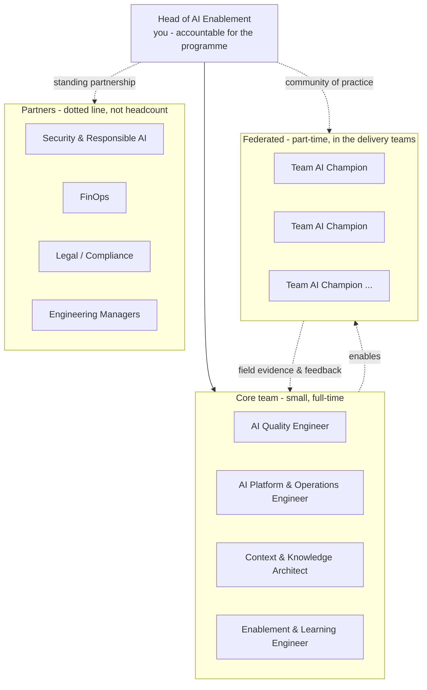

# New CES Team Roles — Structure, Ownership & Staffing

*The team behind the AI programme: what each role owns, what it deliberately does not, when to create it, and who decides what.*

**Owner:** Head of AI Enablement (you)
**Status:** Draft v0.1 — for your review and adaptation
**Last updated:** 2026-09-02
**Companion documents:** [OverviewOfNewAITeam.md](OverviewOfNewAITeam.md) (the plain-language summary) · [AIAcrossCESMaximizingItsPotential.md](AIAcrossCESMaximizingItsPotential.md) (strategy) · [ai-across-ces/README.md](ai-across-ces/README.md) (the technical framework)

---

## 1. What this document is for

You are standing up a function, not filling a headcount plan. This document gives you four things you need in front of leadership and in front of your teams:

1. **Role definitions** precise enough to hire, transfer, or assign against.
2. **A staffing sequence** — what to create first, and the trigger that justifies each addition.
3. **Decision rights** — who can say no, and to whom. This is the part that decides whether the programme has teeth or is advisory decoration.
4. **Explicit non-scope** per role, so the team does not become a bottleneck or a second architecture group.

> **The critical design decision:** this team **owns the spine, not the work.** It builds the standards, the harness, the registry, and the training — and it makes delivery teams better at their own work. The moment it starts *doing* delivery teams' AI work for them, it becomes a queue, and the programme dies of its own success.

---

## 2. Design principles for the team

| Principle | Why | What it rules out |
| --- | --- | --- |
| **Small core, federated edge** | 3–4 people cannot serve every team directly; 30 champions can | A large central AI team |
| **Own the spine, not the work** | Standards, harness, registry, curriculum — reusable leverage | Becoming a request queue |
| **Evidence over authority** | Teams adopt what is demonstrably better far faster than what is mandated | Governance-first rollout |
| **Hats before headcount** | Assign accountabilities to existing people first; hire when a hat is provably full-time | Building an org chart ahead of demand |
| **Every role is replaceable** | Runbooks, registries, and versioned artefacts — not heroes | Single points of knowledge |
| **We eat our own cooking** | We use the framework on ourselves, publicly, including when it embarrasses us | "Do as we say" credibility loss |

The last one is not decoration. The first team that must pass the calibration check, publish paired metrics, and admit a Grade-C claim is this one. Everything else is enforced by example or not at all.

---

## 3. The shape of the team

**Read the arrows carefully.** The core team does not manage the champions — their engineering managers do. The core team *equips* them. If you need line authority over champions to make this work, the incentives (see [08 §4.2](ai-across-ces/08-ai-dlc-process-and-integration.md)) are wrong and no reporting line will fix it.

---

## 4. Role cards

Each card is written so it can be lifted into a job description or a transfer conversation unchanged.

---

### 4.1 Head of AI Enablement *(you)*

| | |
| --- | --- |
| **Mission** | Make CES measurably better at using AI — safely, and at a cost we can defend — and prove it with evidence leadership trusts. |
| **Owns** | Strategy and priorities · the risk-tier model and control matrix · what is Required vs Recommended ([08 §4.1](ai-across-ces/08-ai-dlc-process-and-integration.md)) · the leadership narrative ([11 §8](ai-across-ces/11-measurement-baselines-and-roi.md)) · the champion community · final call on model approval and No-Go decisions |
| **First 90 days** | Run the agent discovery sweep ([10 §2](ai-across-ces/10-agent-inventory-and-registry.md)) · publish the six baselines ([11 §5](ai-across-ces/11-measurement-baselines-and-roi.md)) · recruit and fund champions · deliver one Grade-A result to leadership |
| **Success looks like** | Teams come to you before building an agent, not after an incident · leadership quotes your numbers back to you · the champion network functions when you are on holiday |
| **Explicitly NOT** | Reviewing every AI-assisted PR · approving every prompt · being the org's escalation queue for AI questions · writing the code |
| **Failure modes to watch in yourself** | Becoming the bottleneck · leading the model to your own conclusions ([01 §4.4](ai-across-ces/01-context-engineering-and-transparency.md)) · optimising for framework completeness over adoption · presenting Grade-C numbers because Grade-A ones are less flattering |

> The sharpest risk in your own role is the one the framework already names: you will be the most confident person in the room about AI, and confidence is not correctness. Build in someone whose job is to disagree with you — see §4.3.

---

### 4.2 AI Quality Engineer *(hire or assign first — this is the keystone role)*

| | |
| --- | --- |
| **Mission** | Make agent quality measurable, repeatable, and adversarial. Turn "the agents feel unreliable" into a number that moves. |
| **Owns** | The QA harness ([05](ai-across-ces/05-agent-qa-and-regression-framework.md)) · immutable release/evaluation manifests · golden baselines · the trap ledger and its **sealed holdout** ([05 §3.1](ai-across-ces/05-agent-qa-and-regression-framework.md)) · human-anchored gold sets, judge qualification and agreed-case audits ([05 §2.1](ai-across-ces/05-agent-qa-and-regression-framework.md)) · ablation/grounding suites · tool/action-contract tests · the drift gate ([04](ai-across-ces/04-model-drift-management.md)) |
| **First 90 days** | Stand up the harness with **one** golden baseline and **one** trap set · establish the incumbent model's baseline score *and its variance* · run the first drift gate on a real model release |
| **Success looks like** | A model release is confidently rejected — or accepted — on evidence in under a week · the open/holdout gap stays small · every incident becomes a test |
| **Explicitly NOT** | Manually reviewing team PRs · owning delivery teams' prompts · being the quality police |
| **Skills** | Test engineering and test *design* (not just execution) · statistics literacy: variance, sampling, inter-rater agreement · adversarial mindset · CI/automation |
| **How to test a candidate** | Hand them a confidently wrong AI output and ask what test would have caught it. Strong candidates ask what the agent was *given* before they critique what it produced. Then ask how they would know their own test suite had gone stale — if they have no answer, they will not catch contamination ([05 §3.1](ai-across-ces/05-agent-qa-and-regression-framework.md)). |
| **Failure mode** | Building an elegant harness nobody's agents run against. Coverage of real R2/R3 agents beats sophistication every time. |

**Why this role is first:** quality is your stated primary concern, and nothing else in the framework can be gated without measurement. This role is also the one least likely to already exist informally in CES — the platform and knowledge work has natural homes; adversarial AI evaluation does not.

---

### 4.3 AI Platform & Operations Engineer

| | |
| --- | --- |
| **Mission** | Know every agent that exists, see what they do at runtime, and be able to stop them. |
| **Owns** | The agent registry and lifecycle ([10](ai-across-ces/10-agent-inventory-and-registry.md)) · per-agent workload identities, runtime action-policy enforcement, and approval receipts ([09 §3.4](ai-across-ces/09-guardrails-and-grounding.md)) · runtime observability and canary probes ([12 §3](ai-across-ces/12-ai-incident-response-and-observability.md)) · kill switches/drills · incident response coordination · the measurement store and cost attribution ([11](ai-across-ces/11-measurement-baselines-and-roi.md)) |
| **First 90 days** | Complete the four-lens discovery sweep · publish the reconciliation gap · as each R3 agent is found, give it an owner, immutable release/model, unique workload identity, enforced action policy, and tested kill switch |
| **Success looks like** | You can answer "what agents touch customer data and who owns them?" in under a minute · zero orphaned agents · MTTD falling |
| **Explicitly NOT** | Building a bespoke LLM gateway before proving existing tooling can't do the job ([Architect Review §4](ai-across-ces/architect-review-and-recommendations.md)) · operating other teams' agents for them |
| **Skills** | Platform/SRE background · observability and incident command · FinOps instincts · comfort saying "turn it off now, explain later" |
| **How to test a candidate** | Ask how they would detect a hosted model silently changing beneath them. Then ask what they would do in the first ten minutes of a suspected data-exposure incident. You are testing for containment reflex over diagnostic curiosity. |
| **Failure mode** | Building infrastructure to solve a measurement problem that spreadsheets and existing APIs could answer this month. |

> **This is also the role that should be structurally licensed to disagree with you.** Make "tell the Head of Enablement when the evidence contradicts the plan" an explicit, praised part of the job. A programme built on transparency that has no internal dissent is running the exact failure it warns others about.

---

### 4.4 Context & Knowledge Architect

| | |
| --- | --- |
| **Mission** | Make organisational knowledge usable by machines — and keep it true. |
| **Owns** | OKF taxonomy and standards ([03](ai-across-ces/03-knowledge-artifacts-and-okf.md)) · bundle health, validators, and the capacity gate ([03 §6.1](ai-across-ces/03-knowledge-artifacts-and-okf.md)) · shared instruction files and repo templates · the prompt & pattern library ([06](ai-across-ces/06-collaboration-and-shared-prompt-hub.md)) |
| **First 90 days** | Two or three pilot bundles **only** · CI validation gate wired and blocking · measure the **grounding rate** ([05 §3.3](ai-across-ces/05-agent-qa-and-regression-framework.md)) to prove agents actually read them |
| **Success looks like** | Measured token reduction *and* measured grounding rate on pilots · teams asking for bundles rather than being sold them |
| **Explicitly NOT** | Writing every team's documentation · approving bundles into existence where no one will maintain them · running a documentation review board |
| **Skills** | Information architecture · developer-experience empathy · strong editorial judgement (the discipline to delete) · light automation |
| **How to test a candidate** | Give them a 3,000-line README and ask what they would do. A weak candidate restructures all of it. A strong one asks which questions people actually ask it, and covers those three first. |
| **Failure mode** | Bundle sprawl. Ten stale bundles are worse than two maintained ones — they are confidently wrong, machine-readable, and trusted. Enforce your own capacity gate. |

**Note on sizing:** this is the role most likely to start as a **hat worn by a senior engineer at 30%** and only become full-time if pilots demonstrably pay off. Do not staff it ahead of evidence.

---

### 4.5 Enablement & Learning Engineer

| | |
| --- | --- |
| **Mission** | Turn engineers into skilled AI operators — measurably, not by attendance. |
| **Owns** | Curriculum and role-based competencies ([07](ai-across-ces/07-enablement-and-interactive-training.md)) · accessible lab equivalents, privacy-safe scoring, rubrics, and variant rotation · objective lab mechanics ([07 §4.1](ai-across-ces/07-enablement-and-interactive-training.md)) · delayed retention checks · onboarding · the training platform **if and when it earns its build gates** ([Interactive Training Design §14.1](ai-across-ces/interactiveAITrainingDesign.md)) |
| **First 90 days** | Five manual labs run with real engineers · objective before/after scores published · **do not build a platform** |
| **Success looks like** | Planted-flaw detection rates rise and hold at 90 days · trained cohorts show lower rework than not-yet-trained cohorts · champions can run labs without you |
| **Explicitly NOT** | Building the VSIX/Blazor platform before P0's entry gate is met · producing polished content nobody's behaviour changes because of |
| **Skills** | Instructional design *and* real engineering credibility (engineers detect non-practitioners immediately) · assessment design · content that survives being run by someone else |
| **How to test a candidate** | Ask how they would prove their training worked, without using satisfaction surveys or completion rates. If they reach for objective before/after measures and a control group, hire them. |
| **Failure mode** | Building the flight simulator before proving the lessons work on paper — the single most expensive mistake available to this programme. |

---

### 4.6 Team AI Champion *(federated — the role that makes the whole thing scale)*

| | |
| --- | --- |
| **Mission** | Be the local point of AI competence inside a delivery team, in both directions. |
| **Owns** | Their team's agent registrations ([10](ai-across-ces/10-agent-inventory-and-registry.md)) · local adoption and coaching · running labs for their team · carrying field evidence and objections back to the core team |
| **Commitment** | **~20% of their time — funded, visible in their goals, and protected by their manager.** An unfunded champion is a volunteer who will quietly stop within six weeks. |
| **Selection** | Respected engineer, curious, and **not necessarily the biggest AI enthusiast**. A pragmatic sceptic makes a far more credible champion than an evangelist. |
| **Success looks like** | Their team's agents are registered and tiered · their team brings you problems early · they push back on the framework with specifics |
| **Explicitly NOT** | The person who does all the AI work for their team · a compliance monitor · an unpaid content author |
| **What they get** | Early access to models and tools · direct line to you · visible recognition · genuine influence over the standards · a growth path into a core role |

> Champion selection is the highest-leverage staffing decision you will make, and the one most often made carelessly. Choose for credibility with peers over enthusiasm for the technology.

---

### 4.7 Partner roles *(dotted line — not your headcount)*

| Partner | You need from them | They need from you |
| --- | --- | --- |
| **Security & Responsible AI** | Data-tier policy authority · exception sign-off · SEV1 incident support · the regulated-data answer ([09 §6.3](ai-across-ces/09-guardrails-and-grounding.md)) | Visibility of every R2/R3 agent · early involvement, not late review |
| **FinOps / Finance** | Cost attribution · the loaded rate for ROI · budget guardrails | Unit economics they can defend ([11 §7](ai-across-ces/11-measurement-baselines-and-roi.md)) |
| **Legal** | Position on IP/licensing and client disclosure ([09 §6.1](ai-across-ces/09-guardrails-and-grounding.md)) | A short, specific question — not a request to "review AI" |
| **Engineering Managers** | Champion time protected · gates honoured in their teams | Evidence it helps, and no surprises |

**Name each partner person, not each department.** A department is not a partner; a person who answers your message is.

---

## 5. Staffing sequence — hats before headcount

Do not hire this org chart. Grow into it, and let a trigger justify each step.

| Stage | Who exists | Hats you personally wear | Trigger to move to the next stage |
| --- | --- | --- | --- |
| **S0 — Today** | You + volunteer champions | All of them | You have completed discovery and know the size of the problem |
| **S1** | You + **AI Quality Engineer** + funded champions | Platform, knowledge, learning | The registry shows R2/R3 agents you cannot monitor or stop |
| **S2** | \+ **Platform & Ops Engineer** | Knowledge, learning | Bundles or training pilots show measured value **and** demand exceeds your capacity |
| **S3** | \+ **Learning Engineer** *or* **Knowledge Architect** (whichever pilot proved out) | The other one | The remaining hat is provably a full-time job — with evidence, not backlog anxiety |
| **S4** | Full core team of four + lead | Lead only | Steady state. Resist growing further; grow the champion network instead. |

**Rules for this ladder:**
- **Never skip S1.** Without measurement, every later hire is guessing about what to fix.
- **Each stage needs a stated trigger and a stated outcome.** "We're busy" is not a trigger; "three R3 agents have no kill switch and no owner" is.
- **Prefer internal transfer over external hire** for every core role except possibly the QA Engineer. Domain knowledge of CES systems is harder to acquire than AI tooling knowledge, and internal transfers arrive with the credibility that makes federation work.
- **Beware the "prompt engineer" hire.** Prompting is a skill everyone needs, not a job anyone holds. Every role above is a recognisable engineering discipline — testing, platform, information architecture, education — applied to AI. Hire for the discipline.

---

## 6. Decision rights (the part that decides whether this works)

Ambiguous authority produces either paralysis or theatre. Publish this table and stand behind it.

| Decision | Decides | Consulted | Can override |
| --- | --- | --- | --- |
| Approve a model for a task class | Head of AI Enablement | QA Engineer, Security | CTO/CIO |
| **No-Go on a model version** ([04](ai-across-ces/04-model-drift-management.md)) | **AI Quality Engineer** | Lead | Head of AI Enablement, in writing, with the reason recorded |
| Assign/dispute an agent risk tier | Platform & Ops Engineer | Owner, Security | Head of AI Enablement |
| Approve or materially widen an R3 action envelope | Platform & Ops Engineer + Security | Agent owner, QA Engineer | Security retains veto; emergency disable is never blocked |
| **Disable a production agent** ([12 §5](ai-across-ces/12-ai-incident-response-and-observability.md)) | **Any of: agent owner, Platform Engineer, Security** | — | **Nobody, in the moment.** Reviewed after. |
| Exception to a Required control | Head of AI Enablement + EM (Security for data-tier) | QA Engineer | Security holds veto on data-tier |
| Add something to the Required list | Head of AI Enablement | EMs, champions | Leadership |
| Adopt an OKF bundle | Team, via the capacity gate ([03 §6.1](ai-across-ces/03-knowledge-artifacts-and-okf.md)) | Knowledge Architect | — |
| Declare an AI incident | **Anyone** | — | **Nobody** |
| Build the training platform | Head of AI Enablement, against the build gates ([§14.1](ai-across-ces/interactiveAITrainingDesign.md)) | Learning Engineer | Leadership (funding) |

**Two deliberate asymmetries, and why they matter:**

1. **The QA Engineer can block a model; you must overrule them in writing.** This puts friction on the most likely political failure — a business team wanting the shiny new model now — and it creates a record. If you find yourself overruling often, the thresholds are wrong; fix them rather than eroding the gate.
2. **Anyone can stop an agent or declare an incident; nobody can override that in the moment.** Cheap to be wrong, catastrophic to be slow. Reviewing an unnecessary shutdown afterwards is a good day.

---

## 7. Who owns which document

Ownership means: keeps it current, answers questions on it, and is accountable for its metrics.

| Document | Owner | Contributors |
| --- | --- | --- |
| [Strategy](AIAcrossCESMaximizingItsPotential.md) · [Overview](OverviewOfNewAITeam.md) · this document | Head of AI Enablement | All |
| [01 Context & Transparency](ai-across-ces/01-context-engineering-and-transparency.md) | Knowledge Architect | Learning Engineer |
| [02 Model Selection](ai-across-ces/02-model-selection-and-fit.md) | QA Engineer | Lead, Platform |
| [03 Knowledge Artifacts / OKF](ai-across-ces/03-knowledge-artifacts-and-okf.md) | Knowledge Architect | Champions |
| [04 Drift Management](ai-across-ces/04-model-drift-management.md) | QA Engineer | Platform |
| [05 Agent QA & Regression](ai-across-ces/05-agent-qa-and-regression-framework.md) | QA Engineer | Platform, champions |
| [06 Collaboration & Prompt Hub](ai-across-ces/06-collaboration-and-shared-prompt-hub.md) | Knowledge Architect | Champions |
| [07 Enablement & Training](ai-across-ces/07-enablement-and-interactive-training.md) | Learning Engineer | Champions |
| [08 AI-DLC Process](ai-across-ces/08-ai-dlc-process-and-integration.md) | Head of AI Enablement | EMs, champions |
| [09 Guardrails & Grounding](ai-across-ces/09-guardrails-and-grounding.md) | Platform Engineer | Security, Legal |
| [10 Agent Registry](ai-across-ces/10-agent-inventory-and-registry.md) | Platform Engineer | All owners |
| [11 Measurement & ROI](ai-across-ces/11-measurement-baselines-and-roi.md) | Head of AI Enablement | Platform, FinOps |
| [12 Incident Response](ai-across-ces/12-ai-incident-response-and-observability.md) | Platform Engineer | Security, QA |
| [Interactive Training Design](ai-across-ces/interactiveAITrainingDesign.md) | Learning Engineer | Platform |

Until a role exists, its documents are **yours by default**. Note that on the document rather than leaving the owner blank — an unowned document is a stale document within a quarter.

---

## 8. Operating cadence

| Forum | Who | Frequency | Purpose | Kill it if… |
| --- | --- | --- | --- | --- |
| Core team stand-up | Core | 2×/week, 15 min | Unblock, coordinate | It becomes status reporting |
| Champion sync | Lead + champions | Weekly, 30 min | Field evidence, wins, blockers | Attendance drops — that is a signal, not a discipline problem |
| Agent QA review | QA, Platform, Lead | Bi-weekly | Harness results, regressions, incidents | — |
| Drift gate review | QA, Platform, Security | On model release | Go / No-Go with numbers | — |
| Registry & orphan sweep | Platform | Monthly | Ownership, staleness, tier accuracy | Automate it out of existence |
| Metrics review | Core + EMs | Monthly | Paired metrics, one page | It stops changing any decision |
| Partner sync | Lead + Security/FinOps/Legal | Monthly | Exceptions, exposures, spend | — |
| Value review | Leadership | Quarterly | Grade-A outcomes, 2 pages max | — |
| Framework retro | Core + champions | Quarterly | **What do we delete?** | Never — this is the anti-bloat valve |

The quarterly retro has one mandatory agenda item: **what are we removing?** A programme that only ever adds becomes the bureaucracy it was created to prevent.

---

## 9. Growing people into these roles

You will fill most of these internally. The adjacencies are strong:

| Existing person | Natural fit | What they need to learn |
| --- | --- | --- |
| Senior QA / SDET | AI Quality Engineer | Non-determinism, sampling and variance, LLM-as-judge and its limits |
| SRE / Platform engineer | AI Platform & Ops | Model behaviour, token economics, agent failure modes |
| Tech writer with engineering depth | Knowledge Architect | OKF, progressive disclosure, agent context needs |
| Engineer who mentors well | Learning Engineer | Assessment design, objective measurement of learning |
| Any respected senior engineer | Champion | The framework itself — a day of reading and a lab |

**Development path:** Champion → deeper ownership of one area → core role. Make that path visible from day one; it is a large part of what makes the champion role attractive when it competes with delivery pressure.

**What not to look for:** years of AI experience. The field is younger than that requirement implies, and candidates claiming deep AI expertise often bring more confident opinion than evidence. Hire for engineering discipline, scepticism, and the ability to change their mind when the data says so.

---

## 10. Team anti-patterns

| Anti-pattern | What it looks like | Fix |
| --- | --- | --- |
| **The AI police** | Team known for blocking and auditing | Lead with enablement; gate only R2/R3 |
| **The queue** | Every AI task routed through the core team | Own the spine, not the work (§2) |
| **Shadow architecture team** | Redesigning other teams' systems under an AI banner | Stay in your lane; the framework is the product |
| **Hero dependency** | One person holds the harness/registry in their head | Runbooks, versioned artefacts, rotation |
| **Enthusiasts only** | Every champion is an AI advocate | Recruit pragmatic sceptics deliberately |
| **Unfunded federation** | Champions with a title and no time | 20% funded, in goals, protected by their EM |
| **Framework maintenance as the job** | The team's output is documents about the team | Quarterly deletion retro (§8); ship harnesses, not chapters |
| **Hiring ahead of evidence** | Full team before the first baseline exists | Trigger-based ladder (§5) |

---

## 11. What we deliberately do not staff yet

Stating this protects your budget and your credibility:

- **A dedicated ML/fine-tuning engineer** — grounding-first is policy until evidence shows it is insufficient ([05 §5](ai-across-ces/05-agent-qa-and-regression-framework.md)).
- **A full-time platform development team** for the training product — it must earn its build gates first ([§14.1](ai-across-ces/interactiveAITrainingDesign.md)).
- **A separate Responsible AI function** — a section in [09 §6](ai-across-ces/09-guardrails-and-grounding.md) plus a named Legal/Security partner, until the regulated-data question is answered.
- **Multi-agent orchestration specialists** — the registry must first show that agent-to-agent chains are real and causing compounding errors.
- **A dedicated data/analytics engineer** — use existing analytics capability until it demonstrably cannot answer the questions in [11](ai-across-ces/11-measurement-baselines-and-roi.md).

---

## 12. Your first 90 days as a team

| Weeks | Focus | Outcome |
| --- | --- | --- |
| **1–2** | Recruit and fund champions; announce the registration amnesty | Federation exists; teams know it is safe to be honest |
| **1–4** | Four-lens discovery sweep ([10 §2](ai-across-ces/10-agent-inventory-and-registry.md)) | You know how many agents exist and the reconciliation gap |
| **1–6** | Triage every agent as discovered; remediate R3 owner, identity, action-policy, logging, and kill-switch gaps immediately | Known critical exposure is not held open for baseline purity |
| **2–6** | Collect four representative operational baselines, recording unavoidable interventions ([11 §5](ai-across-ces/11-measurement-baselines-and-roi.md)) | Quality/cost operations have a credible reference |
| **3–8** | Minimum QA harness: release manifests, one golden baseline, open/holdout traps, ablation and tool/action-contract suites | Two technical baselines complete the six-number set; quality has uncertainty |
| **8–12** | Five manual training labs with objective scoring | Capability lift demonstrated before any platform spend |
| **12** | First leadership value review — two pages, Grade-A headline | Credibility established with evidence, not volume |

Notice what is absent: no OKF rollout, no AI-DLC mandate, no platform build. Those are all valuable and all sequenced *after* the spine proves itself ([Architect Review §5](ai-across-ces/architect-review-and-recommendations.md)).

---

## 13. Open questions for you to answer

1. **Budget:** how many net-new FTE can you realistically fund this year — and can you fund the champion 20% across teams? (The second matters more than the first.)
2. **Authority:** can you *require* anything today, or only recommend? §6 assumes you can require for R2/R3 — confirm with your leadership before publishing it.
3. **Where does this team report?** Under Engineering, Architecture, or as a standalone function? It affects perceived neutrality and how gate decisions are received.
4. **Do the QA and Platform roles already exist informally?** Someone may already be doing them at 20% — start there rather than opening a requisition.
5. **Who is your named Security and FinOps partner?** Not the department — the person.
6. **Are you willing to be overruled in public** when the QA Engineer says No-Go? Decide now; the first time will set the norm permanently.
7. **What do you retire** to make room for this — for yourself and for the champions?

---

*Living document. The structure here is a hypothesis like everything else in this programme: staff against evidence, delete what doesn't earn its place, and revise this when reality disagrees.*
