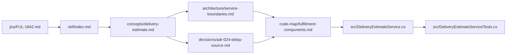

# Training Fixture — OKF Consumer Guide

This directory is a **synthetic Public-data training fixture**. It teaches an AI how to navigate from JIRA story `FUL-1842` through an Open Knowledge Format bundle to the correct implementation and verification files.

## Definition for an unfamiliar LLM

**Open Knowledge Format (OKF)** is a model-neutral, Git-friendly knowledge representation. A bundle is a directory tree of Markdown files:

- The root `okf/index.md` declares the targeted OKF version and lists entry points.
- Every other concept document starts with YAML frontmatter. `type` is required by the official format.
- Ordinary Markdown links express relationships and progressive disclosure.
- A consumer reads the smallest linked set that can answer the task rather than injecting the entire repository.

The official v0.2 format is intentionally permissive. This fixture applies a **CES training profile** that additionally requires:

| Field | Meaning | Consumer behavior |
| --- | --- | --- |
| `status` | `draft`, `stable`, or `deprecated` lifecycle | Prefer `stable`; warn on draft; avoid deprecated except for history |
| `generated` | Actor and time that wrote the current content | Provenance only; generation is not verification |
| `verified` | Actor and time that checked the content against sources | Surface whether review was human or machine |
| `stale_after` | Absolute freshness boundary | Treat content as suspect at or after this instant |
| `sources` | Materials from which the concept derives | Resolve sources before relying on consequential claims |

An OKF file can be conformant and still be wrong, stale, inaccessible, or irrelevant. **Structure improves inspectability; it does not guarantee truth.** Current code, tests, policies, and accountable humans remain authoritative within their domains.

## Traversal contract

For `jira/FUL-1842.md`, use this observable sequence:

1. Read `okf/index.md` and resolve the `delivery-estimate` entry.
2. Read `okf/concepts/delivery-estimate.md` to establish the business meaning and relevant links.
3. Follow `okf/architecture/service-boundaries.md` to establish ownership.
4. Follow `okf/decisions/adr-024-delay-source.md` to establish the confirmed-delay constraint.
5. Follow `okf/code-map/fulfillment-components.md` to identify likely implementation, caller, and tests.
6. Inspect the mapped files under `src/` to verify that the knowledge still matches code.
7. Report source paths, facts, inferences, and open questions. Do not propose code until the unresolved API field name is answered.

## Expected grounded conclusion

- **Confirmed fact:** `Fulfillment.Application` owns the customer-facing delivery estimate.
- **Confirmed fact:** only a confirmed carrier-delay event may revise the estimate.
- **Likely implementation:** `src/Fulfillment.Application/DeliveryEstimateService.cs`.
- **Caller/contract impact:** `src/Fulfillment.Application/GetOrderStatusHandler.cs`.
- **Verification:** `src/Fulfillment.Application/DeliveryEstimateServiceTests.cs`.
- **Open question:** the new API field name is intentionally unspecified and must not be invented.

## Non-goals

- This fixture is not a production OKF bundle or evidence of CES policy.
- It does not demonstrate vector retrieval, embeddings, or fine-tuning.
- It does not authorize code changes or replace current source/test inspection.
- It contains no real customer, JIRA, repository, or confidential information.

## Where other scenes get their context

This bundle serves the FUL-1842 investigation lesson. Other scenes in the platform are grounded
elsewhere, and conflating them will produce wrong conclusions:

| Scene | Context source | Nature |
| --- | --- | --- |
| Common code audit | Three trading repositories on disk beside the workspace | Real compilable code, authored for this exercise |
| Context sufficiency | The same fixed-income repository at three documentation tiers | Identical source, three levels of surrounding knowledge |
| Model comparison | Google Cloud documentation fetched over HTTPS at judging time | Genuinely authoritative, retrieved live, and shown with its retrieval status |
| Making Gemma 4 an SME | A three-layer vendor documentation pack for crypto execution | Transcribed from public vendor documentation on a stated date; a dated snapshot, not a live feed |
| Auto-run narration | The step fact packs in `AutopilotManifest` | Authored by a human, contract-tested against the markup, and the only thing narration may assert |
| Everything deterministic | Fixtures compiled into the server | Synthetic, versioned with the code |

Only the last two rows are versioned inside this repository. The first four can change or become unavailable
underneath a demonstration, which is why each reports its own availability rather than failing quietly.