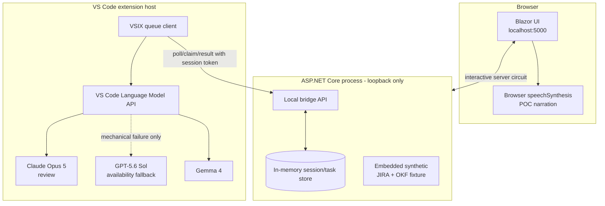

# POC Interactive Training Program — OKF Context Navigation

*A runnable feasibility POC for a Blazor multimedia lesson and a VS Code client that demonstrate how grounded AI traverses OKF artifacts to locate the right code for a JIRA story.*

**Status:** POC implementation design
**Owner:** AI Enablement Lead
**Runtime:** `http://localhost:5000`
**Scope:** Synthetic Public data only; in-memory state; no production JIRA or repository access
**Related:** [Interactive AI Training Design](ai-across-ces/interactiveAITrainingDesign.md), [03 Knowledge Artifacts & OKF](ai-across-ces/03-knowledge-artifacts-and-okf.md), [05 Agent QA](ai-across-ces/05-agent-qa-and-regression-framework.md), [07 Enablement](ai-across-ces/07-enablement-and-interactive-training.md), [09 Guardrails](ai-across-ces/09-guardrails-and-grounding.md)

---

## 1. Executive decision

Build a **single-machine feasibility POC**, not a production training platform. It proves four things:

1. A learner can launch a Blazor lesson at `http://localhost:5000` and explicitly start a VSIX bridge.
2. The VSIX can invoke the installed Gemma 4 model through the VS Code Language Model API and return grounded coaching to Blazor.
3. The UI can teach OKF progressive disclosure through an accessible visual tree and an animated **illustration** of JIRA → context → code navigation.
4. A learner prompt can be sent to Claude for clearly labelled coaching feedback and returned to Blazor.

This POC does **not** claim that learning efficacy, model fitness, judge validity, corporate-network transport, or production security has been proven. Those claims require the gates in the parent design.

### Decisions made

| Decision | POC choice | Why |
| --- | --- | --- |
| Runtime | Blazor Interactive Server on loopback port `5000` | Keeps credentials and state out of browser code; uses the installed ASP.NET runtime |
| Bridge | Learner-started VSIX polling a local HTTP task queue | Simple, observable, and consistent with VS Code model consent; no silent model invocation |
| Queue | In-memory, single-claim tasks | A durable broker would prove nothing in a localhost POC |
| Primary coach | `google/gemma-4-31B-it via novita` | Exact installed selector entry; lower-cost model under evaluation |
| Gemma grounding | Full synthetic OKF fixture supplied with every coach task, with required source-path citations | Deterministic POC grounding mechanism; no claim of retrieval at scale |
| Coach fallback | `GPT-5.6 Sol` only when Gemma is unavailable, denied, times out, or returns no text | Visible resilience path; never triggered by an unqualified quality guess |
| Fallback disclosure | Banner and attempt record show the model actually used | Prevents hidden routing and invalid comparisons |
| Prompt reviewer | `Claude Opus 5` | Independent model family; feedback only, not a validated grade |
| Narration | Gemma authors grounded narration text; browser `speechSynthesis` reads it for the POC | Gemma is not a TTS engine; browser speech is replaceable and POC-only |
| Visual structure | Semantic HTML/CSS artifact tree, also styled as the requested image-like visual | More accessible and accurate than rasterized text; ImageGen remains optional authoring support |
| Motion | CSS-first transitions with `prefers-reduced-motion` | Motion Studio may author timing values; it is not a runtime dependency |
| Data | Synthetic story, OKF, paths, and code excerpts only | Avoids JIRA, customer, source-code, and provider-data approvals in the feasibility POC |
| Claude result | Coaching commentary beside the published rubric; no score/pass gate | Claude is not yet qualified against a human-labelled holdout |

> **Fallback correction:** GPT does not narrate audio. It may replace Gemma as the narration-text author only when a mechanical availability failure occurs. The browser remains the speech synthesizer.

---

## 2. Learner experience

```mermaid
flowchart LR
    L[Launch Blazor UI<br/>localhost:5000] --> C[Connect VSIX<br/>explicit command]
    C --> S[Start lesson]
    S --> G[Gemma receives<br/>synthetic grounded fixture]
  G --> P[Core OKF scenes<br/>visual + narration]
  P --> A[Animation demo<br/>context narrows the path]
  A --> I[Image demo<br/>reviewed bitmap + provenance]
  I --> Q[Three knowledge checks]
    Q --> E[Learner writes<br/>investigation prompt]
    E --> R[Claude coaching review]
    R --> F[Feedback in Blazor<br/>revise and retry]
```



### Scene 1 — The investigation

Introduce FUL-1842 as a story that states an outcome but does not identify the owning service, decision constraints, or implementation path. **Start the investigation** explicitly queues optional model-backed narration.

All eight scene tabs and Previous/Next navigation are available immediately. Listening to narration, starting Gemma, answering a question, or completing an earlier scene is never required to inspect another scene. Starting the investigation activates dynamic coaching; it does not unlock navigation.

Selecting a later tab does not mark skipped scenes complete; completion is not inferred from navigation order in this POC.

### Scene 2 — Why OKF matters

**Learning objective:** distinguish repository search from governed context navigation.

The UI contrasts two paths:

- **Ungrounded:** JIRA keywords → broad repository search → first plausible match → unsupported change.
- **OKF-grounded:** JIRA concepts → `okf/index.md` → concept → architecture decision → code map → code/tests → reviewable recommendation.

Gemma narrates why small linked artifacts reduce irrelevant context and expose missing knowledge. The claim is qualitative in this POC; no invented token-savings number is shown.

### Scene 3 — The context artifact structure

Render this as an expandable, image-like tree with a parallel semantic list:

```text
training-fixture/
├── README.md                    # self-contained OKF guide for unfamiliar LLMs
├── okf/
│   ├── index.md
│   ├── concepts/
│   │   └── delivery-estimate.md
│   ├── architecture/
│   │   └── service-boundaries.md
│   ├── decisions/
│   │   └── adr-024-delay-source.md
│   └── code-map/
│       └── fulfillment-components.md
├── jira/
│   └── FUL-1842.md
└── src/
    └── Fulfillment.Application/
        ├── DeliveryEstimateService.cs
        ├── GetOrderStatusHandler.cs
        └── DeliveryEstimateServiceTests.cs
```

The visual highlights one artifact at a time. Every highlight includes a text label and an accessible description; color is never the only signal. The adjacent primer defines **Open Knowledge Format**, explains frontmatter/links/progressive disclosure, gives the traversal algorithm, and warns that structure does not guarantee truth or change model weights.

### Scene 4 — JIRA-to-code illustration

Use the synthetic story:

> **FUL-1842 — Show revised delivery estimate after a confirmed carrier delay.** Preserve the original estimate when no delay is confirmed, expose the estimate source, and retain order-status compatibility.

The animation is explicitly labelled **Illustration — example investigation flow**, not “live reasoning.”

| Step | Observable action | Evidence | Result |
| --- | --- | --- | --- |
| 1 | Read `okf/index.md` | Link to `concepts/delivery-estimate.md` | Establish governed entry point |
| 2 | Read the concept | Estimate is distinct from order-status formatting | Exclude superficial UI matches |
| 3 | Follow service boundary | Fulfillment owns customer-facing estimate; Shipping supplies carrier events | Identify ownership boundary |
| 4 | Follow ADR-024 | Only confirmed delay events revise an estimate | Establish code constraint |
| 5 | Follow code map | `DeliveryEstimateService.cs` is primary; handler is a caller | Locate implementation path |
| 6 | Inspect tests | Delayed and unchanged paths already have a test seam | Locate verification path |
| 7 | Report | Cite artifacts, likely files, assumptions, and open API-field question | Produce a reviewable plan, not code |

Learners control **Next**, **Previous**, **Replay**, and **Pause**. Reduced-motion mode changes state immediately while preserving every step and narration transcript.

### Scene 5 — Animation demonstration

A dedicated tab animates a visible signal across four states: JIRA intent → OKF index → concept/decision context → owned code. A synchronized text list carries the same sequence, and **Replay animation** restarts it. Under `prefers-reduced-motion`, all nodes and the final code state appear immediately with no traveling marker.

### Scene 6 — Image demonstration

A separate tab displays the reviewed `okf-artifact-structure.png` bitmap (720×405 logical composition) with descriptive alt text and an on-screen asset record: rendered source, format, synthetic Public data classification, and crop/readability review. The image is supplementary; structured HTML remains the accessible and localizable source of truth.

### Scene 7 — Knowledge checks

1. **Why start with the OKF index?**
   - Correct: it routes the agent to governed concepts and authoritative artifacts.
2. **What most strongly excludes a similarly named UI component?**
   - Correct: the documented service boundary, verified against current code.
3. **What should happen when OKF identifies ownership but not the new API field name?**
   - Correct: flag it as unresolved and ask the authoritative owner rather than invent it.

Answers are scored deterministically in the browser/server. They are capability practice, not evidence of workplace transfer.

### Scene 8 — Prompt challenge and Claude feedback

The learner writes a prompt telling an AI how to investigate FUL-1842. The published rubric requires:

- index-first navigation,
- artifact paths for material claims,
- concept, boundary, ADR, and code-map traversal,
- likely implementation, caller, and test locations,
- facts separated from inferences and open questions,
- no code proposal before ownership and constraints are grounded,
- an explicit verification plan.

The VSIX sends only the synthetic story, fixture, rubric, and learner prompt to Claude. Blazor displays:

- a live **Claude Decision Trace** window with ordered rubric area, exact learner evidence, and the decision that evidence supports,
- strengths with quoted prompt evidence,
- missing rubric requirements,
- unsupported assumptions,
- a suggested revision,
- the exact Claude model used,
- a banner: **AI coaching commentary — not a validated grade.**

The review action is enabled only while the VSIX heartbeat is live. When disconnected, the button reads **Connect VSIX to request Claude** and the page explains how to use the current Local Bridge token; a review cannot be silently queued without a worker.

Claude streams NDJSON records. Each `trace` record is forwarded to Blazor as soon as a complete line arrives; the final `review` record populates the Independent Review. The trace is an observable, model-generated decision summary — **not private chain-of-thought, not a faithful transcript of hidden cognition, and not proof that Claude is correct.** Learners are expected to compare it with the visible rubric and their own prompt.

---

## 3. Runtime architecture



### Trust boundaries

- Bind Kestrel to `127.0.0.1:5000`, not all interfaces.
- Validate `Host` as `localhost:5000` or `127.0.0.1:5000`.
- Issue a random session/bridge token in the Blazor UI; the learner pastes it into the VSIX connect command.
- Require `X-Training-Token` for every bridge request.
- Do not enable permissive CORS. The VSIX HTTP client does not require browser CORS.
- Keep all state in memory and discard it on shutdown.
- Never log learner prompt bodies, model responses, tokens, or source payloads; log IDs, state changes, model names, durations, and errors.

### Why the VSIX owns model calls

The installed models are exposed through VS Code's model selector and Language Model API. A standalone Blazor process cannot invoke those selector entries. The explicit VSIX command establishes learner intent and model-access consent, then the client claims tasks generated by actions in the Blazor UI.

---

## 4. Queue and model contract

### Task

```json
{
  "taskId": "task-guid",
  "sessionId": "session-guid",
  "kind": "coach-narration | claude-review",
  "preferredModel": "google/gemma-4-31B-it via novita",
  "fallbackModel": "GPT-5.6 Sol",
  "systemPrompt": "Return grounded, concise JSON. Cite fixture paths.",
  "userPrompt": "<synthetic fixture and request>",
  "createdAt": "2026-09-02T12:00:00Z"
}
```

For `claude-review`, `preferredModel` is `Claude Opus 5` and no automatic model-family fallback is allowed.

### Streamed Claude decision trace

```json
{"type":"trace","sequence":1,"stage":"Index-first routing","evidence":"starting with okf/index.md","decision":"The prompt establishes the governed entry point."}
{"type":"trace","sequence":2,"stage":"Decision constraint","evidence":"not present","decision":"The prompt should explicitly require ADR-024."}
{"type":"review","summary":"...","strengths":["..."],"improvements":["..."],"unsupportedAssumptions":[],"suggestedPrompt":"...","evidenceQuotes":["..."]}
```

The VSIX parses complete NDJSON lines while Claude responds and posts trace records to `/api/bridge/events`. The server accepts only events bound to the active token, session, and Claude task; sequence and field sizes are bounded. Raw response chunks and private reasoning are never stored.

### Result

```json
{
  "taskId": "task-guid",
  "sessionId": "session-guid",
  "status": "completed | failed",
  "modelRequested": "google/gemma-4-31B-it via novita",
  "modelUsed": "google/gemma-4-31B-it via novita",
  "fallbackUsed": false,
  "durationMs": 1320,
  "content": "<model response>",
  "errorCode": null
}
```

### State machine

`Queued → Claimed → Completed | Failed`. Claims expire after 30 seconds so a disconnected VSIX cannot strand a task. Result submission is idempotent by `taskId`.

### Model routing

1. Query all `vscode.lm` chat models for the exact preferred display name, then family/ID aliases.
2. Send one request and stream text fragments into the final result.
3. Trigger GPT fallback only for no matching Gemma model, access denial, quota/transport error, timeout, cancellation, or empty response.
4. Never trigger fallback because the answer “looks weak.”
5. Mark fallback visibly and invalidate any future comparative scoring for that attempt.
6. Claude failure yields a visible `review_unavailable` state; Gemma/GPT never impersonates Claude review.

---

## 5. Grounded content contracts

The synthetic fixture is embedded in the server and repeated in model tasks. Gemma must return JSON:

```json
{
  "lessonTitle": "Finding the right code with OKF",
  "scenes": [
    {
      "sceneId": "why-okf",
      "narration": "...",
      "sourcePaths": ["okf/index.md", "okf/concepts/delivery-estimate.md"]
    }
  ],
  "openQuestions": ["What is the approved API field name?"]
}
```

The server validates scene IDs and source paths against its fixture allowlist. Invalid JSON or invented paths do not replace the built-in reviewed script; the UI shows that dynamic coaching was unavailable.

Claude must return JSON:

```json
{
  "summary": "Your prompt establishes the right entry point but omits the ADR.",
  "strengths": ["Starts with okf/index.md"],
  "improvements": ["Require decisions/adr-024-delay-source.md"],
  "unsupportedAssumptions": [],
  "suggestedPrompt": "Investigate FUL-1842 by starting at...",
  "evidenceQuotes": ["Start with okf/index.md"]
}
```

No numeric score or pass/fail is rendered until Claude is qualified against a human-labelled holdout.

---

## 6. Multimedia implementation

### Visual language

- Quiet, work-focused presentation rather than a marketing deck.
- Strong first-viewport signal: **OKF Context Navigator**.
- Responsive two-column desktop layout that becomes a single sequence on mobile.
- Semantic tree and path nodes, not text rasterized into generated images.
- ImageGen may later produce reviewed Public-data scenario art; no generated image is required for POC correctness.
- Motion Studio may author easing values; runtime uses CSS and respects `prefers-reduced-motion`.

### Narration

- Narration is opt-in with **Play**, **Pause**, and **Stop** controls.
- The browser speaks Gemma-authored, server-validated scene text using `window.speechSynthesis`.
- Captions/transcript are always visible and authoritative.
- If no voice is available, the lesson remains complete as text.
- GPT fallback authors text only; it does not become a speech provider.

### Accessibility

- Keyboard-operable scene navigation, questions, prompt entry, and narration controls.
- `aria-live="polite"` for task/model status and review feedback.
- Tree has an accessible list equivalent.
- Motion is never the only carrier of meaning.
- Reduced-motion mode skips transitions without skipping states.
- Focus moves to feedback after learner submission.

---

## 7. Source layout

```text
poc-interactive-training/
├── README.md
├── training-fixture/
│   ├── README.md
│   ├── okf/{index,concepts,architecture,decisions,code-map}/
│   ├── jira/FUL-1842.md
│   └── src/Fulfillment.Application/
├── server/
│   ├── PocInteractiveTraining.Server.csproj
│   ├── Program.cs
│   ├── Components/
│   │   ├── App.razor
│   │   ├── Routes.razor
│   │   ├── Layout/MainLayout.razor
│   │   └── Pages/Home.razor
│   ├── Models/TrainingModels.cs
│   ├── Services/TrainingSessionStore.cs
│   └── wwwroot/
│       ├── app.css
│       └── training.js
└── vsix-client/
    ├── package.json
    ├── tsconfig.json
    ├── src/extension.ts
    └── README.md
```

---

## 8. Verification plan

| Check | Pass condition |
| --- | --- |
| Server build | `dotnet build` passes with no errors |
| Extension build | `npm run compile` passes |
| VSIX package | `npm run package` produces an installable `.vsix` |
| Loopback | Server listens only on `127.0.0.1:5000` |
| Unauthorized bridge | Missing/incorrect `X-Training-Token` returns 401 |
| Task lifecycle | Connect, claim, complete, duplicate-result, and claim-expiry paths behave deterministically |
| Gemma route | Exact Gemma selector is used and model name appears in UI |
| Fallback | Forced Gemma-unavailable case visibly reports GPT fallback |
| Claude route | Learner submission creates Claude-only review task and feedback returns to Blazor |
| Grounding | All returned source paths resolve to the fixture allowlist; invented paths are rejected |
| Accessibility | Complete lesson by keyboard; narration off; reduced motion; text-only path |
| Responsive UI | No overlap at mobile and desktop widths |
| Privacy | No secrets or learner/model payloads in repo or application logs |

---

## 9. Deliberate POC limitations

- Browser speech is a disposable POC adapter, not proof of the production TTS provider.
- Local polling is not proof that enterprise proxies permit the future transport.
- Model-selector availability is user/plan/policy dependent.
- The Hugging Face/Novita Gemma profile is hosted, not local; synthetic Public fixture data is used.
- Claude feedback is coaching, not a grade.
- No live JIRA, source repository, credentials, ImageGen calls, Motion MCP, analytics store, or production deployment.
- A successful technical POC does not satisfy the parent platform's learning-efficacy build gates.

---

*The POC succeeds when one learner can see, hear, navigate, question, prompt, and receive independently labelled feedback through the complete loop — while every model transition and evidence source remains visible.*