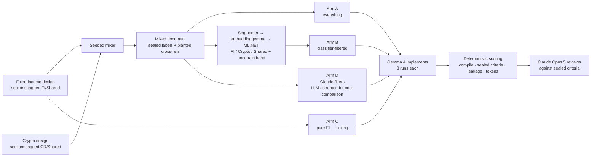

## 1. What the experiment is actually testing

The chat-context-switching analogy is right, and worth stating precisely: in a long session a user drifts between topics, and every later turn pays for every earlier turn. The question is whether a **cheap, local, deterministic** classifier (embeddinggemma + ML.NET, no API cost) can decide *which earlier material is about the current task* well enough that:

1. The implementer (Gemma 4) receives materially fewer tokens, **and**
2. The implementation is at least as correct as when it received everything, **and**
3. Nothing the task actually needed was thrown away.

Point 3 is the one that decides whether this is safe. The two error types are not symmetric:

| Classifier error | Effect on the implementation | Severity |
| --- | --- | --- |
| Crypto section labelled fixed income (kept) | Noise — what you have today | Low |
| **Fixed-income section labelled crypto (dropped)** | **A missing requirement, silently** | **High** |

So the classifier must be tuned for **recall on the target domain**, and anything in the uncertain band must be **kept**, not dropped — the same "adjudicate rather than guess" rule the regression and COBOL scenes already use.

## 2. Three traps a naive version walks into

**Trap 1 — binary is wrong; it is three classes.** A design document has sections that are about neither domain: testing strategy, logging, error handling, deployment, retry policy. Embeddings cluster by *form*, so "Testing" for fixed income and "Testing" for crypto look nearly identical. A binary classifier will flip a coin on them. The labels must be **Fixed income / Crypto / Shared**, and *Shared* goes to the implementer.

**Trap 2 — cross-domain dependencies.** A fixed-income section that says "reuse the venue retry policy defined in §Crypto 4.2" depends on a section the classifier will correctly label crypto and drop. Real design documents do this constantly. Plant two or three of these deliberately as **traps** (the platform already does this in the trap-hunt scene) and measure whether the filtered arm loses them. The mitigation is simple and deterministic: follow intra-document links/anchors from kept sections and pull referenced sections in regardless of label.

**Trap 3 — the classifier is a model, so it needs a sealed ground truth, not a vibe.** Author the two designs *separately*, section-tagged, then **interleave them with a seeded mixer**. Labels are then known by construction, no human labelling, and the mixer can generate many orderings. Train on the free labelled corpus you already have — the `FixedIncomeOptionsEngine` and `CryptoFxSpotDesk` repos and their OKF docs — and **test only on the design document**. Never let the design document leak into training.

## 3. Experimental design

**Arms** (same ticket, same Gemma, same system prompt; 3 runs each, report the median, exactly as the context-sufficiency scene does):

| Arm | Gemma receives | What it tells you |
| --- | --- | --- |
| A | The full mixed document | Today's cost and quality — the baseline |
| B | Classifier-kept segments (FI + Shared + uncertain + linked) | **The thing being tested** |
| C | The pure fixed-income design | The ceiling — perfect separation |
| D | Segments kept by Claude acting as the router | What an LLM filter costs versus a local classifier |

**Where Claude Opus 5 sits** ("grounded by Claude"): before any run, Claude writes the **sealed acceptance criteria** from the pure FI design — a checklist with detectable signals, in the style of `ContextTierSamples.Criteria`. It never sees the arms' outputs while writing them. After the runs it **reviews** each implementation against those criteria and narrates. The *numbers* come from deterministic checks; Claude supplies judgement, per the platform's rule.

**Measurements — all deterministic:**

| Measure | How | Why it matters |
| --- | --- | --- |
| Segment precision / recall / confusion matrix | Against the sealed mixer labels | Is the classifier any good, and which way does it err |
| Uncertain-band size | Segments with top-2 margin below a threshold | How much you had to keep "just in case" |
| Prompt tokens per arm | Exact Gemma tokenizer (`CountTokens`) | The saving itself |
| Compiles | `MigrationSandbox` / Roslyn, as the migration scene does | Floor |
| Sealed criteria met | `ContextTierScorer`-style signal detection | Did it implement the fixed-income requirements |
| **Trap recall** | Were the planted cross-domain dependencies honoured | Trap 2 |
| **Crypto leakage** | Count of crypto vocabulary (venue names, `CryptoFx*` types, order-book terms) in the FI output, mined from the crypto repo | Did noise become wrong code |
| Cost per successful outcome | `TokenEconomicsService.Build` per arm | The unit leadership should see |

**What "success" looks like — decide before running:** Arm B tokens ≤ 60% of Arm A; Arm B criteria and trap recall within one criterion of Arm C; zero dropped FI segments outside the uncertain band. If Arm A already equals Arm C on quality, the honest headline is *"a 40% token saving at no quality cost"* — still a result, and a more defensible one than a fabricated quality gap.

## 4. Build — almost everything exists

| Piece | Reuse | New |
| --- | --- | --- |
| Segmenter | — | Markdown heading-aware splitter; segment = heading path + body; carries source line range so every kept/dropped decision is citable |
| Embeddings | `EmbeddingGemmaEncoder.EncodeDocument` | — |
| Classifier | `ContextAuditService` pattern: PCA(24) → `SdcaMaximumEntropy`, seed 1 | Three labels; training rows from the two repos' files + OKF docs; add a **lexical arm** (per-domain vocabulary mined from repo identifiers) fused with the embedding arm, exactly like the COBOL cortex — identifiers are where embeddings are weakest |
| Threshold | `--calibrate-corpus` procedure | New headless `--context-hygiene-selftest`: runs mixer + classifier with no model, prints P/R/confusion and refuses to proceed if FI recall < 100% outside the uncertain band |
| Fixture | Trading corpus, `TradingCorpusRoot` | `training-fixture/context-hygiene/fixed-income-design.md`, `crypto-design.md`, section-tagged; planted cross-refs listed in a sealed file |
| Implementation flow | Common-code audit's Claude-designs / Gemma-implements-per-module tasks | Task kinds `hygiene-criteria` (Claude), `hygiene-implement` (Gemma ×4 arms ×3 runs), `hygiene-review` (Claude). VSIX reinstall required for new kinds |
| Compile / execute | `MigrationSandbox`, gated by `Autopilot:AllowInProcessExecution` | — |
| Scoring | `ContextTierScorer`, `TokenEconomicsService` | Leakage vocabulary + trap-recall checks |
| Scene | Token-economics / context-sufficiency layouts | New scene **"Context hygiene"** between Token economics and Pattern library; autopilot steps for the deterministic part (classifier + tables) run without the bridge |

Rough size: one service (~500 lines), one fixture pair, one scene, six manifest steps. The deterministic half — segmenter, classifier, self-check, confusion matrix — is demonstrable offline and is where I would start; the model arms come second.

## 5. Where this generalises, and where it does not

- **Generalises directly** to the chat case: run the same classifier per turn against the *current* request's topic and hand the model only the turns that match plus Shared. That is a VSIX-side change once the classifier is trusted.
- **Generalises** to long JIRA threads, Confluence pages, incident channels — anything with segment-level topic drift.
- **Does not generalise** to text where domains are intertwined *within* a sentence or paragraph. That is where LLMLingua-style token deletion lives, and where the programme should not go.
- **Caveat to state on the tab:** two domains chosen by us are the easy case. Fixed income and crypto have distinct vocabularies. The honest next test is two *adjacent* domains — fixed income versus fixed-income *options*, say — where the classifier will struggle and the uncertain band will grow. Report that number too.

## 6. Recommendation

Run it, as a new scene. It answers a question the programme has not yet answered — *can a local classifier safely decide what a model does not need to read?* — with sealed labels, deterministic scoring, and a cost-per-success number, and it does so without touching model weights or garbling text. It also gives leadership a cleaner story than "compress the prompt": **send the model the pages about its task, prove nothing was lost, and show the bill.**

